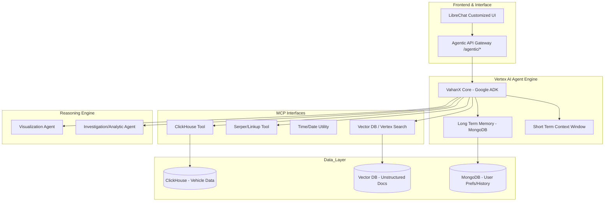
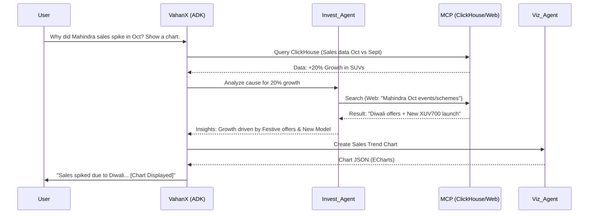

This Technical System Design Document outlines the architecture for **VahanX**, the flagship agent of the Maigic.Ai platform, built using Google’s Agent Development Kit (ADK) and Vertex AI Agent Engine.

  

---

  

# Technical System Design: VahanX Agentic System

  

## 1. High-Level System Architecture

VahanX follows a modular, code-first architecture where a "Supervisor" agent orchestrates specialized sub-agents and tools via the Model Context Protocol (MCP).

  

  

---

  

## 2. Component Deep Dive

  

### 2.1 VahanX Core (ADK Implementation)

The core agent is built using the **Google ADK**. Unlike prompt-based bots, this agent uses a **Reasoning Loop (ReAct)** implemented in code.

- **State Management:** Tracks the current query status, active sub-agents, and retrieved data.

- **Routing:** Determines if a query requires a simple DB lookup, a web search for market context, or an investigation by a sub-agent.

  

### 2.2 Memory Management

- **Short-term Memory:** Managed within the Vertex AI session context (standard chat history).

- **Long-term Memory (LTM):** Powered by **MongoDB**. Stores user preferences, recurring query patterns, and past insights to provide personalized responses (e.g., "Compared to your search last week...").

  

### 2.3 MCP Tooling Interface

The Model Context Protocol (MCP) acts as a standardized "plug" for tools:

- **ClickHouse Tool:** Generates optimized SQL to query millions of vehicle registration records.

- **Search Tool (Serper/Linkup):** Fetches real-time news (e.g., "New EV subsidies announced yesterday").

- **Time Tool:** Provides ground-truth time to handle relative queries ("last month," "Q3 vs Q4").

  

---

  

## 3. Sub-Agent Workflows

  

### 3.1 The "Investigator" Sub-Agent (Deep Analysis)

This agent handles complex "Why" questions.

*Example: "Why did Tata Motors sales drop 15% in Maharashtra last month?"*

  

**Logic Flow:**

1.  **Quantitative Fetch:** Queries ClickHouse for specific sales delta.

2.  **Contextual Search:** Uses Serper to find events in that specific month (e.g., "Regional festivals," "Semi-conductor shortage news," "New Govt taxation").

3.  **Synthesis:** Correlates the data (e.g., "Sales dropped because the 'Shravan' period deterred purchases, coinciding with a 2% price hike by the OEM").

  

### 3.2 The "Visualizer" Sub-Agent

This agent focuses on UI/UX output.

- **Input:** Raw JSON data from ClickHouse.

- **Output:** Structured schema (JSON) that the Frontend (LibreChat/React) renders as ECharts, Bar Charts, or Heatmaps.

  

---

  

## 4. Sequence Diagram: Multi-Agent Collaboration

  

The following diagram illustrates a complex request where the Supervisor coordinates tools and sub-agents.

  

  

---

  

## 5. Technical Stack

  

| Component | Technology |

| :--- | :--- |

| **Agent Framework** | Google Agent Development Kit (ADK) |

| **Orchestration** | Vertex AI Agent Engine |

| **LLM** | Gemini 1.5 Pro / Flash (for speed) |

| **Structured Data** | ClickHouse (via custom Python MCP) |

| **Unstructured Data** | Vertex AI Search / Vector DB (RAG) |

| **Search API** | Serper.dev / Linkup |

| **Database (System)** | MongoDB (User sessions & LTM) |

| **Frontend Integration** | Customized LibreChat (React) |

  

---

  

## 6. Implementation Plan (1.5 Months)

  

### Phase 1: Foundation (Weeks 1-2)

- Configure Google Cloud Project and Vertex AI Agent Engine.

- Develop **MCP Connectors** for ClickHouse and Serper.

- Implement the "Base VahanX" agent with ADK to handle simple SQL queries.

  

### Phase 2: RAG & Memory (Weeks 3-4)

- Setup Vector DB for OEM manuals and Govt policy documents (RAG).

- Integrate MongoDB for **Long-term Memory** (LTM).

- Connect the frontend API Gateway to the ADK backend.

  

### Phase 3: Sub-Agent Intelligence (Weeks 5-6)

- Build the **Investigator Agent** logic (Multi-step reasoning).

- Build the **Visualizer Agent** to translate SQL results into Chart schemas.

- Performance tuning and prompt/code refinement for agent consistency.

  

### Phase 4: Production & Admin (Weeks 7+)

- Deploy Admin Dashboard for observability (monitoring tool selection and cost).

- Final end-to-end testing of the 4 Production-Ready agents.