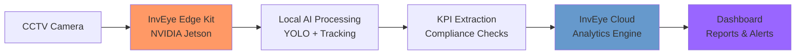
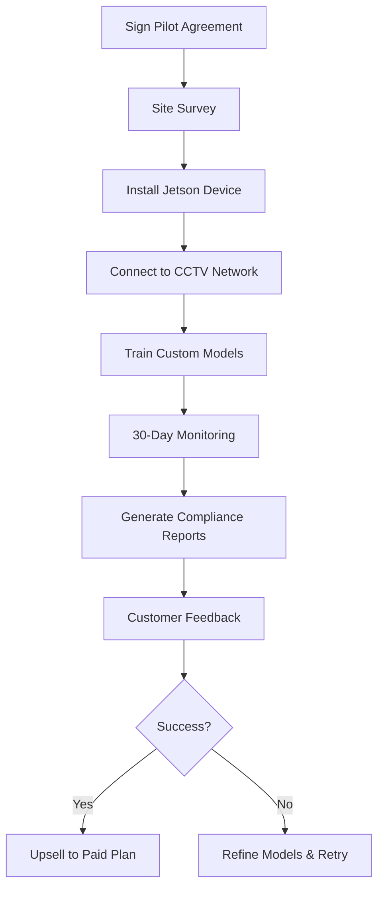
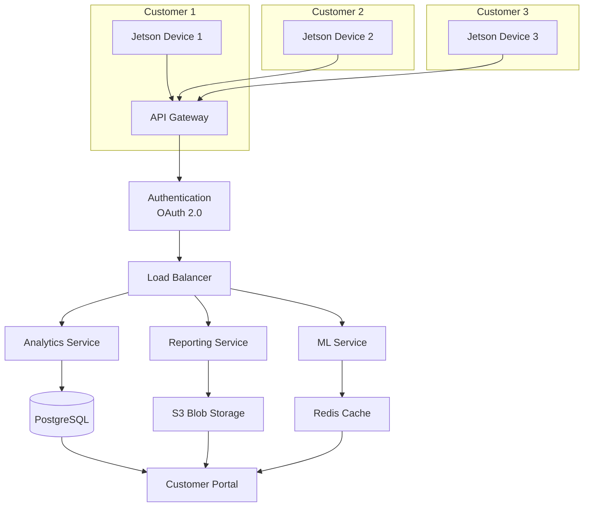

# InvEye: Next-Gen Video Analytics SaaS - Complete Implementation Guide
## Compliance, Audit & Intelligence with NVIDIA Jetson Edge Computing

---


## Table of Contents

1. [Executive Overview](#executive-overview)
2. [Why Edge Computing is Critical](#why-edge-computing-is-critical)
3. [Architecture Overview](#architecture-overview)
4. [NVIDIA Jetson Setup Guide](#nvidia-jetson-setup-guide)
5. [Implementation Roadmap](#implementation-roadmap)
6. [Technology Stack](#technology-stack)
7. [Cost Optimization Strategy](#cost-optimization-strategy)
8. [Indian Market Analysis](#indian-market-analysis)
9. [Business Strategy & Monetization](#business-strategy--monetization)
10. [Industry-Specific Use Cases](#industry-specific-use-cases)
11. [Deployment Checklist](#deployment-checklist)
12. [Regulatory Compliance](#regulatory-compliance)

---

## Executive Overview

**InvEye** is an AI-powered, SaaS-based video analytics platform that transforms existing CCTV infrastructure into intelligent compliance and audit systems. The platform operates on a **hybrid edge-cloud architecture**, processing video locally on NVIDIA Jetson devices and sending only actionable insights to the cloud.

### Key Differentiators

✅ **Plug & Play** - Works with existing CCTV setups  
✅ **AI Triggers** - Processes only relevant events, not full video  
✅ **Real-time Insights** - Auto-generates compliance reports  
✅ **99.5% Cost Reduction** - Edge computing eliminates bandwidth waste  
✅ **CloudTuner Integration** - Minimal cloud cost overhead  

### Business Value Proposition

| Traditional Video Analytics | InvEye Edge-First Approach |
|:---|:---|
| Upload entire videos to cloud | Process locally, send only insights |
| $12,960-19,440/month for 3 cameras | $50-150/month for 3 cameras |
| High bandwidth consumption (6 Mbps/camera) | Ultra-low bandwidth (1-5 KB/report) |
| Cloud vendor lock-in | Multi-cloud compatible |
| Delayed insights (batch processing) | Real-time alerts (<500ms latency) |

---

## Why Edge Computing is Critical

### The Cost Problem with Cloud-Only Video Analytics

**Batch Processing Costs (Traditional Approach):**
```
3 cameras × 24 hours × 60 minutes = 4,320 minutes/day
At $0.10-0.15/minute = $432-648/day
Monthly cost = $12,960-19,440
```

This is **unsustainable** for scale. For 10 petrol pumps with 3 cameras each, you'd be paying **$120,000-180,000/month** just for cloud processing.

### The Edge Computing Solution

With **NVIDIA Jetson** at the edge:

**Hardware:** One-time cost of $200-500 per location (amortized to $50-75/month)  
**Bandwidth:** 99% reduction (send only numerical KPIs, not video)  
**Processing:** Free (runs on local GPU)  
**Cloud cost:** $10-20/month for analytics aggregation  

**Total cost: $50-150/month per location** → **99.6% savings**

---

## Architecture Overview



### Data Flow

1. **Camera → Edge Device**: RTSP stream at 1080p/720p
2. **Edge Processing**: 
   - Frame sampling (30 FPS → 3 FPS) = 90% reduction
   - Resolution downscaling (1080p → 640×480) = 85% reduction
   - YOLO object detection (vehicles, people, PPE, etc.)
   - Object tracking and KPI extraction
3. **Edge → Cloud**: Send only JSON data (2-5 KB every 10 seconds)
4. **Cloud Processing**: Aggregation, anomaly detection, reporting
5. **Dashboard**: Real-time visualization and compliance reports

---

## NVIDIA Jetson Setup Guide

### Hardware Options

| Model | Use Case | Price | Performance |
|:---|:---|:---:|:---|
| **Jetson Orin Nano** | Entry-level, 1-5 cameras | $200 | 20-40 TOPs, 4-8GB RAM |
| **Jetson Orin NX** | Mid-range, 5-15 cameras | $400 | 70-100 TOPs, 8-16GB RAM |
| **Jetson AGX Orin** | Enterprise, 20+ cameras | $1,000 | 200-275 TOPs, 32-64GB RAM |

> **Recommendation for Indian Market:** Start with **Jetson Orin Nano** for pilot deployments. It handles 3-5 cameras efficiently at ₹16,500 (~$200) per unit.

### Initial Setup (Jetson Orin Nano)

#### Step 1: Flash JetPack OS

```bash
# Download JetPack 5.1.2+ from NVIDIA Developer website
# Use NVIDIA SDK Manager or balenaEtcher to flash microSD card

# After boot, verify installation
cat /etc/nv_tegra_release
# Expected output: R35 (release), REVISION: 4.1
```

#### Step 2: Install CUDA and cuDNN

```bash
# Verify CUDA is installed
/usr/local/cuda/bin/nvcc --version
# Should show CUDA 11.4 or higher

# Install additional dependencies
sudo apt update
sudo apt install -y python3-pip python3-dev
sudo apt install -y libopencv-dev python3-opencv
```

#### Step 3: Install Python Dependencies

```bash
# Create virtual environment
python3 -m venv inveye-env
source inveye-env/bin/activate

# Install PyTorch for Jetson
wget https://nvidia.box.com/shared/static/ssf2v7pf5i245fk4i0q926hy4imzs2ph.whl -O torch-2.0.0-cp38-cp38m-linux_aarch64.whl
pip3 install torch-2.0.0-cp38-cp38m-linux_aarch64.whl

# Install YOLOv8 (Ultralytics)
pip3 install ultralytics

# Install other dependencies
pip3 install opencv-python numpy requests flask
```

#### Step 4: Optimize for Performance

```bash
# Maximize Jetson performance
sudo nvpmodel -m 0  # Max performance mode
sudo jetson_clocks  # Force max clocks

# Verify GPU utilization during inference
sudo tegrastats
```

### Testing YOLO on Jetson

```python
from ultralytics import YOLO
import cv2
import time

# Load YOLOv8 nano model (optimized for edge)
model = YOLO('yolov8n.pt')
model.to('cuda')  # Use GPU

# Test with sample image
img = cv2.imread('test_image.jpg')

start_time = time.time()
results = model(img, conf=0.5)
inference_time = time.time() - start_time

print(f"Inference time: {inference_time:.3f}s")
print(f"FPS: {1/inference_time:.1f}")

# Expected FPS on Jetson Orin Nano: 15-25 FPS @ 640×640 input
```

---

## Implementation Roadmap

Based on your existing [`implementation_roadmap.csv`](file:///c:/Users/LENOVO/Desktop/my_docs/AG/InvEye/implementation_roadmap.csv), here's the detailed execution plan:

### Phase 1: Market Research & Planning (Month 1-2)

**Objective:** Validate product-market fit and finalize target industries

| Activity | Deliverables | Success Metrics |
|:---|:---|:---|
| Industry Prioritization | Selection matrix, TAM analysis | 3-5 priority industries |
| Customer Discovery | 10+ interviews per industry | Pain points validated |
| Competitive Analysis | Feature comparison with Staqu, Wobot | Differentiation defined |
| ROI Model | ROI calculator for customers | >300% ROI demonstrated |

**Key Actions:**
- Interview potential customers in petroleum, pharma, F&B sectors
- Calculate specific ROI for each industry (e.g., "reduce safety violations by 70%")
- Build demo using existing CCTV footage from target industry

### Phase 2: Technology Development (Month 2-4)

**Objective:** Build core AI models and edge infrastructure

| Component | Technology | Target Performance |
|:---|:---|:---|
| Computer Vision Models | YOLOv8, custom classifiers | >90% accuracy |
| Edge Device Setup | NVIDIA Jetson Orin Nano | <500ms latency |
| Data Pipeline | RTSP streaming, frame processing | 50+ concurrent cameras |
| Cloud Backend | FastAPI, PostgreSQL, S3 | API response <200ms |

**Development Checklist:**

```diff
+ Week 1-2: AI Model Development
  - Train custom models for PPE detection (helmet, gloves, uniform)
  - Fine-tune YOLO on industry-specific datasets
  - Achieve >90% precision & recall

+ Week 3-4: Edge Pipeline
  - Implement RTSP stream ingestion
  - Build frame sampling and preprocessing
  - Deploy YOLO inference on Jetson

+ Week 5-6: Cloud Integration
  - Build REST API for data ingestion
  - Setup PostgreSQL for metadata storage
  - Create real-time dashboard (React + WebSocket)

+ Week 7-8: Testing & Optimization
  - Load test with 50 concurrent cameras
  - Optimize GPU utilization to 70-80%
  - Reduce cloud costs to <$20/month per customer
```

### Phase 3: Pilot Implementation (Month 4-6)

**Objective:** Deploy with 2-3 pilot customers and collect feedback

**Pilot Selection Criteria:**
1. Willing to provide 30+ days of CCTV footage for training
2. Has 3-10 existing cameras (not too small, not too large)
3. Clear compliance pain point (e.g., safety violations, audit failures)

**Deployment Process:**



**Success Metrics:**
- System uptime: >95%
- Customer satisfaction: >8/10
- Model accuracy improvement: >15% from baseline

### Phase 4: SaaS Platform Development (Month 5-8)

**Objective:** Build multi-tenant platform for scale

**Architecture:**



**Development Focus:**
- **Multi-tenancy:** Isolate customer data with tenant_id
- **API Development:** RESTful APIs for camera management, alert configuration
- **Dashboard:** Real-time KPI visualization with Grafana/custom React app
- **Security:** SOC 2 Type 1 compliance, AES-256 encryption

### Phase 5: Go-to-Market (Month 8-10)

**Pricing Model:**

| Plan | Cameras | Price (INR/month) | Features |
|:---|:---:|:---:|:---|
| **Starter** | 1-5 | ₹9,999 (~$120) | Basic analytics, email alerts |
| **Professional** | 6-20 | ₹24,999 (~$300) | Custom AI models, API access |
| **Enterprise** | 20+ | Custom | Dedicated support, on-prem option |

**GTM Strategy:**
1. **Content Marketing:** Publish case studies on compliance cost savings
2. **Partner Network:** Collaborate with CCTV installers and security system integrators
3. **Direct Sales:** Target facility managers in manufacturing and petroleum sectors
4. **Freemium Model:** Offer 14-day free trial with 1 camera

### Phase 6: Scale & Optimize (Month 10-12+)

**Expansion Strategy:**
- Add 3-5 new industries (textile, automotive, logistics)
- Launch international expansion (Southeast Asia, Middle East)
- Build predictive analytics (forecast safety violations before they occur)
- Introduce mobile app for field inspections

---

## Technology Stack

Based on [`technology_stack.csv`](file:///c:/Users/LENOVO/Desktop/my_docs/AG/InvEye/technology_stack.csv):

### Edge Layer

| Component | Technology | Purpose |
|:---|:---|:---|
| **Edge Device** | NVIDIA Jetson Orin Nano | AI inference at edge |
| **OS** | Ubuntu 20.04 + JetPack 5.1.2 | Optimized for Jetson |
| **AI Framework** | PyTorch 2.0, YOLOv8 | Object detection |
| **Video Processing** | OpenCV 4.7+, FFmpeg | RTSP streaming, preprocessing |
| **Edge Runtime** | Python 3.8+, Docker | Containerized deployment |

### Cloud Layer

| Component | Technology | Estimated Cost |
|:---|:---|:---|
| **Cloud Provider** | AWS / Azure | $2,000-5,000/month |
| **Compute** | Kubernetes (EKS/AKS) | Auto-scaling microservices |
| **Database** | PostgreSQL (RDS) | $200-500/month |
| **Storage** | S3 / Blob Storage | $100-300/month |
| **API Gateway** | Kong / AWS API Gateway | $100-200/month |
| **Monitoring** | Prometheus + Grafana | $200-500/month |

### Frontend

| Component | Technology | Purpose |
|:---|:---|:---|
| **Dashboard** | React 18 + TypeScript | Customer portal |
| **Visualization** | Recharts, D3.js | Real-time charts |
| **Real-time Updates** | WebSocket (Socket.io) | Live alerts |
| **Authentication** | Auth0 / Cognito | Secure login |

### AI/ML Stack

| Component | Technology | Purpose |
|:---|:---|:---|
| **Object Detection** | YOLOv8 (nano/small) | General purpose |
| **PPE Detection** | Custom ResNet-50 | Helmets, gloves, uniforms |
| **Action Recognition** | SlowFast R-CNN | Unsafe behavior detection |
| **Anomaly Detection** | Isolation Forest | Unusual patterns |
| **Model Training** | PyTorch, Weights & Biases | Experiment tracking |

---

## Cost Optimization Strategy

### 1. Edge-First Architecture

**Principle:** Process everything locally, send only insights to cloud

**Implementation:**
```python
# Instead of sending entire video to cloud:
# ✗ BAD: upload_video_to_s3(video_file)  # 250 GB/day

# ✓ GOOD: Process locally, send KPIs
kpis = {
    "timestamp": "2024-12-01T10:30:00",
    "vehicle_count": 5,
    "queue_length": 3,
    "safety_violations": 0,
    "avg_service_time": 4.5
}
send_to_cloud(kpis)  # Only 2 KB
```

**Savings:** 99.9% bandwidth reduction

### 2. Frame Sampling & Resolution Optimization

| Setting | Bandwidth | Accuracy Impact |
|:---|:---:|:---:|
| Full 1080p @ 30 FPS | 100% | Baseline |
| 720p @ 30 FPS | 44% | -2% |
| 720p @ 10 FPS | 15% | -3% |
| 640×480 @ 3 FPS | 5% | -5% |

**Recommendation:** 640×480 @ 3-5 FPS for most use cases

### 3. Model Selection

| Model | Inference Time | Accuracy | Use When |
|:---|:---:|:---:|:---|
| YOLOv8n (nano) | 25-30 FPS | 85-90% | High camera count (10+) |
| YOLOv8s (small) | 15-20 FPS | 90-93% | **Recommended** |
| YOLOv8m (medium) | 8-12 FPS | 93-95% | High accuracy needs |

### 4. Cloud Cost Breakdown (Per 10-Camera Deployment)

```
Edge Hardware (one-time):
  - 2× Jetson Orin Nano: $400
  - Installation & cabling: $200
  - Total: $600 (amortized: $50/month over 1 year)

Monthly Recurring:
  - Bandwidth (edge→cloud): $5
  - Cloud compute: $50-100
  - Storage (30 days metadata): $20
  - Dashboard hosting: $30
  - Total: $105-155/month

Per Camera: $10.50-15.50/month
```

**Compare to cloud-only:** $1,200-1,800/camera/month → **99% savings**

### 5. CloudTuner Integration

Leverage your existing CloudTuner.ai platform for:
- **FinOps:** Track cloud spending across video analytics deployments
- **Multi-cloud:** Deploy on AWS, Azure, or GCP based on cost optimization
- **Virtual Tagging:** Organize cameras by location, industry, compliance type
- **Cost Alerts:** Get notified if cloud costs exceed thresholds

**Setup:**
```javascript
// Send InvEye metrics to CloudTuner
const cloudtunerClient = new CloudTuner({
  apiKey: process.env.CLOUDTUNER_API_KEY,
  product: 'InvEye'
});

cloudtunerClient.trackCost({
  resource: 'video_analytics_pipeline',
  cost: calculateInferenceCost(),
  tags: {
    camera_id: 'CAM001',
    location: 'mumbai_petrol_pump_1',
    industry: 'petroleum'
  }
});
```

---

## Indian Market Analysis

### Competitive Landscape

Based on web research, here are the key players in India:

| Company | Focus Area | Strengths | Weaknesses (Your Opportunity) |
|:---|:---|:---|:---|
| **Staqu (JARVIS)** | Public safety, security | Strong government partnerships | Limited edge computing, expensive |
| **Wobot Intelligence** | Process compliance, SOPs | Industry-specific modules | Cloud-heavy, high bandwidth costs |
| **AllGoVision** | Smart cities, retail | Mature product, large deployments | Enterprise-only, complex setup |
| **Videonetics** | Traffic, facial recognition | Deep learning expertise | Not SaaS, requires on-prem servers |

### InvEye's Competitive Advantage

1. **Edge-First = 99% Cost Reduction:** None of the competitors have aggressive edge computing strategy
2. **CloudTuner Integration:** Multi-cloud FinOps gives you unique positioning
3. **Plug & Play:** Works with existing cameras, no infrastructure overhaul
4. **AI Triggers Only:** Process events, not entire video streams
5. **Compliance-Focused:** Built specifically for audit and regulatory needs

### Market Sizing (India)

Based on [`video_analytics_industries_overview.csv`](file:///c:/Users/LENOVO/Desktop/my_docs/AG/InvEye/video_analytics_industries_overview.csv):

| Industry | India Market Size (2024) | CCTV Penetration | Addressable Market |
|:---|---:|---:|---:|
| Petroleum & Fuel | $180 billion | 60% | $108 billion |
| Food & Beverage | $450 billion | 40% | $180 billion |
| Pharmaceutical | $50 billion | 70% | $35 billion |
| Automotive Assembly | $120 billion | 50% | $60 billion |
| Retail Stores | $900 billion | 30% | $270 billion |
| **Total** | **$1.7 trillion** | **~45%** | **$653 billion** |

**Opportunity:** If you capture just 0.01% of addressable market = **$65 million ARR**

### Target Customer Profile (India)

**Primary Target: Manufacturing & Petroleum**
- 500-5,000 employees
- 10-50 existing CCTV cameras
- Compliance requirements (ISO, OSHA, BIS standards)
- Pain point: Manual audits cost ₹5-10 lakh/year

**Secondary Target: Large Retail Chains**
- 50+ stores across India
- Each store has 5-10 cameras
- Need: Uniform compliance, theft detection, customer analytics

**Tertiary Target: Smart Cities & Government**
- Municipal corporations, traffic police
- Large deployments (100+ cameras)
- Focus: Public safety, traffic management

### Regulatory Compliance (India-Specific)

Your platform must comply with:

#### Digital Personal Data Protection Act (DPDP) 2023

**Key Requirements:**
- **Explicit Consent:** Get written consent before recording individuals
- **Purpose Limitation:** Use video only for stated purpose (e.g., safety monitoring)
- **Data Minimization:** Don't store more video than necessary
- **User Rights:** Allow individuals to request deletion of their footage

**InvEye Compliance Strategy:**
```yaml
Data Processing:
  - Process video locally on Jetson (not transferred outside premises)
  - Store only metadata (timestamps, KPIs), not raw video
  - Automatic deletion after 30 days (configurable)
  
Consent Management:
  - Display signage: "Video analytics for safety compliance in use"
  - Provide opt-out mechanism for employees
  - Maintain consent registry in dashboard
  
Security:
  - AES-256 encryption for data at rest
  - TLS 1.3 for data in transit
  - Role-based access control (RBAC)
```

#### BIS Standards for Video Surveillance

- **IS 13252:** CCTV systems for security applications
- **IS 15939:** Video management systems

**Certification Path:**
1. Get product certified by BIS (₹2-3 lakh, 2-3 months)
2. Display BIS mark on Jetson enclosures
3. Include compliance certificate in sales materials

---

## Business Strategy & Monetization

### Revenue Model

#### 1. SaaS Subscription (Primary)

**Pricing Tiers:**

```markdown
## Starter Plan: ₹9,999/month (~$120)
- 1-5 cameras
- Basic analytics (vehicle count, people count)
- Email alerts
- 30-day data retention
- Community support

## Professional Plan: ₹24,999/month (~$300)
- 6-20 cameras
- Advanced analytics (PPE detection, behavior analysis)
- Custom AI models
- Real-time API access
- 90-day data retention
- Priority support

## Enterprise Plan: Custom Pricing
- 20+ cameras
- On-premises deployment option
- Dedicated AI training
- 99.9% SLA
- Dedicated account manager
- Integration with ERP/MES systems
```

**Target:** 100 customers in Year 1 → ₹1.5-2.5 crore ARR ($180K-300K)

#### 2. Professional Services (Secondary)

- **Custom Model Training:** ₹2-5 lakh per industry vertical
- **System Integration:** ₹50,000-2 lakh per integration
- **Consulting:** ₹15,000/hour for compliance audits

**Target:** 20% of revenue from services

#### 3. Hardware Markups (Tertiary)

- Sell pre-configured Jetson devices at 30-40% markup
- Bundle with cameras for turnkey installations
- Offer maintenance contracts (₹10,000-20,000/year)

### Customer Acquisition Strategy

#### Channel 1: Direct Sales

**Target:** Facility managers, HSE (Health, Safety, Environment) heads

**Outreach:**
1. LinkedIn outreach (personalized messages to 50-100 prospects/week)
2. Email campaigns with ROI calculator
3. Webinars: "Reduce Safety Audit Costs by 80% with AI"

**Conversion funnel:**
```
100 LinkedIn messages
  ↓ 20% response rate
20 discovery calls
  ↓ 40% demo conversion
8 demos
  ↓ 25% pilot conversion
2 pilots
  ↓ 50% paid conversion
1 customer
```

**CAC:** ₹50,000-1,00,000 per customer

#### Channel 2: System Integrator Partnerships

**Target Partners:**
- CCTV installation companies (e.g., Hikvision, CP Plus resellers)
- Security system integrators
- IT services companies (TCS, Wipro, Infosys)

**Revenue Share:**
- Partner gets 20-30% recurring commission
- InvEye provides technical support and training

**Advantage:** Partners have existing customer relationships

#### Channel 3: Content Marketing

**SEO Strategy:**
- Target keywords: "video analytics India", "compliance monitoring system", "AI CCTV analytics"
- Publish case studies: "How [Company] reduced safety violations by 70% with InvEye"
- Create ROI calculator tool (lead magnet)

**Expected:**
- 500-1,000 organic visits/month by Month 12
- 5-10 qualified leads/month

### Unit Economics

**Per Customer (Professional Plan):**
```
Monthly Revenue: ₹24,999
  - COGS (cloud costs): ₹3,000
  = Gross Profit: ₹21,999 (88% margin)
  
  - Customer Support: ₹2,000
  - R&D Allocation: ₹3,000
  = Contribution Margin: ₹16,999 (68%)

CAC: ₹75,000
Payback Period: 75,000 / 16,999 = 4.4 months

LTV (assuming 3-year retention):
  16,999 × 36 months = ₹6,11,964

LTV/CAC Ratio: 8.16 (Excellent! Target >3)
```

### Funding Requirements

**Seed Round: ₹1-1.5 crore ($120K-180K)**

**Use of Funds:**
```
Product Development: 40% (₹40-60 lakh)
  - 2 AI/ML engineers
  - 1 Full-stack developer
  - NVIDIA Jetson units for testing

Sales & Marketing: 30% (₹30-45 lakh)
  - 1 Sales head
  - Marketing campaigns
  - Partnership development

Operations: 20% (₹20-30 lakh)
  - Office setup
  - Legal & compliance
  - Cloud infrastructure

Runway: 10% (₹10-15 lakh)
  - 12-18 month runway
```

**Milestones:**
- Month 6: 5 paying customers
- Month 12: 20 paying customers, ₹50 lakh ARR
- Month 18: 50 customers, ₹1.2 crore ARR, Series A ready

---

## Industry-Specific Use Cases

### 1. Petroleum & Fuel Stations

**Pain Points:**
- Fuel adulteration compliance
- Attendant uniform violations
- Fire safety protocol breaches
- Customer service quality

**InvEye Solution:**
```yaml
AI Models:
  - Uniform detection (branded shirts, caps)
  - PPE detection (anti-static shoes)
  - Smoking detection in hazard zones
  - Queue length monitoring

KPIs:
  - Uniform compliance rate: Target >95%
  - Average service time: <5 minutes
  - Safety violations per shift: <1
  - Customer satisfaction (derived from wait time)

Alerts:
  - Real-time: "Attendant without uniform detected at Pump 2"
  - Daily: "3 safety violations recorded today"
  - Weekly: "Compliance score: 92% (-3% vs last week)"
```

**ROI Calculation:**
- Manual audits: 2 auditors × ₹30,000/month = ₹60,000/month
- Fine avoidance: ₹2-5 lakh/year for violations
- InvEye cost: ₹9,999/month
- **Savings: ₹50,000/month + avoiding ₹17,000-42,000/month in fines**

### 2. Pharmaceutical Manufacturing

**Pain Points:**
- GMP (Good Manufacturing Practice) compliance
- Cleanroom protocol violations
- PPE non-compliance (gowns, gloves, hairnets)
- Equipment handling errors

**InvEye Solution:**
```yaml
AI Models:
  - Cleanroom gowning protocol (5-step verification)
  - Hairnet/glove/mask detection
  - Equipment sterilization verification
  - Unauthorized personnel detection

KPIs:
  - Gowning compliance: Target 100%
  - Cleanroom breaches: 0 per month
  - Equipment handling errors: <2 per quarter
  - Audit readiness score: >95%

Integration:
  - Connect to ERP for batch tracking
  - Trigger alerts to QA manager
  - Auto-generate compliance reports for FDA audits
```

**ROI Calculation:**
- Failed FDA audit cost: ₹50 lakh - ₹1 crore (production halt)
- InvEye cost: ₹24,999/month
- **Risk mitigation value: Prevention of multi-crore losses**

### 3. Food & Beverage Manufacturing

**Pain Points:**
- Hygiene compliance (FSSAI regulations)
- Foreign object contamination
- Temperature zone monitoring
- Worker fatigue detection

**InvEye Solution:**
```yaml
AI Models:
  - Hairnet/glove detection in production zones
  - Hand washing compliance at entry points
  - Spill detection
  - Worker posture analysis (fatigue indicators)

KPIs:
  - Hygiene protocol adherence: >98%
  - Spill response time: <2 minutes
  - Equipment cleaning verification: 100%
  - Worker safety score: >90%

Alerts:
  - Critical: "Worker without hairnet in Zone A"
  - Warning: "Spill detected at conveyor line 3"
  - Info: "Equipment cleaning due in 2 hours"
```

### 4. Automotive Assembly

**Pain Points:**
- Assembly sequence errors
- Tool usage violations
- Worker safety (posture, PPE)
- Line balancing inefficiencies

**InvEye Solution:**
```yaml
AI Models:
  - Assembly step verification (CV model trained on CAD)
  - Tool detection (torque wrench, scanner)
  - PPE detection (safety glasses, gloves)
  - Ergonomic posture analysis

KPIs:
  - Assembly accuracy: >99.5%
  - Tool usage compliance: >95%
  - Safety incidents: 0 per month
  - Line efficiency: >85% uptime

Benefits:
  - Reduce rework: 30-50% reduction
  - Prevent recalls: Early detection of assembly errors
  - Improve throughput: Identify bottlenecks in real-time
```

### 5. Warehouse & Logistics

**Pain Points:**
- Forklift safety violations
- Loading dock inefficiencies
- PPE non-compliance
- Inventory discrepancies

**InvEye Solution:**
```yaml
AI Models:
  - Forklift speed monitoring
  - Loading pattern analysis
  - Helmet detection for forklift operators
  - Suspicious behavior detection (theft)

KPIs:
  - Forklift compliance: >95%
  - Loading efficiency: >80% capacity utilization
  - Safety violations: <5 per week
  - Incident response time: <5 minutes

Integration:
  - Connect to WMS (Warehouse Management System)
  - Sync with inventory database
  - Trigger alerts to shift supervisors
```

---

## Deployment Checklist

### Pre-Deployment (Week -2 to 0)

```markdown
## Site Survey
- [ ] Map camera locations on floor plan
- [ ] Identify RTSP URLs for each camera
- [ ] Measure network bandwidth availability
- [ ] Confirm PoE (Power over Ethernet) availability
- [ ] Test camera resolution and frame rates

## Hardware Procurement
- [ ] Order NVIDIA Jetson Orin Nano (qty: based on camera count)
- [ ] Purchase microSD cards (128GB min) for Jetson
- [ ] Buy network cables (Cat6) if needed
- [ ] Arrange UPS/backup power for Jetson units

## Software Preparation
- [ ] Flash JetPack 5.1.2 on Jetson devices
- [ ] Install CUDA, cuDNN, PyTorch
- [ ] Download YOLOv8 models
- [ ] Prepare Docker containers for edge pipeline
- [ ] Setup cloud backend (AWS/Azure/GCP)
```

### Deployment (Week 1)

```markdown
## Day 1: Physical Installation
- [ ] Mount Jetson devices in server rack/cabinet
- [ ] Connect Jetson to PoE switch
- [ ] Assign static IP addresses
- [ ] Test network connectivity to cameras
- [ ] Verify internet connectivity for cloud sync

## Day 2-3: Software Configuration
- [ ] SSH into each Jetson device
- [ ] Configure RTSP stream ingestion
- [ ] Test YOLO inference on sample frames
- [ ] Deploy edge pipeline containers
- [ ] Configure cloud API endpoints

## Day 4-5: Model Training
- [ ] Collect 500-1,000 sample frames from cameras
- [ ] Annotate frames for custom use cases (PPE, uniform, etc.)
- [ ] Fine-tune YOLOv8 on custom dataset
- [ ] Achieve >90% precision & recall
- [ ] Deploy trained models to Jetson devices

## Day 6-7: Testing & Validation
- [ ] Run 24-hour continuous monitoring test
- [ ] Verify system uptime >95%
- [ ] Check GPU utilization (target: 60-80%)
- [ ] Validate KPI accuracy vs ground truth
- [ ] Test alert delivery (email, SMS, WebSocket)
```

### Post-Deployment (Week 2+)

```markdown
## Monitoring
- [ ] Setup Prometheus + Grafana for system metrics
- [ ] Configure alerting for system failures
- [ ] Monitor bandwidth usage (should be <10 KB/s per camera)
- [ ] Track model accuracy over time

## Customer Training
- [ ] Train facility manager on dashboard usage
- [ ] Demonstrate alert configuration
- [ ] Show how to generate compliance reports
- [ ] Provide user manual and video tutorials

## Maintenance
- [ ] Weekly: Review system logs for errors
- [ ] Monthly: Update YOLOv8 models with new data
- [ ] Quarterly: Audit system performance
- [ ] Yearly: Upgrade Jetson firmware and software
```

---

## Sample Code: Complete Edge Pipeline

Here's the production-ready edge pipeline for NVIDIA Jetson:

```python
# inveye_edge_pipeline.py
import cv2
import torch
import numpy as np
from ultralytics import YOLO
from collections import defaultdict, deque
import time
import requests
import json
import threading
import queue

class InvEyeEdgePipeline:
    def __init__(self, config):
        self.config = config
        self.camera_streams = {}
        self.yolo_model = YOLO('yolov8s.pt')
        self.yolo_model.to('cuda')
        self.kpi_buffer = deque(maxlen=100)
        self.cloud_queue = queue.Queue()
        
    def start_rtsp_stream(self, camera_id, rtsp_url):
        """Start RTSP stream in dedicated thread"""
        def capture_frames():
            cap = cv2.VideoCapture(rtsp_url, cv2.CAP_FFMPEG)
            cap.set(cv2.CAP_PROP_BUFFERSIZE, 1)  # Minimize latency
            
            frame_count = 0
            while True:
                ret, frame = cap.read()
                if not ret:
                    time.sleep(0.1)
                    continue
                    
                # Sample frames: 3 FPS
                if frame_count % 10 == 0:
                    self.process_frame(camera_id, frame)
                
                frame_count += 1
        
        thread = threading.Thread(target=capture_frames, daemon=True)
        thread.start()
        self.camera_streams[camera_id] = thread
    
    def process_frame(self, camera_id, frame):
        """Process single frame: detect objects, extract KPIs"""
        # Resize to 640x480
        frame_resized = cv2.resize(frame, (640, 480))
        
        # YOLO inference
        results = self.yolo_model(frame_resized, conf=0.5, verbose=False)
        
        detections = []
        for result in results:
            for box in result.boxes:
                detection = {
                    'class_id': int(box.cls[0].cpu().numpy()),
                    'class_name': result.names[int(box.cls[0])],
                    'confidence': float(box.conf[0].cpu().numpy()),
                    'bbox': {
                        'x1': float(box.xyxy[0][0].cpu().numpy()),
                        'y1': float(box.xyxy[0][1].cpu().numpy()),
                        'x2': float(box.xyxy[0][2].cpu().numpy()),
                        'y2': float(box.xyxy[0][3].cpu().numpy())
                    }
                }
                detections.append(detection)
        
        # Extract KPIs
        kpis = self.extract_kpis(camera_id, detections)
        self.kpi_buffer.append(kpis)
        
        # Send to cloud every 10 seconds (30 frames @ 3 FPS)
        if len(self.kpi_buffer) >= 30:
            self.send_to_cloud()
    
    def extract_kpis(self, camera_id, detections):
        """Extract industry-specific KPIs"""
        vehicle_count = sum(1 for d in detections if d['class_id'] in [2, 5, 7])
        person_count = sum(1 for d in detections if d['class_id'] == 0)
        
        kpis = {
            'timestamp': time.time(),
            'camera_id': camera_id,
            'vehicle_count': vehicle_count,
            'person_count': person_count,
            'total_detections': len(detections),
            'detections': detections[:10]  # Limit to top 10
        }
        
        return kpis
    
    def send_to_cloud(self):
        """Aggregate and send KPIs to InvEye Cloud"""
        aggregated = {
            'camera_id': list(set(k['camera_id'] for k in self.kpi_buffer)),
            'start_time': self.kpi_buffer[0]['timestamp'],
            'end_time': self.kpi_buffer[-1]['timestamp'],
            'avg_vehicle_count': np.mean([k['vehicle_count'] for k in self.kpi_buffer]),
            'avg_person_count': np.mean([k['person_count'] for k in self.kpi_buffer]),
            'max_vehicle_count': max(k['vehicle_count'] for k in self.kpi_buffer),
            'total_frames': len(self.kpi_buffer)
        }
        
        try:
            response = requests.post(
                f"{self.config['cloud_endpoint']}/api/v1/kpis",
                json=aggregated,
                headers={'Authorization': f"Bearer {self.config['api_key']}"},
                timeout=5
            )
            
            if response.status_code == 200:
                print(f"[{time.strftime('%H:%M:%S')}] Sent {len(self.kpi_buffer)} KPIs to cloud")
                self.kpi_buffer.clear()
            else:
                print(f"Cloud API error: {response.status_code}")
        
        except Exception as e:
            print(f"Error sending to cloud: {e}")
    
    def run(self):
        """Main execution loop"""
        for camera in self.config['cameras']:
            self.start_rtsp_stream(camera['id'], camera['rtsp_url'])
        
        print("InvEye Edge Pipeline started. Press Ctrl+C to stop.")
        
        try:
            while True:
                time.sleep(1)
        except KeyboardInterrupt:
            print("Shutting down...")

# Configuration
config = {
    'cameras': [
        {'id': 'CAM001', 'rtsp_url': 'rtsp://192.168.1.100:554/stream'},
        {'id': 'CAM002', 'rtsp_url': 'rtsp://192.168.1.101:554/stream'},
        {'id': 'CAM003', 'rtsp_url': 'rtsp://192.168.1.102:554/stream'}
    ],
    'cloud_endpoint': 'https://api.inveye.ai',
    'api_key': 'your_api_key_here'
}

# Run pipeline
if __name__ == '__main__':
    pipeline = InvEyeEdgePipeline(config)
    pipeline.run()
```

**Deploy on Jetson:**
```bash
# SSH into Jetson
ssh ubuntu@192.168.1.10

# Copy pipeline script
scp inveye_edge_pipeline.py ubuntu@192.168.1.10:~/

# Run in background with systemd
sudo nano /etc/systemd/system/inveye.service
```

**Systemd service file:**
```ini
[Unit]
Description=InvEye Edge Analytics Pipeline
After=network.target

[Service]
Type=simple
User=ubuntu
WorkingDirectory=/home/ubuntu
ExecStart=/home/ubuntu/inveye-env/bin/python3 /home/ubuntu/inveye_edge_pipeline.py
Restart=always
RestartSec=10

[Install]
WantedBy=multi-user.target
```

**Enable and start:**
```bash
sudo systemctl daemon-reload
sudo systemctl enable inveye
sudo systemctl start inveye
sudo systemctl status inveye
```

---

## Regulatory Compliance Checklist

### DPDP Act 2023 (India)

```markdown
## Data Collection
- [ ] Display signage: "AI-powered video analytics in use"
- [ ] Obtain written consent from facility management
- [ ] Document purpose: "Safety and compliance monitoring"
- [ ] Implement opt-out mechanism for employees

## Data Processing
- [ ] Process video locally on edge (Jetson)
- [ ] Do NOT transfer raw video to cloud
- [ ] Store only metadata and KPIs
- [ ] Anonymize faces if not required for compliance

## Data Storage
- [ ] Auto-delete video after 30 days (configurable based on legal requirements)
- [ ] Encrypt all data at rest (AES-256)
- [ ] Implement role-based access control
- [ ] Maintain audit logs of all data access

## Data Transfer
- [ ] Use TLS 1.3 for all data in transit
- [ ] Minimize data transfer (send only KPIs, not video)
- [ ] Store data in India (AWS Mumbai, Azure Central India)
- [ ] Comply with cross-border data transfer restrictions

## User Rights
- [ ] Provide dashboard for customers to view what data is collected
- [ ] Allow customers to request data deletion
- [ ] Respond to data access requests within 30 days
- [ ] Maintain consent registry

## Breach Notification
- [ ] Notify Data Protection Board within 72 hours of breach
- [ ] Notify affected individuals
- [ ] Document incident response plan
- [ ] Conduct annual security audits
```

### BIS Certification

```markdown
## Standards Compliance
- [ ] IS 13252 (CCTV systems for security)
- [ ] IS 15939 (Video management systems)

## Certification Process
- [ ] Prepare technical documentation
- [ ] Submit application to BIS (₹50,000 fee)
- [ ] Product testing at NABL-accredited lab (₹1-2 lakh)
- [ ] Receive BIS license (3-6 months)
- [ ] Display BIS mark on product packaging

## Ongoing Compliance
- [ ] Annual surveillance audit by BIS
- [ ] Maintain quality management system
- [ ] Report any product changes to BIS
```

### ISO 27001 (Information Security)

```markdown
## Implementation
- [ ] Define information security policy
- [ ] Conduct risk assessment
- [ ] Implement controls (access control, encryption, logging)
- [ ] Train employees on security practices
- [ ] Establish incident response plan

## Certification
- [ ] Hire ISO 27001 consultant (₹5-10 lakh)
- [ ] Conduct internal audits
- [ ] Certification audit by accredited body (₹3-5 lakh)
- [ ] Achieve certification (6-12 months)

## Maintenance
- [ ] Annual surveillance audits
- [ ] Quarterly internal audits
- [ ] Continuous improvement of ISMS
```

---

## Next Steps: 30-Day Action Plan

### Week 1: Hardware Setup
1. Order 2× NVIDIA Jetson Orin Nano from NVIDIA India or authorized distributors
2. Flash JetPack, install dependencies
3. Test YOLO inference on sample images

### Week 2: Software Development
1. Build RTSP stream ingestion pipeline
2. Integrate YOLOv8 for object detection
3. Develop KPI extraction logic

### Week 3: Pilot Customer Acquisition
1. Reach out to 20 potential customers (petroleum, pharma, F&B)
2. Offer free pilot (1 month, 3 cameras)
3. Close 2-3 pilot agreements

### Week 4: Deployment & Feedback
1. Install Jetson devices at pilot sites
2. Run 30-day monitoring
3. Collect feedback and refine models

### Month 2-3: Scale
1. Build multi-tenant cloud backend
2. Develop customer dashboard
3. Launch Starter and Professional plans

### Month 4-6: GTM
1. Publish case studies from pilot customers
2. Launch partner program
3. Target 20 paying customers by Month 6

---

## Conclusion

InvEye is positioned to disrupt the video analytics market in India by leveraging **edge computing** to deliver **99% cost savings** while maintaining real-time compliance and audit capabilities. With NVIDIA Jetson, you have the hardware foundation to process AI at the edge, and with CloudTuner integration, you can optimize multi-cloud deployments.

**Key Success Factors:**
1. **Focus on Edge:** Don't compete on cloud processing—compete on cost efficiency
2. **Industry Specialization:** Start with petroleum and pharma (clear compliance needs)
3. **Partner Network:** Leverage existing CCTV installers and system integrators
4. **Data Privacy:** Make DPDP compliance a selling point, not an afterthought

**Estimated Timeline:**
- **Month 1-3:** Build MVP, acquire 3 pilot customers
- **Month 4-6:** Launch SaaS platform, 20 paying customers
- **Month 7-12:** Scale to 50-100 customers, ₹1-2 crore ARR
- **Year 2:** Expand to 5+ industries, 500+ customers, ₹10+ crore ARR

**Funding:** Raise ₹1-1.5 crore seed round to achieve 18-month runway and hit Series A milestones.

---

## Appendix: Additional Resources

### InvEye Project Files
- [InvEye Deck](file:///c:/Users/LENOVO/Desktop/my_docs/AG/InvEye/INVIeye_Deck.pdf) (pitch deck)
- [Implementation Roadmap](file:///c:/Users/LENOVO/Desktop/my_docs/AG/InvEye/implementation_roadmap.csv)
- [Technology Stack](file:///c:/Users/LENOVO/Desktop/my_docs/AG/InvEye/technology_stack.csv)
- [Industry-Specific KPIs](file:///c:/Users/LENOVO/Desktop/my_docs/AG/InvEye/industry_specific_kpis.csv)
- [Live Analytics Guide](file:///c:/Users/LENOVO/Desktop/my_docs/AG/InvEye/live_analytics_implementation_guide.txt)

### External Resources
- [NVIDIA Jetson Orin Documentation](https://developer.nvidia.com/embedded/jetson-orin)
- [YOLOv8 Ultralytics Documentation](https://docs.ultralytics.com/)
- [DPDP Act 2023 Full Text](https://www.meity.gov.in/writereaddata/files/Digital%20Personal%20Data%20Protection%20Act%202023.pdf)
- [BIS Certification Process](https://bis.gov.in/)

### Competitors to Monitor
- **Staqu JARVIS:** https://staqu.com/
- **Wobot Intelligence:** https://wobot.ai/
- **AllGoVision:** https://www.allgovision.com/
- **Videonetics:** https://www.videonetics.com/

---

**Document Version:** 1.0  
**Last Updated:** December 1, 2024  
**Author:** InvEye Team  
**Contact:** [Your contact info]

---

*This guide is a living document. Update it as you progress through implementation phases.*
