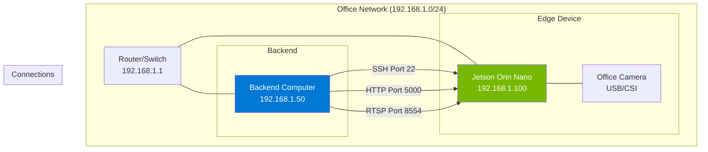

# Jetson Orin Nano: End-to-End Setup & Backend Connectivity Guide

> [!IMPORTANT]
> This guide addresses the specific issue where the camera feed is visible on the Jetson's connected monitor, but a backend computer cannot connect to the Jetson device over the network.

---

## 🎯 Which Device to Use?

Throughout this guide, commands are marked with device indicators:

| Icon | Device | Description |
|:----:|--------|-------------|
| 🟢 | **Jetson Orin Nano** | Run on the Jetson terminal (keyboard/monitor connected directly OR via SSH) |
| 🔵 | **Backend Computer** | Run on your Windows/Linux backend computer |
| 🟠 | **Host Ubuntu PC** | Only for initial OS flashing (one-time setup) |

> [!TIP]
> **Your current situation:** The Jetson has a monitor and keyboard connected directly. Run all 🟢 commands there. Once SSH is working, you can run 🟢 commands remotely from your 🔵 backend computer via SSH.

---

## Table of Contents

1. [Quick Diagnosis Checklist](#quick-diagnosis-checklist)
2. [OS Installation (JetPack 6.x)](#os-installation-jetpack-6x)
3. [Network Configuration](#network-configuration)
4. [SSH & Remote Access Setup](#ssh--remote-access-setup)
5. [Firewall Configuration](#firewall-configuration)
6. [Camera Stream Sharing](#camera-stream-sharing)
7. [Backend Connection Methods](#backend-connection-methods)
8. [Troubleshooting Common Issues](#troubleshooting-common-issues)
9. [Verification Commands](#verification-commands)

---

## Quick Diagnosis Checklist

### 🟢 Run on JETSON (using keyboard/monitor connected to Jetson)

```bash
# 1. Check if Jetson has an IP address
ip addr show

# 2. Verify network connectivity (ping your backend computer)
ping -c 4 <BACKEND_COMPUTER_IP>

# 3. Check if SSH is running
sudo systemctl status ssh

# 4. Check firewall status
sudo ufw status

# 5. List listening ports
sudo ss -tulpn | grep LISTEN

# 6. Check if the camera is being accessed
v4l2-ctl --list-devices
```

---

## OS Installation (JetPack 6.x)

> [!NOTE]
> If your Jetson already has JetPack installed and boots normally, **skip to [Network Configuration](#network-configuration)**.

### Hardware Requirements

| Component | Specification |
|-----------|--------------|
| **Jetson Orin Nano Developer Kit** | 4GB or 8GB RAM version |
| **NVMe SSD** | 128GB+ (recommended for Orin Nano) |
| **Power Supply** | 9-20V DC (included with kit) |
| **USB-C Cable** | For flashing (USB 3.0 recommended) |
| **Host Computer** | Ubuntu 20.04/22.04 x64 for flashing |

> [!NOTE]
> Unlike older Jetson Nano, the **Orin Nano** requires an NVMe SSD for the operating system. microSD is NOT supported for boot.

### Step 1: Download NVIDIA SDK Manager

### 🟠 Run on HOST UBUNTU PC (for flashing only)

```bash
# Download SDK Manager
wget https://developer.nvidia.com/downloads/sdkm-192-4-ubuntu-2004-amd64-deb

# Install SDK Manager
sudo apt install ./sdkm-192-4-ubuntu-2004-amd64-deb

# Launch SDK Manager
sdkmanager
```

### Step 2: Flash JetPack to Orin Nano

1. **Connect Jetson to Host Computer:**
   - Power OFF the Jetson
   - Connect USB-C cable from Jetson to host computer
   - Hold the **Force Recovery** button
   - While holding, power ON the Jetson
   - Release Force Recovery after 2 seconds

2. **In SDK Manager:**
   - Login with NVIDIA developer account
   - Select **Jetson Orin Nano Developer Kit** as target
   - Select **JetPack 6.0** or latest available
   - Select **NVMe** as storage (not SD card)
   - Click "Continue" and wait for download (~15GB)

3. **Flash Process:**
   - SDK Manager will detect the Jetson in recovery mode
   - Select "Flash" and wait (~30-45 minutes)
   - When prompted, enter username/password for Jetson
   - Complete the flash process

### Step 3: First Boot & Initial Setup

After flashing, disconnect USB and connect:
- HDMI monitor
- USB keyboard/mouse
- Ethernet cable

**Power ON and complete the setup wizard:**

### 🟢 Run on JETSON (using keyboard/monitor connected to Jetson)

```bash
# After login, verify the installation
cat /etc/nv_tegra_release
# Should show: R36 (JetPack 6.x)

# Check GPU
tegrastats
# Should show GPU activity

# Update system
sudo apt update && sudo apt upgrade -y
```

---

## Network Configuration

> [!CAUTION]
> **This is the most common cause of connectivity issues!** The Jetson must be on the same network/subnet as your backend computer.

### 🟢 Run ALL commands in this section on JETSON

### Method 1: Wired Ethernet (Recommended)

```bash
# Check current network interfaces
ip addr show

# You should see eth0 (or eno1/enp1s0) with an IP address
# Example: 192.168.1.105/24

# If no IP is assigned, configure manually:
sudo nmcli con add type ethernet con-name "Wired" ifname eth0 \
    ip4 192.168.1.100/24 gw4 192.168.1.1

# Activate the connection
sudo nmcli con up "Wired"
```

### Method 2: Static IP Configuration (Recommended for InvEye)

For consistent connectivity, set a static IP:

```bash
# Edit netplan configuration
sudo nano /etc/netplan/01-network-manager-all.yaml
```

Replace contents with:

```yaml
network:
  version: 2
  renderer: NetworkManager
  ethernets:
    eth0:
      dhcp4: no
      addresses:
        - 192.168.1.100/24
      routes:
        - to: default
          via: 192.168.1.1
      nameservers:
        addresses:
          - 8.8.8.8
          - 8.8.4.4
```

Apply the configuration:

```bash
sudo netplan apply

# Verify
ip addr show eth0
```

### Method 3: WiFi Setup (If needed)

```bash
# List available WiFi networks
nmcli dev wifi list

# Connect to WiFi
nmcli dev wifi connect "NETWORK_NAME" password "WIFI_PASSWORD"

# Verify connection
nmcli con show --active
ip addr show wlan0
```

### Verify Network Connectivity

```bash
# Ping your router/gateway
ping -c 4 192.168.1.1

# Ping your backend computer
ping -c 4 <BACKEND_COMPUTER_IP>

# If ping fails, check if both devices are on same subnet
# Jetson: 192.168.1.100/24
# Backend: 192.168.1.XXX/24 (must be same network)
```

---

## SSH & Remote Access Setup

### 🟢 Run on JETSON: Enable SSH (Critical!)

SSH is often disabled by default on new JetPack installations:

```bash
# Install OpenSSH server if not installed
sudo apt install openssh-server -y

# Start SSH service
sudo systemctl start ssh

# Enable SSH on boot
sudo systemctl enable ssh

# Verify SSH is running
sudo systemctl status ssh

# Check SSH is listening on port 22
sudo ss -tulpn | grep :22
```

### 🔵 Run on BACKEND COMPUTER: Configure SSH Key Authentication

```powershell
# Generate SSH key (if not already done)
ssh-keygen -t ed25519 -C "inveye-backend"

# Copy key to Jetson (replace with actual Jetson IP)
type $env:USERPROFILE\.ssh\id_ed25519.pub | ssh inveye@192.168.1.100 "mkdir -p ~/.ssh && cat >> ~/.ssh/authorized_keys"

# Now you can SSH without password
ssh inveye@192.168.1.100
```

### 🔵 Run on BACKEND COMPUTER: Test SSH Connection

```powershell
# Using PowerShell
ssh inveye@192.168.1.100

# Using PuTTY
# 1. Open PuTTY
# 2. Enter IP: 192.168.1.100
# 3. Port: 22
# 4. Connection type: SSH
# 5. Click Open
```

---

## Firewall Configuration

> [!WARNING]
> Ubuntu's UFW firewall can block all incoming connections. This is a very common cause of the "cannot connect" issue.

### 🟢 Run ALL commands in this section on JETSON

### Option 1: Disable Firewall (Quick Test)

```bash
# Check if firewall is enabled
sudo ufw status

# Temporarily disable for testing
sudo ufw disable

# Now test if backend can connect
```

### Option 2: Configure Firewall Properly (Recommended)

```bash
# Allow SSH
sudo ufw allow ssh

# Allow common InvEye ports
sudo ufw allow 22/tcp    # SSH
sudo ufw allow 8080/tcp  # Web server
sudo ufw allow 8554/tcp  # RTSP streaming
sudo ufw allow 5000/tcp  # Flask API
sudo ufw allow 554/tcp   # RTSP default

# Allow ping
sudo ufw allow icmp

# Enable firewall with rules
sudo ufw enable

# Verify rules
sudo ufw status verbose
```

### Check iptables (Alternative to UFW)

```bash
# List all iptables rules
sudo iptables -L -n -v

# If blocking, flush rules (CAUTION: removes all rules)
sudo iptables -F
```

---

## Camera Stream Sharing

The camera feed is visible locally but not accessible remotely. Here's how to stream it:

### 🟢 Run ALL commands in this section on JETSON

### Method 1: RTSP Server with GStreamer

```bash
# Install GStreamer RTSP server
sudo apt install gstreamer1.0-rtsp
pip3 install gi

# Create RTSP streaming script
mkdir -p ~/inveye-edge/scripts
nano ~/inveye-edge/scripts/rtsp_server.py
```

Add this content:

```python
#!/usr/bin/env python3
"""
RTSP Server for Jetson Orin Nano Camera Streaming
Allows backend computers to access the camera feed
"""

import gi
gi.require_version('Gst', '1.0')
gi.require_version('GstRtspServer', '1.0')
from gi.repository import Gst, GstRtspServer, GLib

Gst.init(None)

class RTSPServer:
    def __init__(self, port="8554", mount_point="/stream"):
        self.server = GstRtspServer.RTSPServer()
        self.server.set_service(port)
        
        factory = GstRtspServer.RTSPMediaFactory()
        
        # For USB Camera
        pipeline = (
            "( v4l2src device=/dev/video0 ! "
            "video/x-raw,width=1280,height=720,framerate=30/1 ! "
            "nvvidconv ! nvv4l2h264enc insert-sps-pps=true ! "
            "rtph264pay name=pay0 pt=96 )"
        )
        
        # Alternative: For CSI Camera
        # pipeline = (
        #     "( nvarguscamerasrc ! "
        #     "video/x-raw(memory:NVMM),width=1280,height=720,framerate=30/1 ! "
        #     "nvv4l2h264enc insert-sps-pps=true ! "
        #     "rtph264pay name=pay0 pt=96 )"
        # )
        
        factory.set_launch(pipeline)
        factory.set_shared(True)
        
        mounts = self.server.get_mount_points()
        mounts.add_factory(mount_point, factory)
        
        self.server.attach(None)
        print(f"RTSP server running at rtsp://<JETSON_IP>:{port}{mount_point}")

if __name__ == "__main__":
    server = RTSPServer()
    loop = GLib.MainLoop()
    print("Press Ctrl+C to stop the server")
    try:
        loop.run()
    except KeyboardInterrupt:
        print("\nServer stopped")
```

Run the RTSP server:

```bash
chmod +x ~/inveye-edge/scripts/rtsp_server.py
python3 ~/inveye-edge/scripts/rtsp_server.py
```

### Method 2: Flask HTTP Video Streaming

```bash
# Install Flask
pip3 install flask opencv-python

# Create Flask streaming server
nano ~/inveye-edge/scripts/flask_stream.py
```

Add this content:

```python
#!/usr/bin/env python3
"""
Flask HTTP Streaming Server for Jetson Orin Nano
Access from browser: http://<JETSON_IP>:5000
"""

from flask import Flask, Response
import cv2

app = Flask(__name__)

def generate_frames():
    cap = cv2.VideoCapture(0)  # Use camera index 0
    cap.set(cv2.CAP_PROP_FRAME_WIDTH, 1280)
    cap.set(cv2.CAP_PROP_FRAME_HEIGHT, 720)
    
    while True:
        success, frame = cap.read()
        if not success:
            break
        
        ret, buffer = cv2.imencode('.jpg', frame)
        frame_bytes = buffer.tobytes()
        
        yield (b'--frame\r\n'
               b'Content-Type: image/jpeg\r\n\r\n' + frame_bytes + b'\r\n')

@app.route('/video')
def video_feed():
    return Response(generate_frames(),
                    mimetype='multipart/x-mixed-replace; boundary=frame')

@app.route('/')
def index():
    return '''
    <html>
        <head><title>InvEye Camera Stream</title></head>
        <body>
            <h1>InvEye Camera Feed</h1>
            
        </body>
    </html>
    '''

if __name__ == '__main__':
    # IMPORTANT: host='0.0.0.0' allows external access
    app.run(host='0.0.0.0', port=5000, threaded=True)
```

Run the Flask server:

```bash
python3 ~/inveye-edge/scripts/flask_stream.py
```

Access from backend: `http://192.168.1.100:5000`

### Create Systemd Service (Auto-start on Boot)

```bash
sudo nano /etc/systemd/system/inveye-stream.service
```

Add:

```ini
[Unit]
Description=InvEye Camera Streaming Service
After=network.target

[Service]
User=inveye
WorkingDirectory=/home/inveye/inveye-edge/scripts
ExecStart=/usr/bin/python3 flask_stream.py
Restart=always
RestartSec=10

[Install]
WantedBy=multi-user.target
```

Enable the service:

```bash
sudo systemctl daemon-reload
sudo systemctl enable inveye-stream
sudo systemctl start inveye-stream
sudo systemctl status inveye-stream
```

---

## Backend Connection Methods

### 🔵 Run ALL commands in this section on BACKEND COMPUTER

#### Method 1: Browser Access (HTTP Stream)
```
Open browser and go to: http://192.168.1.100:5000
```

#### Method 2: VLC Player (RTSP Stream)
```
1. Open VLC
2. Media → Open Network Stream
3. Enter: rtsp://192.168.1.100:8554/stream
4. Click Play
```

#### Method 3: SSH Tunnel (For Secure Access)
```powershell
# Create SSH tunnel to access Jetson's port 5000 locally
ssh -L 8080:localhost:5000 inveye@192.168.1.100

# Now access http://localhost:8080 on your Windows browser
```

#### Method 4: Python Client (Programmatic Access)
```python
import cv2

# For HTTP Stream
cap = cv2.VideoCapture('http://192.168.1.100:5000/video')

# For RTSP Stream
# cap = cv2.VideoCapture('rtsp://192.168.1.100:8554/stream')

while True:
    ret, frame = cap.read()
    if not ret:
        break
    cv2.imshow('InvEye Camera', frame)
    if cv2.waitKey(1) & 0xFF == ord('q'):
        break

cap.release()
cv2.destroyAllWindows()
```

---

## Troubleshooting Common Issues

### Issue 1: "Connection Refused"

**Symptoms:** Backend cannot connect, ping works but SSH/HTTP fails

**Solution:**
```bash
# On Jetson - Check if service is running
sudo systemctl status ssh
sudo systemctl status inveye-stream

# Check if ports are listening
sudo ss -tulpn | grep -E "22|5000|8554"

# Restart services
sudo systemctl restart ssh
sudo systemctl restart inveye-stream
```

### Issue 2: "No Route to Host"

**Symptoms:** Ping fails completely

**Solution:**
```bash
# Check network interface
ip addr show

# Verify subnet matches backend computer
# Both should be 192.168.1.x/24 or similar

# Check routing table
ip route show

# Verify cable connection
sudo ethtool eth0
```

### Issue 3: "Connection Timed Out"

**Symptoms:** Connection hangs then times out

**Solution:**
```bash
# Firewall is likely blocking
sudo ufw disable  # Test without firewall

# If that works, configure firewall properly
sudo ufw allow 22/tcp
sudo ufw allow 5000/tcp
sudo ufw allow 8554/tcp
sudo ufw enable
```

### Issue 4: "Camera Not Found"

**Symptoms:** Stream service fails to start

**Solution:**
```bash
# List available cameras
v4l2-ctl --list-devices

# Check camera permissions
ls -la /dev/video*

# Add user to video group
sudo usermod -aG video $USER
# Logout and login for changes to take effect

# Test camera directly
gst-launch-1.0 v4l2src device=/dev/video0 ! videoconvert ! autovideosink
```

### Issue 5: SSH Keys Not Working

**Solution:**
```bash
# On Jetson - Check SSH config
cat /etc/ssh/sshd_config | grep -E "PubkeyAuthentication|PasswordAuthentication"

# Should show:
# PubkeyAuthentication yes
# PasswordAuthentication yes

# Fix permissions
chmod 700 ~/.ssh
chmod 600 ~/.ssh/authorized_keys

# Restart SSH
sudo systemctl restart ssh
```

---

## Verification Commands

Run these on your **Jetson Orin Nano** to verify everything is working:

```bash
#!/bin/bash
echo "=== JETSON ORIN NANO CONNECTIVITY CHECK ==="

echo -e "\n1. Network Interface:"
ip -4 addr show | grep -E "inet |state"

echo -e "\n2. SSH Status:"
sudo systemctl is-active ssh

echo -e "\n3. Firewall Status:"
sudo ufw status

echo -e "\n4. Listening Ports:"
sudo ss -tulpn | grep LISTEN

echo -e "\n5. Camera Devices:"
ls /dev/video* 2>/dev/null || echo "No camera devices found"

echo -e "\n6. GPU Status:"
tegrastats --interval 1000 &
sleep 2
kill $!

echo -e "\n7. Ping Test to Gateway:"
ping -c 2 $(ip route | grep default | awk '{print $3}')

echo -e "\n=== END OF CHECK ==="
```

---

## Quick Reference Card

| Task | Command |
|------|---------|
| Check IP Address | `ip addr show` |
| Restart SSH | `sudo systemctl restart ssh` |
| Disable Firewall | `sudo ufw disable` |
| Allow Port | `sudo ufw allow 5000/tcp` |
| Test Camera | `gst-launch-1.0 v4l2src ! autovideosink` |
| Check Ports | `sudo ss -tulpn \| grep LISTEN` |
| Start Stream | `python3 ~/inveye-edge/scripts/flask_stream.py` |
| View Logs | `journalctl -u inveye-stream -f` |

---

## Network Diagram for InvEye Setup



---

> [!TIP]
> **Most Common Fix:** If camera feed shows on local monitor but backend can't connect:
> 1. Set a static IP on Jetson
> 2. Run `sudo ufw allow 5000/tcp && sudo ufw allow 22/tcp`
> 3. Start the Flask streaming server with `host='0.0.0.0'`
> 4. Access from backend via browser at `http://<JETSON_IP>:5000`
