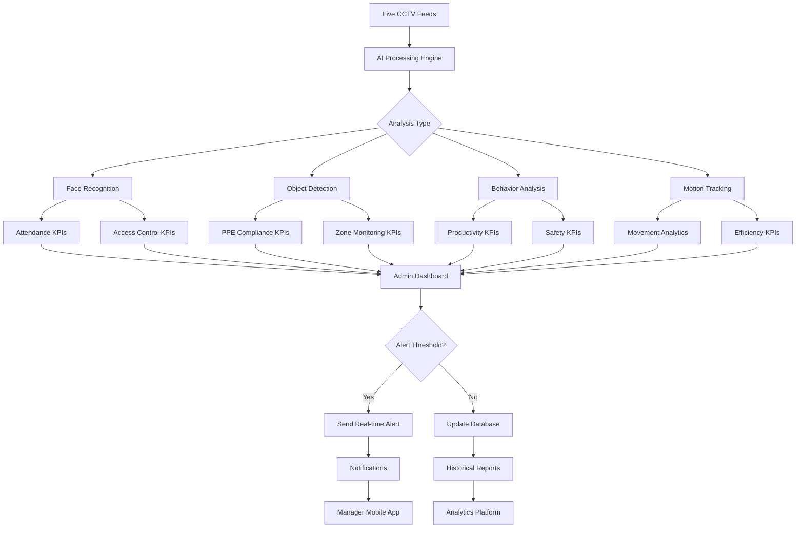
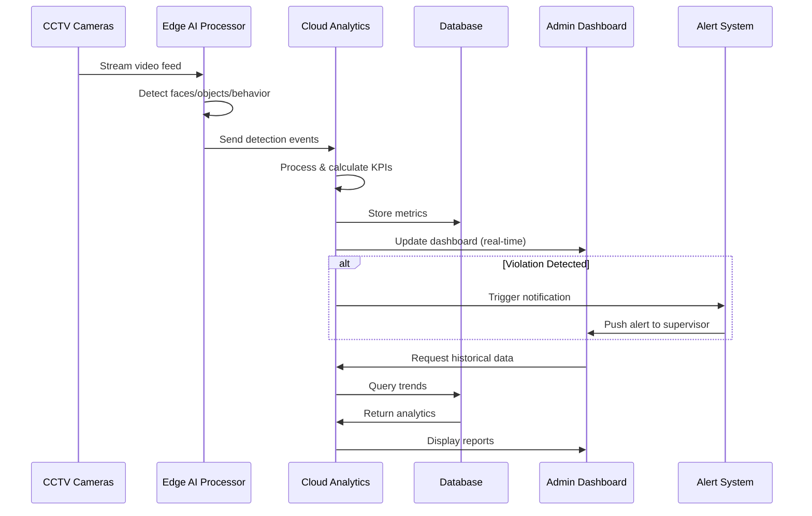

# Employee Tracking KPI Cards
## Admin/Employer Dashboard Perspective

> [!IMPORTANT]
> All KPIs leverage **live CCTV feed analysis** and **AI-powered computer vision** for real-time monitoring and automated insights.

---

## 🎯 Core Performance KPIs

### 1. **Attendance & Punctuality Score**
```
┌─────────────────────────────────────────┐
│ 👥 Attendance Rate                      │
│ ━━━━━━━━━━━━━━━━━━━━━━━━━ 94.5%        │
│                                         │
│ 🕐 On-Time Arrivals:      276/300      │
│ ⏰ Late Arrivals (<15m):   18/300      │
│ ⚠️ Late (>15m):             6/300      │
│                                         │
│ 📊 7-Day Trend: ↗️ +2.3%               │
│ ⚡ Today: 285 Present / 300 Total      │
└─────────────────────────────────────────┘
```
**AI Capabilities:**
- Face recognition at entry/exit points
- Automated clock-in/clock-out via CCTV
- Real-time late arrival alerts
- Pattern detection for habitual tardiness

---

### 2. **Workstation Productivity Index**
```
┌─────────────────────────────────────────┐
│ 💼 Workspace Utilization                │
│ ━━━━━━━━━━━━━━━━━━━━━━━━━ 87.2%        │
│                                         │
│ Active Work Time:      6.8h / 8h        │
│ Break Time:            0.9h             │
│ Idle/Away Time:        0.3h             │
│                                         │
│ 🎯 Desk Occupancy:     89%              │
│ 📈 Efficiency Score:   A-               │
└─────────────────────────────────────────┘
```
**AI Capabilities:**
- Posture detection (seated/standing)
- Desk presence monitoring
- Activity level assessment
- Unusual absence pattern alerts

---

### 3. **Zone Compliance Tracker**
```
┌─────────────────────────────────────────┐
│ 🗺️ Restricted Area Monitoring          │
│                                         │
│ ✅ Authorized Access:      1,247        │
│ ⚠️ Warnings Issued:          12         │
│ 🚫 Violations Today:          2         │
│                                         │
│ High-Risk Zones:                        │
│ • Server Room:        ✓ Compliant       │
│ • Cash Vault:         ⚠️ 1 Violation   │
│ • Warehouse Hazmat:   ✓ Compliant       │
└─────────────────────────────────────────┘
```
**AI Capabilities:**
- Perimeter breach detection
- Unauthorized access alerts
- ID badge verification via CCTV
- Time-based permission enforcement

---

### 4. **Safety & PPE Compliance**
```
┌─────────────────────────────────────────┐
│ 🦺 Personal Protective Equipment        │
│ ━━━━━━━━━━━━━━━━━━━━━━━━━ 96.8%        │
│                                         │
│ Required Zones:                         │
│ • Hard Hat (Construction):   98%        │
│ • Safety Vest (Warehouse):   97%        │
│ • Face Mask (Lab):          95%         │
│                                         │
│ ⚠️ Active Violations:         4         │
│ 🔔 Alerts Sent Today:        11         │
└─────────────────────────────────────────┘
```
**AI Capabilities:**
- Real-time PPE detection (helmet, vest, mask)
- Instant violation notifications
- Compliance heat maps by zone
- Historical trend analysis

---

## 📊 Behavioral Analytics KPIs

### 5. **Collaboration & Interaction Index**
```
┌─────────────────────────────────────────┐
│ 🤝 Team Engagement Score                │
│                                         │
│ Meeting Room Usage:    78%              │
│ Avg. Meeting Duration: 32 min           │
│ Cross-Dept. Interactions: 145           │
│                                         │
│ 📍 Top Collaboration Zones:             │
│   1. Conference Room A (24 sessions)    │
│   2. Break Room (89 interactions)       │
│   3. Open Workspace (156 encounters)    │
└─────────────────────────────────────────┘
```
**AI Capabilities:**
- People counting in meeting rooms
- Interaction frequency analysis
- Team formation pattern detection
- Isolated employee identification

---

### 6. **Movement & Efficiency Heatmap**
```
┌─────────────────────────────────────────┐
│ 🚶 Employee Movement Analytics          │
│                                         │
│ Avg. Daily Steps (estimated): 4,200     │
│ High-Traffic Areas:                     │
│ • Main Entrance:      🔴 Very High      │
│ • Cafeteria:          🟠 High           │
│ • Restrooms:          🟡 Medium         │
│                                         │
│ ⚡ Bottleneck Alert:                    │
│   Elevator Bank B (Peak: 9:00-9:15)     │
└─────────────────────────────────────────┘
```
**AI Capabilities:**
- Trajectory tracking across facility
- Congestion detection
- Optimal path suggestions
- Crowd density monitoring

---

### 7. **Break Time & Wellness Monitor**
```
┌─────────────────────────────────────────┐
│ ☕ Break Pattern Analysis               │
│                                         │
│ Avg. Break Duration:   18 min           │
│ Break Frequency:       2.3 / day        │
│ Extended Breaks (>30m): 8 instances     │
│                                         │
│ 🌡️ Wellness Indicators:                │
│ • Regular breaks taken:    ✓ Healthy    │
│ • Overwork alerts:         3 employees  │
│ • No-break streaks:        0 employees  │
└─────────────────────────────────────────┘
```
**AI Capabilities:**
- Break area occupancy tracking
- Duration measurement
- Fatigue pattern detection
- Work-life balance scoring

---

## 🔐 Security & Audit KPIs

### 8. **Entry/Exit Traffic Monitor**
```
┌─────────────────────────────────────────┐
│ 🚪 Access Control Dashboard             │
│                                         │
│ Today's Traffic:                        │
│ • Total Entries:         1,247          │
│ • Total Exits:           1,198          │
│ • Currently On-Site:       312          │
│                                         │
│ 🆔 Identification Success:  99.7%       │
│ ⚠️ Failed Recognition:        4         │
│ 🚨 Tailgating Incidents:      2         │
└─────────────────────────────────────────┘
```
**AI Capabilities:**
- Facial recognition at gates
- Tailgating detection
- Unusual time access alerts
- Visitor vs. employee classification

---

### 9. **Suspicious Activity Tracker**
```
┌─────────────────────────────────────────┐
│ 🔍 AI Anomaly Detection                 │
│                                         │
│ Last 24 Hours:                          │
│ • Loitering Incidents:       3          │
│ • Abandoned Objects:         0          │
│ • Running/Panic Events:      1          │
│ • After-Hours Presence:      2          │
│                                         │
│ 🎯 Threat Level:      🟢 Low            │
│ 📹 Cameras Active:    48/50             │
└─────────────────────────────────────────┘
```
**AI Capabilities:**
- Loitering detection
- Unusual behavior recognition
- Abandoned object alerts
- Panic/emergency detection

---

### 10. **Uniform & Dress Code Compliance**
```
┌─────────────────────────────────────────┐
│ 👔 Appearance Standards                 │
│ ━━━━━━━━━━━━━━━━━━━━━━━━━ 92.1%        │
│                                         │
│ Compliance Rate:      276/300           │
│ Violations Today:      24               │
│                                         │
│ Common Issues:                          │
│ • No ID Badge Visible:    14            │
│ • Improper Footwear:       6            │
│ • Uniform Incomplete:      4            │
└─────────────────────────────────────────┘
```
**AI Capabilities:**
- Uniform color/pattern recognition
- ID badge visibility detection
- Dress code violation flagging
- Department-specific compliance

---

## 📈 Operational Efficiency KPIs

### 11. **Task Completion Velocity**
```
┌─────────────────────────────────────────┐
│ ⚡ Production Floor Efficiency          │
│                                         │
│ Assembly Line A:                        │
│ • Target Output:      500 units         │
│ • Current Progress:   478 (95.6%)       │
│ • Workers Present:    25/26             │
│ • Avg. Cycle Time:    4.2 min           │
│                                         │
│ 🏆 Efficiency Score:   A                │
│ 📊 vs. Yesterday:     +3.2%             │
└─────────────────────────────────────────┘
```
**AI Capabilities:**
- Worker presence at stations
- Activity level monitoring
- Idle time detection
- Shift handover verification

---

### 12. **Customer Service Response Time**
```
┌─────────────────────────────────────────┐
│ 🎧 Service Counter Analytics            │
│                                         │
│ Avg. Wait Time:        3.2 min          │
│ Queue Length:          Current: 4       │
│ Agents Available:      8/10             │
│                                         │
│ 📍 Counter Performance:                 │
│ • Counter 1:  ⚡ Fast (2.1 min avg)    │
│ • Counter 2:  ✓ Normal (3.5 min)       │
│ • Counter 3:  ⚠️ Slow (5.8 min)        │
└─────────────────────────────────────────┘
```
**AI Capabilities:**
- Queue length monitoring
- Customer counting
- Service time measurement
- Staff presence verification

---

## 🎯 KPI Dashboard Flow



---

## 🔄 Real-Time Processing Workflow



---

## 📱 KPI Card Categories

| Category | KPI Cards | Primary AI Features |
|----------|-----------|-------------------|
| **Performance** | Attendance, Productivity, Task Velocity | Face Recognition, Activity Detection |
| **Behavioral** | Collaboration, Movement, Breaks | Trajectory Tracking, People Counting |
| **Security** | Access Control, Anomalies, Zone Compliance | Perimeter Detection, Behavior Analysis |
| **Safety** | PPE Compliance, Dress Code | Object Detection, Pattern Recognition |
| **Operational** | Service Time, Efficiency, Queue Management | Queue Detection, Time Measurement |

---

## 🎨 Implementation Notes

> [!TIP]
> **Dashboard Best Practices:**
> - Use color coding (🟢 Green = Good, 🟡 Yellow = Warning, 🔴 Red = Critical)
> - Enable drill-down capability for each KPI card
> - Provide exportable reports with camera timestamps
> - Include playback links to relevant CCTV footage

> [!NOTE]
> **Privacy Compliance:**
> - Ensure GDPR/local privacy law compliance
> - Anonymize data where required
> - Provide employee transparency notices
> - Implement role-based access controls
