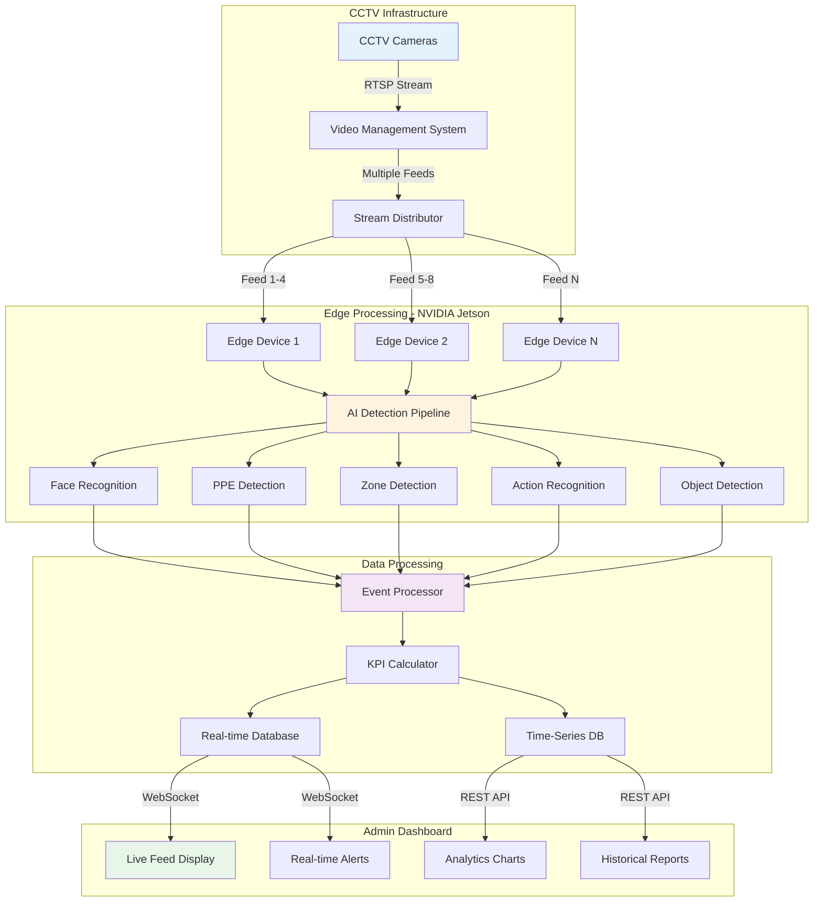
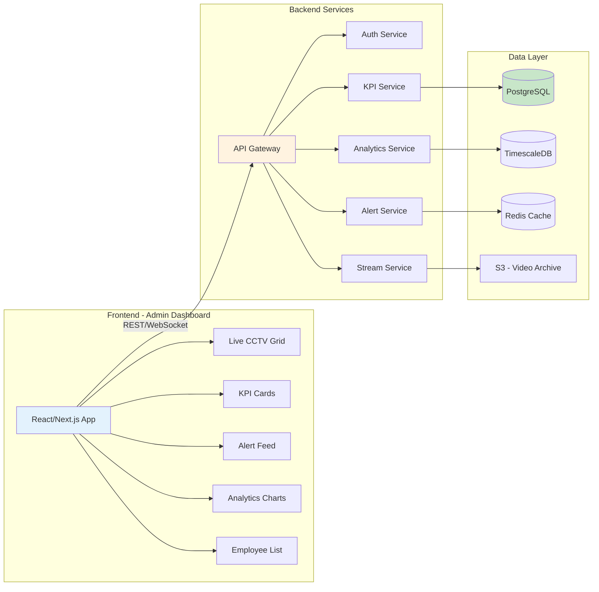
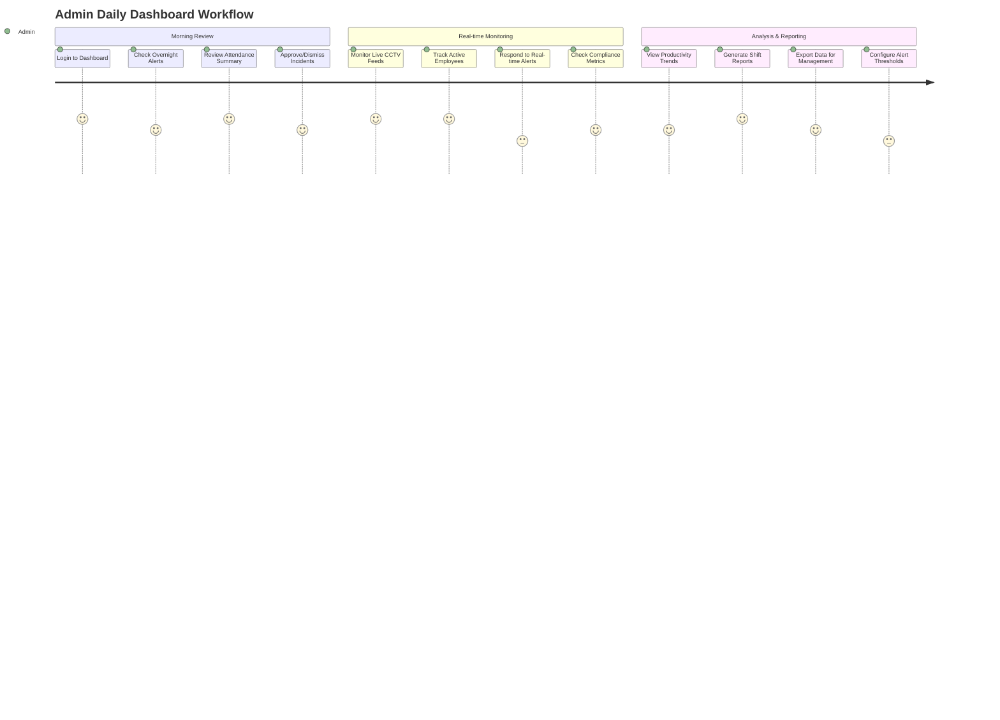
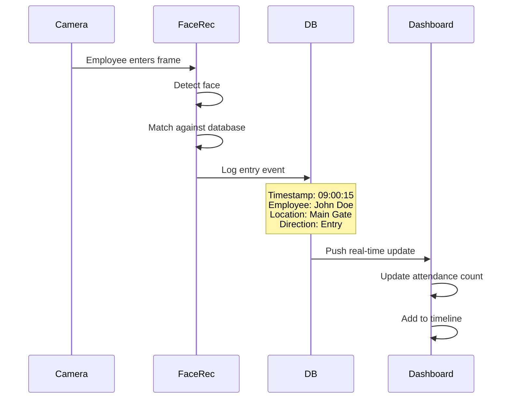
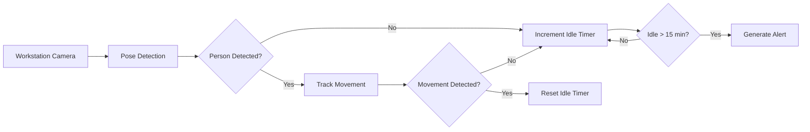
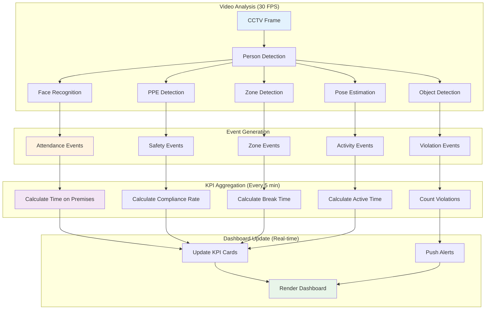
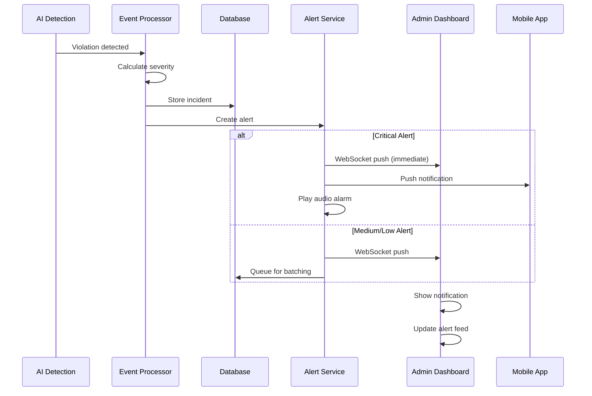

# Employee Tracking Dashboard - Complete Workflow & System Architecture

## 📋 Table of Contents
1. [System Overview](#system-overview)
2. [CCTV-Based Real-Time Tracking Flow](#cctv-based-real-time-tracking-flow)
3. [Dashboard Architecture](#dashboard-architecture)
4. [Admin Dashboard Workflow](#admin-dashboard-workflow)
5. [KPI Tracking Mechanisms](#kpi-tracking-mechanisms)
6. [Technical Flow](#technical-flow)
7. [Alert System](#alert-system)

---

## System Overview

### Purpose
Real-time employee tracking and productivity monitoring dashboard for administrators using AI-powered CCTV analytics.

### Key Capabilities
- **Live Tracking:** Real-time employee location and activity monitoring
- **Attendance:** Automated clock in/out detection via facial recognition
- **Productivity:** Time-on-task analysis and workstation monitoring
- **Compliance:** Safety equipment (PPE) and behavior compliance tracking
- **Analytics:** Historical trends, patterns, and predictive insights

### Inspiration Reference
Based on the **Nayara Petrol Pump Dashboard** design pattern:
- Clean, professional interface with light theme
- Real-time CCTV feed integration
- Live alert system with severity indicators
- Geographic/location-based summaries
- Time-series trend charts
- Color-coded status indicators
- Multi-level drill-down capability

---

## CCTV-Based Real-Time Tracking Flow



### Camera Placement Strategy

| Zone Type | Camera Count | Coverage | AI Models Required |
|:---|:---:|:---|:---|
| **Entry/Exit Gates** | 2-4 | Face capture, direction detection | Face Recognition, Person Detection |
| **Workstations** | 1 per 4 desks | Activity monitoring, posture detection | Pose Estimation, Object Detection |
| **Break Areas** | 1 per room | Time tracking, occupancy | Person Detection, Zone Tracking |
| **Production Floor** | 1 per 200 sq ft | PPE compliance, safety monitoring | PPE Classifier, Behavior Analysis |
| **Restricted Zones** | 1 per entrance | Access control, violation detection | Zone Detection, Face Recognition |

---

## Dashboard Architecture

### System Components



### Tech Stack Recommendation

**Frontend:**
- React/Next.js for dashboard interface
- WebRTC for live video streaming
- Chart.js / Recharts for data visualization
- Socket.io for real-time updates
- TailwindCSS for styling

**Backend:**
- Node.js / Python FastAPI for API services
- PostgreSQL for structured data (employees, shifts, incidents)
- TimescaleDB for time-series metrics
- Redis for real-time alert queue
- WebSocket server for live updates

**AI/ML:**
- NVIDIA Jetson for edge inference
- YOLOv8 for object/person detection
- DeepFace for facial recognition
- MediaPipe for pose estimation
- Custom models for PPE detection

---

## Admin Dashboard Workflow

### User Journey: Administrator Daily Flow



### Dashboard Screens Hierarchy

```
📊 InvEye Admin Dashboard
│
├─ 🏠 Overview Dashboard
│  ├─ Today's Summary (KPI Cards)
│  ├─ Live CCTV Grid (4-16 feeds)
│  ├─ Real-time Alert Feed
│  ├─ Attendance Status
│  └─ Active Violations
│
├─ 👥 Employee Tracking
│  ├─ Employee List (sortable, filterable)
│  ├─ Individual Employee Details
│  │  ├─ Clock In/Out Timeline
│  │  ├─ Location History
│  │  ├─ Activity Summary
│  │  ├─ Compliance Score
│  │  └─ Incident Log
│  └─ Department View
│
├─ 📈 Analytics
│  ├─ Productivity Metrics
│  ├─ Attendance Trends
│  ├─ Compliance Dashboard
│  ├─ Zone Heatmaps
│  └─ Comparative Reports
│
├─ 🔔 Alerts & Incidents
│  ├─ Live Alerts (filterable)
│  ├─ Incident Management
│  ├─ Historical Alerts
│  └─ Alert Configuration
│
├─ 📹 CCTV Management
│  ├─ Live Camera Grid
│  ├─ Camera Status
│  ├─ Historical Playback
│  └─ Snapshot Gallery
│
└─ ⚙️ Settings
   ├─ Shift Management
   ├─ Zone Configuration
   ├─ Alert Thresholds
   ├─ User Permissions
   └─ System Health
```

---

## KPI Tracking Mechanisms

### 1. Employee Entry/Exit Detection

**How It Works:**


**Dashboard Display:**
- **KPI Card:** Total employees present (updates live)
- **Timeline View:** Entry/exit events with timestamps
- **Location Map:** Show entry points with activity dots
- **Table View:** Employee name, entry time, location, status

---

### 2. Actual Time on Premises

**Calculation:**
```
Time on Premises = Last Detected On-Site - First Entry Time
Active Time = Time on Premises - Break Time - Idle Time
```

**Dashboard Display:**
```
┌─────────────────────────────────────┐
│ Employee: John Doe (#EMP-1234)     │
│                                     │
│ 📍 Current Status: On Premises     │
│ 🕐 Clock In: 09:02 AM              │
│ ⏱️ Total Time: 6h 45m              │
│ ✅ Active Time: 5h 30m (81%)       │
│ ☕ Break Time: 45m                 │
│ 💤 Idle Time: 30m                  │
│                                     │
│ Timeline:                           │
│ ▓▓▓▓░░▓▓▓▓▓▓░▓▓▓▓▓▓▓▓▓             │
│ 09  10  11  12  01  02  03  04     │
│ ▓ Active  ░ Break  ░ Idle          │
└─────────────────────────────────────┘
```

---

### 3. Time Spent in Break Areas

**Detection Method:**
- **Zone-based tracking:** Define break room polygons in camera view
- **Person tracking:** Track employee ID across zones
- **Dwell time calculation:** Time spent in designated break zones

**Dashboard Display:**
- **Break Duration Card:** Average break time per employee
- **Heatmap:** Break area utilization by hour
- **Alert:** Triggered if break time > 60 minutes/day
- **Individual View:** Break sessions timeline

---

### 4. Hours Beyond Shift

**Logic:**
```javascript
// Example calculation
const shiftEnd = "18:00"; // 6 PM
const actualExit = "20:30"; // 8:30 PM
const overtime = calculateDifference(shiftEnd, actualExit);
// Result: 2 hours 30 minutes overtime
```

**Dashboard Display:**
```
┌────────────────────────────────┐
│ Overtime Tracker               │
│                                │
│ Today's Overtime:              │
│ 👤 15 employees                │
│ ⏱️ 28.5 total hours           │
│ 💰 Avg: 1.9 hrs/person        │
│                                │
│ Top Overtime Workers:          │
│ 1. John Doe     3.5 hrs 🔴    │
│ 2. Jane Smith   2.8 hrs 🟡    │
│ 3. Mike Johnson 2.2 hrs 🟡    │
│                                │
│ [View Detailed Report →]      │
└────────────────────────────────┘
```

---

### 5. % of Scheduled Days Missed

**Calculation:**
```
Absenteeism Rate = (Absent Days / Scheduled Days) × 100
```

**Data Sources:**
- **Scheduled shifts:** From HR/shift management system
- **Actual attendance:** From CCTV entry detection
- **Leaves (approved):** Excluded from calculation

**Dashboard Display:**
- **Monthly Absenteeism Card:** 5.2% (12/230 days)
- **Trend Chart:** Weekly/monthly absenteeism patterns
- **Department Comparison:** Bar chart by department
- **Individual Tracking:** Employee-level absenteeism scores

---

### 6. Inactive Periods at Workstation

**Detection Method:**


**Dashboard Display:**
```
┌─────────────────────────────────┐
│ Workstation Activity            │
│                                 │
│ Desk #12 - John Doe             │
│ Status: 🟢 Active               │
│                                 │
│ Today's Activity:               │
│ ■■■■■■■■░░ 82% Active          │
│ ░░         10% Idle             │
│ ░          8% Away              │
│                                 │
│ Idle Periods (>15 min):         │
│ • 11:30-11:50 AM (20 min)       │
│ • 02:15-02:35 PM (20 min)       │
│                                 │
│ Last Seen: 2 min ago            │
└─────────────────────────────────┘
```

---

### 7. Unauthorized Phone Use

**Detection Method:**
- **Object Detection:** YOLOv8 trained to detect phones
- **Hand-to-face gesture:** Pose estimation for phone-holding gesture
- **Duration tracking:** Time phone is detected in hand

**Dashboard Display:**
```
┌─────────────────────────────────┐
│ Phone Use Monitoring            │
│                                 │
│ 🔴 ACTIVE VIOLATION              │
│ Employee: Sarah Lee (#EMP-789)  │
│ Location: Workstation B-15      │
│ Duration: 8 min 32 sec          │
│ Threshold: 10 min/hour          │
│                                 │
│ [View CCTV Feed] [Dismiss]      │
│                                 │
│ Today's Summary:                │
│ • 12 phone use incidents        │
│ • Avg duration: 6.5 min         │
│ • Top violator: John Doe (3x)   │
└─────────────────────────────────┘
```

---

## Technical Flow

### Real-Time Data Processing Pipeline



### Database Schema (Simplified)

```sql
-- Employees
CREATE TABLE employees (
    id SERIAL PRIMARY KEY,
    employee_code VARCHAR(20) UNIQUE,
    name VARCHAR(100),
    department VARCHAR(50),
    shift_start TIME,
    shift_end TIME
);

-- Attendance Events
CREATE TABLE attendance_events (
    id SERIAL PRIMARY KEY,
    employee_id INT REFERENCES employees(id),
    event_type VARCHAR(10), -- 'entry' or 'exit'
    timestamp TIMESTAMPTZ,
    location VARCHAR(50),
    camera_id INT,
    confidence FLOAT
);

-- Zone Events
CREATE TABLE zone_events (
    id SERIAL PRIMARY KEY,
    employee_id INT REFERENCES employees(id),
    zone_type VARCHAR(50), -- 'workstation', 'break_area', 'restricted'
    entry_time TIMESTAMPTZ,
    exit_time TIMESTAMPTZ,
    duration_seconds INT
);

-- Violations
CREATE TABLE violations (
    id SERIAL PRIMARY KEY,
    employee_id INT REFERENCES employees(id),
    violation_type VARCHAR(50), -- 'phone_use', 'no_ppe', 'idle'
    timestamp TIMESTAMPTZ,
    duration_seconds INT,
    severity VARCHAR(20), -- 'low', 'medium', 'high'
    status VARCHAR(20) DEFAULT 'open', -- 'open', 'acknowledged', 'resolved'
    snapshot_url TEXT
);

-- Daily KPIs (Aggregated)
CREATE TABLE daily_kpis (
    id SERIAL PRIMARY KEY,
    employee_id INT REFERENCES employees(id),
    date DATE,
    time_on_premises INT, -- seconds
    active_time INT,
    break_time INT,
    idle_time INT,
    overtime INT,
    violation_count INT,
    compliance_score FLOAT
);
```

---

## Alert System

### Alert Priority Levels

| Priority | Color | Icon | Response Time | Examples |
|:---|:---:|:---:|:---|:---|
| **Critical** | 🔴 Red | ⚠️ | Immediate | Restricted area breach, safety incident, fire |
| **High** | 🟠 Orange | ⚡ | < 5 min | No PPE in hazard zone, prolonged idle |
| **Medium** | 🟡 Yellow | ℹ️ | < 30 min | Excessive break time, phone use |
| **Low** | 🔵 Blue | 📋 | < 1 hour | Late arrival, minor compliance issue |

### Alert Flow



### Dashboard Alert Component

```
┌─────────────────────────────────────────┐
│ 🔔 Real-time Alerts                     │
├─────────────────────────────────────────┤
│                                         │
│ 🔴 CRITICAL - 2 min ago                │
│ Restricted Area Breach                  │
│ Employee: Unknown Person                │
│ Location: Server Room (Cam #8)          │
│ [View CCTV] [Acknowledge]               │
│                                         │
│ ─────────────────────────────────────  │
│                                         │
│ 🟠 HIGH - 5 min ago                    │
│ No PPE Detected                         │
│ Employee: John Doe (#EMP-1234)          │
│ Location: Production Floor (Cam #12)    │
│ [View CCTV] [Dismiss]                   │
│                                         │
│ ─────────────────────────────────────  │
│                                         │
│ 🟡 MEDIUM - 15 min ago                 │
│ Unauthorized Phone Use                  │
│ Employee: Sarah Lee (#EMP-789)          │
│ Duration: 12 min (threshold: 10 min)    │
│ [View Details] [Dismiss]                │
│                                         │
│ ─────────────────────────────────────  │
│                                         │
│ [View All Alerts (24) →]               │
└─────────────────────────────────────────┘
```

---

## Dashboard Screen Wireframes

### Screen 1: Main Overview Dashboard

```
┌────────────────────────────────────────────────────────────────────┐
│ 🏠 InvEye Dashboard    [Location: HQ]  [Shift: Day]  🔴 LIVE      │
│ [Today ▼] [Export] [Settings]                    Admin: John Doe  │
├────────────────────────────────────────────────────────────────────┤
│                                                                    │
│ ┌──────────┐ ┌──────────┐ ┌──────────┐ ┌──────────┐             │
│ │   👤     │ │   ✓      │ │   ⚠️     │ │   🕐    │             │
│ │   145    │ │   92%    │ │    3     │ │  7.2hr  │             │
│ │ Present  │ │Compliance│ │  Alerts  │ │ Avg Time│             │
│ │ ↑ +5     │ │ ↓ -2%    │ │ ↑ +1     │ │ → 0%    │             │
│ └──────────┘ └──────────┘ └──────────┘ └──────────┘             │
│                                                                    │
├──────────────────────────────┬─────────────────────────────────────┤
│ 📹 Live CCTV Feeds (4/16)   │ 🔔 Real-time Alerts                │
│                              │                                     │
│ ┌────────┬────────┐         │ 🔴 Restricted Area Breach           │
│ │ CAM 1  │ CAM 2  │         │ Unknown Person - Server Room        │
│ │ Gate A │ Floor B│         │ 2 min ago                           │
│ │ [Live] │ [Live] │         │ ─────────────────────────────────   │
│ └────────┴────────┘         │ 🟠 No PPE Detected                 │
│ ┌────────┬────────┐         │ John Doe - Production Floor         │
│ │ CAM 3  │ CAM 4  │         │ 5 min ago                           │
│ │ Break  │ Exit C │         │ ─────────────────────────────────   │
│ │ [Live] │ [Live] │         │ 🟡 Phone Use Alert                 │
│ └────────┴────────┘         │ Sarah Lee - Workstation B-15        │
│                              │ 15 min ago                          │
│ [View All Cameras →]        │ [View All (24) →]                  │
│                              │                                     │
├──────────────────────────────┴─────────────────────────────────────┤
│                                                                    │
│ 📊 Attendance Trend (Last 7 Days)                                 │
│ ┌────────────────────────────────────────────────────────────┐   │
│ │ 160│                                                        │   │
│ │    │     ●───●                                             │   │
│ │ 140│    ╱     ╲     ●───●───●                             │   │
│ │    │   ●       ╲   ╱                                       │   │
│ │ 120│            ╲ ╱                                        │   │
│ │    │             ●                                          │   │
│ │ 100│                                                        │   │
│ │    ┼────────────────────────────────────────────────────── │   │
│ │     Mon  Tue  Wed  Thu  Fri  Sat  Sun                     │   │
│ └────────────────────────────────────────────────────────────┘   │
│                                                                    │
│ ┌──────────────────────────────┬─────────────────────────────┐   │
│ │ PPE Compliance Rate (Today)  │ Break Area Occupancy        │   │
│ │                              │                             │   │
│ │          92%                 │ Break Room A: 12👤          │   │
│ │       ██████████░░           │ Break Room B: 8👤           │   │
│ │                              │ Cafeteria: 25👤             │   │
│ │ Target: 95%                  │ Outdoor: 3👤                │   │
│ │ ⚠️ Below threshold           │                             │   │
│ └──────────────────────────────┴─────────────────────────────┘   │
└────────────────────────────────────────────────────────────────────┘
```

---

## Next Steps for Implementation

### Phase 1: Setup (Week 1-2)
1. ✅ Install CCTV cameras in strategic locations
2. ✅ Deploy NVIDIA Jetson edge devices
3. ✅ Set up network infrastructure (RTSP streaming)
4. ✅ Configure database servers
5. ✅ Deploy backend API services

### Phase 2: AI Model Training (Week 3-4)
1. 🔄 Collect training data from CCTVs
2. 🔄 Train/fine-tune face recognition model
3. 🔄 Train PPE detection model
4. 🔄 Configure zone detection polygons
5. 🔄 Test and validate model accuracy

### Phase 3: Dashboard Development (Week 5-6)
1. 📋 Design Figma prototypes (see Figma guide)
2. 📋 Build frontend components
3. 📋 Integrate real-time WebSocket
4. 📋 Implement alert system
5. 📋 Create admin user management

### Phase 4: Testing & Deployment (Week 7-8)
1. ⏳ End-to-end testing with live data
2. ⏳ Performance optimization
3. ⏳ Security audit
4. ⏳ Admin training
5. ⏳ Go live

---

**Document Version:** 1.0  
**Last Updated:** December 2, 2024  
**Related Documents:**
- [Employee & Retail KPIs](file:///c:/Users/LENOVO/Desktop/my_docs/AG/InvEye/EMPLOYEE_RETAIL_KPIS.md)
- [Figma Design Guide](file:///c:/Users/LENOVO/Desktop/my_docs/AG/InvEye/FIGMA_DASHBOARD_DESIGN_GUIDE.md)
- [Beginner's Figma Tutorial](file:///c:/Users/LENOVO/Desktop/my_docs/AG/InvEye/FIGMA_BEGINNER_TUTORIAL.md)
