# NAYARA FUEL STATION - SYSTEM ARCHITECTURE DIAGRAMS

**Technical Architecture for AI-Powered Petroleum Retail Monitoring**

---

## 📋 Table of Contents

1. [High-Level System Overview](#high-level-system-overview)
2. [Component Architecture](#component-architecture)
3. [Data Flow Architecture](#data-flow-architecture)
4. [Severity-Based Alert Routing](#severity-based-alert-routing)
5. [Integration Architecture](#integration-architecture)
6. [Network Topology](#network-topology)
7. [Database Schema](#database-schema)
8. [Deployment Architecture](#deployment-architecture)

---

## High-Level System Overview


**Key Components**:
- **Edge Layer**: CCTV + AI processing at fuel station
- **Cloud Layer**: Analytics, storage, dashboards
- **Integration Layer**: Connect to existing fuel station systems
- **User Layer**: Web + mobile interfaces

---

## Component Architecture

### Edge Processing Layer (maigic.ai)


**Processing Pipeline**:
1. **Video Decode**: RTSP streams → H.264/H.265 decode (GPU-accelerated)
2. **Frame Extraction**: 30 FPS → downsample to 5-10 FPS for AI
3. **AI Inference**: Run detection models on each frame
4. **Event Generation**: Convert detections to KPI events
5. **Classification**: Assign severity (RED/ORANGE/YELLOW)
6. **Cloud Sync**: Send events to cloudtuner.ai

**Hardware Spec**:
- **NVIDIA Jetson Orin Nano** (8GB): Small stations (≤ 16 cameras)
- **NVIDIA Jetson AGX Orin** (32GB): Large stations (≥ 24 cameras)
- **Storage**: 256GB NVMe SSD (local video buffer)

---

### Cloud Analytics Service


---

## Data Flow Architecture

### Real-Time KPI Monitoring Flow


---

### Tanker Unloading SOP Verification Flow

```mermaid
flowchart TD
    A[Tanker Enters Station] --> B[Camera 5: LPR Detection]
    B --> C{Authorized Tanker?}
    C -->|No| D[🔴 Alert: Unauthorized Tanker]
    C -->|Yes| E[Tanker Parks at Bay]
    
    E --> F[Camera 6: Monitor Unloading Zone]
    F --> G{Grounding Cable Connected?}
    G -->|No| H[🔴 Alert: Static Discharge Violation]
    G -->|Yes| I{Supervisor Present?}
    I -->|No| J[🔴 Alert: No Supervisor]
    I -->|Yes| K[Monitor Valve Opening]
    
    K --> L{Correct Sequence?}
    L -->|No| M[🔴 Alert: SOP Violation]
    L -->|Yes| N[ATG: Start Density Monitoring]
    
    N --> O{Density in Range?}
    O -->|No| P[🔴 Alert: Fuel Quality Issue]
    O -->|Yes| Q[Unloading In Progress]
    
    Q --> R[Completion Detected]
    R --> S[Auto-Generate Delivery Report]
    S --> T[Update Inventory]
    T --> U[✅ Compliance Log Updated]
    
    style D fill:#FFCDD2
    style H fill:#FFCDD2
    style J fill:#FFCDD2
    style M fill:#FFCDD2
    style P fill:#FFCDD2
    style U fill:#C8E6C9
```



---

## Severity-Based Alert Routing


### Alert Persistence & Tracking


---

## Integration Architecture

### External System Connections


### API Specifications

#### ATG Integration (Automatic Tank Gauge)

**Endpoint**: `GET /api/atg/tank-status`

**Request**:
```json
{
  "station_id": "NAY-SEC12",
  "tank_ids": ["TANK-MS-1", "TANK-HSD-1"]
}
```

**Response**:
```json
{
  "timestamp": "2024-12-08T14:32:00Z",
  "tanks": [
    {
      "tank_id": "TANK-MS-1",
      "product": "MS (Petrol)",
      "volume_liters": 12485,
      "density_kg_m3": 738.2,
      "temperature_celsius": 28.5,
      "water_level_mm": 5,
      "status": "NORMAL"
    },
    {
      "tank_id": "TANK-HSD-1",
      "product": "HSD (Diesel)",
      "volume_liters": 8920,
      "density_kg_m3": 834.1,
      "temperature_celsius": 29.1,
      "water_level_mm": 3,
      "status": "NORMAL"
    }
  ]
}
```

**Alert Triggers**:
- Density variance > ±0.5 kg/m³ → 🔴 RED Alert
- Water level > 10mm → 🔴 RED Alert
- Temperature out of range → ⚠️ ORANGE Alert

---

#### POS Integration

**Webhook**: `POST /api/pos/transaction` (Pushed by POS on each sale)

**Payload**:
```json
{
  "transaction_id": "TXN-20241208-1432-042",
  "timestamp": "2024-12-08T14:32:15Z",
  "du_id": "DU-03",
  "product": "MS",
  "quantity_liters": 45.5,
  "amount_inr": 5005.50,
  "payment_method": "UPI",
  "customer_vehicle": "MH-12-AB-1234"
}
```

**Validation**:
- Cross-check quantity with DU meter reading
- Verify amount = quantity × price
- Flag if variance > 2%

---

## Network Topology

### Fuel Station Network Architecture


**Network Configuration**:
- **CCTV VLAN**: Isolated for video traffic (highest priority QoS)
- **Edge AI VLAN**: Jetson devices + gateway (medium priority)
- **Fuel Systems VLAN**: ATG, POS, DU (secure, no internet access)
- **Office VLAN**: Manager devices (standard priority)

**Security**:
- Firewall rules: Only Edge Gateway can access internet
- VPN tunnel: Station → Cloud (encrypted)
- Certificate-based authentication
- No direct camera internet exposure

---

## Database Schema

### Core Tables


### Time-Series Data (TimescaleDB)

**Table**: `kpi_timeseries`

| Column | Type | Description |
|:-------|:-----|:------------|
| `time` | TIMESTAMPTZ | Event timestamp (indexed) |
| `station_id` | VARCHAR | Station identifier |
| `kpi_code` | VARCHAR | KPI code |
| `value` | FLOAT | Measured value |
| `status` | VARCHAR | OK / WARNING / CRITICAL |
| `metadata` | JSONB | Additional context |

**Hypertable Config**:
- Partition by: `time` (1 day chunks)
- Retention policy: 90 days (auto-delete older data)
- Compression: After 7 days

**Sample Queries**:

```sql
-- Hourly compliance score for last 24 hours
SELECT 
  time_bucket('1 hour', time) AS hour,
  AVG(CASE WHEN status = 'OK' THEN 100 ELSE 0 END) AS compliance_pct
FROM kpi_timeseries
WHERE station_id = 'NAY-SEC12'
  AND time > NOW() - INTERVAL '24 hours'
GROUP BY hour
ORDER BY hour DESC;

-- Top 5 violated KPIs this week
SELECT 
  kpi_code,
  COUNT(*) AS violation_count
FROM kpi_timeseries
WHERE status IN ('WARNING', 'CRITICAL')
  AND time > NOW() - INTERVAL '7 days'
GROUP BY kpi_code
ORDER BY violation_count DESC
LIMIT 5;
```

---

## Deployment Architecture

### Cloud Infrastructure (AWS)


**Resource Specifications**:

| Service | Instance Type | Count | Purpose |
|:--------|:--------------|:------|:--------|
| **API Service** | ECS Fargate (2 vCPU, 4GB) | 3 | REST API endpoints |
| **Analytics** | ECS Fargate (4 vCPU, 8GB) | 2 | Heavy computation |
| **Alert Service** | ECS Fargate (1 vCPU, 2GB) | 2 | Notification dispatch |
| **WebSocket** | ECS Fargate (2 vCPU, 4GB) | 2 | Real-time updates |
| **PostgreSQL** | RDS db.r6g.xlarge | 1 (Multi-AZ) | Primary database |
| **TimescaleDB** | RDS db.r6g.large | 1 | Time-series data |
| **Redis** | ElastiCache r6g.large | 1 (Cluster mode) | Alert queue |

**Autoscaling**:
- API Service: Scale out when CPU > 70%
- Analytics: Scale out when queue depth > 1000 events

---

### Multi-Region Deployment (Future)


---

## Security Architecture

### Authentication & Access Control


**Role-Based Access Control (RBAC)**:

| Role | Dashboard | Alerts | CCTV | Reports | Config |
|:-----|:----------|:-------|:-----|:--------|:-------|
| **Station Manager** | Own station | Acknowledge | Own station | View only | No |
| **Regional Manager** | All assigned | View all | All stations | Generate | Limited |
| **Corporate Admin** | Global | Manage | Global | Full access | Yes |
| **Auditor** | Read-only | View | No | Full access | No |

---

## Scalability Considerations

### Horizontal Scaling

**Current Capacity** (Single Station):
- **CCTV Streams**: 16 cameras × 4 Mbps = 64 Mbps
- **Edge Processing**: 2 Jetson devices (8 cameras each)
- **Cloud Events**: ~500 events/hour
- **Dashboard Users**: 5-10 concurrent

**Scaling to 100 Stations**:
- **Cloud Events**: 50,000 events/hour
- **Database**: PostgreSQL with read replicas
- **Cache Layer**: Redis cluster (5 nodes)
- **API Service**: Autoscale to 10-20 instances
- **Storage**: S3 with lifecycle policies (30 days archive → Glacier)

---

## Next Steps

### Architecture Review Checklist
- [ ] Validate camera placement strategy with field operations
- [ ] Confirm ATG/POS API availability and documentation
- [ ] Review network security requirements with IT team
- [ ] Estimate cloud infrastructure costs for 10/50/100 stations
- [ ] Finalize edge device procurement (Jetson models)

### Documentation References
- [NAYARA_KPI_SEVERITY_CLASSIFICATION.md](file:///c:/Users/LENOVO/Desktop/my_docs/AG/InvEye/nayasa/NAYARA_KPI_SEVERITY_CLASSIFICATION.md)
- [NAYARA_WORKFLOW.md](file:///c:/Users/LENOVO/Desktop/my_docs/AG/InvEye/nayasa/NAYARA_WORKFLOW.md)

---

**Document Version**: 1.0  
**Last Updated**: December 8, 2024  
**System**: InvEye (Nayara Edition)  
**Edge Processing**: maigic.ai  
**Dashboard**: cloudtuner.ai  
**Infrastructure**: AWS (ap-south-1)
