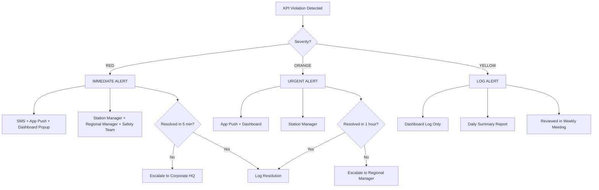

# NAYARA FUEL STATION KPI SEVERITY CLASSIFICATION

**Comprehensive AI-Powered CCTV Analytics for Petroleum Retail Compliance**

---

## 📋 Table of Contents

1. [Overview](#overview)
2. [KPI Severity Framework](#kpi-severity-framework)
3. [VERY CRITICAL KPIs (RED) - IMMEDIATE ACTION REQUIRED](#very-critical-kpis)
4. [CRITICAL KPIs (ORANGE) - URGENT ATTENTION NEEDED](#critical-kpis)
5. [MODERATE KPIs (YELLOW) - ROUTINE MONITORING](#moderate-kpis)
6. [Detection Methods](#detection-methods)
7. [Alert & Escalation System](#alert--escalation-system)

---

## Overview

### Purpose
This document defines **73 Key Performance Indicators (KPIs)** for Nayara fuel station operations, categorized by severity level. Each KPI is designed to be monitored through AI-powered CCTV analytics, integrated with fuel management systems (ATG, DU, POS), and presented via real-time dashboards.

### System Context
- **Edge Processing**: maigic.ai (NVIDIA Jetson-powered)
- **Dashboard**: cloudtuner.ai
- **Industry**: Petroleum Retail (Nayara brand)
- **Regulatory Bodies**: PESO, Fire Department, Bureau of Indian Standards (BIS), Weights & Measures

### KPI Distribution
| Severity | Count | Percentage | Response Time |
|:---------|:-----:|:----------:|:--------------|
| 🔥 **VERY CRITICAL (RED)** | 32 | 44% | < 1 minute |
| ⚠️ **CRITICAL (ORANGE)** | 27 | 37% | < 15 minutes |
| 🟡 **MODERATE (YELLOW)** | 14 | 19% | < 4 hours |
| **TOTAL** | **73** | **100%** | - |

---

## KPI Severity Framework

### 🔥 VERY CRITICAL (RED CATEGORY)
**Definition**: KPIs that directly impact human safety, legal compliance, fuel integrity, or could cause major financial/reputational damage.

**Characteristics**:
- Immediate threat to life or property
- Regulatory violation with legal consequences
- Fuel contamination or theft
- Critical equipment failure affecting safety

**Response Protocol**:
- **Auto-alert**: Station Manager + Regional Manager + Safety Team
- **Notification**: SMS + App Push + Dashboard Popup
- **Action Required**: Immediate intervention (< 1 min)
- **Escalation**: If unresolved in 5 min → Corporate HQ

---

### ⚠️ CRITICAL (ORANGE CATEGORY)
**Definition**: KPIs that indicate operational errors, customer dissatisfaction, internal audit issues, or moderate safety risks.

**Characteristics**:
- Service quality degradation
- Minor compliance lapses
- Customer experience impact
- Financial discrepancies within limits

**Response Protocol**:
- **Auto-alert**: Station Manager
- **Notification**: App Push + Dashboard
- **Action Required**: Urgent attention (< 15 min)
- **Escalation**: If unresolved in 1 hour → Regional Manager

---

### 🟡 MODERATE (YELLOW CATEGORY)
**Definition**: KPIs for general improvements, branding, and routine compliance that don't pose immediate risks.

**Characteristics**:
- Housekeeping and aesthetics
- Minor documentation delays
- Environmental maintenance
- Staff training scheduling

**Response Protocol**:
- **Auto-alert**: Dashboard log only
- **Notification**: Daily summary report
- **Action Required**: Routine follow-up (< 4 hours)
- **Escalation**: Weekly review with Station Manager

---

## VERY CRITICAL KPIs

### 1️⃣ Safety & Compliance (9 KPIs)

#### 1.1 Fire Extinguisher Availability, Pressure & Expiry Compliance
**Description**: All fire extinguishers must be present, functional (within pressure range), and not expired.

**Detection Method**:
- **Visual Detection**: Object recognition to detect presence of fire extinguishers
- **OCR**: Read pressure gauge and expiry date labels
- **Alert Trigger**: Missing extinguisher OR pressure below green zone OR expiry date passed

**Target**: 100% compliance at all times

**Why VERY CRITICAL**: Fire is the #1 risk at fuel stations. Non-functional extinguishers = catastrophic loss.

**Regulatory Reference**: PESO Fire Safety Norms

---

#### 1.2 Emergency Shutdown & Fire Assembly Compliance
**Description**: Emergency shut-off buttons accessible and tested; fire assembly point clearly marked and unobstructed.

**Detection Method**:
- **Zone Monitoring**: Check for obstructions in front of emergency buttons
- **Periodic Testing**: Verify mock drill conducted (database check > 90 days)

**Target**: 100% accessibility, drill every 90 days

**Why VERY CRITICAL**: Emergency response readiness can save lives during incidents.

---

#### 1.3 Electrical Panel Safety (Open Wires, Short Circuit Risks)
**Description**: All electrical panels must be closed, locked, and free from exposed wiring.

**Detection Method**:
- **Visual Inspection**: Detect open panel doors
- **Thermal Imaging** (if available): Detect hotspots indicating faulty wiring

**Target**: Zero open panels or exposed wires

**Why VERY CRITICAL**: Electrical sparks near fuel = explosion risk.

---

#### 1.4 PPE Non-Compliance for Critical Staff (Near DU, Tanker Unloading)
**Description**: Staff handling fuel dispensing or tanker operations MUST wear safety gear (helmet, gloves, anti-static shoes).

**Detection Method**:
- **PPE Detection AI**: Helmet, gloves, safety shoe recognition
- **Zone-based**: Trigger only when staff in dispensing zone or tanker bay

**Target**: 100% compliance

**Why VERY CRITICAL**: Direct fuel contact without PPE = burn/explosion injury risk.

**Regulatory Reference**: PESO Safety Guidelines for Petroleum Handling

---

#### 1.5 No Smoking Violations
**Description**: Smoking anywhere on premises is strictly prohibited.

**Detection Method**:
- **Smoking Detection AI**: Detect cigarettes, smoke, lighter flames
- **Real-time Alert**: Instant notification with camera snapshot

**Target**: Zero violations

**Why VERY CRITICAL**: Single spark can ignite vapors → Major fire/explosion.

---

#### 1.6 Emergency Exit Blocked
**Description**: All emergency exits must remain unobstructed 24/7.

**Detection Method**:
- **Zone Obstruction Detection**: Monitor exit paths for objects/vehicles
- **Continuous Monitoring**: Alert if blockage > 2 minutes

**Target**: 100% clear exits

**Why VERY CRITICAL**: Blocked exits = fatalities during evacuation.

---

#### 1.7 Mock Drill Not Conducted for > 90 Days
**Description**: Fire/Emergency drills must be conducted every 90 days per PESO norms.

**Detection Method**:
- **Database Check**: Track last drill date
- **Auto-alert**: Trigger alert 7 days before 90-day deadline

**Target**: Drill every 90 days

**Why VERY CRITICAL**: Untrained staff = poor emergency response = loss of life.

---

#### 1.8 Tanker Unloading SOP Violation
**Description**: Tanker unloading must follow strict SOP (grounding, bonding, valve sequence, presence of supervisor).

**Detection Method**:
- **Activity Sequence Recognition**: Detect steps (grounding cable connection, valve opening, supervisor presence)
- **Alert**: Trigger if sequence violated or supervisor absent

**Target**: 100% SOP adherence

**Why VERY CRITICAL**: SOPs prevent static discharge → fire during unloading.

---

#### 1.9 Static Discharge Procedure Not Followed
**Description**: Static grounding cable must be attached before tanker unloading begins.

**Detection Method**:
- **Object Detection**: Identify grounding cable attachment
- **Sequence Monitoring**: Verify cable connected BEFORE valve opened

**Target**: 100% compliance

**Why VERY CRITICAL**: Static electricity = major cause of fuel fires.

---

### 2️⃣ Fuel Quality & Quantity (9 KPIs)

#### 2.1 Density Mismatch Beyond Tolerance
**Description**: Fuel density must match declared value ± tolerance (e.g., ±0.5 kg/m³).

**Detection Method**:
- **ATG Integration**: Pull real-time density from Automatic Tank Gauge
- **Comparison**: Check against declared density in delivery note

**Target**: Within ± 0.5 kg/m³

**Why VERY CRITICAL**: Density mismatch = fuel adulteration = legal action + customer complaints.

---

#### 2.2 Wrong Density Entry / Missing Density Register
**Description**: Density must be recorded in register for every fuel delivery.

**Detection Method**:
- **OCR + Database**: Scan density register for missing entries
- **Cross-verification**: Match with tanker unloading timestamps

**Target**: 100% entries

**Why VERY CRITICAL**: Regulatory requirement; missing data = audit failure.

---

#### 2.3 Tank Dip Variance Beyond Allowable Limit
**Description**: Manual dip reading vs ATG reading variance > threshold indicates leak or theft.

**Detection Method**:
- **ATG Data**: Compare physical dip vs electronic reading
- **Threshold**: Alert if variance > 50 liters (configurable)

**Target**: Variance < 50 liters

**Why VERY CRITICAL**: Large variance = fuel theft or tank leak.

---

#### 2.4 Calibration Failure of Dispensing Units (DU)
**Description**: DUs must pass calibration test by Weights & Measures department.

**Detection Method**:
- **Certificate Tracking**: Monitor calibration certificate expiry
- **Flow Rate Analysis**: Detect abnormal flow patterns

**Target**: Valid calibration certificate

**Why VERY CRITICAL**: Uncalibrated DU = customer fraud = legal penalty.

**Regulatory Reference**: Weights & Measures Act

---

#### 2.5 DU Manipulation or Tampering
**Description**: Any unauthorized modification to dispensing unit internals.

**Detection Method**:
- **Anomaly Detection**: Unusual DU readings (e.g., 10L delivered in 3 seconds)
- **Seal Verification**: Check for broken seals (manual inspection reminder)

**Target**: Zero tampering

**Why VERY CRITICAL**: DU fraud = revenue loss + criminal liability.

---

#### 2.6 Auto-Cut Manipulation
**Description**: Auto-cut nozzle feature must not be bypassed.

**Detection Method**:
- **Video Analysis**: Detect manual override or nozzle modifications
- **Flow Pattern**: Detect abnormal fuel overflow

**Target**: Zero manipulation

**Why VERY CRITICAL**: Bypassing auto-cut = fuel spill → fire risk.

---

#### 2.7 Nozzle Fraud / Short Delivery
**Description**: Customer not receiving full quantity paid for.

**Detection Method**:
- **POS Integration**: Compare billed quantity vs DU meter reading
- **CCTV Verification**: Review suspicious transactions

**Target**: Zero short delivery complaints

**Why VERY CRITICAL**: Customer fraud = brand damage + legal action.

---

#### 2.8 Filter Paper Test Failure
**Description**: Daily filter paper test must show no water/contaminants in fuel.

**Detection Method**:
- **Activity Recognition**: Verify test conducted daily (morning shift)
- **Result Logging**: Check result entry in register

**Target**: 100% pass rate

**Why VERY CRITICAL**: Contaminated fuel = vehicle damage + liability claims.

---

#### 2.9 Tank Contamination Risk (Water in Tank)
**Description**: Water accumulation in underground tanks.

**Detection Method**:
- **ATG Alerts**: Water level sensor data
- **Filter Test Tracking**: Cross-check with filter paper results

**Target**: Water level < 1cm

**Why VERY CRITICAL**: Water in fuel = quality failure + customer complaints.

---

### 3️⃣ Equipment & Asset (4 KPIs)

#### 3.1 CCTV Uptime Below Safety Threshold (< 70%)
**Description**: Minimum 70% of cameras must be operational at all times.

**Detection Method**:
- **System Health Monitoring**: Auto-detect camera failures
- **Coverage Analysis**: Ensure critical zones (DU, tanker bay, cash counter) always covered

**Target**: ≥ 70% uptime

**Why VERY CRITICAL**: CCTV = audit evidence, theft prevention, safety monitoring.

---

#### 3.2 DVR Not Recording / Data Missing (Legal Violation)
**Description**: DVR must record all footage with NO gaps.

**Detection Method**:
- **Storage Monitoring**: Check for recording interruptions
- **Data Audit**: Verify 30-day storage compliance

**Target**: 100% recording uptime

**Why VERY CRITICAL**: Legal requirement for audit trails and incident investigations.

**Regulatory Reference**: Petroleum Dealers Licensing Guidelines

---

#### 3.3 ATG Malfunction (No Real-Time Tank Status)
**Description**: Automatic Tank Gauge must provide real-time fuel levels and density.

**Detection Method**:
- **API Health Check**: Verify ATG data feed active
- **Data Freshness**: Alert if no update > 5 minutes

**Target**: 100% uptime

**Why VERY CRITICAL**: ATG = critical for fuel reconciliation and theft detection.

---

#### 3.4 DU Malfunction Leading to Wrong Delivery
**Description**: Dispensing unit errors causing incorrect fuel quantity.

**Detection Method**:
- **Customer Complaint Correlation**: Track complaints + DU readings
- **Flow Anomaly**: Detect DU delivering outside normal range

**Target**: < 1% error rate

**Why VERY CRITICAL**: Customer dissatisfaction + potential legal disputes.

---

### 4️⃣ Fraud Prevention (5 KPIs)

#### 4.1 Any Evidence of Nozzle or DU Tampering
**Description**: Visual or data-based evidence of tampering.

**Detection Method**:
- **Video Forensics**: Detect unusual activity around DU panels
- **Data Anomaly**: Sudden change in flow rates or totals

**Target**: Zero tampering incidents

**Why VERY CRITICAL**: Tampering = theft + regulatory violation.

---

#### 4.2 Unauthorized Fuel Diversion
**Description**: Fuel removed from tanks without proper billing.

**Detection Method**:
- **Tank Level Reconciliation**: ATG vs Sales mismatch
- **Video Monitoring**: Detect unauthorized tanker access

**Target**: Zero diversion

**Why VERY CRITICAL**: Direct revenue loss + criminal activity.

---

#### 4.3 Short Billing / Double Billing
**Description**: Incorrect POS transactions (undercharging or overcharging).

**Detection Method**:
- **POS Audit**: Flag transactions with unusual amounts
- **Video Verification**: Review cashier activity during flagged transactions

**Target**: < 0.1% of transactions

**Why VERY CRITICAL**: Financial loss or customer complaints.

---

#### 4.4 Fuel Theft from Tank, Pipeline
**Description**: Physical theft of fuel from storage tanks or pipelines.

**Detection Method**:
- **Perimeter Monitoring**: Detect unauthorized access to tank area
- **Level Monitoring**: Sudden drop in tank levels without corresponding sales

**Target**: Zero theft incidents

**Why VERY CRITICAL**: Major financial loss + safety risk.

---

#### 4.5 Unauthorized Payments / POS Failure Causing Manipulation
**Description**: POS system downtime exploited for cash misappropriation.

**Detection Method**:
- **POS Uptime Monitoring**: Alert on system downtime
- **Cash Reconciliation**: Verify end-of-day collections

**Target**: 100% POS uptime

**Why VERY CRITICAL**: Revenue leakage during system failures.

---

### 5️⃣ Regulatory & Licensing (5 KPIs)

#### 5.1 Fire NOC Expired
**Description**: Fire No-Objection Certificate must be valid.

**Detection Method**:
- **Certificate Tracking Database**: Auto-alert 30 days before expiry

**Target**: Always valid

**Why VERY CRITICAL**: Legal requirement; expired NOC = station shutdown.

**Regulatory Reference**: Fire Safety Act

---

#### 5.2 PESO License Expired
**Description**: Petroleum & Explosives Safety Organization license must be current.

**Detection Method**:
- **Certificate Database**: Monitor expiry date

**Target**: Always valid

**Why VERY CRITICAL**: Operating without PESO license = criminal offense.

---

#### 5.3 Pollution Control Certificate Expired
**Description**: Environmental clearance certificate.

**Detection Method**:
- **Certificate Database**: Auto-alert before expiry

**Target**: Always valid

**Why VERY CRITICAL**: Environmental violation = heavy fines.

---

#### 5.4 Weights & Measures Certificate Expired
**Description**: DU calibration certificate.

**Detection Method**:
- **Certificate Database**: Track per DU

**Target**: Valid for all DUs

**Why VERY CRITICAL**: Expired certificate = regulatory penalty.

---

#### 5.5 Staff Without Police Verification
**Description**: All staff must have police background verification.

**Detection Method**:
- **HR Database**: Track verification status for all employees
- **Facial Recognition**: Alert if unverified person detected on duty

**Target**: 100% verified staff

**Why VERY CRITICAL**: Security risk + regulatory requirement.

---

## CRITICAL KPIs

### 1️⃣ Forecourt & Operations (7 KPIs)

#### 1.1 Queue Mismanagement
**Description**: Excessive waiting time at DU islands.

**Detection**: Queue length estimation AI, wait time > 10 min

**Target**: Average wait < 5 min

---

#### 1.2 Staff Uniform/Grooming Non-Compliance
**Description**: Staff not in proper Nayara uniform or grooming standards.

**Detection**: Uniform recognition AI

**Target**: ≥ 95% compliance

---

#### 1.3 Vehicle Stop Line Violation
**Description**: Vehicles not stopping at designated lines.

**Detection**: Vehicle position detection

**Target**: < 5% violations

---

#### 1.4 Housekeeping Not Maintained
**Description**: Forecourt cleanliness below standards.

**Detection**: Image analysis for debris, spills, clutter

**Target**: ≥ 90% cleanliness score

---

#### 1.5 Water/Restroom Cleanliness Failure
**Description**: Customer restrooms not clean.

**Detection**: Periodic inspection + customer feedback integration

**Target**: ≥ 85% cleanliness score

---

#### 1.6 Unauthorized Personnel Inside Dispensing Area
**Description**: Non-staff entering DU island zones.

**Detection**: Zone intrusion detection

**Target**: Zero unauthorized access

---

#### 1.7 Spill Management Missing (Without Ignition Source)
**Description**: Fuel spills not responded to within 5 minutes.

**Detection**: Spill detection + response time tracking

**Target**: Response < 5 min

---

### 2️⃣ Customer Service (5 KPIs)

#### 2.1 Billing Issues / Wrong Bill
**Description**: Incorrect billing amount.

**Detection**: POS audit + customer complaint correlation

**Target**: < 1% error rate

---

#### 2.2 Delay in Fueling Operations
**Description**: Staff taking excessive time to respond to customer.

**Detection**: Customer arrival to service start time > 3 min

**Target**: Response < 2 min

---

#### 2.3 Suggestive Selling Non-Compliance
**Description**: Staff not offering additional products (lubricants, air pressure).

**Detection**: Audio analysis (if available) + transaction patterns

**Target**: ≥ 60% suggestive selling rate

---

#### 2.4 Low Customer Satisfaction Score (CSS)
**Description**: Customer feedback below target.

**Detection**: Integrate with customer feedback system

**Target**: CSS ≥ 4.0 / 5.0

---

#### 2.5 Slow Resolution of Complaints
**Description**: Customer complaints not resolved promptly.

**Detection**: Complaint management system integration

**Target**: Resolution < 24 hours

---

### 3️⃣ Financial & Inventory (5 KPIs)

#### 3.1 Minor Stock Mismatch (Within Tolerance Limits)
**Description**: Small discrepancies in lubricant/accessory inventory.

**Detection**: Inventory reconciliation

**Target**: Variance < 2%

---

#### 3.2 Daily Cash Settlement Deviation
**Description**: Cash register vs sales report mismatch.

**Detection**: POS reconciliation

**Target**: Variance < ₹500

---

#### 3.3 Price Update Delayed
**Description**: DU price boards not updated within 2 hours of price change notification.

**Detection**: OCR on price boards + timestamp

**Target**: Update < 2 hours

---

#### 3.4 Inventory Mismatch (Lubricants, Accessories)
**Description**: Physical stock vs system stock variance.

**Detection**: Shelf monitoring + inventory database

**Target**: Variance < 5%

---

#### 3.5 Credit Sale Approval Delays
**Description**: Credit transactions not approved promptly.

**Detection**: Transaction approval time tracking

**Target**: Approval < 10 min

---

### 4️⃣ Equipment & Asset (5 KPIs)

#### 4.1 Generator Not Maintained
**Description**: Backup generator not serviced as scheduled.

**Detection**: Maintenance log tracking

**Target**: Service every 90 days

---

#### 4.2 Lighting Not Fully Functional (Canopy/Periphery)
**Description**: Faulty lights on canopy or forecourt.

**Detection**: Light level monitoring (lux meter integration) + visual detection

**Target**: ≥ 95% lights functional

---

#### 4.3 POS Machine Downtime
**Description**: POS system offline.

**Detection**: System health monitoring

**Target**: Uptime ≥ 99%

---

#### 4.4 VRS Malfunction (Where Applicable)
**Description**: Vapor Recovery System failure (environmental compliance).

**Detection**: System sensor integration

**Target**: 100% uptime

---

#### 4.5 Nozzle Flow Rate Slightly Below Desired Level
**Description**: Slow fuel dispensing (but within acceptable limits).

**Detection**: Flow rate monitoring

**Target**: ≥ 30 liters/min

---

### 5️⃣ Documentation (5 KPIs)

#### 5.1 Daily Checklist Not Updated
**Description**: Station opening/closing checklist incomplete.

**Detection**: Checklist database tracking

**Target**: 100% completion

---

#### 5.2 Tanker Unloading Register Incomplete
**Description**: Missing entries in delivery register.

**Detection**: OCR + database verification

**Target**: 100% entries

---

#### 5.3 Delay in Audit Closure
**Description**: Internal audit findings not closed on time.

**Detection**: Audit management system

**Target**: Closure < 7 days

---

#### 5.4 Training Log Missing for 1–2 Staff
**Description**: Staff training records not updated.

**Detection**: HR database tracking

**Target**: 100% records current

---

#### 5.5 Biometric Attendance Mismatch
**Description**: Biometric records don't match staff actually on duty.

**Detection**: Facial recognition vs biometric data

**Target**: < 2% mismatch

---

## MODERATE KPIs

### 1️⃣ Housekeeping & Maintenance (4 KPIs)

#### 1.1 Forecourt Cleanliness Below Standard
**Target**: ≥ 80% score

---

#### 1.2 Branding/Signage Faded or Dusty
**Target**: ≥ 90% visibility

---

#### 1.3 Incomplete Plantation or Green Zone Maintenance
**Target**: Monthly maintenance

---

#### 1.4 Trash Overflow in Bins
**Target**: Emptied twice daily

---

### 2️⃣ HR & Staff (4 KPIs)

#### 2.1 Grooming Not Fully Up to Standards
**Target**: ≥ 85% compliance

---

#### 2.2 Minor Delay in Shift Handover
**Target**: Handover < 15 min

---

#### 2.3 Staff Attrition Trends
**Target**: Attrition < 15% annually

---

#### 2.4 Training Refreshers Pending
**Target**: Quarterly refresher

---

### 3️⃣ Environmental (3 KPIs)

#### 3.1 Minor STP Deviations
**Target**: ± 10% from norms

---

#### 3.2 Rainwater Harvesting Maintenance Overdue
**Target**: Annual servicing

---

#### 3.3 Plastic Disposal Compliance Lapses (Non-Hazardous)
**Target**: Weekly disposal

---

### 4️⃣ Documentation (3 KPIs)

#### 4.1 Logbook Incomplete but Not Critical
**Target**: 100% entries (monthly review)

---

#### 4.2 Missing Minor Signatures
**Target**: < 5% unsigned

---

#### 4.3 Reports Delayed (Non-Safety Related)
**Target**: Submit within 48 hours

---

## Detection Methods

### AI/Computer Vision Models

| Model | Purpose | KPIs Covered |
|:------|:--------|:-------------|
| **PPE Detection** | Detect helmet, gloves, safety shoes, uniform | 1.4, 2.2, 3.1 (RED/ORANGE categories) |
| **Smoking Detection** | Identify cigarettes, smoke, lighters | 1.5 (RED) |
| **Fire/Smoke Detection** | Early fire detection | Alert system |
| **Nozzle Tampering** | Anomaly detection on DU | 2.5, 4.1 (RED) |
| **Queue Estimation** | Customer wait time analysis | 1.1 (ORANGE) |
| **Zone Intrusion** | Unauthorized access | 1.6 (ORANGE) |
| **Spill Detection** | Liquid on forecourt | 1.7 (ORANGE) |
| **License Plate Recognition** | Tanker verification | 1.8 (RED) |
| **Activity Recognition** | Tanker unloading SOP | 1.8, 1.9 (RED) |
| **Facial Recognition** | Staff verification | 5.5 (RED) |
| **Flow Anomaly Detection** | DU manipulation | 2.4, 2.5 (RED) |

### System Integrations

| System | Data Retrieved | KPIs Covered |
|:-------|:---------------|:-------------|
| **ATG (Automatic Tank Gauge)** | Fuel levels, density, temperature, water level | 2.1, 2.3, 2.9, 3.3 (RED) |
| **POS System** | Billing, payment data | 2.7, 4.3, 4.5 (RED), 2.1 (ORANGE) |
| **DU Calibration System** | Flow rates, totals | 2.4, 2.5, 3.4 (RED) |
| **Certificate Management** | License expiry dates | 5.1-5.4 (RED) |
| **Biometric Attendance** | Staff presence | 5.5 (RED), 2.5 (ORANGE) |
| **HR Database** | Police verification, training logs | 5.5 (RED), 2.4 (ORANGE) |

---

## Alert & Escalation System

### Alert Flow



### Escalation Matrix

| Role | RED (< 1 min) | ORANGE (< 15 min) | YELLOW (Daily) |
|:-----|:--------------|:------------------|:---------------|
| **Station Manager** | ✅ SMS + App + Dashboard | ✅ App + Dashboard | 📊 Dashboard Log |
| **Regional Manager** | ✅ SMS + App | 📧 Email (if unresolved) | 📊 Weekly Report |
| **Safety Team** | ✅ SMS | 📧 Daily Summary | - |
| **Corporate HQ** | 📧 Digest (if unresolved) | 📧 Weekly Report | 📊 Monthly Report |

### Notification Templates

#### RED Alert Example
```
🔴 VERY CRITICAL ALERT
Station: Nayara Fuel Station - Sector 12
KPI: No Smoking Violation
Location: Dispensing Island 3
Time: 14:32:15 | 08-Dec-2024
Snapshot: [View Image]
Action: IMMEDIATE INTERVENTION REQUIRED
```

#### ORANGE Alert Example
```
⚠️ CRITICAL ALERT
Station: Nayara Fuel Station - Sector 12
KPI: Queue Wait Time Exceeded
Location: DU Island 2
Wait Time: 12 minutes (Target: < 5 min)
Time: 17:45:20 | 08-Dec-2024
Action: Open additional DU lane
```

---

## Next Steps

### Implementation Phases

**Phase 1: Infrastructure Setup (Week 1-2)**
- Deploy CCTV cameras at forecourt, DU islands, tanker bay, cash counter
- Install NVIDIA Jetson edge devices (maigic.ai)
- Configure network (RTSP streaming)

**Phase 2: Integration (Week 3-4)**
- Connect ATG system via API
- Integrate POS system
- Link certificate management database
- Deploy biometric attendance integration

**Phase 3: AI Model Deployment (Week 5-6)**
- Train/deploy PPE detection models
- Configure smoking detection
- Set up zone monitoring
- Calibrate flow anomaly detection

**Phase 4: Dashboard & Alerts (Week 7-8)**
- Deploy cloudtuner.ai dashboard
- Configure alert escalation rules
- Set up SMS/App notification system
- Train station managers

**Phase 5: Go Live (Week 9)**
- Pilot at 1 station
- Monitor and refine thresholds
- Gather feedback
- Roll out to additional stations

---

**Document Version**: 1.0  
**Last Updated**: December 8, 2024  
**Related Documents**:  
- [NAYARA_WORKFLOW.md](file:///c:/Users/LENOVO/Desktop/my_docs/AG/InvEye/nayasa/NAYARA_WORKFLOW.md)  
- [NAYARA_ARCHITECTURE_DIAGRAM.md](file:///c:/Users/LENOVO/Desktop/my_docs/AG/InvEye/nayasa/NAYARA_ARCHITECTURE_DIAGRAM.md)
