# NAYARA FUEL STATION MONITORING - COMPLETE WORKFLOW

**End-to-End AI-Powered CCTV Analytics for Petroleum Retail Operations**

---

## 📋 Table of Contents

1. [System Overview](#system-overview)
2. [CCTV Infrastructure & Camera Placement](#cctv-infrastructure--camera-placement)
3. [Real-Time Monitoring Data Flow](#real-time-monitoring-data-flow)
4. [Dashboard Workflow](#dashboard-workflow)
5. [Alert & Escalation System](#alert--escalation-system)
6. [Integration Architecture](#integration-architecture)
7. [User Journeys](#user-journeys)
8. [Implementation Roadmap](#implementation-roadmap)

---

## System Overview

### Purpose
Real-time AI-powered monitoring and compliance tracking for Nayara fuel stations, covering **73 KPIs** across safety, operations, fuel quality, fraud prevention, and regulatory compliance.

### System Components


### Key Capabilities

**Safety & Compliance Monitoring**:
- 🔥 Fire safety equipment verification
- 👷 PPE compliance detection
- 🚭 No-smoking violation alerts
- ⚡ Emergency equipment accessibility
- 🚨 Tanker unloading SOP adherence

**Fuel Quality & Integrity**:
- ⛽ Real-time density monitoring via ATG
- 🧪 Filter paper test tracking
- 📊 Tank dip variance detection
- ⚖️ DU calibration status
- 💧 Water contamination alerts

**Fraud Prevention**:
- 🔒 Nozzle tampering detection
- 📹 Transaction video verification
- 💰 Cash reconciliation tracking
- 🚛 Unauthorized fuel diversion alerts
- 📱 POS manipulation prevention

**Operational Efficiency**:
- ⏱️ Queue management
- 👕 Staff uniform compliance
- 🧹 Housekeeping monitoring
- 📋 Documentation completeness
- ⚙️ Equipment uptime tracking

---

## CCTV Infrastructure & Camera Placement

### Camera Layout Strategy

#### Zone 1: Forecourt & Dispensing Islands
**Coverage**: Customer fueling area, DU islands (minimum 4 cameras)


**AI Models Active**:
- PPE Detection (helmet, gloves, uniform)
- Smoking Detection
- Vehicle Counting
- Queue Length Estimation
- Spill Detection
- Staff Identification (uniform recognition)

**KPIs Monitored**: 1.4, 1.5, 2.2, 1.1, 1.7 (see KPI severity document)

---

#### Zone 2: Tanker Unloading Bay
**Coverage**: Tanker parking, unloading area (minimum 2 cameras)


**AI Models Active**:
- License Plate Recognition
- Activity Sequence Recognition (SOP compliance)
- PPE Detection
- Supervisor Presence Verification

**KPIs Monitored**: 1.8, 1.9 (VERY CRITICAL - RED)

---

#### Zone 3: Cash Counter & Shop
**Coverage**: POS terminal, customer interaction (minimum 2 cameras)

**AI Models Active**:
- Transaction Monitoring
- Customer Service Interaction Tracking
- Staff Uniform Detection
- Suspicious Activity Detection

**KPIs Monitored**: 2.1, 2.2, 4.3, 4.5 (ORANGE)

---

#### Zone 4: Tank Farm & Perimeter
**Coverage**: Underground tank access points, perimeter (minimum 3 cameras)

**AI Models Active**:
- Perimeter Intrusion Detection
- Unauthorized Access Alerts
- Zone Occupancy Monitoring

**KPIs Monitored**: 4.2, 4.4 (VERY CRITICAL - RED)

---

#### Zone 5: Equipment & Utility Areas
**Coverage**: Generator, electrical panels, fire equipment (minimum 3 cameras)

**AI Models Active**:
- Fire Extinguisher Presence Detection
- OCR (pressure gauge, expiry dates)
- Electrical Panel Status (open/closed)
- Emergency Equipment Accessibility

**KPIs Monitored**: 1.1, 1.2, 1.3, 1.6 (VERY CRITICAL - RED)

---

### Total Camera Requirement
**Small Station** (4 DU islands): **14-16 cameras**  
**Medium Station** (6-8 DU islands): **18-22 cameras**  
**Large Station** (10+ DU islands): **24-30 cameras**

---

## Real-Time Monitoring Data Flow

### End-to-End Processing Pipeline


### Data Processing Layers

**Layer 1: Edge AI Processing (< 100ms latency)**
- Real-time video analysis
- Object detection (people, vehicles, equipment)
- PPE compliance checking
- Smoking detection
- Zone intrusion detection

**Layer 2: Event Classification (< 500ms)**
- KPI categorization (RED/ORANGE/YELLOW)
- Severity assignment
- Alert decision (immediate vs logged)

**Layer 3: Cloud Analytics (< 3 seconds)**
- Historical trend analysis
- Multi-source correlation (CCTV + ATG + POS)
- Predictive alerts (e.g., certificate expiry in 7 days)
- Compliance report generation

**Layer 4: Dashboard Display (< 5 seconds)**
- Real-time KPI cards update
- Alert feed refresh
- CCTV grid display
- Chart updates

---

## Dashboard Workflow

### Station Manager Dashboard (Primary User)

#### Main Dashboard View

```
┌────────────────────────────────────────────────────────────────┐
│  NAYARA FUEL STATION - Sector 12                   👤 Manager  │
│  InvEye AI Monitoring Dashboard               🔔 3 Active Alerts│
├────────────────────────────────────────────────────────────────┤
│                                                                 │
│  📊 TODAY'S SUMMARY                                            │
│  ┌─────────────┬─────────────┬─────────────┬─────────────┐   │
│  │ 🔥 RED ALERTS │ ⚠️ ORANGE  │ 🟡 YELLOW  │ ✅ CCTV UP │   │
│  │      2       │      5      │     12      │    95%      │   │
│  └─────────────┴─────────────┴─────────────┴─────────────┘   │
│                                                                 │
│  🚨 ACTIVE ALERTS (Real-time Feed)                            │
│  ┌──────────────────────────────────────────────────────┐    │
│  │ 🔴 CRITICAL - 2 min ago                             │    │
│  │ NO SMOKING VIOLATION                                 │    │
│  │ Location: DU Island 3 | Camera #4                   │    │
│  │ [View Snapshot 📷] [Dispatch Staff ▶]               │    │
│  ├──────────────────────────────────────────────────────┤    │
│  │ 🟠 URGENT - 8 min ago                               │    │
│  │ QUEUE WAIT TIME: 11 minutes                         │    │
│  │ DU Island 2 | Target: < 5 min                       │    │
│  │ [Open Additional Lane ▶]                            │    │
│  └──────────────────────────────────────────────────────┘    │
│                                                                 │
│  📹 LIVE CCTV GRID (4x4)                                      │
│  ┌────┬────┬────┬────┐                                        │
│  │ 🟢 │ 🟢 │ 🟢 │ 🟢 │  🟢 = Live | 🔴 = Offline             │
│  ├────┼────┼────┼────┤                                        │
│  │ 🟢 │ 🟢 │ 🟢 │ 🟢 │  [Click to Enlarge Any Feed]          │
│  ├────┼────┼────┼────┤                                        │
│  │ 🟢 │ 🟢 │ 🔴 │ 🟢 │                                        │
│  └────┴────┴────┴────┘                                        │
│                                                                 │
│  ⛽ FUEL QUALITY & QUANTITY                                    │
│  ┌─────────────────────────────────────────────────────┐     │
│  │ MS (Petrol):   12,485 L | Density: 738.2 kg/m³ ✅   │     │
│  │ HSD (Diesel):  8,920 L  | Density: 834.1 kg/m³ ✅   │     │
│  │ Last Tank Dip: 06:30 AM | Variance: +12 L ✅        │     │
│  └─────────────────────────────────────────────────────┘     │
│                                                                 │
│  📈 OPERATIONAL METRICS (Today)                                │
│  • Customers Served: 342                                       │
│  • Avg Fueling Time: 4.2 min                                  │
│  • Staff Uniform Compliance: 92%                              │
│  • Forecourt Cleanliness: 88%                                 │
│                                                                 │
└────────────────────────────────────────────────────────────────┘
```

---

### Regional Manager Dashboard

**Focus Areas**:
- Multi-station overview
- Compliance summary
- Critical alerts from all stations
- Weekly/monthly trend analysis

**View Structure**:
```
📊 REGIONAL OVERVIEW (10 Stations)
│
├─ 🔥 Critical Alerts Today: 12
│  └─ Station A: 3 RED, 5 ORANGE
│  └─ Station B: 1 RED, 2 ORANGE
│
├─ 📊 Compliance Score (This Week)
│  └─ Overall: 88% (Target: ≥ 90%)
│  └─ Best: Station E (96%)
│  └─ Needs Attention: Station C (78%)
│
├─ 🎯 Top 5 Compliance Issues
│  1. Staff Uniform (15 violations)
│  2. Queue Management (12 violations)
│  3. Housekeeping (9 violations)
│
└─ 📈 Trend Analysis
   └─ Month-over-month improvement: +5%
```

---

## Alert & Escalation System

### Alert Routing Logic


### Escalation Timeline

| Time Since Alert | RED (VERY CRITICAL) | ORANGE (CRITICAL) | YELLOW (MODERATE) |
|:-----------------|:--------------------|:------------------|:------------------|
| **0 min** | SMS + App + Dashboard (Manager + Regional + Safety) | App + Dashboard (Manager) | Dashboard log |
| **5 min** | Escalate to Corporate HQ if unresolved | - | - |
| **15 min** | Incident report required | - | - |
| **1 hour** | - | Email Regional Manager if unresolved | - |
| **4 hours** | - | - | Add to daily summary |
| **End of Day** | Compliance report to Corporate | Summary to Regional Manager | Summary to Manager |

---

### Alert Examples by Severity

#### 🔥 RED Alert: No Smoking Violation
```
━━━━━━━━━━━━━━━━━━━━━━━━━━
🚨 VERY CRITICAL ALERT 🚨
━━━━━━━━━━━━━━━━━━━━━━━━━━

KPI: No Smoking Violation
Station: Nayara - Sector 12
Location: DU Island 3
Camera: #4
Time: 14:32:45 | 08-Dec-2024

🔥 FIRE RISK - IMMEDIATE ACTION
└─ Dispatch staff to location
└─ Issue verbal warning
└─ Document incident

[View CCTV Snapshot] [Acknowledge]
```

#### ⚠️ ORANGE Alert: Queue Wait Time
```
━━━━━━━━━━━━━━━━━━━━━━━━━━
⚠️ CRITICAL ALERT
━━━━━━━━━━━━━━━━━━━━━━━━━━

KPI: Queue Wait Time Exceeded
Station: Nayara - Sector 12
DU Island: 2
Current Wait: 11 minutes
Target: < 5 minutes
Time: 17:45:12 | 08-Dec-2024

RECOMMENDED ACTION:
└─ Open additional DU lane
└─ Redirect customers

[View Queue] [Open Lane 4]
```

#### 🟡 YELLOW Alert: Housekeeping
```
━━━━━━━━━━━━━━━━━━━━━━━━━━
🟡 MODERATE ALERT
━━━━━━━━━━━━━━━━━━━━━━━━━━

KPI: Forecourt Cleanliness
Station: Nayara - Sector 12
Score: 76% (Target: ≥ 80%)
Time: 10:15:00 | 08-Dec-2024

ACTION:
└─ Schedule forecourt cleaning
└─ Review in daily log

[Assign Task]
```

---

## Integration Architecture

### API Integration Points


### Data Sync Schedule

| System | Sync Frequency | Data Points |
|:-------|:--------------|:------------|
| **ATG** | Real-time (5 sec) | Fuel levels, density, temperature, water level |
| **POS** | Real-time (on transaction) | Billing amounts, payment method, transaction time |
| **DU** | Every 1 min | Flow rates, totals, calibration status |
| **Certificate DB** | Daily (midnight) | License expiry dates |
| **Biometric** | Real-time | Staff attendance, clock in/out |
| **CCTV** | Continuous | Video streams, AI event triggers |

---

## User Journeys

### Journey 1: Station Manager Morning Routine

```mermaid
journey
    title Station Manager Morning Workflow
    section Arrival (6:00 AM)
      Login to Dashboard: 5: Manager
      Review Overnight Alerts: 4: Manager
      Check CCTV Uptime: 5: Manager
      Verify DVR Recording: 5: Manager
    section Opening Checklist (6:15 AM)
      Fire Extinguisher Check: 4: Manager
      PPE Stock Verification: 5: Manager
      DU Functional Test: 5: Manager
      Filter Paper Test: 4: Manager
    section Operations Start (7:00 AM)
      Monitor Live Dashboard: 5: Manager
      Respond to Queue Alerts: 4: Manager
      Track Fuel Deliveries: 5: Manager
    section Midday Review (12:00 PM)
      Check Compliance Score: 4: Manager
      Review Customer Complaints: 3: Manager
      Resolve ORANGE Alerts: 4: Manager
```

---

### Journey 2: Tanker Delivery SOP Compliance

```mermaid
sequenceDiagram
    participant Tanker as Fuel Tanker
    participant CCTV as CCTV Camera 5
    participant AI as maigic.ai
    participant Manager as Station Manager
    participant ATG as ATG System

    Tanker->>CCTV: Enters station premises
    CCTV->>AI: License plate detected
    AI->>AI: Verify expected delivery schedule
    
    alt Unauthorized Tanker
        AI->>Manager: 🔴 RED Alert: Unauthorized Tanker
        Manager->>Tanker: Deny entry
    end
    
    Tanker->>CCTV: Parks at unloading bay
    CCTV->>AI: Monitor grounding cable connection
    
    alt Cable NOT Connected
        AI->>Manager: 🔴 RED Alert: Static Discharge Violation
        Manager->>Tanker: Stop unloading
    end
    
    CCTV->>AI: Detect supervisor presence
    
    alt Supervisor Absent
        AI->>Manager: 🔴 RED Alert: No Supervisor
    end
    
    Tanker->>ATG: Fuel unloading begins
    ATG->>AI: Real-time density monitoring
    
    alt Density Mismatch
        AI->>Manager: 🔴 RED Alert: Fuel Quality Issue
        Manager->>Tanker: Stop unloading immediately
    end
    
    ATG->>Manager: Unloading complete
    Manager->>AI: Log delivery in system
    AI->>AI: Update compliance report
```



---

### Journey 3: Critical Alert Response (RED)

**Scenario**: Smoking violation detected

```
1. DETECTION (0:00)
   └─ Camera #4 detects person with cigarette near DU Island 3
   └─ AI confirms smoking activity (confidence > 95%)

2. ALERT TRIGGERED (0:02)
   └─ SMS sent to Station Manager: "🔴 SMOKING VIOLATION - DU 3"
   └─ App push notification
   └─ Dashboard popup with audio alarm
   └─ Regional Manager notified

3. STATION MANAGER RESPONSE (0:45)
   └─ Views CCTV snapshot on dashboard
   └─ Dispatches floor supervisor to location
   └─ Acknowledges alert in app

4. ON-GROUND ACTION (2:30)
   └─ Supervisor issues verbal warning
   └─ Extinguishes cigarette
   └─ Logs incident in system

5. RESOLUTION (3:00)
   └─ Manager marks alert as "Resolved"
   └─ System auto-generates incident report
   └─ Added to daily compliance summary

6. FOLLOW-UP (End of Day)
   └─ Incident reviewed in shift handover
   └─ Staff briefing on safety protocols
   └─ Sent to Regional Manager in daily report
```

---

## Implementation Roadmap

### Phase 1: Infrastructure Setup (Days 1-14)

**Week 1: Site Survey & Planning**
- [x] Conduct station walk-through
- [x] Identify camera mounting points (14-30 locations)
- [x] Assess network infrastructure (LAN, WiFi coverage)
- [x] Verify power availability for edge devices
- [x] Create detailed camera layout diagram

**Week 2: Hardware Installation**
- [ ] Install CCTV cameras (all zones)
- [ ] Deploy NVIDIA Jetson edge devices (2-4 units)
- [ ] Set up Video Management System (VMS)
- [ ] Configure network (VLAN for CCTV traffic)
- [ ] Test RTSP streaming from all cameras

**Deliverables**:
✅ 14-30 cameras operational  
✅ Live video feeds accessible  
✅ Edge devices powered and networked  

---

### Phase 2: System Integration (Days 15-28)

**Week 3: API Connections**
- [ ] Integrate ATG system (REST API)
- [ ] Connect POS system (transaction feed)
- [ ] Link DU calibration database
- [ ] Sync certificate management system
- [ ] Integrate biometric attendance

**Week 4: Cloud Setup**
- [ ] Deploy cloudtuner.ai instance
- [ ] Configure database (PostgreSQL + TimescaleDB)
- [ ] Set up alert service (SMS, App, Email)
- [ ] Create user accounts (Station Manager, Regional Manager)
- [ ] Configure role-based access control

**Deliverables**:
✅ Real-time data flowing from ATG, POS, DU  
✅ Cloud dashboard accessible  
✅ Alert notifications functional  

---

### Phase 3: AI Model Deployment (Days 29-42)

**Week 5: Core Models**
- [ ] Deploy PPE detection model
- [ ] Configure smoking detection
- [ ] Train uniform recognition (Nayara branding)
- [ ] Set up zone intrusion detection
- [ ] Deploy spill detection

**Week 6: Advanced Models**
- [ ] Train tanker SOP activity recognition
- [ ] Deploy license plate recognition
- [ ] Configure flow anomaly detection (DU tampering)
- [ ] Set up facial recognition (staff verification)
- [ ] Calibrate all detection thresholds

**Deliverables**:
✅ All AI models operational  
✅ Detection accuracy > 85%  
✅ False positive rate < 10%  

---

### Phase 4: Dashboard & Training (Days 43-56)

**Week 7: Dashboard Configuration**
- [ ] Customize KPI cards for Nayara
- [ ] Configure alert severity rules (RED/ORANGE/YELLOW)
- [ ] Set up escalation workflows
- [ ] Create compliance report templates
- [ ] Build mobile app (iOS + Android)

**Week 8: User Training**
- [ ] Train Station Managers (2-day workshop)
- [ ] Train Regional Managers (1-day workshop)
- [ ] Create user manuals and video tutorials
- [ ] Conduct mock alert drills
- [ ] Handover to operations team

**Deliverables**:
✅ Dashboard fully customized  
✅ All users trained  
✅ Documentation complete  

---

### Phase 5: Go Live & Optimization (Days 57-70)

**Week 9: Pilot Station**
- [ ] Go live at first station (24/7 monitoring)
- [ ] Monitor system performance
- [ ] Collect user feedback
- [ ] Fine-tune AI thresholds
- [ ] Fix bugs and issues

**Week 10: Rollout**
- [ ] Deploy to next 3 stations
- [ ] Weekly review meetings
- [ ] Performance optimization
- [ ] Scale infrastructure as needed
- [ ] Plan nationwide rollout

**Success Metrics**:
- ✅ CCTV uptime > 95%
- ✅ Alert response time < 3 min (RED), < 15 min (ORANGE)
- ✅ AI detection accuracy > 90%
- ✅ User satisfaction > 4/5
- ✅ Compliance score improvement by 15% in first month

---

## Compliance Tracking & Reporting

### Automated Compliance Reports

**Daily Summary** (Auto-generated at 11:59 PM)
```
📊 DAILY COMPLIANCE REPORT
Station: Nayara - Sector 12
Date: 08-Dec-2024

━━━━━━━━━━━━━━━━━━━━━━━━━━
ALERT SUMMARY
━━━━━━━━━━━━━━━━━━━━━━━━━━
🔥 RED Alerts:     2 (All Resolved)
⚠️ ORANGE Alerts:  7 (1 Pending)
🟡 YELLOW Alerts: 14 (9 Pending)

COMPLIANCE SCORE: 91% ✅ (Target: ≥ 90%)

━━━━━━━━━━━━━━━━━━━━━━━━━━
TOP ISSUES
━━━━━━━━━━━━━━━━━━━━━━━━━━
1. Queue Management (3 violations)
2. Staff Uniform (2 violations)
3. Housekeeping (4 violations)

━━━━━━━━━━━━━━━━━━━━━━━━━━
FUEL OPERATIONS
━━━━━━━━━━━━━━━━━━━━━━━━━━
✅ Filter Paper Tests: 2/2 Passed
✅ Tank Dip Variance: ±18L (Within Limit)
✅ Density Compliance: 100%
✅ DU Calibration: All Valid

━━━━━━━━━━━━━━━━━━━━━━━━━━
NEXT ACTIONS
━━━━━━━━━━━━━━━━━━━━━━━━━━
• Resolve 1 pending ORANGE alert (Queue)
• Schedule forecourt cleaning (YELLOW)
• Conduct staff briefing on uniform compliance
```

---

**Monthly Regulatory Report** (For PESO, Fire Dept, etc.)
- Fire safety compliance log
- PPE compliance statistics
- Emergency drill records
- Equipment maintenance logs
- Incident reports with CCTV evidence

---

## Next Steps

### Immediate Actions
1. **Review Implementation Plan**: Approve timeline and budget
2. **Site Survey**: Schedule walk-through at pilot station
3. **Vendor Coordination**: Confirm hardware procurement (cameras, edge devices)
4. **Stakeholder Alignment**: Brief Regional Managers on system capabilities

### Documentation to Review
- [NAYARA_KPI_SEVERITY_CLASSIFICATION.md](file:///c:/Users/LENOVO/Desktop/my_docs/AG/InvEye/nayasa/NAYARA_KPI_SEVERITY_CLASSIFICATION.md) - Complete KPI breakdown
- [NAYARA_ARCHITECTURE_DIAGRAM.md](file:///c:/Users/LENOVO/Desktop/my_docs/AG/InvEye/nayasa/NAYARA_ARCHITECTURE_DIAGRAM.md) - System architecture details

---

**Document Version**: 1.0  
**Last Updated**: December 8, 2024  
**System**: InvEye (Nayara Edition)  
**Edge Processing**: maigic.ai  
**Dashboard**: cloudtuner.ai
