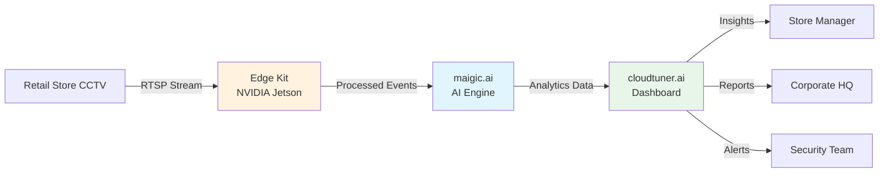
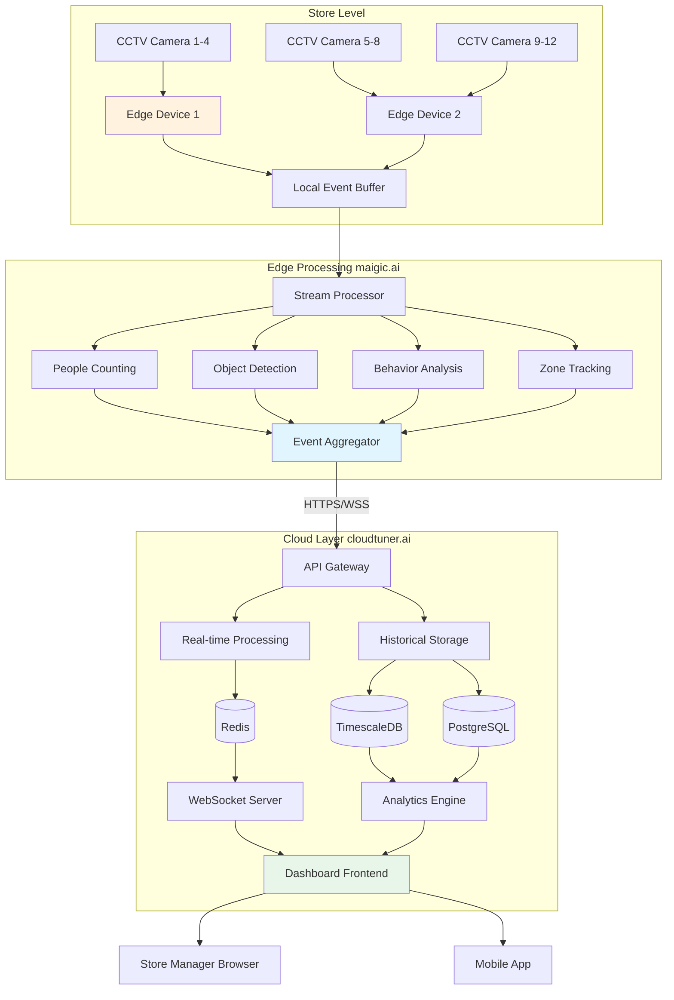

# InvEye Retail KPI Integration Guide
## End-to-End Documentation for Retail Intelligence Platform

> [!IMPORTANT]
> **Complete Integration Architecture**: CCTV Feed → Edge Kit → maigic.ai Analysis → cloudtuner.ai Dashboard

---

## 📋 Table of Contents

1. [Executive Summary](#executive-summary)
2. [Product Ecosystem Overview](#product-ecosystem-overview)
3. [Hardware Requirements](#hardware-requirements)
4. [Software Architecture](#software-architecture)
5. [Integration Flow](#integration-flow)
6. [Deployment Guide](#deployment-guide)
7. [API Specifications](#api-specifications)
8. [Dashboard Features](#dashboard-features)
9. [Security & Compliance](#security--compliance)
10. [Maintenance & Support](#maintenance--support)

---

## Executive Summary

### What is InvEye Retail KPI?

InvEye Retail KPI is an AI-powered retail intelligence platform that transforms existing CCTV infrastructure into actionable business insights. The system processes live video feeds from retail stores to provide real-time analytics on customer behavior, product performance, security, and operational efficiency.

### Three-Tier Architecture



### Value Proposition

- **Increase Revenue:** 15-25% conversion rate improvement through optimized layouts
- **Reduce Shrinkage:** 30-40% reduction in theft-related losses
- **Optimize Operations:** 20% improvement in staff deployment efficiency
- **Enhance Experience:** Reduce queue wait times by 35%

---

## Product Ecosystem Overview

### Component 1: Edge Kit (Hardware)

**What It Is:**
- NVIDIA Jetson-based edge computing devices
- Installed on-premises at retail locations
- Processes video feeds locally for privacy and low latency

**Key Specifications:**
- **Model:** NVIDIA Jetson AGX Orin / Xavier NX
- **Processing:** Up to 8 camera feeds per device
- **Storage:** 256GB NVMe SSD
- **Connectivity:** Gigabit Ethernet, Wi-Fi 6
- **Power:** 60W maximum consumption

**Deployment:**
```
Typical Retail Store (5,000 sq ft)
├─ 2x Edge Kit Devices
├─ 12x CCTV Cameras
└─ 1x Network Switch
```

---

### Component 2: maigic.ai (AI Processing Engine)

**What It Is:**
- Cloud-based AI processing and model management
- Computer vision models for retail analytics
- Continuous learning and model updates

**Core AI Capabilities:**

| Module | Function | Accuracy |
|:---|:---|:---:|
| **People Counting** | Entry/exit tracking, unique visitors | 98% |
| **Demographics** | Age range, gender estimation | 92% |
| **Object Detection** | Product recognition, shopping cart tracking | 95% |
| **Behavior Analysis** | Suspicious activity, theft detection | 89% |
| **Zone Tracking** | Customer movement, dwell time | 96% |
| **Interaction Detection** | Product pickups, shelf engagement | 91% |

**AI Models Used:**
- YOLOv8 for object/person detection
- DeepSort for multi-camera tracking
- ResNet for product classification
- Custom CNN for behavior analysis

---

### Component 3: cloudtuner.ai (Dashboard & Reporting)

**What It Is:**
- Cloud-hosted web application
- Real-time KPI visualization
- Historical reporting and analytics
- Multi-location management

**Key Features:**
- Live CCTV feed monitoring
- 15+ KPI tracking dashboards
- Real-time alert system
- Customizable reports
- Mobile responsive interface
- API access for integrations

**Access Levels:**
- **Store Manager:** Single location view, operational KPIs
- **Regional Manager:** Multi-location comparison
- **Corporate:** Enterprise-wide analytics, BI integration
- **Security:** Loss prevention and incident management

---

## Hardware Requirements

### Minimum Requirements

#### Per Retail Location

**CCTV Cameras:**
- **Quantity:** 8-16 cameras (based on store size)
- **Type:** IP cameras with H.264/H.265 encoding
- **Resolution:** 1080p minimum (4K recommended for high-value zones)
- **Frame Rate:** 25-30 FPS
- **Field of View:** 90-110 degrees
- **Night Vision:** IR capable for 24/7 operation
- **Protocol:** RTSP streaming support

**Network Infrastructure:**
- **Bandwidth:** 10 Mbps per camera minimum
- **Total:** 100-200 Mbps dedicated for CCTV
- **Switch:** Managed PoE switch (24 ports)
- **Router:** Business-grade with QoS support
- **Backup:** 4G/5G failover recommended

**Edge Computing:**
- **Devices:** 2x NVIDIA Jetson AGX Orin (or 3x Xavier NX)
- **Mounting:** Rack-mounted or wall-mounted enclosure
- **Cooling:** Active cooling required
- **UPS:** 30 min backup power minimum

**Storage:**
- **Local:** 2TB NVMe SSD per edge device
- **Cloud:** S3-compatible object storage
- **Retention:** 30 days local, 90 days cloud

---

### Recommended Camera Placement

```
┌─────────────────────────────────────────────┐
│          Retail Store Floor Plan            │
│                                             │
│  [CAM1]  [CAM2]                             │
│  Entrance  Exit                             │
│                                             │
│  ┌────────┐  ┌────────┐  ┌────────┐       │
│  │ Elec   │  │Fashion │  │ Home   │       │
│  │[CAM5]  │  │[CAM6]  │  │[CAM7]  │       │
│  └────────┘  └────────┘  └────────┘       │
│                                             │
│  ┌────────────────────────────────┐        │
│  │      Groceries                 │        │
│  │  [CAM8]        [CAM9]          │        │
│  └────────────────────────────────┘        │
│                                             │
│  [CAM10] [CAM11] [CAM12]                   │
│  Checkout Lanes                             │
│                                             │
│  [CAM13]       [CAM14]                     │
│  Fitting Rooms  Stock Room                  │
└─────────────────────────────────────────────┘
```

**Camera Assignment:**
- **CAM 1-2:** Entry/exit for footfall counting
- **CAM 3-4:** Queue monitoring at checkouts
- **CAM 5-9:** Zone coverage for product aisles
- **CAM 10-12:** High-value product areas
- **CAM 13:** Fitting room entrance
- **CAM 14:** Stock room/staff area access control

---

## Software Architecture

### System Architecture Diagram



---

## Integration Flow

### Step-by-Step Data Journey

#### 1. Video Capture (CCTV → Edge Kit)

```
CCTV Camera
  ↓ RTSP Stream (H.264)
Edge Kit (NVIDIA Jetson)
  ├─ Video Decoder
  ├─ Frame Buffer (30 FPS)
  └─ GPU Memory
```

**Configuration Example:**
```yaml
camera:
  id: "CAM-001"
  name: "Main Entrance"
  location: "Entry Gate A"
  stream_url: "rtsp://192.168.1.101:554/stream1"
  resolution: "1920x1080"
  fps: 30
  codec: "h264"
```

---

#### 2. Edge Processing (maigic.ai)

```python
# Pseudocode for maigic.ai processing pipeline

while video_stream.is_active():
    frame = video_stream.read_frame()
    
    # Run AI inference
    detections = {
        'people': yolo_v8.detect_persons(frame),
        'products': resnet.classify_objects(frame),
        'behavior': behavior_model.analyze(frame)
    }
    
    # Generate events
    events = []
    for person in detections['people']:
        if person.crossed_line('entry'):
            events.append({
                'type': 'CUSTOMER_ENTRY',
                'timestamp': now(),
                'camera_id': 'CAM-001',
                'demographics': person.demographics,
                'unique_id': person.tracking_id
            })
    
    # Push to cloud
    cloudtuner.send_events(events)
```

**Processing Metrics:**
- **Latency:** < 100ms per frame
- **Throughput:** 30 frames/second per camera
- **GPU Utilization:** 60-80%

---

#### 3. Cloud Analytics (cloudtuner.ai)

**Event Processing:**
```javascript
// Real-time event handler in cloudtuner.ai

eventStream.on('CUSTOMER_ENTRY', async (event) => {
    // Update real-time KPIs
    await kpiService.increment('footfall_today');
    await kpiService.addDemographic(event.demographics);
    
    // Check for alerts
    const current_count = await kpiService.get('current_occupancy');
    if (current_count > CAPACITY_THRESHOLD) {
        await alertService.trigger({
            severity: 'HIGH',
            type: 'CAPACITY_EXCEEDED',
            message: `Store capacity at ${current_count} (max: ${CAPACITY_THRESHOLD})`
        });
    }
    
    // Push to dashboard via WebSocket
    dashboardSocket.broadcast({
        type: 'KPI_UPDATE',
        data: {
            footfall: await kpiService.get('footfall_today'),
            occupancy: current_count
        }
    });
});
```

---

#### 4. Dashboard Visualization

**Real-Time Update Flow:**
```
Cloud Event
  → WebSocket Push
  → Browser Receives
  → React State Update
  → DOM Re-render
  → User Sees Update
  
Total Latency: < 1 second
```

---

## Deployment Guide

### Phase 1: Site Preparation (Week 1)

**Tasks:**
1. ✅ Conduct site survey
2. ✅ Identify camera mounting points
3. ✅ Plan network cabling
4. ✅ Designate edge device location
5. ✅ Verify power availability

**Deliverables:**
- Site survey report
- Camera placement diagram
- Network topology plan
- Bill of materials

---

### Phase 2: Hardware Installation (Week 2)

**Tasks:**
1. ✅ Install CCTV cameras
2. ✅ Run network cabling (Cat6)
3. ✅ Install PoE switch
4. ✅ Mount edge computing devices
5. ✅ Configure network

**Camera Installation Checklist:**
- [ ] Camera securely mounted
- [ ] Cable properly routed and concealed
- [ ] PoE connection verified
- [ ] Camera angle and FOV confirmed
- [ ] Focus and exposure adjusted
- [ ] RTSP stream tested

---

### Phase 3: Software Configuration (Week 3)

**Edge Device Setup:**

```bash
# 1. Flash edge device with InvEye OS
sudo ./flash_inveye_os.sh

# 2. Configure network
sudo nano /etc/network/interfaces

# 3. Add cameras
inveye camera add --id CAM-001 --url rtsp://192.168.1.101:554/stream1

# 4. Test camera feeds
inveye camera test-all

# 5. Start AI processing
sudo systemctl start maigic-ai

# 6. Connect to cloud
inveye cloud connect --api-key YOUR_API_KEY
```

**cloudtuner.ai Setup:**

1. Create account at https://cloudtuner.ai
2. Create new "Retail Location"
3. Generate API key
4. Configure edge devices with API key
5. Set up user accounts (manager, staff, security)
6. Configure alert thresholds

---

### Phase 4: AI Model Training (Week 4)

**Custom Model Training:**

1. **Collect Training Data**
   - Record 24 hours of footage from all cameras
   - Label 1,000+ product images
   - Annotate customer behaviors

2. **Train Models**
   ```python
   # Submit training job to maigic.ai
   from maigic import ModelTrainer
   
   trainer = ModelTrainer(api_key='YOUR_KEY')
   
   # Product detection model
   product_model = trainer.train_object_detection(
       dataset='products_dataset',
       base_model='yolov8n',
       epochs=100,
       batch_size=16
   )
   
   # Deploy to edge devices
   product_model.deploy(location='store_001')
   ```

3. **Validate Accuracy**
   - Run validation dataset
   - Measure precision/recall
   - Fine-tune if needed

---

### Phase 5: Testing & Go-Live (Week 5-6)

**Testing Checklist:**

- [ ] All camera feeds visible in dashboard
- [ ] Footfall counting accuracy > 95%
- [ ] Queue detection working
- [ ] Product interaction tracking active
- [ ] Theft alerts triggering correctly
- [ ] WebSocket real-time updates functional
- [ ] Historical data storing properly
- [ ] Reports generating successfully
- [ ] Mobile app accessible
- [ ] User permissions correct

**Go-Live Process:**
1. Soft launch (parallel run with existing systems)
2. Monitor for 1 week
3. Train store staff
4. Full launch
5. Post-launch support (2 weeks)

---

## API Specifications

### REST API Endpoints

**Base URL:** `https://api.cloudtuner.ai/v1`

#### Authentication
```http
POST /auth/login
Content-Type: application/json

{
  "email": "manager@store.com",
  "password": "secure_password"
}

Response:
{
  "access_token": "eyJhbGc...",
  "refresh_token": "dGhpc2lz...",
  "expires_in": 3600
}
```

#### Get Real-Time KPIs
```http
GET /locations/{location_id}/kpis/realtime
Authorization: Bearer {access_token}

Response:
{
  "location_id": "store_001",
  "timestamp": "2024-12-02T16:55:00Z",
  "kpis": {
    "footfall_today": 2847,
    "current_occupancy": 127,
    "conversion_rate": 34.2,
    "avg_basket_value": 127.45,
    "queue_wait_time_avg": 4.2,
    "active_alerts": 2
  }
}
```

#### Get Zone Analytics
```http
GET /locations/{location_id}/zones/analytics
Authorization: Bearer {access_token}
Query Parameters:
  - start_date: 2024-12-01
  - end_date: 2024-12-02
  - zone_id: electronics (optional)

Response:
{
  "zones": [
    {
      "zone_id": "electronics",
      "zone_name": "Electronics Department",
      "visitors": 1247,
      "avg_dwell_time": 8.5,
      "engagement_rate": 89.3,
      "conversion_rate": 42.1
    },
    ...
  ]
}
```

#### Create Custom Alert
```http
POST /locations/{location_id}/alerts/configure
Authorization: Bearer {access_token}
Content-Type: application/json

{
  "alert_type": "QUEUE_LENGTH",
  "threshold": 8,
  "zone": "checkout_lanes",
  "severity": "HIGH",
  "notify": ["manager@store.com"]
}
```

---

### WebSocket API

**Connection:**
```javascript
const ws = new WebSocket('wss://ws.cloudtuner.ai/v1/stream');

ws.on('open', () => {
    // Authenticate
    ws.send(JSON.stringify({
        type: 'AUTH',
        token: 'Bearer eyJhbGc...'
    }));
    
    // Subscribe to location
    ws.send(JSON.stringify({
        type: 'SUBSCRIBE',
        location_id: 'store_001'
    }));
});

// Receive real-time updates
ws.on('message', (data) => {
    const event = JSON.parse(data);
    
    switch(event.type) {
        case 'KPI_UPDATE':
            updateDashboard(event.data);
            break;
        case 'ALERT':
            showAlert(event.alert);
            break;
        case 'CUSTOMER_EVENT':
            logEvent(event.event);
            break;
    }
});
```

---

## Dashboard Features

### 1. Overview Dashboard

**KPI Cards:**
- Today's Footfall
- Conversion Rate
- Active Alerts
- Average Basket Value

**Charts:**
- Footfall trend (hourly)
- Zone heatmap
- Queue status

**Live Feeds:**
- 4-16 camera grid
- Real-time alerts sidebar

---

### 2. Customer Analytics

**Features:**
- Demographics breakdown
- Customer journey visualization
- Dwell time analysis
- Zone performance comparison

**Exports:**
- PDF reports
- CSV data export
- Excel dashboards

---

### 3. Product Intelligence

**Features:**
- Top interacted products
- Shelf performance metrics
- Conversion funnel analysis
- Basket composition insights

---

### 4. Loss Prevention

**Features:**
- Live incident feed
- Suspicious behavior alerts
- CCTV footage playback
- Incident report generation

---

## Security & Compliance

### Data Privacy

**GDPR Compliance:**
- Customer data anonymized
- Facial data not stored long-term
- Right to access and deletion
- Privacy policy displayed in-store

**Data Encryption:**
- TLS 1.3 for all API communication
- AES-256 encryption at rest
- Video streams encrypted end-to-end

### Access Control

**Role-Based Access:**
- Store Manager: Full location access
- Regional Manager: Multi-location view
- Corporate: All locations, analytics only
- Security: Incident management only

**Multi-Factor Authentication:**
- Required for all accounts
- SMS or authenticator app
- IP whitelist option

---

## Maintenance & Support

### Regular Maintenance

**Monthly Tasks:**
- Clean camera lenses
- Check network bandwidth
- Review system logs
- Update AI models

**Quarterly Tasks:**
- Hardware health check
- Storage capacity review
- User access audit
- Performance optimization

### Support Channels

- **Email:** support@inveye.ai
- **Phone:** 1-800-INVEYE-1
- **Portal:** https://support.cloudtuner.ai
- **Chat:** 24/7 in-dashboard support

### SLA Commitments

- **Uptime:** 99.5% guaranteed
- **Support Response:** < 4 hours
- **Critical Issues:** < 1 hour
- **On-site Support:** Available (premium plan)

---

## Appendix

### A. Hardware Specifications

[Detailed hardware specs] 

### B. Network Requirements

[Network topology diagrams]

### C. Troubleshooting Guide

[Common issues and solutions]

### D. API Reference

[Complete API documentation]

---

**Document Version:** 1.0  
**Last Updated:** December 2, 2024  
**Contact:** integration@inveye.ai

**Related Documents:**
- [Retail KPI Workflow](file:///c:/Users/LENOVO/Desktop/my_docs/AG/InvEye/retail%20track/RETAIL_KPI_WORKFLOW.md)
- [Retail KPI Cards](file:///c:/Users/LENOVO/Desktop/my_docs/AG/InvEye/retail%20track/RETAIL_KPI_CARDS.md)
- [Quick Reference](file:///c:/Users/LENOVO/Desktop/my_docs/AG/InvEye/retail%20track/RETAIL_TRACKING_QUICK_REFERENCE.md)
