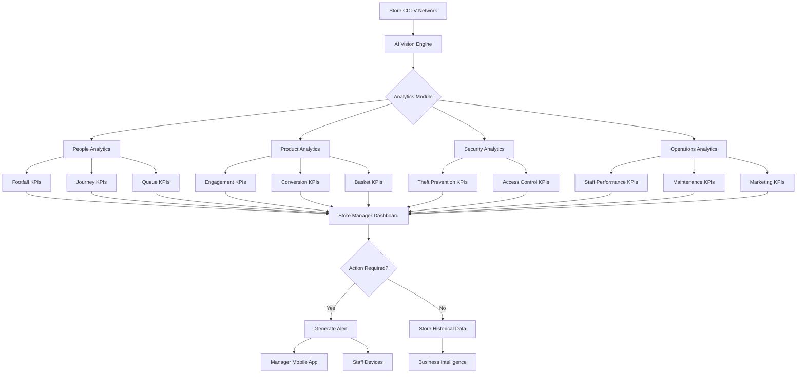
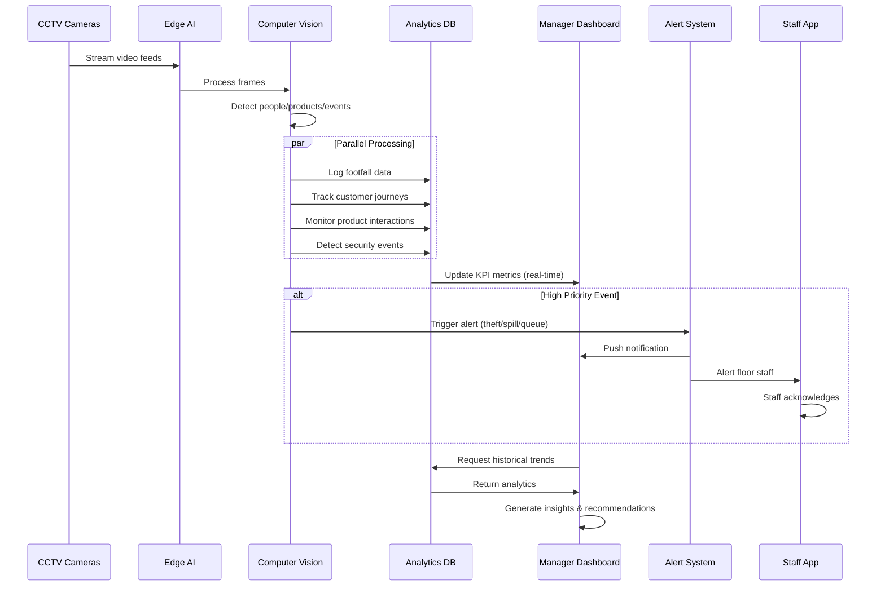
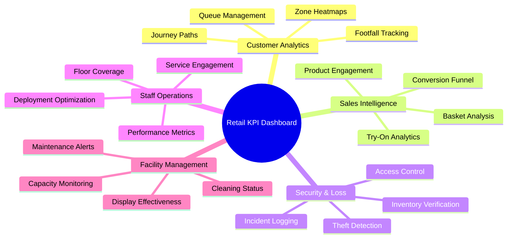

# Retail Shopping KPI Cards
## Admin/Store Manager Dashboard Perspective

> [!IMPORTANT]
> All KPIs leverage **live CCTV feed analysis** and **AI-powered computer vision** for real-time retail intelligence and automated insights.

---

## 🛍️ Customer Behavior KPIs

### 1. **Footfall & Traffic Analytics**
```
┌─────────────────────────────────────────┐
│ 👥 Store Traffic Monitor                │
│                                         │
│ Today's Visitors:      2,847            │
│ ━━━━━━━━━━━━━━━━━━━━━━━━━━━━━━━━━━━━━ │
│                                         │
│ 📊 Hourly Breakdown:                    │
│ • Peak Time:     14:00-16:00 (487)      │
│ • Current:       127 shoppers           │
│ • Avg. Duration: 23 minutes             │
│                                         │
│ 📈 vs Last Week: ↗️ +12.4%              │
│ 🎯 Conversion Rate: 34.2%               │
└─────────────────────────────────────────┘
```
**AI Capabilities:**
- People counting at entrances/exits
- Unique visitor identification
- Dwell time measurement
- Gender/age demographic estimation

---

### 2. **Zone Heatmap & Engagement**
```
┌─────────────────────────────────────────┐
│ 🗺️ Store Zone Performance              │
│                                         │
│ High Engagement Zones:                  │
│ 🔴 Electronics:        89% (Hot)        │
│ 🟠 Fashion/Apparel:    72% (High)       │
│ 🟡 Home Goods:         56% (Medium)     │
│ 🟢 Groceries:          91% (Hot)        │
│ ⚪ Clearance:          23% (Low)        │
│                                         │
│ 💡 Recommendation: Relocate clearance   │
│    items to high-traffic corridor       │
└─────────────────────────────────────────┘
```
**AI Capabilities:**
- Zone-based people density mapping
- Dwell time per department
- Path flow analysis
- Dead zone identification

---

### 3. **Queue & Checkout Analytics**
```
┌─────────────────────────────────────────┐
│ 🛒 Checkout Performance                 │
│                                         │
│ Active Checkouts:      12/15            │
│ Avg. Wait Time:        4.2 min          │
│ Current Queue Length:                   │
│ • Lane 1-5:   ████░     (3-4 people)    │
│ • Lane 6-10:  ██░░░     (1-2 people)    │
│ • Lane 11-15: ████████  (6-8 people)    │
│                                         │
│ ⚠️ Alert: Lane 13 wait > 8 min          │
│ 🎯 Service Rate: 14.3 customers/hour    │
└─────────────────────────────────────────┘
```
**AI Capabilities:**
- Real-time queue detection
- Wait time calculation
- Abandoned cart tracking
- Lane optimization suggestions

---

### 4. **Customer Journey Path Analysis**
```
┌─────────────────────────────────────────┐
│ 🚶 Shopping Path Intelligence           │
│                                         │
│ Most Common Journey:                    │
│ Entrance → Groceries → Fashion →        │
│ Electronics → Checkout                  │
│                                         │
│ 📊 Path Statistics:                     │
│ • Avg. Sections Visited: 4.2            │
│ • Backtracking Rate:     18%            │
│ • Express Shoppers:      34%            │
│ • Browsers (no purchase): 22%           │
└─────────────────────────────────────────┘
```
**AI Capabilities:**
- Customer trajectory tracking
- Visit sequence analysis
- Navigation efficiency scoring
- Layout optimization insights

---

## 💰 Sales & Conversion KPIs

### 5. **Product Interaction Tracker**
```
┌─────────────────────────────────────────┐
│ 🏷️ Item Engagement Analytics            │
│                                         │
│ Top Interacted Products (Today):        │
│ 1. iPhone 15 Display:     284 touches   │
│ 2. Nike Sneaker Wall:     219 pickups   │
│ 3. Smart TV Section:      187 views     │
│                                         │
│ 📈 Touch-to-Purchase Rate:              │
│ • Electronics:   42%                    │
│ • Apparel:      38%                     │
│ • Accessories:  51%                     │
└─────────────────────────────────────────┘
```
**AI Capabilities:**
- Product pickup detection
- Shelf interaction tracking
- Dwell time at displays
- Try-on/testing behavior analysis

---

### 6. **Conversion Funnel Monitor**
```
┌─────────────────────────────────────────┐
│ 🎯 Sales Funnel Performance             │
│                                         │
│ Entered Store:        2,847  (100%)     │
│     ↓                                   │
│ Engaged with Product: 2,134  (75%)      │
│     ↓                                   │
│ Added to Cart:        1,421  (50%)      │
│     ↓                                   │
│ Completed Purchase:     974  (34.2%)    │
│                                         │
│ 🔍 Drop-off Point: Cart → Checkout      │
│ 💡 Action: Reduce queue times           │
└─────────────────────────────────────────┘
```
**AI Capabilities:**
- Customer behavior classification
- Cart abandonment detection
- Purchase intent prediction
- Conversion bottleneck identification

---

### 7. **Shopping Basket Analysis**
```
┌─────────────────────────────────────────┐
│ 🛍️ Cart Intelligence                    │
│                                         │
│ Avg. Items per Cart:     7.3            │
│ Avg. Transaction Value:  $127.45        │
│                                         │
│ 📦 Product Bundles Detected:            │
│ • Milk + Bread + Eggs:       89 carts   │
│ • Phone + Case + Screen:     34 carts   │
│ • Jeans + Belt + Shoes:      28 carts   │
│                                         │
│ 💡 Cross-sell Opportunity:              │
│    Phone buyers - Suggest chargers      │
└─────────────────────────────────────────┘
```
**AI Capabilities:**
- Shopping cart content recognition
- Basket composition analysis
- Product affinity detection
- Upsell/cross-sell recommendations

---

## 🔐 Security & Loss Prevention KPIs

### 8. **Theft & Shrinkage Monitor**
```
┌─────────────────────────────────────────┐
│ 🚨 Loss Prevention Dashboard            │
│                                         │
│ Suspicious Events Today:    7           │
│ ━━━━━━━━━━━━━━━━━━━━━━━━━━━━━━━━━━━━━ │
│                                         │
│ • Concealment Detected:     3           │
│ • Detagging Attempts:      1           │
│ • Unusual Behavior:        2           │
│ • Exit Without Payment:     1           │
│                                         │
│ 🎯 All incidents flagged & recorded     │
│ 📹 Footage archived for review          │
└─────────────────────────────────────────┘
```
**AI Capabilities:**
- Shoplifting behavior detection
- Concealment action recognition
- Tag removal alerts
- Exit gate mismatch detection

---

### 9. **Inventory Presence Verification**
```
┌─────────────────────────────────────────┐
│ 📦 Shelf Stock Monitoring               │
│                                         │
│ Critical Stock Levels:                  │
│ 🔴 Out of Stock:          12 items      │
│ 🟡 Low Stock (<20%):      34 items      │
│ 🟢 Well Stocked:         487 items      │
│                                         │
│ 🚨 Empty Shelves Detected:              │
│ • Aisle 3, Bay 7  (Batteries)           │
│ • Aisle 12, Bay 2 (Milk)                │
│                                         │
│ ⏰ Avg. Restock Time: 18 minutes        │
└─────────────────────────────────────────┘
```
**AI Capabilities:**
- Shelf fullness detection
- Out-of-stock alerts
- Product placement verification
- Planogram compliance checking

---

### 10. **Access Control & Staff Zones**
```
┌─────────────────────────────────────────┐
│ 🔒 Restricted Area Monitoring           │
│                                         │
│ Staff-Only Zones:                       │
│ • Stock Room:       ✓ 24 authorized     │
│ • Cash Office:      ✓ 3 authorized      │
│ • Loading Bay:      ⚠️ 1 unauthorized   │
│                                         │
│ Customer Intrusions:     2 (Today)      │
│ ⚡ Real-time Alerts:     Enabled         │
│                                         │
│ 🎯 Compliance Rate:  99.2%              │
└─────────────────────────────────────────┘
```
**AI Capabilities:**
- Unauthorized access detection
- Staff vs. customer classification
- Perimeter breach alerts
- Time-based access validation

---

## 👔 Staff Performance KPIs

### 11. **Employee Floor Coverage**
```
┌─────────────────────────────────────────┐
│ 🧑‍💼 Staff Deployment Analytics          │
│                                         │
│ Active Staff on Floor:   18/20          │
│                                         │
│ Department Coverage:                    │
│ • Electronics:     ✓ 4 staff (Optimal)  │
│ • Fashion:        ⚠️ 2 staff (Low)      │
│ • Groceries:       ✓ 5 staff (Good)     │
│ • Checkouts:       ✓ 7 staff (Good)     │
│                                         │
│ 💡 Action: Reassign 1 staff to Fashion  │
│ 📊 Customer-to-Staff Ratio: 71:1        │
└─────────────────────────────────────────┘
```
**AI Capabilities:**
- Staff location tracking
- Department presence monitoring
- Coverage gap detection
- Optimal deployment suggestions

---

### 12. **Customer Service Engagement**
```
┌─────────────────────────────────────────┐
│ 🤝 Staff-Customer Interactions          │
│                                         │
│ Total Interactions Today:  347          │
│ Avg. Interaction Time:     2.4 min      │
│                                         │
│ 🏆 Top Performers:                      │
│ 1. Sarah (Electronics): 48 assists      │
│ 2. Mike (Fashion):     42 assists       │
│ 3. Lisa (Groceries):   39 assists       │
│                                         │
│ ⚠️ Low Engagement:                      │
│   John (Accessories): 8 assists         │
└─────────────────────────────────────────┘
```
**AI Capabilities:**
- Interaction detection
- Customer approach recognition
- Service time measurement
- Engagement pattern analysis

---

## 📊 Operational Efficiency KPIs

### 13. **Cleaning & Maintenance Monitor**
```
┌─────────────────────────────────────────┐
│ 🧹 Facility Condition Tracking          │
│                                         │
│ Last Inspections:                       │
│ • Restrooms:      45 min ago ✓          │
│ • Food Court:     22 min ago ✓          │
│ • Entry Floors:   78 min ago ⚠️         │
│                                         │
│ 🚨 Issues Detected:                     │
│ • Spill in Aisle 5 (12 min ago)         │
│ • Overflowing bin near checkout         │
│                                         │
│ 📋 Maintenance Alerts Sent: 3           │
└─────────────────────────────────────────┘
```
**AI Capabilities:**
- Spill/debris detection
- Crowd-based cleaning scheduling
- Facility condition monitoring
- Maintenance dispatch optimization

---

### 14. **Promotional Display Effectiveness**
```
┌─────────────────────────────────────────┐
│ 🎪 Marketing Campaign Performance       │
│                                         │
│ Active Displays:                        │
│ • Entrance Banner:    🔥 847 views      │
│ • Endcap Promo #1:    ⚡ 623 views      │
│ • Digital Screen:     💫 1,247 views    │
│                                         │
│ Engagement Rates:                       │
│ • Views:             2,717              │
│ • Stop & Look:      1,124 (41.4%)       │
│ • Purchased After:    387 (14.2%)       │
│                                         │
│ 🎯 Best Performer: Digital Screen       │
└─────────────────────────────────────────┘
```
**AI Capabilities:**
- Display attention tracking
- Gaze direction analysis
- Engagement duration measurement
- Campaign ROI calculation

---

### 15. **Fitting Room & Try-On Analytics**
```
┌─────────────────────────────────────────┐
│ 👗 Fitting Room Intelligence            │
│                                         │
│ Rooms Occupied:        8/12             │
│ Avg. Try-On Time:      8.3 min          │
│ Total Sessions Today:  147              │
│                                         │
│ Conversion Metrics:                     │
│ • Purchased After:     89 (60.5%)       │
│ • Left Without:        58 (39.5%)       │
│                                         │
│ 📊 Peak Times:  12:00-14:00, 17:00-19:00│
│ ⏰ Current Wait: 3 minutes              │
└─────────────────────────────────────────┘
```
**AI Capabilities:**
- Occupancy detection
- Queue management
- Try-on duration tracking
- Conversion rate analysis

---

## 🎯 KPI Dashboard Flow - Retail



---

## 🔄 Real-Time Retail Intelligence Workflow



---

## 📊 Retail KPI Integration Map



---

## 📱 KPI Card Categories - Retail

| Category | KPI Cards | Primary AI Features | Business Impact |
|----------|-----------|-------------------|-----------------|
| **Customer Behavior** | Footfall, Heatmap, Journey, Queue | People Counting, Path Tracking | Optimize layout & staffing |
| **Sales & Conversion** | Engagement, Funnel, Basket, Try-On | Interaction Detection, Intent Prediction | Increase revenue & conversions |
| **Security** | Theft, Inventory, Access Control | Behavior Analysis, Object Recognition | Reduce shrinkage & losses |
| **Staff Performance** | Coverage, Engagement, Service | Staff Tracking, Interaction Detection | Improve customer service |
| **Operations** | Cleaning, Maintenance, Displays | Condition Monitoring, Attention Tracking | Enhance shopping experience |

---

## 🎨 Dashboard Implementation Guidelines

> [!TIP]
> **Retail-Specific Features:**
> - **Live Camera Preview**: Click any KPI to view relevant camera feed
> - **Historical Playback**: Review footage of specific events/time periods
> - **Heatmap Overlay**: Visualize customer movement on store layout
> - **Automated Reports**: Daily/weekly summaries sent to stakeholders

> [!IMPORTANT]
> **Integration Requirements:**
> - POS System sync for conversion tracking
> - Inventory management system integration
> - Staff scheduling system connection
> - Customer loyalty program data (optional)

> [!WARNING]
> **Privacy & Compliance:**
> - Display visible "CCTV in operation" signage
> - Comply with local data protection laws (GDPR, CCPA)
> - Anonymize personal data in reports
> - Implement secure data storage with encryption
> - Provide customer opt-out mechanisms where required

---

## 🚀 Advanced Retail AI Capabilities

### Multi-Camera Tracking
- Track individual customer journey across multiple cameras
- Stitch together complete shopping path
- Identify returning customers (with consent)

### Predictive Analytics
- Forecast busy periods based on historical patterns
- Predict stock-outs before they occur
- Identify high-value customer behaviors

### Emotion Detection
- Gauge customer sentiment (happy/frustrated/confused)
- Identify customers needing assistance
- Measure reaction to displays/products

### Demographic Insights
- Age range estimation
- Gender distribution
- Group shopping vs. solo patterns

---

## 📈 Success Metrics for Retail KPI System

| Metric | Target | Current | Status |
|--------|--------|---------|--------|
| Customer Conversion Rate | 35% | 34.2% | 🟡 |
| Avg. Transaction Value | $130 | $127.45 | 🟡 |
| Shrinkage Reduction | -20% | -18% | 🟢 |
| Queue Wait Time | <5 min | 4.2 min | 🟢 |
| Staff Deployment Efficiency | 95% | 92% | 🟡 |
| Customer Satisfaction (indirect) | 4.5/5 | 4.3/5 | 🟡 |

---

> [!NOTE]
> **Next Steps for Implementation:**
> 1. Camera placement optimization audit
> 2. Edge AI hardware deployment
> 3. Integration with existing POS/ERP systems
> 4. Staff training on dashboard usage
> 5. Privacy policy updates and customer notifications
> 6. Pilot testing in one store section
> 7. Full rollout with continuous optimization
