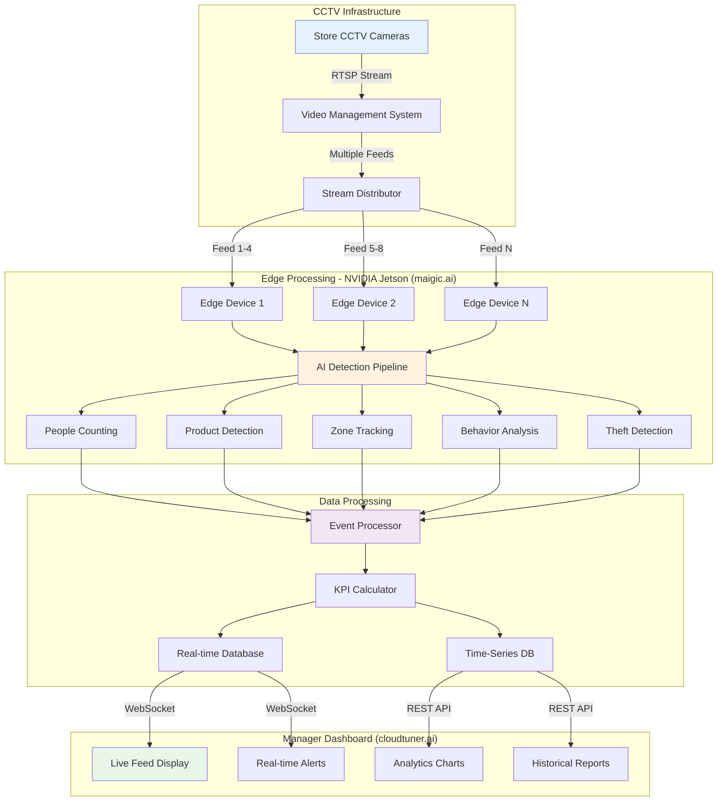
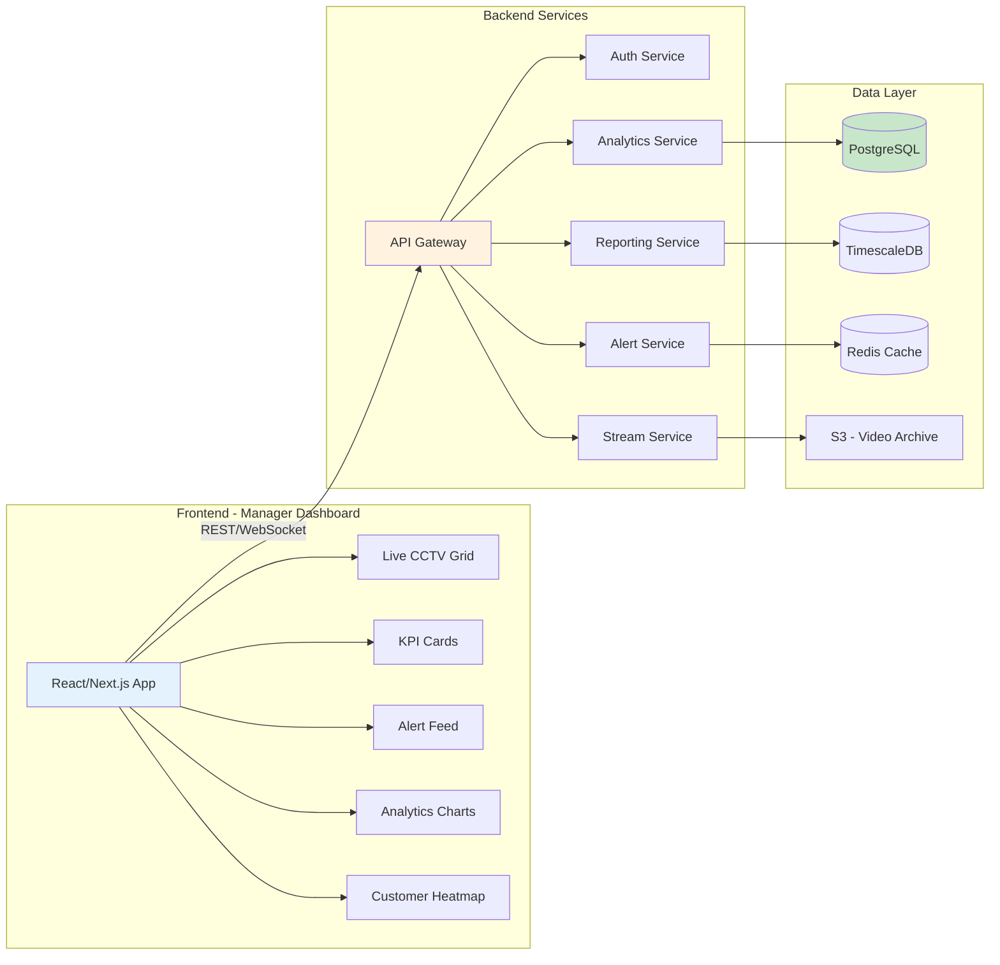
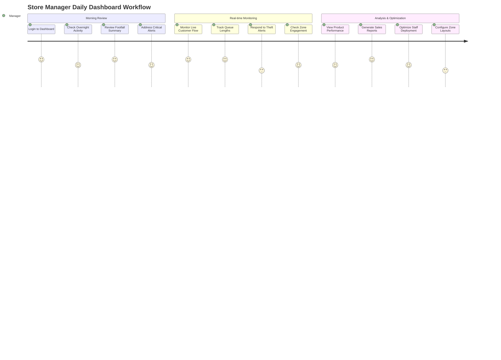
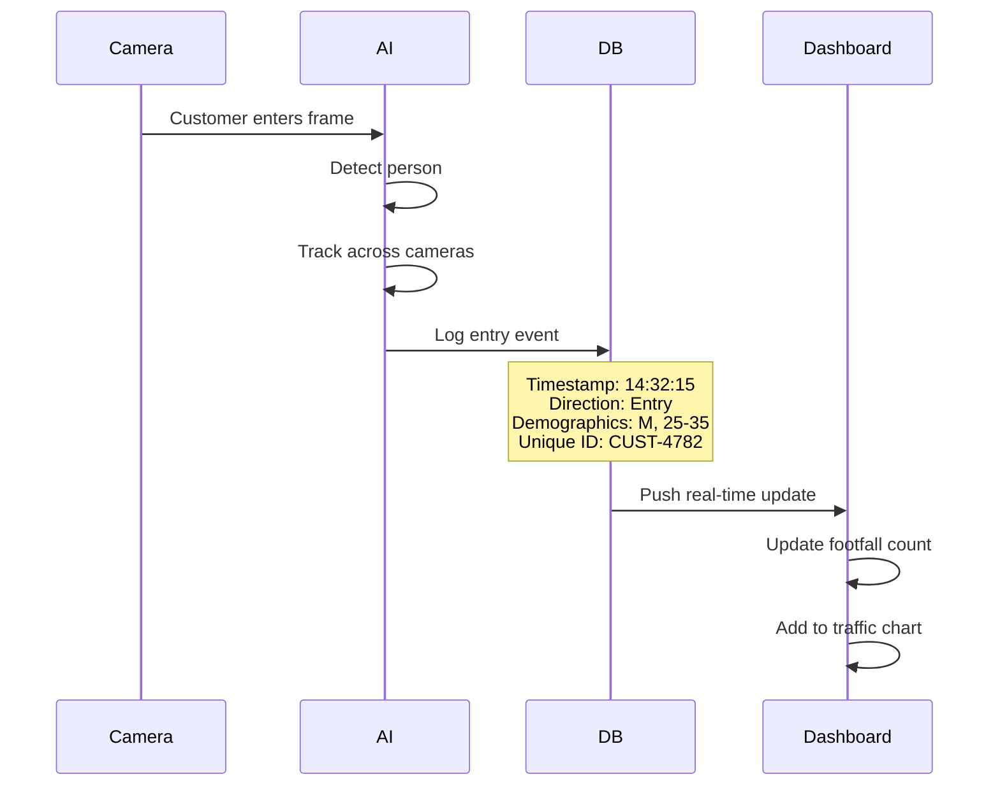
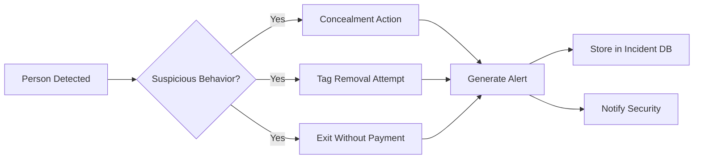
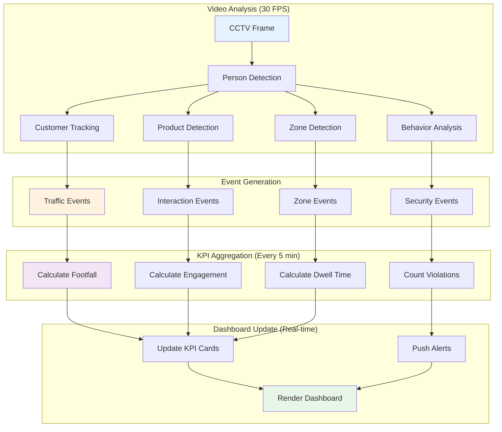
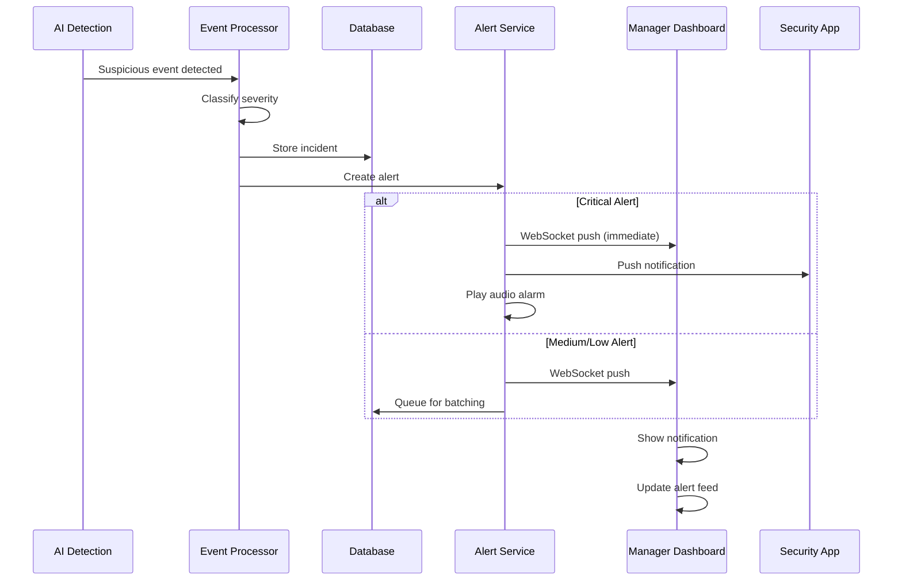
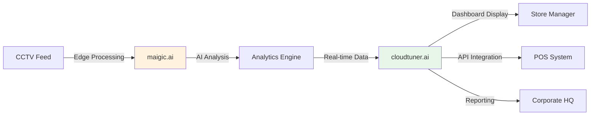

# Retail KPI Tracking Dashboard - Complete Workflow & System Architecture

## 📋 Table of Contents
1. [System Overview](#system-overview)
2. [CCTV-Based Real-Time Retail Analytics Flow](#cctv-based-real-time-retail-analytics-flow)
3. [Dashboard Architecture](#dashboard-architecture)
4. [Store Manager Dashboard Workflow](#store-manager-dashboard-workflow)
5. [KPI Tracking Mechanisms](#kpi-tracking-mechanisms)
6. [Technical Flow](#technical-flow)
7. [Alert System](#alert-system)

---

## System Overview

### Purpose
Real-time retail analytics and customer behavior monitoring dashboard for store managers using AI-powered CCTV analytics.

### Key Capabilities
- **Footfall Tracking:** Real-time customer counting and traffic analysis
- **Customer Journey:** Path tracking and zone engagement mapping
- **Queue Management:** Checkout line monitoring and wait time optimization
- **Product Interaction:** Shelf engagement and product pickup detection
- **Loss Prevention:** Theft detection and inventory verification
- **Staff Analytics:** Coverage monitoring and service engagement tracking

### Inspiration Reference
Based on the **InvEye Employee Dashboard** design pattern:
- Clean, professional interface with light theme
- Real-time CCTV feed integration
- Live alert system with severity indicators
- Zone-based summaries
- Time-series trend charts
- Color-coded status indicators
- Multi-level drill-down capability

---

## CCTV-Based Real-Time Retail Analytics Flow



### Camera Placement Strategy

| Zone Type | Camera Count | Coverage | AI Models Required |
|:---|:---:|:---|:---|
| **Store Entrance/Exit** | 2-4 | People counting, gender/age detection | Person Detection, Demographics |
| **Checkout Lanes** | 1 per 4 lanes | Queue length, wait time tracking | Person Detection, Queue Analysis |
| **Product Aisles** | 1 per 40ft | Shelf interaction, product pickups | Object Detection, Interaction Analysis |
| **High-Value Zones** | 1 per section | Theft prevention, product tracking | Behavior Analysis, Object Tracking |
| **Fitting Rooms** | 1 per entrance | Occupancy, entry/exit tracking | Person Detection, Occupancy Tracking |

---

## Dashboard Architecture

### System Components



### Tech Stack Recommendation

**Frontend:**
- React/Next.js for dashboard interface
- WebRTC for live video streaming
- Chart.js / Recharts for data visualization
- Socket.io for real-time updates
- Tailwind CSS for styling

**Backend:**
- Node.js / Python FastAPI for API services
- PostgreSQL for structured data (customers, transactions, incidents)
- TimescaleDB for time-series metrics
- Redis for real-time alert queue
- WebSocket server for live updates

**AI/ML:**
- NVIDIA Jetson for edge inference
- YOLOv8 for object/person detection
- DeepSort for customer tracking
- Custom models for behavior analysis
- Computer vision for product recognition

---

## Store Manager Dashboard Workflow

### User Journey: Store Manager Daily Flow



### Dashboard Screens Hierarchy

```
📊 InvEye Retail Dashboard
│
├─ 🏠 Overview Dashboard
│  ├─ Today's Summary (KPI Cards)
│  ├─ Live CCTV Grid (4-16 feeds)
│  ├─ Real-time Alert Feed
│  ├─ Current Footfall
│  └─ Active Queue Status
│
├─ 👥 Customer Analytics
│  ├─ Footfall Trends
│  ├─ Customer Journey Paths
│  ├─ Zone Heatmaps
│  ├─ Dwell Time Analysis
│  └─ Demographic Insights
│
├─ 🛍️ Product Intelligence
│  ├─ Product Interaction Stats
│  ├─ Shelf Performance
│  ├─ Conversion Funnel
│  └─ Basket Analysis
│
├─ 🔐 Loss Prevention
│  ├─ Suspicious Activity Log
│  ├─ Theft Incident Reports
│  ├─ Inventory Discrepancies
│  └─ Access Control Violations
│
├─ 👔 Staff Performanc
│  ├─ Floor Coverage Map
│  ├─ Customer Engagement Stats
│  ├─ Service Time Metrics
│  └─ Staff Deployment Optimization
│
├─ 📹 CCTV Management
│  ├─ Live Camera Grid
│  ├─ Camera Health Status
│  ├─ Historical Playback
│  └─ Incident Snapshots
│
└─ ⚙️ Settings
   ├─ Zone Configuration
   ├─ Alert Thresholds
   ├─ Operating Hours
   └─ Integration Settings
```

---

## KPI Tracking Mechanisms

### 1. Footfall & Traffic Analytics

**How It Works:**


**Dashboard Display:**
- **KPI Card:** Total visitors today (updates live)
- **Hourly Breakdown:** Traffic by hour chart
- **Demographics:** Age/gender distribution
- **Comparison:** Week-over-week trends

---

### 2. Zone Heatmap & Engagement

**Detection Method:**
- **Zone-based tracking:** Define store zones (polygons)
- **Person tracking:** Track customer movement across zones
- **Dwell time calculation:** Time spent in each zone

**Dashboard Display:**
```
┌─────────────────────────────────────┐
│ 🗺️ Store Zone Performance          │
│                                     │
│ [Heatmap Visualization]             │
│                                     │
│ High Engagement Zones:              │
│ 🔴 Electronics:    89% (Hot)        │
│ 🟠 Fashion:       72% (High)        │
│ 🟡 Home Goods:     56% (Medium)     │
│                                     │
│ 💡 Recommendation:                  │
│   Move clearance items to corridor  │
└─────────────────────────────────────┘
```

---

### 3. Queue & Checkout Analytics

**Logic:**
```javascript
// Example calculation
const checkoutMetrics = {
    activeLanes: 12,
    totalLanes: 15,
    avgQueueLength: 4.2,
    avgWaitTime: calculateWaitTime(queueData),
    alertThreshold: 8 // minutes
};

if (queue.waitTime > alertThreshold) {
    generateAlert('QUEUE_LONG', queue.laneId);
}
```

**Dashboard Display:**
- **Live Queue View:** Visual bars showing queue lengths
- **Wait Time Alert:** Notification when >8 min
- **Lane Efficiency:** Customers served per hour
- **Abandonment Rate:** Carts left before checkout

---

### 4. Product Interaction Tracker

**Detection Method:**
- **Shelf monitoring:** Cameras on product shelves
- **Hand detection:** When customer picks up item
- **Dwell time:** How long they examine it
- **Action classification:** Picked up, examined, returned

**Dashboard Display:**
```
┌─────────────────────────────────────┐
│ 🏷️ Top Interacted Products         │
│                                     │
│ 1. iPhone 15:      284 touches     │
│ 2. Nike Sneakers:  219 pickups     │
│ 3. Smart TV:       187 views       │
│                                     │
│ Touch-to-Purchase Rate:             │
│ ■■■■■■■■░░ 42% Electronics          │
└─────────────────────────────────────┘
```

---

### 5. Theft & Loss Prevention

**Detection Method:**


**Dashboard Display:**
```
┌─────────────────────────────────────┐
│ 🚨 Loss Prevention                  │
│                                     │
│ Suspicious Events Today: 7          │
│ • Concealment: 3                    │
│ • Tag Removal: 1                    │
│ • Exit Mismatch: 1                  │
│                                     │
│ 🔴 ACTIVE ALERT - 2 min ago         │
│ Concealment detected - Aisle 7      │
│ [View CCTV] [Dispatch Security]     │
└─────────────────────────────────────┘
```

---

### 6. Customer Journey Paths

**Tracking Method:**
- **Multi-camera tracking:** Track single customer across cameras
- **Path reconstruction:** Build complete journey map
- **Sequence analysis:** Common paths identified

**Dashboard Display:**
```
┌─────────────────────────────────────┐
│ 🚶 Customer Journey Intelligence    │
│                                     │
│ Most Common Path:                   │
│ Entrance → Groceries → Fashion →    │
│ Electronics → Checkout              │
│                                     │
│ Avg. Zones Visited: 4.2             │
│ Backtracking Rate: 18%              │
│ Express Shoppers: 34%               │
└─────────────────────────────────────┘
```

---

## Technical Flow

### Real-Time Data Processing Pipeline



### Database Schema (Simplified)

```sql
-- Customer Visits
CREATE TABLE customer_visits (
    id SERIAL PRIMARY KEY,
    visitor_id VARCHAR(50),
    entry_time TIMESTAMPTZ,
    exit_time TIMESTAMPTZ,
    duration_seconds INT,
    gender VARCHAR(10),
    age_range VARCHAR(20),
    made_purchase BOOLEAN
);

-- Zone Events
CREATE TABLE zone_events (
    id SERIAL PRIMARY KEY,
    visitor_id VARCHAR(50),
    zone_name VARCHAR(50),
    entry_time TIMESTAMPTZ,
    exit_time TIMESTAMPTZ,
    dwell_seconds INT,
    interactions INT
);

-- Product Interactions
CREATE TABLE product_interactions (
    id SERIAL PRIMARY KEY,
    visitor_id VARCHAR(50),
    product_id INT,
    action_type VARCHAR(20), -- 'viewed', 'picked', 'purchased'
    timestamp TIMESTAMPTZ,
    duration_seconds INT
);

-- Security Incidents
CREATE TABLE security_incidents (
    id SERIAL PRIMARY KEY,
    incident_type VARCHAR(50),
    timestamp TIMESTAMPTZ,
    location VARCHAR(100),
    severity VARCHAR(20),
    status VARCHAR(20) DEFAULT 'open',
    snapshot_url TEXT,
    description TEXT
);

-- Daily KPIs (Aggregated)
CREATE TABLE daily_kpis (
    id SERIAL PRIMARY KEY,
    date DATE,
    total_visitors INT,
    unique_visitors INT,
    conversion_rate FLOAT,
    avg_dwell_time INT,
    avg_basket_value DECIMAL(10,2),
    theft_incidents INT,
    revenue DECIMAL(12,2)
);
```

---

## Alert System

### Alert Priority Levels

| Priority | Color | Icon | Response Time | Examples |
|:---|:---:|:---:|:---|:---|
| **Critical** | 🔴 Red | ⚠️ | Immediate | Theft in progress, emergency |
| **High** | 🟠 Orange | ⚡ | < 3 min | Suspicious behavior, long queue |
| **Medium** | 🟡 Yellow | ℹ️ | < 15 min | Low stock, spill detected |
| **Low** | 🔵 Blue | 📋 | < 1 hour | Cleaning needed, minor issue |

### Alert Flow



### Dashboard Alert Component

```
┌─────────────────────────────────────────┐
│ 🔔 Real-time Alerts                     │
├─────────────────────────────────────────┤
│                                         │
│ 🔴 CRITICAL - 1 min ago                │
│ Theft Suspected                         │
│ Location: Electronics - Aisle 7         │
│ Camera #12                              │
│ [View CCTV] [Dispatch Security]         │
│                                         │
│ ─────────────────────────────────────  │
│                                         │
│ 🟠 HIGH - 3 min ago                    │
│ Queue Wait Time Exceeded                │
│ Checkout Lane 13: 9.2 min wait         │
│ [View Queue] [Open Lane]                │
│                                         │
│ ─────────────────────────────────────  │
│                                         │
│ 🟡 MEDIUM - 12 min ago                 │
│ Low Stock Detected                      │
│ Product: Milk - Aisle 12                │
│ [View Inventory] [Request Restock]      │
│                                         │
│ [View All Alerts (18) →]               │
└─────────────────────────────────────────┘
```

---

## Integration with InvEye Ecosystem

### Product Integration Flow



**Components:**
- **Edge Kit:** NVIDIA Jetson devices at store
- **maigic.ai:** AI processing engine for video analytics
- **cloudtuner.ai:** Cloud-based dashboard and reporting
- **Integration APIs:** Connect to existing retail systems

---

## Next Steps for Implementation

### Phase 1: Setup (Week 1-2)
1. ✅ Install CCTV cameras in strategic locations
2. ✅ Deploy NVIDIA Jetson edge devices (maigic.ai)
3. ✅ Set up network infrastructure (RTSP streaming)
4. ✅ Configure cloudtuner.ai platform
5. ✅ Deploy backend API services

### Phase 2: AI Model Training (Week 3-4)
1. 🔄 Collect training data from store CCTVs
2. 🔄 Train/fine-tune people counting models
3. 🔄 Train product detection models
4. 🔄 Configure zone detection polygons
5. 🔄 Test and validate model accuracy

### Phase 3: Dashboard Development (Week 5-6)
1. 📋 Design Figma prototypes
2. 📋 Build frontend components
3. 📋 Integrate real-time WebSocket
4. 📋 Implement alert system
5. 📋 Create manager user management

### Phase 4: Testing & Deployment (Week 7-8)
1. ⏳ End-to-end testing with live data
2. ⏳ Performance optimization
3. ⏳ Security audit
4. ⏳ Manager training
5. ⏳ Go live

---

**Document Version:** 1.0  
**Last Updated:** December 2, 2024  
**Related Documents:**
- [Retail KPI Cards](file:///c:/Users/LENOVO/Desktop/my_docs/AG/InvEye/retail%20track/RETAIL_KPI_CARDS.md)
- [Integration Guide](file:///c:/Users/LENOVO/Desktop/my_docs/AG/InvEye/retail%20track/RETAIL_INVEYE_INTEGRATION_GUIDE.md)
