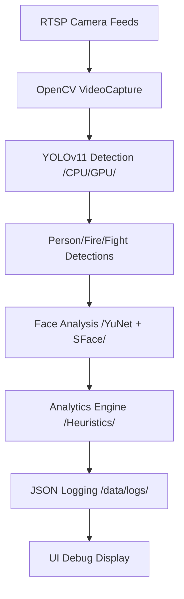
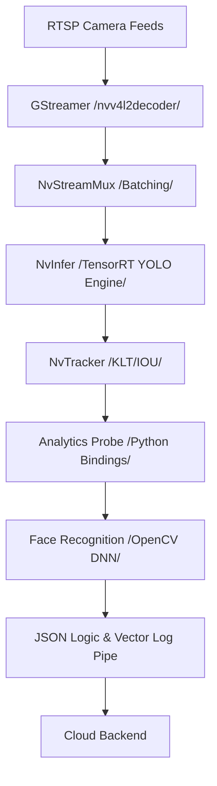

# Robo-i Edge Service: AI-Powered Multi-Camera Surveillance

Robo-i Edge Service is a high-performance video analytics application designed for edge deployment. It features multi-model detection (including fire, fight, and person), face recognition, and real-time logging. The system is designed for a hybrid development workflow, allowing for local testing on x86 machines and production deployment on NVIDIA Jetson Orin Nano.

---

## 🌩️ System Architecture & Execution Flow

### 💻 Development / x86 Flow

In development, we prioritize simplicity and compatibility using OpenCV and the standard Ultralytics YOLO implementation.



### 🏎️ Production / Jetson Flow

In production, we utilize NVIDIA's **DeepStream** and **TensorRT** for maximum hardware acceleration and 24/7 reliability.



---

## 📂 Project Structure & File Guide

Understanding the layout of this project:

- **[`configs/`](../configs/)**: Centralized configuration management.
  - **`app_config.yaml`**: Defines camera RTSP streams, operational thresholds (e.g., confidence, IOUs), and logging intervals.
  - **`deepstream/`**: Hardware-specific configurations for NvInfer (GIE) and trackers to optimize the Jetson pipeline.
- **[`core/`](../core/)**: The core processing and decision-making logic.
  - **`analytics_engine.py`**:
    - Coordinates logic between object detection and face recognition.
    - Implements heuristic-based event detection for fire, smoke, and physical altercations.
    - Manages the standardized JSON logging format for downstream processing (Vector).
  - **`face_recognizer.py`**:
    - Implements high-performance face detection (YuNet) and feature extraction (SFace).
    - Features a thread-safe embedding cache to ensure real-time performance on shared feeds.
    - Optimized for low-latency identity matching using Cosine Similarity.
- **[`models/`](../models/)**: Lifecycle management for AI weights.
  - **`source/` & `exports/`**: Tracks raw PyTorch models and their universal ONNX counterparts.
  - **`engines/`**: Storage for platform-specific TensorRT engines built specifically for the Jetson Orin Nano hardware.
- **[`runners/`](../runners/)**: Application lifecycle and entry points.
  - **`dev_host_runner_multi.py`**: A pure-Python implementation using Ultralytics/OpenCV for rapid development and UI-based debugging on x86 machines.
  - **`jetson_prod_runner_multi.py`**: A high-performance, GStreamer-based DeepStream implementation designed for 24/7 reliability on the edge.
- **[`scripts/`](../scripts/)**: Operational automation.
  - **`run_orin.sh`**: A supervisory script for production that handles hardware safety (thermal monitoring) and automatic crash recovery.
  - **`download_face_model.py`**: A simple utility to ensure the environment has the latest validated face models before startup.
- **[`tools/`](../tools/)**: Maintenance and debugging tools.
  - `check_classes.py`: Utility to verify model class IDs.
  - `capture_video.py` / `capture_image.py`: Tools for capturing evidence or debugging feeds.
- **[`docs/`](./)**: Detailed documentation.
  - [getting_started.md](./getting_started.md): Detailed environment setup guide for Jetson users.
- **[`vector.toml`](../vector.toml)**: Configuration for the Vector log pipeline used to ship logs to the cloud.

---

## 🚀 Running the Application

### 💻 1. Development Environment (x86 Host / RTX 3060)

The development runner is designed for x86 machines and uses OpenCV for easy execution and testing.

**Prerequisites:**

1. Follow the local setup guide to install dependencies.
2. Ensure your camera feeds are configured in `../configs/app_config.yaml`.

**Start the Service:**

```bash
# Recommended: Use the helper script
chmod +x scripts/run_dev.sh
./scripts/run_dev.sh

# Or run directly as a module
python3 -m runners.dev_host_runner_multi
```

### 🏎️ 2. Production Environment (NVIDIA Jetson)

The production runner is optimized for the NVIDIA Jetson Orin Nano using DeepStream for high-performance inference.

**Prerequisites:**

1. **Crucial:** Complete the environment setup by following [getting_started.md](./getting_started.md).
2. Ensure you have built the necessary TensorRT engines (see guide below).

**Start the Service:**

```bash
# Recommended: Use the main runner script (monitors temperature & logs)
chmod +x scripts/run_orin.sh
./scripts/run_orin.sh

# Or run the production entry point directly
python3 -m runners.jetson_prod_runner_multi
```

---

## 🛠️ Critical Guide: Building Engines (Jetson Only)

TensorRT engines are required for maximum performance on Jetson. Use the following command to build or rebuild engines if your model configuration changes:

```bash
/usr/src/tensorrt/bin/trtexec \
  --onnx=models/exports/yolo11n.onnx \
  --saveEngine=models/engines/yolo11n_b1_gpu0_fp16.engine \
  --fp16
```

_(Note: Ensure all paths point to your actual model files in the `models/` directory.)_

---

## 🔐 Face Recognition Maintenance

After cloning, you must download the face models:

```bash
python3 scripts/download_face_model.py
```

Place reference images of known people in `data/faces/` (format: `name.jpg`).

---

## 🌡️ Reliability & Monitoring

- **Temperature Control**: The `run_orin.sh` script monitors CPU temperature and will automatically shut down the device if it exceeds 85°C to prevent hardware damage.
- **Logging**: Logs are handled via `Vector` (configured in `vector.toml`) to ensure efficient metrics shipment without overwhelming local storage.

### Quick Links

- **[Getting Started (Jetson Setup)](docs/getting_started.md)**: Hardware flashing, DeepStream, and environment setup.
- **[System Architecture](docs/README.md#-system-architecture--execution-flow)**: Visual flows for Dev and Prod environments.
- **[Running the App](docs/README.md#-running-the-application)**: Instructions for x86 and Jetson runners.

## 🚀 Quick Run

### Production (Jetson)

```bash
chmod +x scripts/run_orin.sh
./scripts/run_orin.sh
```

### Development (x86)

```bash
chmod +x scripts/run_dev.sh
./scripts/run_dev.sh
```
