# Technical Architecture - The Visual Guide

Alright, so you want to see how this all fits together technically. Here are the diagrams that show the architecture, workflows, and how money/data flows through the system.

---

## 1. The Full Stack: L0 + L1 Architecture

This shows how our blockchain infrastructure is layered. Think of L0 as the foundation that lets us build specialized chains on top.

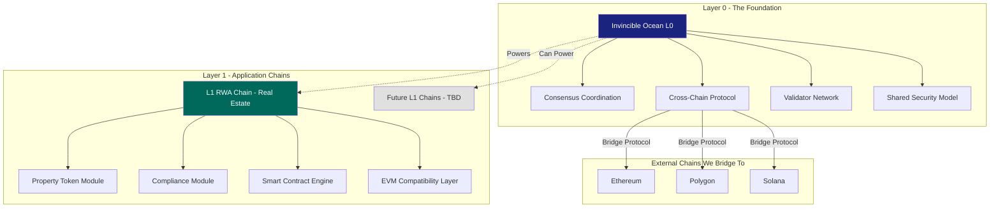

**What this means:**  
L0 handles the heavy lifting (security, cross-chain stuff). L1 is where properties get tokenized and traded. Later we can spin up other L1s for different asset types without rebuilding everything.

---

## 2. How Property Tokenization Actually Works

Step by step, from finding a building to investors collecting rent.

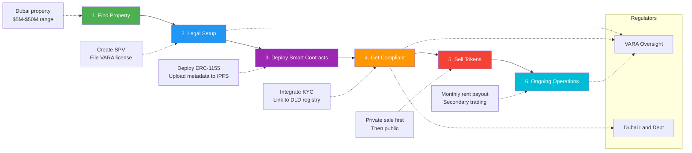

---

## 3. Smart Contract Architecture

These are the main contracts that make everything work. They interact with each other and with external data sources.

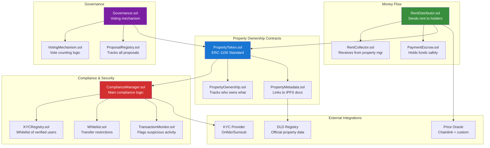

**Key insight:**  
Every token transfer goes through the ComplianceManager first. Can't transfer to someone who hasn't done KYC. Can't transfer to a sanctioned wallet. This is enforced at the protocol level, not just in the UI.

---

## 4. How Someone Becomes an Investor

The full KYC → token purchase flow.

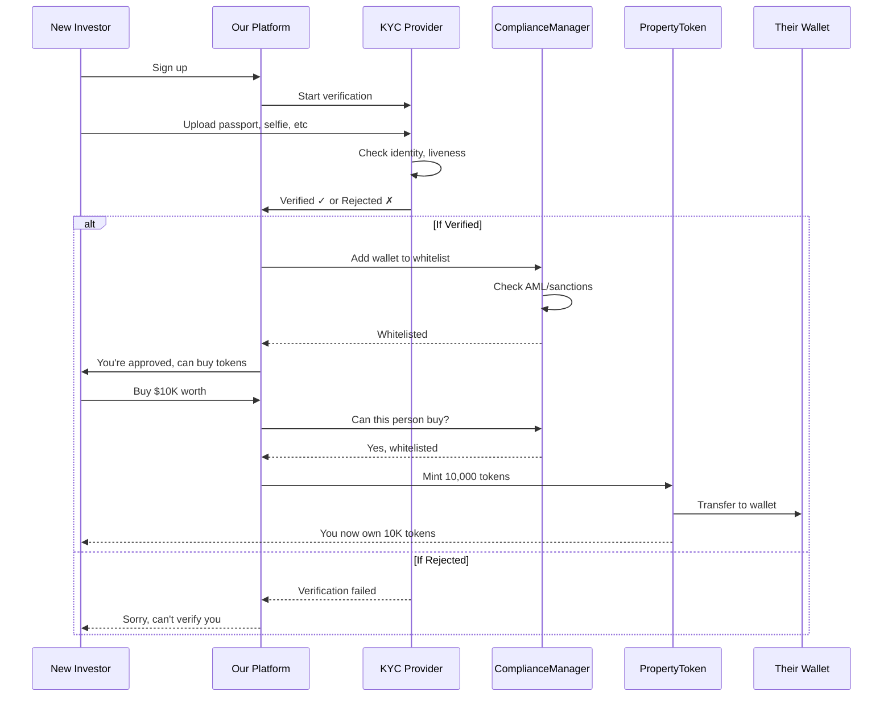

The important part: Once someone's whitelisted, their wallet address is approved. They can trade on DEXs and it'll still work because the smart contract checks the whitelist.

---

## 5. How Rent Gets Distributed

From property manager → token holders, automatically.

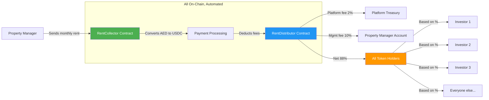

**Example:**  
Property generates $50K rent this month. Manager sends it → RentCollector converts to stablecoin → Takes 2% platform fee ($1K), 10% mgmt fee ($5K) → Distributes remaining $44K proportionally to all token holders based on how many tokens they own.

All automatic. Once a month. No manual work.

---

## 6. Cross-Chain Bridge (How We Connect to Ethereum, etc.)

This lets someone take their property token from our chain to Ethereum if they want.

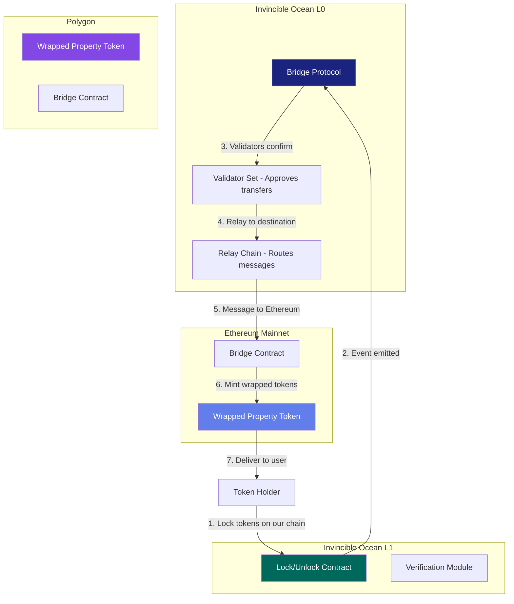

**Why this matters:**  
Someone might want to use their property tokens in Ethereum DeFi. They can bridge over, use them as collateral, then bridge back. The actual property stays where it is, but the token representation moves.

---

## 7. VARA Compliance Framework

What we need to do to stay licensed and legal.

```mermaid
graph TD
    A[Invincible Ocean - ARVA Issuer]
    
    subgraph "Before Getting Licensed"
        B1[Dubai LLC + AED 1.5M capital]
        B2[Comprehensive whitepaper]
        B3[AML/CTF policies written]
        B4[Management team in place]
    end
    
    subgraph "After Getting Licensed"
        C1[Independent audit every 6 months]
        C2[Monthly reports to VARA]
        C3[Client funds in segregated accounts]
        C4[24/7 transaction monitoring]
        C5[Incident reporting within 24hrs]
    end
    
    subgraph "Technical Requirements"
        D1[Verify tokens match assets 1:1]
        D2[Track token circulation real-time]
        D3[Maintain investor whitelist]
        D4[Smart contract audits before deploy]
    end
    
    subgraph "DLD Integration"
        E1[Link blockchain to property registry]
        E2[Issue ownership certificates]
        E3[Notify on every transfer]
    end
    
    A --> B1 & B2 & B3 & B4
    A --> C1 & C2 & C3 & C4 & C5
    A --> D1 & D2 & D3 & D4
    A --> E1 & E2 & E3
    
    VARA[VARA - The Regulator] -.->|Oversees everything| A
    DLD[Dubai Land Department] -.->|Validates property data| E1
    
    style A fill:#D32F2F,color:#fff
    style VARA fill:#1976D2,color:#fff
    style DLD fill:#388E3C,color:#fff
```

---

## 8. Where the Money Goes (Token Distribution & Revenue Split)

**For a $10M Property:**

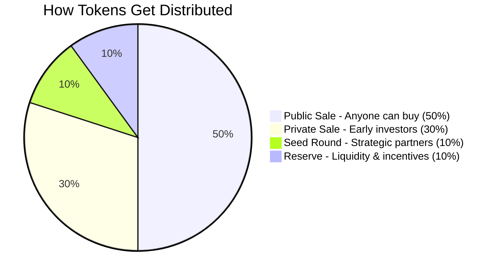

**Monthly Rent Distribution:**

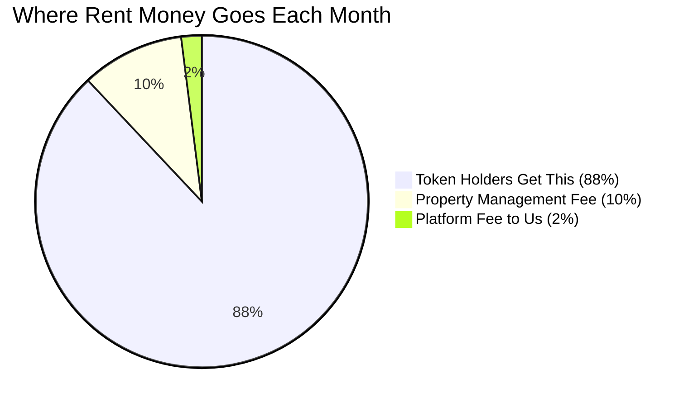

---

## 9. The 3-Year Build Timeline

What we're building when.

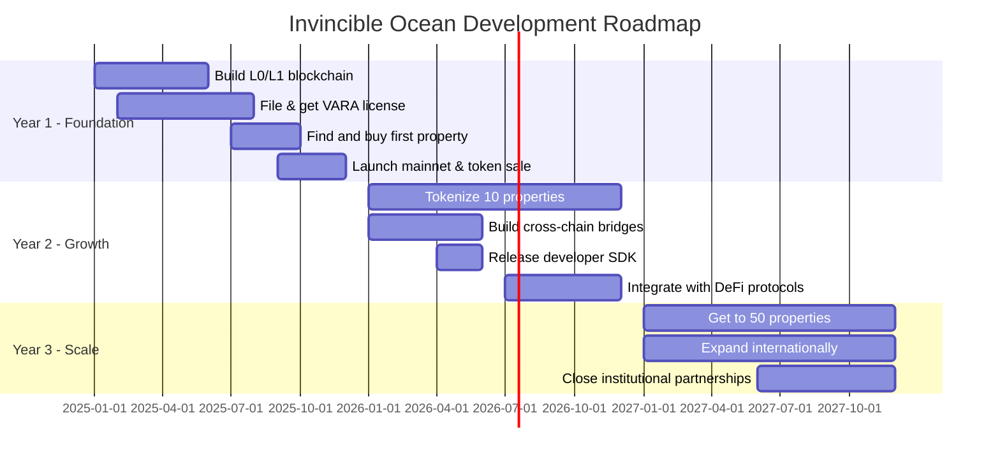

---

## 10. Data Architecture - What Lives Where

Not everything goes on the blockchain. Here's what goes where and why.

```mermaid
graph TB
    subgraph "On-Chain - Immutable"
        A1[Who owns which tokens]
        A2[Every transaction ever]
        A3[All compliance records]
        A4[Governance votes]
    end
    
    subgraph "IPFS - Distributed Storage"
        B1[Property photos & videos]
        B2[Legal documents & deeds]
        B3[Valuation reports]
        B4[Contracts & agreements]
    end
    
    subgraph "Traditional Database - Fast queries"
        C1[User profiles & settings]
        C2[KYC documents - encrypted]
        C3[Analytics & metrics]
        C4[Email/notification logs]
    end
    
    subgraph "External APIs - Live data"
        D1[Dubai Land Dept registry]
        D2[Property valuation oracles]
        D3[Currency exchange rates]
        D4[Market data feeds]
    end
    
    SC[Smart Contracts] --> A1 & A2 & A3 & A4
    SC -.->|Store hash only| B1 & B2 & B3 & B4
    Platform[Our Backend] --> C1 & C2 & C3 & C4
    Platform -.->|Query when needed| D1 & D2 & D3 & D4
    
    SC -->|Write| Blockchain[(Blockchain State)]
    B1 -->|Store files| IPFS[(IPFS Network)]
    C1 -->|Store data| DB[(PostgreSQL)]
    
    style SC fill:#9C27B0,color:#fff
    style Blockchain fill:#1976D2,color:#fff
    style IPFS fill:#4CAF50,color:#fff
    style DB fill:#FF9800,color:#fff
```

**Why this split:**  
- Blockchain: Things that need to be immutable and trustless
- IPFS: Large files that need to be distributed
- Database: Things that need to be updated or queried quickly
- APIs: Live data from external sources

---

## Technical Specs Summary

Just the numbers:

**L0 Layer:**
- Target: 1,000+ cross-chain messages/second
- Security: $100M+ staked (eventually)
- Validators: Start with 50, scale to 100+
- Consensus: BFT with 2-second finality

**L1 RWA Chain:**
- Throughput: 5,000-10,000 TPS
- Block time: 2-5 seconds
- Finality: 2-10 seconds (depending on consensus)
- Gas fees: Fixed low ($0.01-0.10 per transaction)
- Node requirements: 500GB-2TB storage

**Smart Contracts:**
- Property tokens: ERC-1155 (multi-token standard)
- Metadata: IPFS links for documents
- Compliance: Custom precompiles built into the chain
- Governance: On-chain voting

**Security:**
- Minimum 2 independent audits (CertiK + OpenZeppelin)
- Bug bounty: $100K+ pool on Immunefi
- Pen testing: Quarterly by external firms
- Monitoring: 24/7 with <1 hour response time

---

**Notes:**  
These diagrams will evolve as we build. The important thing is the architecture is sound - we can adjust implementation details as we go.

If any of this is unclear or you want to dive deeper into a specific component, just ask. This is the foundation we're building on, so it's worth getting it right.
