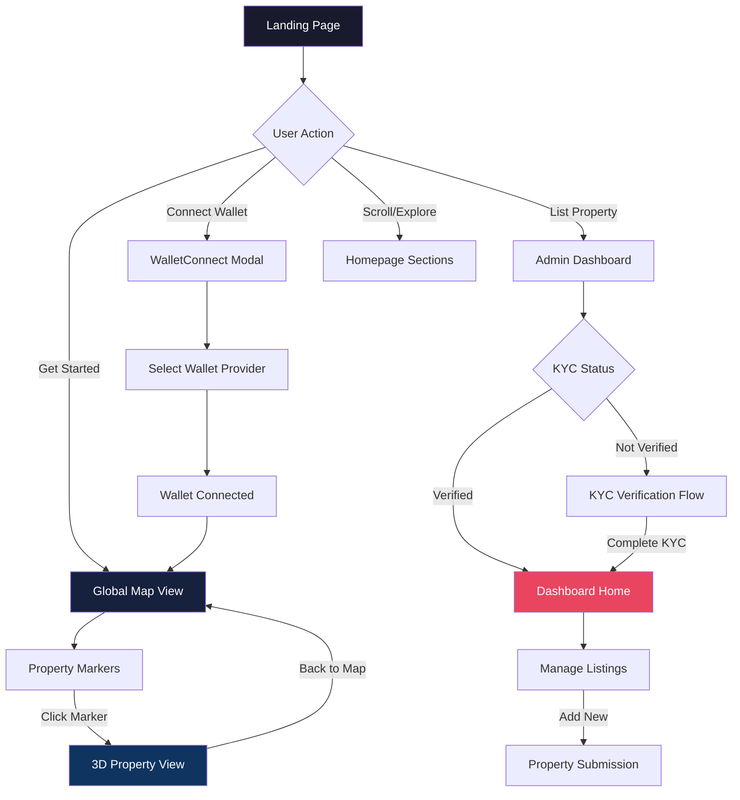
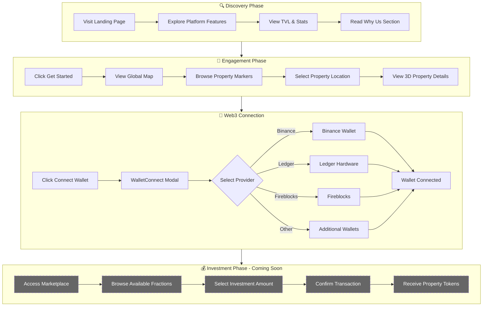
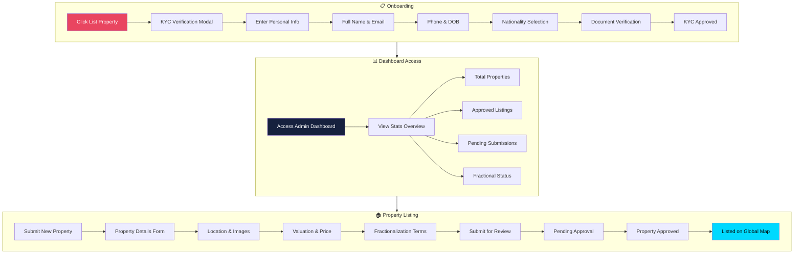
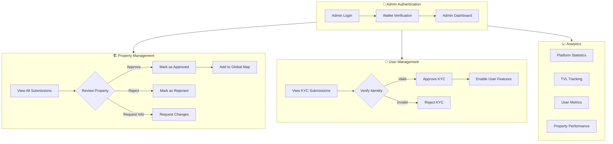
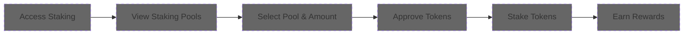

# Fraction Estate / Invincible Ocean - User Flow Documentation

> Complete user journey documentation for the RWA (Real World Asset) tokenization platform.

---

## Platform Overview

Fraction Estate operates as a **Web3-enabled real estate tokenization platform** that bridges traditional real estate investment with blockchain technology. The platform enables fractional ownership of high-value properties through tokenization.

### Key Platform Sections

| Section | Status | Description |
|---------|--------|-------------|
| Landing Page | ✅ Live | Marketing homepage with platform overview |
| Global Map | ✅ Live | Interactive 3D world map showing properties |
| Property View | ✅ Live | Detailed 3D visualization of individual properties |
| Admin Dashboard | ✅ Live | Property listing management interface |
| KYC Verification | ✅ Live | Identity verification flow |
| Marketplace | 🚧 Coming Soon | Property trading platform |
| Staking | 🚧 Coming Soon | Token staking functionality |
| My Assets | 🚧 Coming Soon | User portfolio management |

---

## User Personas

### 1. Investor
Real estate investors seeking fractional ownership opportunities with lower entry barriers.

### 2. Property Owner
Real estate owners wanting to tokenize and fractionalize their properties.

### 3. Platform Admin
Administrative users managing listings, approvals, and platform operations.

---

## User Flow Diagrams

### 1. Complete Platform Navigation Flow



---

### 2. Investor Journey Flow



---

### 3. Property Owner Listing Flow



---

### 4. KYC Verification Flow (Detailed)

```mermaid
flowchart LR
    subgraph Step1["Step 1: Personal Info"]
        A1[Full Name]
        A2[Email Address]
        A3[Phone Number]
    end
    
    subgraph Step2["Step 2: Identity"]
        B1[Date of Birth]
        B2[Nationality]
        B3[Country of Residence]
    end
    
    subgraph Step3["Step 3: Documents"]
        C1[ID Document Upload]
        C2[Proof of Address]
        C3[Selfie Verification]
    end
    
    subgraph Step4["Step 4: Review"]
        D1[Submit for Review]
        D2[Verification Processing]
        D3[KYC Approved/Rejected]
    end
    
    Step1 --> Step2 --> Step3 --> Step4
```



---

### 5. Platform Admin Flow



---

## Interactive Elements & UI Components

### Navigation Structure

```
🏠 Header Navigation
├── Home (Landing Page)
├── Why Us (Features Section)
├── Assets (Property Listings)
├── Blog (Community Updates)
├── List Property → Admin Dashboard / KYC
└── Connect Wallet → WalletConnect Modal

🗺️ App Navigation (dApp Mode)
├── Back to Home
├── Back to Map (from Property View)
├── Marketplace (Coming Soon)
├── Staking (Coming Soon)
└── My Assets (Coming Soon)
```

### Interactive Components

| Component | Location | Function |
|-----------|----------|----------|
| Property Markers | Global Map | Navigate to 3D property view |
| Map Controls | Property View | Zoom, rotate, reset view |
| KYC Modal | Dashboard Entry | Identity verification steps |
| WalletConnect | Header | Multi-wallet connection |
| Coming Soon Modal | Bottom Nav | Placeholder for future features |
| Stats Cards | Homepage & Dashboard | Display TVL, investor count, etc. |

---

## Web3 Integration Points

### Wallet Connection Options
- **WalletConnect** - Primary integration protocol
- **Binance Wallet** - Direct integration
- **Ledger** - Hardware wallet support
- **Fireblocks** - Institutional custody

### Blockchain Features
- Asset tokenization on Ethereum
- ETH-based pricing (e.g., "2.5 ETH")
- Blockchain audit trails for transactions
- Smart contract-based ownership

---

## Future Flow Additions (Coming Soon)

### Marketplace Flow

```mermaid
flowchart LR
    A[Browse Properties] --> B[View Fractions Available]
    B --> C[Select Investment Amount]
    C --> D[Connect Wallet]
    D --> E[Sign Transaction]
    E --> F[Receive Tokens]
    F --> G[Own Property Fraction]
    
    style A fill:#666,stroke-dasharray: 5 5
    style B fill:#666,stroke-dasharray: 5 5
    style C fill:#666,stroke-dasharray: 5 5
    style D fill:#666,stroke-dasharray: 5 5
    style E fill:#666,stroke-dasharray: 5 5
    style F fill:#666,stroke-dasharray: 5 5
    style G fill:#666,stroke-dasharray: 5 5
```


### Staking Flow


---

## Site Exploration Recording

The following recording documents the complete exploration of the Fraction Estate website:


---

## Summary

This documentation captures the current state of Fraction Estate's user flows as of December 2024. The platform has a functional:

✅ **Landing Page** with rich marketing content  
✅ **3D Global Map** for property visualization  
✅ **Admin Dashboard** for property management  
✅ **KYC System** for user verification  
✅ **WalletConnect Integration** for Web3 connectivity  

🚧 **Coming Soon**: Marketplace, Staking, and My Assets sections.

---

*Document generated: December 29, 2024*
