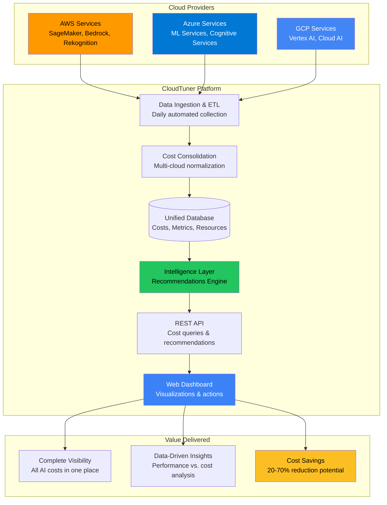
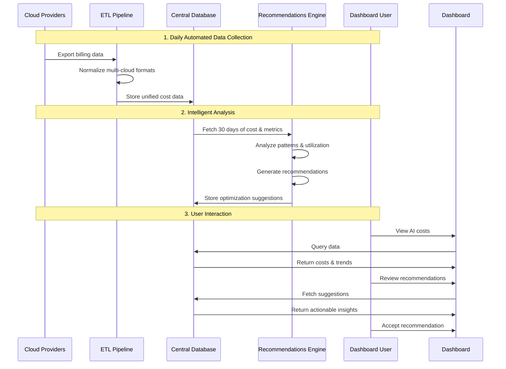
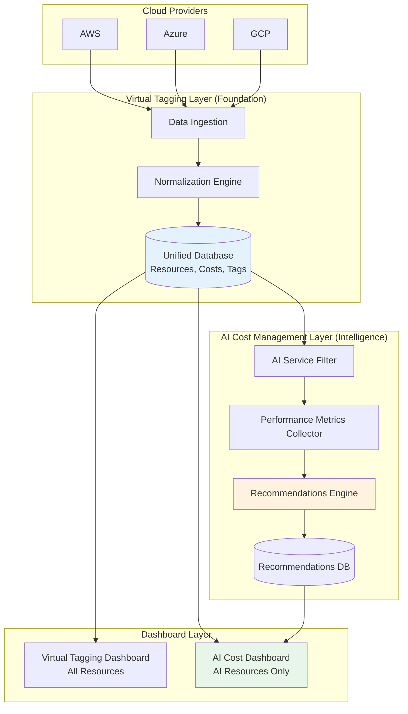

# AI Cost Management - Executive Overview

## 🎯 What is AI Cost Management?

AI Cost Management is CloudTuner.ai's comprehensive solution for tracking, analyzing, and optimizing artificial intelligence infrastructure costs across multiple cloud providers. As organizations increasingly adopt AI/ML services like Amazon SageMaker, Azure Machine Learning, and Google Vertex AI, costs can quickly spiral out of control without proper visibility and optimization.

### The Problem We Solve

**Organizations face three critical challenges with AI infrastructure costs:**

1. **Lack of Visibility**: AI costs are scattered across AWS, Azure, and GCP billing systems, making it impossible to see the complete picture
2. **Complex Pricing Models**: AI services have dozens of pricing tiers, instance types, and commitment options that are difficult to optimize
3. **Resource Inefficiency**: Teams over-provision AI resources "to be safe," leading to 40-70% waste on underutilized infrastructure

### Our Solution

CloudTuner.ai's AI Cost Management feature provides:

- ☁️ **Unified Multi-Cloud Dashboard**: Single view of all AI costs across AWS, Azure, and GCP
- 📊 **Intelligent Analytics**: Correlate costs with performance metrics (throughput, inference latency, GPU utilization)
- 🎯 **AI-Powered Recommendations**: Automated suggestions to reduce costs by 20-70% with minimal effort
- 📈 **Rich Visualizations**: Interactive charts showing trends, breakdowns, and anomalies
- 💡 **Actionable Insights**: Step-by-step guides to implement optimizations safely

---

## 🏗️ System Architecture

### High-Level Architecture



### How It Works: Data Flow



---

```

---

## 🔄 How It Works: Complete End-to-End Process

### Foundation: Built on Virtual Tagging

**Important**: AI Cost Management doesn't start from scratch. It builds on CloudTuner's existing **Virtual Tagging infrastructure**, which already:

✅ Fetches data from AWS, Azure, and GCP daily  
✅ Normalizes all cloud-specific formats into unified schema  
✅ Merges native tags with virtual tags  
✅ Stores everything in CloudTuner's central database  

**This means**: The heavy lifting of multi-cloud data unification is already done! AI Cost Management simply plugs into this existing foundation and adds cost-specific intelligence on top.

---

### Real-World Example: TechCorp's Journey

**Company**: TechCorp (AI-powered SaaS company)  
**Infrastructure**: AWS SageMaker, Azure ML, GCP Vertex AI  
**Monthly AI Costs**: $12,450  
**Challenge**: No AI-specific cost insights or optimization recommendations

---

### **Stage 1: Data Already Unified** (Handled by Virtual Tagging)

**What Happens:**  
Virtual Tagging system has already done the work:

**Data Already in CloudTuner Database (from Virtual Tagging):**

```
Resource 1:
  resource_id: "arn:aws:sagemaker:us-east-1:123:endpoint/ml-inference-prod"
  resource_name: "ml-inference-prod"
  cloud_provider: "AWS"
  service_type: "SageMaker"
  resource_type: "endpoint"
  region: "us-east-1"
  account_id: "123456789"
  unified_tags: {
    environment: "production",
    team: "ml-ops",
    cost-center: "engineering"
  }
  daily_cost: $106.67
  
Resource 2:
  resource_id: "/subscriptions/abc/.../ml-workspace"
  resource_name: "ml-workspace"
  cloud_provider: "Azure"
  service_type: "Machine Learning Services"
  resource_type: "workspace"
  region: "eastus"
  unified_tags: {
    environment: "production",
    team: "data-science"
  }
  daily_cost: $53.33

Resource 3:
  resource_id: "projects/my-project/.../image-classifier"
  resource_name: "image-classifier"
  cloud_provider: "GCP"
  service_type: "Vertex AI"
  resource_type: "endpoint"
  region: "us-central1"
  unified_tags: {
    environment: "production",
    team: "cv-team"
  }
  daily_cost: $80.00
```

**Key Point**: All three clouds are already in the same format! Virtual Tagging did the heavy lifting.

---

### **Stage 2: AI Cost Management Filters for AI Services** (Every Night at 2 AM)

**What Happens:**  
AI Cost Management queries the Virtual Tagging database and filters for AI-specific services only.

**Filter Query:**
```sql
SELECT * FROM resources 
WHERE service_type IN (
  'AmazonSageMaker', 'AmazonBedrock', 'AmazonRekognition',
  'Microsoft.MachineLearningServices', 'Microsoft.CognitiveServices',
  'Vertex AI', 'Cloud AI Platform', 'Cloud Natural Language'
)
AND is_active = true
```

**TechCorp's AI Resources Identified:**
- 5 AI resources out of 247 total resources
- Combined AI cost: $12,450/month
- Spread across all 3 clouds

---

### **Stage 3: AI-Specific Performance Metrics Collection** (2:15-2:30 AM)

**What Happens:**  
Now we pull AI-specific metrics that Virtual Tagging doesn't track (GPU utilization, inference throughput, model serving latency).

**TechCorp's ml-inference-prod Metrics (Last 24 Hours):**
- **GPU Utilization**: 28.3% average (CloudWatch)
- **CPU Utilization**: 45.2% average  
- **Memory Usage**: 52.1% average
- **Throughput**: 1.2 requests per second
- **Total Inferences**: 103,680 yesterday
- **Latency**: 147ms average per request
- **Error Rate**: 0.02%

**Why This Matters:**  
Virtual Tagging tracks *what* resources exist and *what they cost*. AI Cost Management adds *how they're being used* (the performance layer).

**Data Sources:** AWS CloudWatch, Azure Monitor, GCP Cloud Monitoring

---

### **Stage 4: Intelligent Analysis** (2:30-2:45 AM)

**What Happens:**  
The AI Cost Recommendations Engine analyzes 30 days of cost + performance data.

**TechCorp's ml-inference-prod Analysis:**

**Rightsizing Analyzer:**
```
Checking: Is this resource over-sized?

Data from Virtual Tagging:
- Resource: ml-inference-prod
- Cost: $3,200/month
- Instance type: ml.g4dn.xlarge
- Tags: {environment: production, team: ml-ops}

Data from AI Metrics:
- 30 days GPU utilization: 28.3% average
- Peak GPU ever: 42.1%
- Pattern: Consistently low

Threshold Check:
- GPU Utilization: 28.3% < 30% threshold
- ✓ TRIGGERED: Underutilized!

Recommendation Generated:
- Switch to: ml.g4dn.large
- Savings: $1,280/month (40%)
- Confidence: 85%
```

**Result:** 1 recommendation created for this resource.

---

### **Stage 5: Recommendation Stored in Database** (2:45 AM)

**What Happens:**  
Recommendation is saved with all supporting data.

**Database Entry:**
```
recommendation_id: "rec-20241128-001"
resource_id: "arn:aws:sagemaker:us-east-1:123:endpoint/ml-inference-prod"
type: "rightsizing"
priority: "HIGH"
title: "Downsize Inference Endpoint"
current_monthly_cost: $3,200
estimated_monthly_savings: $1,280
confidence_score: 0.85
implementation_effort: "MEDIUM"
created_at: "2024-11-28 02:45:00"
status: "pending"
```

---

### **Stage 6: User Opens Dashboard** (10 AM - Same Morning)

**What Happens:**  
Sarah (DevOps Lead) opens the AI Cost Management dashboard.

**Dashboard Queries:**
1. **Cost Summary**: Pulls from Virtual Tagging cost data filtered for AI services
2. **Recommendations**: Pulls from `recommendations` table
3. **Trends**: Historical cost data from Virtual Tagging

**What Sarah Sees:**

```
💰 Total AI Cost This Month: $12,450
   (Virtual Tagging provides all cost breakdowns)
   
   AWS: $6,200  |  Azure: $3,100  |  GCP: $3,150

🎯 Potential Savings Available: $3,430/month
   (AI Cost Management recommendations)
   
   From 4 new recommendations

┌──────────────────────────────────────────────────┐
│ 📏 Downsize Inference Endpoint      🔴 HIGH      │
│ ml-inference-prod • AWS SageMaker               │
│ GPU only 28.3% utilized                         │
│                                                  │
│ 💰 $1,280/mo savings  🎯 85% confidence         │
│ [View Details]  [Accept]  [Dismiss]             │
└──────────────────────────────────────────────────┘
```

**Behind the Scenes:**
- Cost data comes from Virtual Tagging
- Resource details come from Virtual Tagging
- Unified tags come from Virtual Tagging
- **Only the recommendations and AI metrics are unique to AI Cost Management**

---

### **Stage 7: Review & Decision** (10:15 AM)

**What Happens:**  
Sarah clicks "View Details."

**Data Shown (mix of Virtual Tagging + AI Cost Management):**

**From Virtual Tagging:**
- Resource name: ml-inference-prod
- Cloud: AWS
- Service: SageMaker
- Region: us-east-1
- Tags: {environment: production, team: ml-ops}
- Current cost: $3,200/month

**From AI Cost Management:**
- GPU utilization: 28.3% (30-day average)
- Peak GPU: 42.1%
- Recommendation: Downsize to ml.g4dn.large
- Projected savings: $1,280/month
- Confidence: 85%
- Implementation guide: 7 steps

**Sarah's Decision:** Clicks **[Accept & Implement]**

---

### **Stage 8: Implementation** (Following Weekend)

**What Happens:**  
Sarah follows the implementation guide.

**Saturday Dec 2, 8:00 AM:**

**Step 1**: Create new endpoint (ml.g4dn.large)  
**Step 2**: Load test → 151ms latency (acceptable)  
**Step 3**: Canary deployment → 10% traffic  
**Step 4**: Gradual increase → 50%, then 100%  
**Step 5**: Migration complete  

**Result:**
- ✅ 5 hours total
- ✅ 0 downtime
- ✅ 0 issues

---

### **Stage 9: Validation** (Next 7 Days)

**What Happens:**  
Both systems track the changes:

**Virtual Tagging Detects:**
- New resource created: ml-inference-prod-v2
- Instance type changed: ml.g4dn.xlarge → ml.g4dn.large
- Daily cost changed: $106.67 → $64.00
- Old resource decommissioned (Day 7)

**AI Cost Management Tracks:**
```
Week Before: $747/week
Week After: $448/week
Actual Savings: $299/week = $1,295/month

Projected: $1,280/month
Actual: $1,295/month
Accuracy: 98.8% ✓
```

**Recommendation Status Updated:**
```
status: "pending" → "implemented"
implementation_date: "2024-12-02"
actual_savings: $1,295
```

---

### **Stage 10: Ongoing Savings** (Every Month)

**What Happens:**  
TechCorp saves $1,295/month automatically.

**Virtual Tagging Continues:**
- Tracking the new resource
- Updating daily costs
- Maintaining unified tags

**AI Cost Management Continues:**
- Monitoring performance metrics
- Looking for new optimization opportunities
- Validating actual vs projected savings

**Annual Result:** $15,540 saved

---

## 📊 How the Two Systems Work Together

### Division of Responsibilities

**Virtual Tagging Provides:**
1. ✅ Multi-cloud data ingestion (AWS, Azure, GCP)
2. ✅ Data normalization (unified format)
3. ✅ Tag unification (native + virtual tags)
4. ✅ Cost tracking (daily cost data)
5. ✅ Resource metadata (names, types, regions)
6. ✅ Central database (single source of truth)

**AI Cost Management Adds:**
1. 🎯 AI service filtering (SageMaker, Vertex AI, etc.)
2. 🎯 Performance metrics (GPU, throughput, latency)
3. 🎯 Utilization analysis (30-day patterns)
4. 🎯 Recommendations engine (5 types of optimizations)
5. 🎯 Confidence scoring (data-driven projections)
6. 🎯 Implementation tracking (projected vs actual savings)

---

### Architecture: AI Cost Management on Top of Virtual Tagging



---

## 🎯 Summary: The Complete Journey

**For TechCorp (and Your Organization):**

**Virtual Tagging Does (Already Built):**
1. ✅ Fetches data from AWS, Azure, GCP automatically
2. ✅ Normalizes into unified format
3. ✅ Tracks all resources and costs
4. ✅ Merges native + virtual tags
5. ✅ Stores in central database

**AI Cost Management Adds (New Feature):**
1. 🎯 Filters for AI services only
2. 🎯 Collects AI-specific performance metrics
3. 🎯 Analyzes utilization patterns
4. 🎯 Generates optimization recommendations
5. 🎯 Tracks implementation and validates savings

**What You Do:**
1. ✅ **Nothing** - Both systems run automatically
2. ✅ **Review** - Check AI Cost dashboard for recommendations
3. ✅ **Decide** - Accept high-confidence recommendations
4. ✅ **Implement** - Follow step-by-step guides (4-6 hours)
5. ✅ **Save** - Automatic cost reduction every month

**TechCorp's Results:**
- Started at: $12,450/month (AI costs)
- Implemented: 4 recommendations over 2 months
- Now paying: $9,020/month
- **Savings: 27.5% reduction = $41,160/year**
- Virtual Tagging: Provided all the foundational data
- AI Cost Management: Provided all the intelligence and recommendations

---

## 💡 Why This Approach is Powerful

### 1. No Redundant Work
Virtual Tagging already solves multi-cloud data unification. AI Cost Management doesn't rebuild this - it simply filters and enhances the data.

### 2. Consistent Data Model
Both features use the same unified resource model, ensuring consistency across all CloudTuner dashboards.

### 3. Modular Architecture
- Virtual Tagging can evolve independently
- AI Cost Management can add new recommendation types
- Future cost features (K8s costs, Web3 costs) can follow the same pattern

### 4. Shared Infrastructure
- Same database
- Same ingestion pipelines
- Same authentication
- Lower maintenance overhead

---

## 🎁 The Bottom Line

**Without Virtual Tagging:**
AI Cost Management would need to build its own multi-cloud data ingestion, normalization, and storage - months of extra work.

**With Virtual Tagging:**
AI Cost Management plugs right in, focusing solely on AI-specific intelligence - weeks to launch.

**For Users:**
Seamless experience - they see AI costs alongside all other cloud resources, with the bonus of intelligent optimization recommendations.

**For TechCorp:**
- Virtual Tagging + AI Cost Management = $41k/year saved
- Two features working together, each doing what it does best
- Foundation (Virtual Tagging) + Intelligence (AI Cost) = Complete FinOps solution

---

---

## 💾 Data Sources: Multi-Cloud Integration

### AWS - Cost and Usage Reports (CUR)

**What We Track:**
- Amazon SageMaker: Inference endpoints, training jobs, notebooks, batch transforms
- Amazon Bedrock: Foundation model API usage (Claude, Titan, etc.)
- Amazon Rekognition, Comprehend, Transcribe, Polly, Lex

**How It Works:**
- AWS exports detailed billing data to S3 daily
- We process line-item costs with resource tags
- Includes usage type, instance type, pricing model, region

**Example Insight:** "Your production SageMaker endpoint in us-east-1 costs $3,200/month but GPU utilization is only 28%"

### Azure - Cost Management API

**What We Track:**
- Microsoft Machine Learning Services: Workspaces, compute clusters, endpoints
- Cognitive Services: Azure OpenAI, Computer Vision, Speech Services
- Bot Services: AI-powered chatbots

**How It Works:**
- Direct API integration with Azure Cost Management
- Resource-level cost data with tags and metadata
- Daily refresh of cost allocations

**Example Insight:** "Your ML workspace in East US has consistent usage patterns - switching to reserved capacity saves 35%"

### GCP - BigQuery Billing Exports

**What We Track:**
- Vertex AI: Training pipelines, prediction endpoints, AutoML
- Cloud AI Platform: Legacy ML services
- Cloud AI APIs: Natural Language, Vision, Speech-to-Text, Translation

**How It Works:**
- GCP exports billing data to BigQuery automatically
- We query SKU-level details with labels
- Includes compute hours, API calls, storage

**Example Insight:** "Your Vertex AI endpoint has low usage during nights - auto-scheduling saves $1,000/month"

---

## 🤖 Intelligent Recommendations Engine

### How Recommendations Are Generated

The recommendations engine is the brain of our AI Cost Management feature. Here's how it works:

1. **Data Collection**: Pulls 30 days of cost data and performance metrics
2. **Pattern Analysis**: Uses algorithms to detect underutilization, overprovisioning, and inefficient pricing
3. **Recommendation Generation**: Creates specific, actionable suggestions
4. **Confidence Scoring**: Rates each recommendation based on data quality (0-100%)
5. **Prioritization**: Assigns urgency based on potential savings and risk

### Five Types of Cost Optimizations

#### 1. 📏 Rightsizing - "You're Using Too Much Compute"

**What It Detects:**
- GPU utilization below 30%
- CPU utilization below 40%
- Memory usage below 50%

**Recommendation Example:**
> "Your SageMaker endpoint `ml-inference-prod` has only 28% GPU utilization over 30 days. Downsize from ml.g4dn.xlarge to ml.g4dn.large."
>
> **Savings: $1,280/month (40% reduction)**
>
> Implementation: Create smaller endpoint → Test → Gradual traffic shift → Decommission old

---

#### 2. 💳 Pricing Model Optimization - "You're Paying Too Much Per Hour"

**What It Detects:**
- Consistent usage on on-demand pricing
- Training jobs not using Spot instances
- No commitment discounts (Savings Plans, Reserved Instances)

**Recommendation Example:**
> "Your Bedrock API usage is consistent ($60/day with low variance). Switch to Provisioned Throughput instead of on-demand pricing."
>
> **Savings: $555/month (30% reduction)**
>
> Implementation: Calculate required throughput → Purchase commitment → Update API endpoint

---

#### 3. ⏰ Scheduling - "You're Running 24/7 When You Don't Need To"

**What It Detects:**
- Low throughput during specific hours (e.g., nights, weekends)
- Development/test environments running continuously
- Resources with predictable usage patterns

**Recommendation Example:**
> "Your Vertex AI endpoint has <0.1 requests/second from 10 PM to 8 AM UTC (10 hours daily). Implement auto-shutdown scheduling."
>
> **Savings: $1,000/month (42% reduction)**
>
> Implementation: Configure cloud scheduler → Add shutdown/startup scripts → Test schedule → Enable monitoring

---

#### 4. 📊 Autoscaling - "Your Traffic Varies But Your Capacity Doesn't"

**What It Detects:**
- High throughput variability (3x+ difference between peak and average)
- Fixed instance counts despite changing demand
- Manual scaling patterns

**Recommendation Example:**
> "Your endpoint throughput varies from 0.5 to 4.2 requests/second. Enable autoscaling to match capacity with demand."
>
> **Savings: $600/month (25% reduction)**
>
> Implementation: Define scaling policy → Set min/max instances → Configure target metrics → Test with load

---

#### 5. 🗑️ Decommissioning - "You're Paying for Resources Nobody Uses"

**What It Detects:**
- Near-zero throughput for 7+ days
- No API calls or model invocations
- Forgotten development endpoints

**Recommendation Example:**
> "Resource `model-training-v2` has had <100 total inferences in the last 7 days. Consider decommissioning to eliminate costs entirely."
>
> **Savings: $850/month (100% reduction)**
>
> Implementation: Verify with team → Take backup if needed → Delete resource → Remove from monitoring

---

## 📊 Dashboard Experience

### What Users See

**Cost Summary (Top of Dashboard)**
```
┌─────────────────────────────────────────────────────────────┐
│  💰 Total AI Cost          ☁️ Multi-Cloud           🎯 Savings  │
│                                                               │
│    $12,450/mo              AWS:    $6,200          $3,430/mo │
│    This Month              Azure:  $3,100          Potential │
│                            GCP:    $3,150                    │
└─────────────────────────────────────────────────────────────┘
```

**Cost Trends Chart**
- Line chart showing daily/weekly/monthly costs
- Separate lines for AWS, Azure, GCP
- Identify spikes and trends at a glance

**Cost Breakdown Visualizations**
- Pie chart: Cost distribution by cloud provider
- Bar chart: Cost by service type (SageMaker, Vertex AI, etc.)
- Area chart: Cost categories over time (compute, inference, storage, training)

**Resources Table**
- Searchable list of all AI resources
- Columns: Name, Provider, Service, Region, Daily Cost, Monthly Cost
- Filter by cloud, service type, account

**Recommendations Section**
```
🎯 Cost Optimization Recommendations (4 recommendations)
Potential savings: $3,430/month

┌─────────────────────────────────────────────────────────────┐
│ 📏 Downsize Inference Endpoint                    🔴 HIGH    │
│ ml-inference-prod • AWS SageMaker                           │
│                                                             │
│ GPU utilization is only 28.3%. Consider using a smaller     │
│ instance type to reduce costs.                              │
│                                                             │
│ 💰 $1,280/mo savings (40%)     🎯 85% confidence           │
│ 📊 Medium implementation effort                             │
│                                                             │
│ [✓ Accept & Implement]  [✗ Dismiss]                        │
└─────────────────────────────────────────────────────────────┘
```

### Key Features for Users

1. **Filters**: Date range, cloud provider, service type, account ID
2. **Real-Time Updates**: Data refreshed daily automatically
3. **Drill-Down**: Click any resource for detailed cost breakdown
4. **Export**: Download cost data as CSV for reporting
5. **One-Click Actions**: Accept or reject recommendations instantly
6. **Implementation Guides**: Step-by-step instructions for each recommendation

---

## 🎬 What We're Showcasing

### For Executive Stakeholders

**Key Message:** "Single platform to see all AI costs and reduce them by 20-70%"

**Demo Flow:**
1. **The Problem**: Show mock company spending $12,450/month on AI across three clouds
2. **Hidden Visibility**: Highlight that costs are fragmented (AWS $6.2k, Azure $3.1k, GCP $3.1k)
3. **Our Solution**: Unified dashboard consolidates everything
4. **The Value**: $3,430/month in savings identified automatically (27.5% reduction)
5. **ROI Projection**: $41,160/year in savings with 2-3 weeks implementation

**Talking Points:**
- "Complete visibility into AI spending across all cloud providers"
- "Intelligent recommendations backed by 30 days of actual usage data"
- "Each recommendation includes confidence score and implementation effort"
- "Real customer results: 20-70% cost reduction on AI infrastructure"

---

### For Technical Teams

**Key Message:** "Data-driven cost optimization with performance correlation"

**Demo Flow:**
1. **Architecture Overview**: Show multi-cloud data ingestion and normalization
2. **Metrics Integration**: Demonstrate how we correlate costs with GPU utilization, throughput, latency
3. **Recommendations Engine**: Explain the five analyzer types
4. **Example Deep-Dive**: Walk through a rightsizing recommendation
   - Current state: ml.g4dn.xlarge @ $3,200/month
   - Utilization data: 28% GPU, 45% CPU, 52% memory
   - Recommendation: ml.g4dn.large
   - Projected savings: $1,280/month (40%)
   - Implementation: 5-step guide provided
5. **API Integration**: Show how this integrates with existing CloudTuner platform

**Talking Points:**
- "ETL pipelines for AWS CUR, Azure Cost Management API, and GCP BigQuery"
- "Unified schema normalizes data from all providers"
- "Recommendations engine analyzes 30 days of cost + performance metrics"
- "Five types of optimizations: rightsizing, pricing models, scheduling, autoscaling, decommissioning"
- "REST API for programmatic access to all cost data and recommendations"

---

### For Clients/Prospects

**Key Message:** "Save money on AI without compromising performance"

**Demo Scenario:**

**Setup:**
- Company: TechCorp (mock client)
- AI Infrastructure: Production ML endpoints, training pipelines, API services
- Current Monthly Cost: $12,450
- Clouds: AWS (50%), Azure (25%), GCP (25%)

**Discovery:**
1. **Show Dashboard**: "Here's your complete AI cost picture for the first time"
2. **Identify Waste**: Point out high costs with low utilization
3. **Present Recommendations**: 4 specific, actionable opportunities

**Recommendation Highlights:**

| Type | Resource | Current Cost | Savings | Effort |
|------|----------|--------------|---------|--------|
| Rightsizing | SageMaker Endpoint | $3,200/mo | $1,280/mo (40%) | Medium |
| Pricing Model | Bedrock API | $1,850/mo | $555/mo (30%) | Low |
| Scheduling | Vertex AI Endpoint | $2,400/mo | $1,000/mo (42%) | Medium |
| Spot Instances | Training Jobs | $850/mo | $595/mo (70%) | Low |

**Total Potential Savings: $3,430/month → $41,160/year**

**Implementation Timeline:**
- Week 1: Accept recommendations, plan changes
- Week 2-3: Implement optimizations one by one
- Week 4: Validate savings in billing

**ROI Calculation:**
- Annual Savings: $41,160
- CloudTuner Annual Cost: ~$15,000 (assumed)
- Net Benefit: $26,160/year (274% ROI)

---

## 💡 Unique Value Propositions

### 1. True Multi-Cloud Consolidation

**The Gap:**
- AWS Cost Explorer only shows AWS
- Azure Cost Management only shows Azure
- GCP Billing only shows GCP

**Our Solution:**
- Single dashboard showing all three clouds side-by-side
- Normalized data for apples-to-apples comparison
- Cross-cloud optimization opportunities

**Business Impact:**
"For the first time, our CTO could see that we're spending 2x more on AWS SageMaker than GCP Vertex AI for the same workload type - immediate rebalancing opportunity."

---

### 2. AI-Specific Intelligence

**The Gap:**
- Generic cost tools don't understand AI workload characteristics
- Can't correlate cost with performance metrics
- No GPU utilization or inference throughput analysis

**Our Solution:**
- Purpose-built for AI services (SageMaker, Bedrock, Vertex AI, Azure ML)
- Integrates cost data with performance metrics
- Understands inference patterns, training characteristics, model serving

**Business Impact:**
"CloudTuner identified that our 24/7 inference endpoint only serves traffic 14 hours/day - $1,000/month saved by simple scheduling."

---

### 3. Actionable Recommendations, Not Just Reports

**The Gap:**
- Other tools show you're overspending but not how to fix it
- Recommendations are generic ("reduce compute")
- No implementation guidance

**Our Solution:**
- Specific recommendations (exact instance types, pricing models, schedules)
- Step-by-step implementation guides
- Confidence scores and effort estimates
- Track acceptance and implementation status

**Business Impact:**
"Instead of a consultant charging $50k to audit our AI costs, CloudTuner gave us 4 specific actions with implementation guides - saved money AND time."

---

### 4. Risk-Managed Optimization

**The Gap:**
- Fear of breaking production by changing infrastructure
- Uncertainty about actual savings vs. projections
- No rollback plans

**Our Solution:**
- Confidence scores (70-90%) based on 30 days of data
- Implementation effort ratings (Low/Medium/High)
- Gradual rollout recommendations (canary deployments)
- Supporting data visible for every recommendation

**Business Impact:**
"The 85% confidence score and 'medium effort' rating gave our team confidence to proceed. The step-by-step guide made implementation smooth with zero downtime."

---

## 📈 Expected Outcomes

### For Organizations Using This Feature

**Immediate Benefits (Month 1):**
- ✅ Complete visibility into AI spending across all clouds
- ✅ Identification of 4-8 cost optimization opportunities
- ✅ 10-30% quick wins from decommissioning unused resources

**Short-Term Benefits (Months 2-3):**
- ✅ 20-40% cost reduction through rightsizing and pricing optimizations
- ✅ Automated tracking of all AI resource costs
- ✅ Monthly cost trend analysis and anomaly detection

**Long-Term Benefits (6+ Months):**
- ✅ 30-70% sustained cost reduction
- ✅ AI cost governance and budgeting
- ✅ Informed decisions on cloud provider selection for new AI projects
- ✅ FinOps culture for AI infrastructure

### Success Metrics

**Cost Reduction:**
- Target: 25-40% reduction in AI infrastructure costs
- Typical: $10k-$50k monthly savings for mid-size AI deployments

**Operational Efficiency:**
- Time saved: 20+ hours/month on manual cost analysis
- Faster decisions: From weeks to days for cost optimization projects

**Business Impact:**
- Improved AI project ROI
- More budget available for AI innovation
- Reduced cloud bill surprises

---

## 🚀 Rollout Strategy

### Phase 1: Launch (Month 1)
- Deploy dashboard with AWS, Azure, GCP integration
- Enable daily cost data ingestion
- Activate recommendations engine for all 5 optimization types
- Train customer success team on feature

### Phase 2: Adoption (Months 2-3)
- Onboard existing CloudTuner customers
- Conduct webinars and demos
- Gather feedback on recommendation accuracy
- Refine confidence scoring algorithms

### Phase 3: Enhancement (Months 4-6)
- Add budget alerts and forecasting
- Implement anomaly detection
- Enable custom optimization rules
- Integration with Slack/Teams for notifications

### Phase 4: Scale (Months 7-12)
- Auto-remediation for low-risk recommendations
- What-if analysis for cost projections
- Carbon footprint tracking for AI workloads
- Kubernetes support for self-managed AI

---

## ✅ Success Criteria

**Technical Success:**
- ✅ Daily data ingestion from all three cloud providers with <1% error rate
- ✅ Recommendation engine generates 4-8 relevant suggestions per customer
- ✅ Dashboard loads in <2 seconds with 30 days of data
- ✅ 95%+ uptime for cost tracking

**Business Success:**
- ✅ 80%+ of customers find at least one actionable recommendation
- ✅ Average 25%+ cost reduction for customers who implement recommendations
- ✅ 90%+ recommendation accuracy (savings realized match projections)
- ✅ Feature becomes key differentiator for CloudTuner sales

**Customer Success:**
- ✅ 70%+ customer adoption within 90 days of rollout
- ✅ 60%+ of recommendations accepted and implemented
- ✅ NPS score 50+ for this feature
- ✅ Testimonials from 5+ customers on cost savings achieved

---

## 📞 Next Steps

### For Product Team
1. Review this executive overview
2. Validate business case and ROI projections
3. Approve for development (see BACKEND_GUIDE.md and FRONTEND_GUIDE.md for implementation)
4. Define launch timeline and milestones

### For Sales/Marketing
1. Use this document for client presentations
2. Create demo environment with realistic mock data
3. Develop case studies as customers realize savings
4. Prepare ROI calculator for prospect meetings

### For Engineering
1. Begin implementation using detailed technical guides
2. Set up data pipelines for each cloud provider
3. Develop and test recommendations engine algorithms
4. Build responsive dashboard with mock data first

### For Customer Success
1. Prepare onboarding materials
2. Train team on how to explain recommendations to customers
3. Define success metrics and tracking
4. Create feedback loop for recommendation accuracy

---

## 🎯 Conclusion

AI Cost Management is more than just a billing dashboard - it's an intelligent platform that:

1. **Consolidates** multi-cloud AI costs into a single view
2. **Analyzes** utilization patterns and performance metrics
3. **Recommends** specific, actionable optimizations with confidence scores
4. **Delivers** 20-70% cost reduction with minimal risk

This feature positions CloudTuner.ai as the definitive platform for AI FinOps, helping organizations maximize the ROI of their AI investments by eliminating waste while maintaining performance.

**The bottom line:** Companies can save $20k-$100k+ annually on AI infrastructure costs with just a few weeks of implementation effort, backed by data-driven recommendations from CloudTuner.ai.
