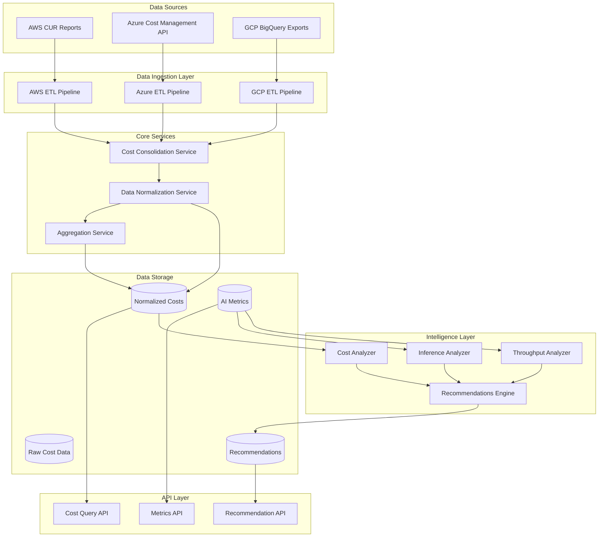

# AI Cost Management - Backend Implementation Guide

## Overview

The AI Cost Management feature consolidates AI resource costs from multiple cloud providers (AWS, Azure, GCP) and provides intelligent cost optimization recommendations based on throughput, inference metrics, and usage patterns.

## Architecture



## Database Schema

### Table: `ai_resources`

Stores information about AI resources across cloud providers.

```sql
CREATE TABLE ai_resources (
    id UUID PRIMARY KEY DEFAULT gen_random_uuid(),
    resource_id VARCHAR(255) NOT NULL,
    resource_name VARCHAR(255) NOT NULL,
    cloud_provider VARCHAR(50) NOT NULL, -- 'AWS', 'Azure', 'GCP'
    service_type VARCHAR(100) NOT NULL, -- 'SageMaker', 'Bedrock', 'Azure ML', 'Vertex AI'
    resource_type VARCHAR(100) NOT NULL, -- 'endpoint', 'training-job', 'batch-transform'
    region VARCHAR(100) NOT NULL,
    account_id VARCHAR(100) NOT NULL,
    tags JSONB,
    created_at TIMESTAMP DEFAULT CURRENT_TIMESTAMP,
    updated_at TIMESTAMP DEFAULT CURRENT_TIMESTAMP,
    is_active BOOLEAN DEFAULT true,
    
    CONSTRAINT unique_resource UNIQUE (cloud_provider, account_id, resource_id)
);

CREATE INDEX idx_ai_resources_provider ON ai_resources(cloud_provider);
CREATE INDEX idx_ai_resources_service ON ai_resources(service_type);
CREATE INDEX idx_ai_resources_account ON ai_resources(account_id);
```

### Table: `ai_costs`

Stores normalized cost data from all cloud providers.

```sql
CREATE TABLE ai_costs (
    id UUID PRIMARY KEY DEFAULT gen_random_uuid(),
    resource_id UUID REFERENCES ai_resources(id),
    cloud_provider VARCHAR(50) NOT NULL,
    cost_date DATE NOT NULL,
    cost_amount DECIMAL(15, 6) NOT NULL,
    currency VARCHAR(10) DEFAULT 'USD',
    usage_quantity DECIMAL(15, 6),
    usage_unit VARCHAR(50),
    pricing_model VARCHAR(50), -- 'on-demand', 'reserved', 'spot', 'savings-plan'
    cost_category VARCHAR(100), -- 'compute', 'storage', 'inference', 'training'
    raw_data JSONB,
    created_at TIMESTAMP DEFAULT CURRENT_TIMESTAMP,
    
    CONSTRAINT unique_cost_entry UNIQUE (resource_id, cost_date, cost_category)
);

CREATE INDEX idx_ai_costs_resource ON ai_costs(resource_id);
CREATE INDEX idx_ai_costs_date ON ai_costs(cost_date);
CREATE INDEX idx_ai_costs_provider ON ai_costs(cloud_provider);
CREATE INDEX idx_ai_costs_category ON ai_costs(cost_category);
```

### Table: `ai_metrics`

Stores performance metrics for AI workloads.

```sql
CREATE TABLE ai_metrics (
    id UUID PRIMARY KEY DEFAULT gen_random_uuid(),
    resource_id UUID REFERENCES ai_resources(id),
    metric_date TIMESTAMP NOT NULL,
    throughput_rps DECIMAL(15, 6), -- Requests per second
    inference_latency_ms DECIMAL(15, 6), -- Average latency
    inference_count BIGINT,
    tokens_processed BIGINT,
    model_size_gb DECIMAL(10, 3),
    gpu_utilization_percent DECIMAL(5, 2),
    cpu_utilization_percent DECIMAL(5, 2),
    memory_utilization_percent DECIMAL(5, 2),
    error_rate_percent DECIMAL(5, 2),
    raw_metrics JSONB,
    created_at TIMESTAMP DEFAULT CURRENT_TIMESTAMP
);

CREATE INDEX idx_ai_metrics_resource ON ai_metrics(resource_id);
CREATE INDEX idx_ai_metrics_date ON ai_metrics(metric_date);
```

### Table: `cost_recommendations`

Stores AI-generated cost optimization recommendations.

```sql
CREATE TABLE cost_recommendations (
    id UUID PRIMARY KEY DEFAULT gen_random_uuid(),
    resource_id UUID REFERENCES ai_resources(id),
    recommendation_type VARCHAR(100) NOT NULL, -- 'rightsizing', 'pricing-model', 'scheduling', 'autoscaling'
    recommendation_title VARCHAR(255) NOT NULL,
    recommendation_description TEXT NOT NULL,
    current_cost_monthly DECIMAL(15, 6),
    estimated_savings_monthly DECIMAL(15, 6),
    savings_percent DECIMAL(5, 2),
    confidence_score DECIMAL(3, 2), -- 0.00 to 1.00
    priority VARCHAR(20), -- 'critical', 'high', 'medium', 'low'
    implementation_effort VARCHAR(20), -- 'low', 'medium', 'high'
    recommended_action JSONB, -- Specific actions to take
    supporting_data JSONB,
    status VARCHAR(50) DEFAULT 'pending', -- 'pending', 'accepted', 'rejected', 'implemented'
    created_at TIMESTAMP DEFAULT CURRENT_TIMESTAMP,
    updated_at TIMESTAMP DEFAULT CURRENT_TIMESTAMP,
    expires_at TIMESTAMP
);

CREATE INDEX idx_recommendations_resource ON cost_recommendations(resource_id);
CREATE INDEX idx_recommendations_type ON cost_recommendations(recommendation_type);
CREATE INDEX idx_recommendations_priority ON cost_recommendations(priority);
CREATE INDEX idx_recommendations_status ON cost_recommendations(status);
```

## Data Consolidation Service

### AWS CUR Integration

```python
# services/etl/aws_cur_processor.py
import boto3
import pandas as pd
from datetime import datetime, timedelta

class AWSCURProcessor:
    """Process AWS Cost and Usage Reports for AI services"""
    
    AI_SERVICES = [
        'AmazonSageMaker',
        'AmazonBedrock',
        'AmazonRekognition',
        'AmazonComprehend',
        'AmazonTranscribe',
        'AmazonPolly',
        'AmazonLex'
    ]
    
    def __init__(self, s3_bucket, s3_prefix):
        self.s3_client = boto3.client('s3')
        self.bucket = s3_bucket
        self.prefix = s3_prefix
    
    def fetch_cur_data(self, start_date, end_date):
        """Fetch CUR data from S3 and filter for AI services"""
        
        # Download CUR files from S3
        cur_files = self._list_cur_files(start_date, end_date)
        
        ai_costs = []
        for cur_file in cur_files:
            df = self._read_cur_file(cur_file)
            ai_df = df[df['line_item_product_code'].isin(self.AI_SERVICES)]
            ai_costs.append(ai_df)
        
        return pd.concat(ai_costs, ignore_index=True)
    
    def normalize_to_schema(self, cur_df):
        """Normalize AWS CUR data to our schema"""
        
        normalized = []
        for _, row in cur_df.iterrows():
            normalized.append({
                'resource_id': row['line_item_resource_id'],
                'resource_name': self._extract_resource_name(row),
                'cloud_provider': 'AWS',
                'service_type': row['line_item_product_code'],
                'resource_type': self._map_resource_type(row),
                'region': row['product_region'],
                'account_id': row['line_item_usage_account_id'],
                'cost_date': row['line_item_usage_start_date'].date(),
                'cost_amount': float(row['line_item_blended_cost']),
                'currency': row['line_item_currency_code'],
                'usage_quantity': float(row['line_item_usage_amount']),
                'usage_unit': row['pricing_unit'],
                'pricing_model': self._map_pricing_model(row),
                'cost_category': self._categorize_cost(row),
                'tags': self._extract_tags(row)
            })
        
        return normalized
    
    def _map_resource_type(self, row):
        """Map AWS resource types to our taxonomy"""
        product_code = row['line_item_product_code']
        usage_type = row.get('line_item_usage_type', '')
        
        if product_code == 'AmazonSageMaker':
            if 'Endpoint' in usage_type:
                return 'endpoint'
            elif 'Training' in usage_type:
                return 'training-job'
            elif 'Transform' in usage_type:
                return 'batch-transform'
            elif 'Notebook' in usage_type:
                return 'notebook'
        
        return 'other'
    
    def _categorize_cost(self, row):
        """Categorize cost type"""
        usage_type = row.get('line_item_usage_type', '').lower()
        
        if any(x in usage_type for x in ['compute', 'instance', 'endpoint']):
            return 'compute'
        elif any(x in usage_type for x in ['storage', 's3', 'ebs']):
            return 'storage'
        elif 'training' in usage_type:
            return 'training'
        elif 'inference' in usage_type:
            return 'inference'
        else:
            return 'other'
```

### Azure Cost Management Integration

```python
# services/etl/azure_cost_processor.py
from azure.identity import DefaultAzureCredential
from azure.mgmt.costmanagement import CostManagementClient
from datetime import datetime, timedelta

class AzureCostProcessor:
    """Process Azure Cost Management data for AI services"""
    
    AI_SERVICES = [
        'Microsoft.MachineLearningServices',
        'Microsoft.CognitiveServices',
        'Microsoft.BotService'
    ]
    
    def __init__(self, subscription_id):
        self.credential = DefaultAzureCredential()
        self.client = CostManagementClient(self.credential)
        self.subscription_id = subscription_id
    
    def fetch_cost_data(self, start_date, end_date):
        """Fetch Azure cost data using Cost Management API"""
        
        scope = f"/subscriptions/{self.subscription_id}"
        
        query = {
            "type": "Usage",
            "timeframe": "Custom",
            "timePeriod": {
                "from": start_date.isoformat(),
                "to": end_date.isoformat()
            },
            "dataset": {
                "granularity": "Daily",
                "aggregation": {
                    "totalCost": {"name": "Cost", "function": "Sum"}
                },
                "grouping": [
                    {"type": "Dimension", "name": "ResourceId"},
                    {"type": "Dimension", "name": "ResourceType"},
                    {"type": "Dimension", "name": "ServiceName"},
                    {"type": "Dimension", "name": "MeterCategory"}
                ],
                "filter": {
                    "dimensions": {
                        "name": "ServiceName",
                        "operator": "In",
                        "values": self.AI_SERVICES
                    }
                }
            }
        }
        
        result = self.client.query.usage(scope, query)
        return self._parse_azure_response(result)
    
    def normalize_to_schema(self, azure_data):
        """Normalize Azure cost data to our schema"""
        
        normalized = []
        for item in azure_data:
            normalized.append({
                'resource_id': item['resource_id'],
                'resource_name': self._extract_resource_name(item['resource_id']),
                'cloud_provider': 'Azure',
                'service_type': item['service_name'],
                'resource_type': self._map_resource_type(item),
                'region': self._extract_region(item['resource_id']),
                'account_id': self.subscription_id,
                'cost_date': item['usage_date'],
                'cost_amount': float(item['cost']),
                'currency': item.get('currency', 'USD'),
                'usage_quantity': item.get('quantity'),
                'usage_unit': item.get('unit_of_measure'),
                'pricing_model': self._map_pricing_model(item),
                'cost_category': self._categorize_cost(item),
                'tags': item.get('tags', {})
            })
        
        return normalized
```

### GCP BigQuery Integration

```python
# services/etl/gcp_bigquery_processor.py
from google.cloud import bigquery
from datetime import datetime, timedelta

class GCPBigQueryProcessor:
    """Process GCP BigQuery billing exports for AI services"""
    
    AI_SERVICES = [
        'Vertex AI',
        'Cloud AI',
        'Cloud Machine Learning',
        'Cloud Natural Language',
        'Cloud Vision',
        'Cloud Speech-to-Text',
        'Cloud Text-to-Speech'
    ]
    
    def __init__(self, project_id, dataset_id, table_id):
        self.client = bigquery.Client(project=project_id)
        self.table_ref = f"{project_id}.{dataset_id}.{table_id}"
    
    def fetch_cost_data(self, start_date, end_date):
        """Fetch GCP cost data from BigQuery"""
        
        query = f"""
        SELECT
            project.id as project_id,
            service.description as service_name,
            sku.description as sku_description,
            usage_start_time,
            usage_end_time,
            cost,
            currency,
            usage.amount as usage_amount,
            usage.unit as usage_unit,
            usage.pricing_model,
            labels,
            resource.name as resource_name,
            resource.global_name as resource_id,
            location.region as region
        FROM `{self.table_ref}`
        WHERE DATE(usage_start_time) BETWEEN @start_date AND @end_date
            AND service.description IN UNNEST(@ai_services)
        """
        
        job_config = bigquery.QueryJobConfig(
            query_parameters=[
                bigquery.ScalarQueryParameter("start_date", "DATE", start_date),
                bigquery.ScalarQueryParameter("end_date", "DATE", end_date),
                bigquery.ArrayQueryParameter("ai_services", "STRING", self.AI_SERVICES)
            ]
        )
        
        results = self.client.query(query, job_config=job_config)
        return [dict(row) for row in results]
    
    def normalize_to_schema(self, gcp_data):
        """Normalize GCP BigQuery data to our schema"""
        
        normalized = []
        for item in gcp_data:
            normalized.append({
                'resource_id': item['resource_id'] or f"gcp-{item['project_id']}-{item['sku_description']}",
                'resource_name': item['resource_name'] or item['sku_description'],
                'cloud_provider': 'GCP',
                'service_type': item['service_name'],
                'resource_type': self._map_resource_type(item),
                'region': item['region'] or 'global',
                'account_id': item['project_id'],
                'cost_date': item['usage_start_time'].date(),
                'cost_amount': float(item['cost']),
                'currency': item['currency'],
                'usage_quantity': item['usage_amount'],
                'usage_unit': item['usage_unit'],
                'pricing_model': item.get('pricing_model', 'on-demand'),
                'cost_category': self._categorize_cost(item),
                'tags': item.get('labels', {})
            })
        
        return normalized
```

## API Endpoints

### Cost Query API

```python
# api/routes/costs.py
from fastapi import APIRouter, Query, Depends
from typing import List, Optional
from datetime import date, datetime, timedelta
from pydantic import BaseModel

router = APIRouter(prefix="/api/v1/ai-costs", tags=["AI Costs"])

class CostSummary(BaseModel):
    total_cost: float
    currency: str
    period_start: date
    period_end: date
    breakdown_by_provider: dict
    breakdown_by_service: dict
    breakdown_by_category: dict

class CostTrend(BaseModel):
    date: date
    cost: float
    provider: str

@router.get("/summary", response_model=CostSummary)
async def get_cost_summary(
    start_date: date = Query(..., description="Start date for cost analysis"),
    end_date: date = Query(..., description="End date for cost analysis"),
    cloud_provider: Optional[List[str]] = Query(None, description="Filter by cloud provider"),
    service_type: Optional[List[str]] = Query(None, description="Filter by service type"),
    account_id: Optional[List[str]] = Query(None, description="Filter by account"),
):
    """Get aggregated cost summary for AI resources"""
    
    # Build query filters
    filters = {
        'start_date': start_date,
        'end_date': end_date
    }
    if cloud_provider:
        filters['cloud_provider'] = cloud_provider
    if service_type:
        filters['service_type'] = service_type
    if account_id:
        filters['account_id'] = account_id
    
    # Query database
    cost_data = await db.get_aggregated_costs(filters)
    
    return CostSummary(
        total_cost=cost_data['total'],
        currency='USD',
        period_start=start_date,
        period_end=end_date,
        breakdown_by_provider=cost_data['by_provider'],
        breakdown_by_service=cost_data['by_service'],
        breakdown_by_category=cost_data['by_category']
    )

@router.get("/trends", response_model=List[CostTrend])
async def get_cost_trends(
    start_date: date,
    end_date: date,
    granularity: str = Query("daily", regex="^(daily|weekly|monthly)$"),
    cloud_provider: Optional[List[str]] = None,
):
    """Get cost trends over time"""
    
    trends = await db.get_cost_trends(
        start_date=start_date,
        end_date=end_date,
        granularity=granularity,
        providers=cloud_provider
    )
    
    return trends

@router.get("/resources/{resource_id}/costs")
async def get_resource_costs(
    resource_id: str,
    start_date: date,
    end_date: date
):
    """Get detailed cost breakdown for a specific resource"""
    
    resource_costs = await db.get_resource_costs(
        resource_id=resource_id,
        start_date=start_date,
        end_date=end_date
    )
    
    return resource_costs
```

### Recommendations API

```python
# api/routes/recommendations.py
from fastapi import APIRouter, Query
from typing import List, Optional
from pydantic import BaseModel

router = APIRouter(prefix="/api/v1/recommendations", tags=["Recommendations"])

class Recommendation(BaseModel):
    id: str
    resource_id: str
    resource_name: str
    cloud_provider: str
    recommendation_type: str
    title: str
    description: str
    current_monthly_cost: float
    estimated_monthly_savings: float
    savings_percent: float
    confidence_score: float
    priority: str
    implementation_effort: str
    recommended_action: dict
    supporting_data: dict
    created_at: datetime

@router.get("/", response_model=List[Recommendation])
async def get_recommendations(
    cloud_provider: Optional[List[str]] = None,
    recommendation_type: Optional[List[str]] = None,
    priority: Optional[List[str]] = None,
    min_savings: Optional[float] = Query(None, description="Minimum monthly savings"),
    status: str = Query("pending", description="Recommendation status")
):
    """Get cost optimization recommendations"""
    
    filters = {'status': status}
    if cloud_provider:
        filters['cloud_provider'] = cloud_provider
    if recommendation_type:
        filters['recommendation_type'] = recommendation_type
    if priority:
        filters['priority'] = priority
    if min_savings:
        filters['min_savings'] = min_savings
    
    recommendations = await db.get_recommendations(filters)
    return recommendations

@router.get("/{recommendation_id}", response_model=Recommendation)
async def get_recommendation(recommendation_id: str):
    """Get detailed information for a specific recommendation"""
    
    recommendation = await db.get_recommendation_by_id(recommendation_id)
    return recommendation

@router.post("/{recommendation_id}/accept")
async def accept_recommendation(recommendation_id: str):
    """Mark recommendation as accepted"""
    
    await db.update_recommendation_status(recommendation_id, 'accepted')
    return {"status": "success", "message": "Recommendation accepted"}

@router.post("/{recommendation_id}/reject")
async def reject_recommendation(recommendation_id: str, reason: Optional[str] = None):
    """Mark recommendation as rejected"""
    
    await db.update_recommendation_status(recommendation_id, 'rejected', reason)
    return {"status": "success", "message": "Recommendation rejected"}
```

## Recommendations Engine

```python
# services/recommendations/engine.py
from typing import List, Dict
import numpy as np
from datetime import datetime, timedelta

class RecommendationEngine:
    """Generate intelligent cost optimization recommendations"""
    
    def __init__(self, db_service, metrics_service):
        self.db = db_service
        self.metrics = metrics_service
    
    async def generate_recommendations(self, resource_id: str) -> List[Dict]:
        """Generate all applicable recommendations for a resource"""
        
        recommendations = []
        
        # Fetch resource data
        resource = await self.db.get_resource(resource_id)
        costs = await self.db.get_resource_costs(resource_id, days=30)
        metrics = await self.metrics.get_resource_metrics(resource_id, days=30)
        
        # Run recommendation analyzers
        recommendations.extend(await self._check_rightsizing(resource, metrics))
        recommendations.extend(await self._check_pricing_optimization(resource, costs))
        recommendations.extend(await self._check_scheduling(resource, metrics))
        recommendations.extend(await self._check_autoscaling(resource, metrics))
        recommendations.extend(await self._check_underutilization(resource, metrics))
        
        return recommendations
    
    async def _check_rightsizing(self, resource, metrics) -> List[Dict]:
        """Check if resource is over-provisioned"""
        
        recommendations = []
        
        if not metrics:
            return recommendations
        
        # Calculate average utilization
        avg_gpu_util = np.mean([m['gpu_utilization_percent'] for m in metrics if m.get('gpu_utilization_percent')])
        avg_cpu_util = np.mean([m['cpu_utilization_percent'] for m in metrics])
        avg_mem_util = np.mean([m['memory_utilization_percent'] for m in metrics])
        
        # Check for underutilization
        if resource['service_type'] in ['AmazonSageMaker', 'Vertex AI'] and resource['resource_type'] == 'endpoint':
            if avg_gpu_util < 30:  # GPU utilization below 30%
                
                current_cost = await self._calculate_monthly_cost(resource['id'])
                estimated_savings = current_cost * 0.4  # Estimate 40% savings
                
                recommendations.append({
                    'resource_id': resource['id'],
                    'recommendation_type': 'rightsizing',
                    'recommendation_title': 'Downsize Inference Endpoint',
                    'recommendation_description': f"GPU utilization is only {avg_gpu_util:.1f}%. Consider using a smaller instance type to reduce costs.",
                    'current_cost_monthly': current_cost,
                    'estimated_savings_monthly': estimated_savings,
                    'savings_percent': (estimated_savings / current_cost) * 100,
                    'confidence_score': 0.85,
                    'priority': 'high',
                    'implementation_effort': 'medium',
                    'recommended_action': {
                        'action': 'downsize_instance',
                        'current_instance': self._get_instance_type(resource),
                        'recommended_instance': self._suggest_smaller_instance(resource, avg_gpu_util),
                        'steps': [
                            'Create new endpoint with smaller instance type',
                            'Test thoroughly with production traffic',
                            'Graduallyshift traffic using canary deployment',
                            'Monitor performance for 48 hours',
                            'Decommission old endpoint'
                        ]
                    },
                    'supporting_data': {
                        'avg_gpu_utilization': avg_gpu_util,
                        'avg_cpu_utilization': avg_cpu_util,
                        'avg_memory_utilization': avg_mem_util,
                        'analysis_period_days': 30
                    }
                })
        
        return recommendations
    
    async def _check_pricing_optimization(self, resource, costs) -> List[Dict]:
        """Check for pricing model optimization opportunities"""
        
        recommendations = []
        
        # Calculate usage patterns
        daily_costs = self._group_by_day(costs)
        avg_daily_cost = np.mean([c['cost'] for c in daily_costs])
        cost_variance = np.std([c['cost'] for c in daily_costs])
        
        # Check if currently on-demand and usage is consistent
        current_pricing = self._get_current_pricing_model(costs)
        
        if current_pricing == 'on-demand' and cost_variance < (avg_daily_cost * 0.3):
            # Low variance = good candidate for commitment
            
            current_monthly_cost = avg_daily_cost * 30
            
            if resource['cloud_provider'] == 'AWS':
                # Suggest Savings Plan or Reserved Instance
                savings_plan_discount = 0.35  # 35% typical savings
                estimated_savings = current_monthly_cost * savings_plan_discount
                
                recommendations.append({
                    'resource_id': resource['id'],
                    'recommendation_type': 'pricing-model',
                    'recommendation_title': 'Switch to Savings Plan',
                    'recommendation_description': 'Consistent usage detected. A 1-year Savings Plan could reduce costs by ~35%.',
                    'current_cost_monthly': current_monthly_cost,
                    'estimated_savings_monthly': estimated_savings,
                    'savings_percent': savings_plan_discount * 100,
                    'confidence_score': 0.90,
                    'priority': 'high',
                    'implementation_effort': 'low',
                    'recommended_action': {
                        'action': 'purchase_savings_plan',
                        'plan_type': 'compute_savings_plan',
                        'commitment_term': '1_year',
                        'payment_option': 'no_upfront',
                        'hourly_commitment': avg_daily_cost / 24,
                        'steps': [
                            'Review historical usage in AWS Cost Explorer',
                            'Purchase Compute Savings Plan through AWS Console',
                            'Monitor savings realization in billing dashboard'
                        ]
                    },
                    'supporting_data': {
                        'avg_daily_cost': avg_daily_cost,
                        'cost_variance': cost_variance,
                        'consistency_score': 1 - (cost_variance / avg_daily_cost),
                        'analysis_period_days': len(daily_costs)
                    }
                })
        
        return recommendations
    
    async def _check_scheduling(self, resource, metrics) -> List[Dict]:
        """Check if resource can be scheduled (turned off during off-hours)"""
        
        recommendations = []
        
        if resource['resource_type'] not in ['endpoint', 'notebook']:
            return recommendations
        
        # Analyze hourly usage patterns
        hourly_usage = self._group_by_hour(metrics)
        
        # Identify off-peak hours (low throughput/inference)
        off_peak_hours = []
        for hour, data in hourly_usage.items():
            avg_throughput = np.mean([d.get('throughput_rps', 0) for d in data])
            if avg_throughput < 0.1:  # Less than 0.1 requests per second
                off_peak_hours.append(hour)
        
        if len(off_peak_hours) >= 8:  # At least 8 hours of low usage
            
            current_monthly_cost = await self._calculate_monthly_cost(resource['id'])
            hours_to_save = len(off_peak_hours)
            estimated_savings = current_monthly_cost * (hours_to_save / 24)
            
            recommendations.append({
                'resource_id': resource['id'],
                'recommendation_type': 'scheduling',
                'recommendation_title': 'Implement Auto-Scheduling',
                'recommendation_description': f'Resource shows low usage during {hours_to_save} hours per day. Auto-scheduling can save ~{(hours_to_save/24)*100:.0f}% of costs.',
                'current_cost_monthly': current_monthly_cost,
                'estimated_savings_monthly': estimated_savings,
                'savings_percent': (estimated_savings / current_monthly_cost) * 100,
                'confidence_score': 0.75,
                'priority': 'medium',
                'implementation_effort': 'medium',
                'recommended_action': {
                    'action': 'implement_scheduling',
                    'schedule': {
                        'shutdown_hours': sorted(off_peak_hours),
                        'timezone': 'UTC'
                    },
                    'steps': [
                        'Create EventBridge/Cloud Scheduler rules for shutdown',
                        'Create EventBridge/Cloud Scheduler rules for startup',
                        'Implement graceful shutdown handling',
                        'Test schedule in non-production environment',
                        'Enable monitoring for scheduled events'
                    ]
                },
                'supporting_data': {
                    'off_peak_hours': off_peak_hours,
                    'avg_throughput_by_hour': {h: np.mean([d.get('throughput_rps', 0) for d in data]) 
                                                for h, data in hourly_usage.items()}
                }
            })
        
        return recommendations
    
    async def _check_autoscaling(self, resource, metrics) -> List[Dict]:
        """Check if autoscaling configuration is optimal"""
        
        recommendations = []
        
        if resource['resource_type'] != 'endpoint':
            return recommendations
        
        # Analyze throughput variability
        throughput_data = [m.get('throughput_rps', 0) for m in metrics]
        peak_throughput = np.percentile(throughput_data, 95)
        avg_throughput = np.mean(throughput_data)
        min_throughput = np.percentile(throughput_data, 5)
        
        # High variability = good candidate for autoscaling
        if peak_throughput > (avg_throughput * 3):
            
            current_monthly_cost = await self._calculate_monthly_cost(resource['id'])
            
            # Estimate savings from scaling down during low usage
            estimated_savings = current_monthly_cost * 0.25  # Estimate 25% savings
            
            recommendations.append({
                'resource_id': resource['id'],
                'recommendation_type': 'autoscaling',
                'recommendation_title': 'Enable Autoscaling',
                'recommendation_description': 'High throughput variability detected. Autoscaling can optimize costs by scaling based on demand.',
                'current_cost_monthly': current_monthly_cost,
                'estimated_savings_monthly': estimated_savings,
                'savings_percent': 25,
                'confidence_score': 0.80,
                'priority': 'medium',
                'implementation_effort': 'high',
                'recommended_action': {
                    'action': 'configure_autoscaling',
                    'configuration': {
                        'min_instances': 1,
                        'max_instances': self._calculate_max_instances(peak_throughput),
                        'target_metric': 'invocations_per_instance',
                        'target_value': 1000,
                        'scale_in_cooldown': 300,
                        'scale_out_cooldown': 60
                    },
                    'steps': [
                        'Define scaling policy based on invocation metrics',
                        'Configure Application Auto Scaling',
                        'Set appropriate min/max instance bounds',
                        'Test scaling behavior with load testing',
                        'Monitor for oscillation or slow scaling'
                    ]
                },
                'supporting_data': {
                    'peak_throughput_rps': peak_throughput,
                    'avg_throughput_rps': avg_throughput,
                    'min_throughput_rps': min_throughput,
                    'variability_ratio': peak_throughput / avg_throughput
                }
            })
        
        return recommendations
    
    async def _check_underutilization(self, resource, metrics) -> List[Dict]:
        """Check for severely underutilized or idle resources"""
        
        recommendations = []
        
        if not metrics:
            return recommendations
        
        # Check for near-zero activity
        recent_metrics = metrics[-7:]  # Last 7 days
        avg_throughput = np.mean([m.get('throughput_rps', 0) for m in recent_metrics])
        total_inferences = sum([m.get('inference_count', 0) for m in recent_metrics])
        
        if avg_throughput < 0.01 and total_inferences < 100:  # Virtually no usage
            
            current_monthly_cost = await self._calculate_monthly_cost(resource['id'])
            
            recommendations.append({
                'resource_id': resource['id'],
                'recommendation_type': 'decommission',
                'recommendation_title': 'Consider Decommissioning',
                'recommendation_description': 'Resource shows virtually no usage over the past week. Consider decommissioning to eliminate costs entirely.',
                'current_cost_monthly': current_monthly_cost,
                'estimated_savings_monthly': current_monthly_cost,
                'savings_percent': 100,
                'confidence_score': 0.70,
                'priority': 'critical',
                'implementation_effort': 'low',
                'recommended_action': {
                    'action': 'decommission_resource',
                    'steps': [
                        'Verify resource is not used by any applications',
                        'Check with resource owner/team',
                        'Take snapshot/backup if needed',
                        'Delete the resource',
                        'Remove from monitoring and alerting'
                    ]
                },
                'supporting_data': {
                    'avg_throughput_last_7_days': avg_throughput,
                    'total_inferences_last_7_days': total_inferences,
                    'days_analyzed': len(recent_metrics)
                }
            })
        
        return recommendations
```

## Integration Example

```python
# main.py - Orchestration
from fastapi import FastAPI
from services.etl.aws_cur_processor import AWSCURProcessor
from services.etl.azure_cost_processor import AzureCostProcessor
from services.etl.gcp_bigquery_processor import GCPBigQueryProcessor
from services.recommendations.engine import RecommendationEngine
from api.routes import costs, recommendations

app = FastAPI(title="CloudTuner AI Cost Management API")

# Include routers
app.include_router(costs.router)
app.include_router(recommendations.router)

# Background job for ETL and recommendations
async def daily_etl_job():
    """Run daily to consolidate costs and generate recommendations"""
    
    from datetime import datetime, timedelta
    
    end_date = datetime.now().date()
    start_date = end_date - timedelta(days=1)
    
    # Process AWS
    aws_processor = AWSCURProcessor(
        s3_bucket=config.AWS_CUR_BUCKET,
        s3_prefix=config.AWS_CUR_PREFIX
    )
    aws_data = aws_processor.fetch_cur_data(start_date, end_date)
    aws_normalized = aws_processor.normalize_to_schema(aws_data)
    await db.upsert_costs(aws_normalized)
    
    # Process Azure
    azure_processor = AzureCostProcessor(config.AZURE_SUBSCRIPTION_ID)
    azure_data = azure_processor.fetch_cost_data(start_date, end_date)
    azure_normalized = azure_processor.normalize_to_schema(azure_data)
    await db.upsert_costs(azure_normalized)
    
    # Process GCP
    gcp_processor = GCPBigQueryProcessor(
        project_id=config.GCP_PROJECT_ID,
        dataset_id=config.GCP_DATASET_ID,
        table_id=config.GCP_TABLE_ID
    )
    gcp_data = gcp_processor.fetch_cost_data(start_date, end_date)
    gcp_normalized = gcp_processor.normalize_to_schema(gcp_data)
    await db.upsert_costs(gcp_normalized)
    
    # Generate recommendations for all active resources
    recommendation_engine = RecommendationEngine(db, metrics_service)
    active_resources = await db.get_active_resources()
    
    for resource in active_resources:
        recommendations = await recommendation_engine.generate_recommendations(resource['id'])
        await db.save_recommendations(recommendations)
