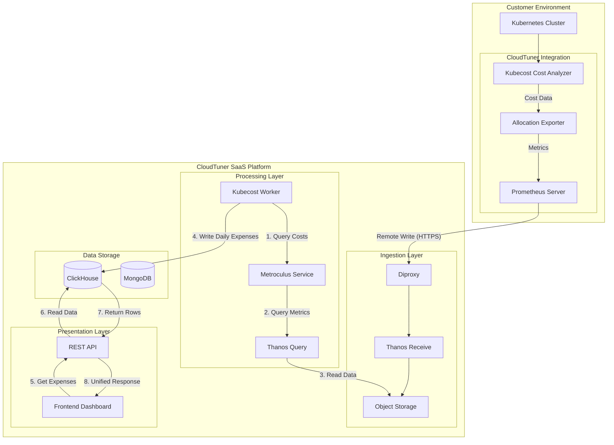
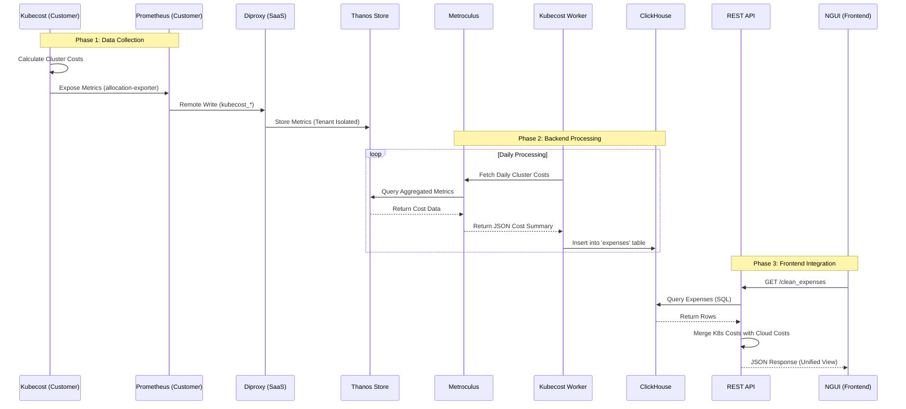
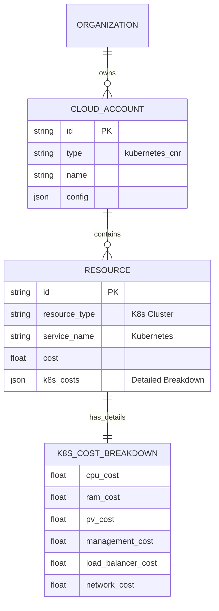

# Kubernetes Stack Architecture Diagrams

## 1. High-Level Integration Architecture

This diagram illustrates how the customer's Kubernetes cluster integrates with the CloudTuner SaaS platform.



## 2. Detailed Data Flow & Processing Pipeline

This diagram details the specific components and data transformations from metric collection to API response.



## 3. Data Source Architecture (Handover)

Based on the ASCII diagram from the frontend handover documentation.

```mermaid
graph TD
    subgraph "Customer Cluster"
        KC[Kubecost]
        Prom[Prometheus remote_write]
    end

    subgraph "CloudTuner SaaS"
        DP[diproxy<br>(Receiver)]
        Thanos[Thanos<br>(Long-term Storage)]
        Metro[Metroculus<br>(Query & Aggregate)]
        Worker[kubecost_worker<br>(Transform & Write)]
        CH[(ClickHouse<br>expenses table)]
        API[REST API<br>/v2/clean_expenses]
        UI[NGUI<br>Frontend]
    end

    KC -->|kubecost_* metrics| Prom
    Prom --> DP
    DP --> Thanos
    Thanos --> Metro
    Metro -->|Cost Data| Worker
    Worker -->|Daily expense records| CH
    CH --> API
    API --> UI
```

## 4. Entity Relationship Diagram (Schema)

Illustrating how Kubernetes entities map to CloudTuner's data model.


