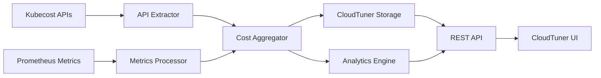

# Kubecost Data Extraction and Processing Components Design

## Overview
This document outlines the design for extracting cost and allocation data from Kubecost and integrating it with CloudTuner's cost analytics platform.

## Architecture

### 1. Data Sources
- **Prometheus Metrics**: Real-time metrics already flowing to CloudTuner via diproxy
- **Kubecost APIs**: Historical allocation and asset cost data
- **Kubernetes API**: Resource metadata and configuration

### 2. Data Extraction Components

#### A. Kubecost API Extractor (`kubecost-extractor`)
**Purpose**: Extracts detailed cost allocation and asset data from Kubecost APIs
**Schedule**: Hourly for allocation data, daily for asset summaries

**Key APIs**:
- `/model/allocation` - Pod/namespace cost allocation
- `/model/assets` - Infrastructure asset costs
- `/model/budget` - Budget utilization data
- `/model/predict` - Cost forecasting data

**Data Structure**:
```json
{
  "timestamp": "2025-09-10T08:00:00Z",
  "cluster": "minikube-test-cluster",
  "window": "1h",
  "allocations": [
    {
      "namespace": "default",
      "pod": "restapi-xxx",
      "cpuCost": 0.05,
      "ramCost": 0.02,
      "networkCost": 0.001,
      "pvCost": 0.01,
      "totalCost": 0.081
    }
  ],
  "assets": [
    {
      "type": "Node",
      "name": "minikube",
      "cpuCores": 2,
      "ramGB": 8,
      "totalCost": 0.50
    }
  ]
}
```

#### B. Metrics Processor (`metrics-processor`)
**Purpose**: Processes Prometheus metrics from Kubecost for real-time analytics
**Schedule**: Continuous streaming

**Key Metrics**:
- `kubecost_cluster_cpu_usage`
- `kubecost_cluster_memory_usage`
- `kubecost_network_usage`
- `kubecost_storage_usage`

#### C. Cost Aggregator (`cost-aggregator`)
**Purpose**: Aggregates and normalizes cost data for CloudTuner analytics
**Schedule**: Every 15 minutes

**Functions**:
- Merge API data with metrics data
- Apply cost allocation rules
- Generate hourly/daily/monthly summaries
- Calculate cost trends and anomalies

### 3. Data Processing Pipeline



### 4. Storage Strategy

#### InfluxDB Schema
```sql
-- Cost allocation measurements
CREATE TABLE cost_allocations (
  time TIMESTAMP,
  cluster STRING,
  namespace STRING,
  pod STRING,
  cpu_cost FLOAT,
  memory_cost FLOAT,
  network_cost FLOAT,
  storage_cost FLOAT,
  total_cost FLOAT,
  tags (resource_type, owner, team)
);

-- Asset cost measurements
CREATE TABLE asset_costs (
  time TIMESTAMP,
  cluster STRING,
  asset_type STRING,
  asset_name STRING,
  cpu_cores FLOAT,
  memory_gb FLOAT,
  storage_gb FLOAT,
  total_cost FLOAT,
  tags (node_type, zone, instance_type)
);
```

#### ClickHouse Schema
```sql
-- Aggregated cost summaries
CREATE TABLE cost_summaries (
  timestamp DateTime,
  cluster String,
  namespace String,
  window_duration String,
  total_cost Float64,
  cpu_cost Float64,
  memory_cost Float64,
  network_cost Float64,
  storage_cost Float64,
  efficiency_score Float64
) ENGINE = MergeTree()
ORDER BY (timestamp, cluster, namespace);
```

### 5. API Integration Points

#### CloudTuner Cost API Extensions
- `GET /api/v1/costs/kubernetes/{cluster}`
- `GET /api/v1/costs/kubernetes/{cluster}/namespaces`
- `GET /api/v1/costs/kubernetes/{cluster}/workloads`
- `GET /api/v1/costs/kubernetes/{cluster}/optimization`

#### Data Flow
1. **Real-time**: Prometheus → diproxy → InfluxDB → Analytics
2. **Batch**: Kubecost APIs → Extractor → Aggregator → ClickHouse → Analytics
3. **Query**: CloudTuner UI → REST API → Storage → Processed Data

### 6. Configuration

#### Extractor Configuration
```yaml
kubecost:
  endpoint: "http://kubecost-cost-analyzer.kubecost.svc.cluster.local:9090"
  apis:
    allocation:
      enabled: true
      window: "1h"
      aggregate: ["cluster", "namespace", "pod"]
    assets:
      enabled: true
      window: "1d"
      aggregate: ["cluster"]
  
cloudtuner:
  storage:
    influxdb: "http://influxdb.default.svc.cluster.local"
    clickhouse: "http://clickhouse.default.svc.cluster.local:8123"
  
schedule:
  allocation_sync: "0 */1 * * *"  # Every hour
  asset_sync: "0 0 * * *"         # Daily
  cleanup: "0 2 * * *"            # Daily cleanup at 2 AM
```

### 7. Monitoring and Alerting

#### Metrics to Monitor
- Data extraction success rate
- API response times
- Data freshness (time since last successful sync)
- Cost trend anomalies
- Storage utilization

#### Alerts
- Failed data extraction (>5% failure rate)
- Stale data (>4 hours since last sync)
- Cost spike (>50% increase in 24h)
- Storage capacity (>80% utilization)

### 8. Security Considerations

- Service account with minimal required permissions
- Secure credential management via Kubernetes secrets
- API rate limiting and timeout handling
- Data encryption in transit and at rest
- Audit logging for all cost data access

### 9. Implementation Timeline

**Phase 1 (Week 1-2)**: Basic API Extractor
- Implement kubecost-extractor service
- Basic allocation data extraction
- Storage integration with InfluxDB

**Phase 2 (Week 3-4)**: Metrics Processing
- Implement metrics-processor
- Real-time cost monitoring
- Basic aggregation pipeline

**Phase 3 (Week 5-6)**: Cost Analytics
- Implement cost-aggregator
- Advanced analytics and trends
- CloudTuner API extensions

**Phase 4 (Week 7-8)**: Optimization
- Performance optimization
- Advanced monitoring
- Production deployment

### 10. Success Metrics

- **Data Accuracy**: >99% consistency between Kubecost and CloudTuner
- **Data Freshness**: <5 minutes latency for real-time metrics
- **API Performance**: <200ms response time for cost queries
- **Cost Optimization**: 15-30% cost reduction through insights