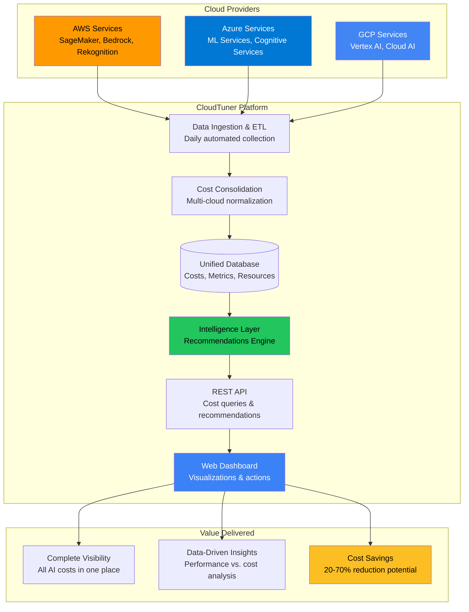
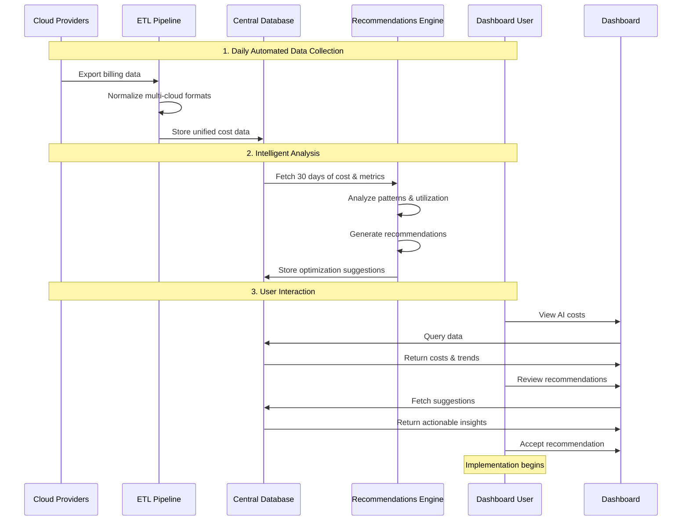

 

## 🎯 What is AI Cost Management?

  

AI Cost Management is CloudTuner.ai's comprehensive solution for tracking, analyzing, and optimizing artificial intelligence infrastructure costs across multiple cloud providers. As organizations increasingly adopt AI/ML services like Amazon SageMaker, Azure Machine Learning, and Google Vertex AI, costs can quickly spiral out of control without proper visibility and optimization.

  

### The Problem We Solve

  

**Organizations face three critical challenges with AI infrastructure costs:**

  

1. **Lack of Visibility**: AI costs are scattered across AWS, Azure, and GCP billing systems, making it impossible to see the complete picture

2. **Complex Pricing Models**: AI services have dozens of pricing tiers, instance types, and commitment options that are difficult to optimize

3. **Resource Inefficiency**: Teams over-provision AI resources "to be safe," leading to 40-70% waste on underutilized infrastructure

  

### Our Solution

  

CloudTuner.ai's AI Cost Management feature provides:

  

- ☁️ **Unified Multi-Cloud Dashboard**: Single view of all AI costs across AWS, Azure, and GCP

- 📊 **Intelligent Analytics**: Correlate costs with performance metrics (throughput, inference latency, GPU utilization)

- 🎯 **AI-Powered Recommendations**: Automated suggestions to reduce costs by 20-70% with minimal effort

- 📈 **Rich Visualizations**: Interactive charts showing trends, breakdowns, and anomalies

- 💡 **Actionable Insights**: Step-by-step guides to implement optimizations safely

  

---

  

## 🏗️ System Architecture

  

### High-Level Architecture

  

  

### How It Works: Data Flow

  

  

---

  

## 💾 Data Sources: Multi-Cloud Integration

  

### AWS - Cost and Usage Reports (CUR)

  

**What We Track:**

- Amazon SageMaker: Inference endpoints, training jobs, notebooks, batch transforms

- Amazon Bedrock: Foundation model API usage (Claude, Titan, etc.)

- Amazon Rekognition, Comprehend, Transcribe, Polly, Lex

  

**How It Works:**

- AWS exports detailed billing data to S3 daily

- We process line-item costs with resource tags

- Includes usage type, instance type, pricing model, region

  

**Example Insight:** "Your production SageMaker endpoint in us-east-1 costs $3,200/month but GPU utilization is only 28%"

  

### Azure - Cost Management API

  

**What We Track:**

- Microsoft Machine Learning Services: Workspaces, compute clusters, endpoints

- Cognitive Services: Azure OpenAI, Computer Vision, Speech Services

- Bot Services: AI-powered chatbots

  

**How It Works:**

- Direct API integration with Azure Cost Management

- Resource-level cost data with tags and metadata

- Daily refresh of cost allocations

  

**Example Insight:** "Your ML workspace in East US has consistent usage patterns - switching to reserved capacity saves 35%"

  

### GCP - BigQuery Billing Exports

  

**What We Track:**

- Vertex AI: Training pipelines, prediction endpoints, AutoML

- Cloud AI Platform: Legacy ML services

- Cloud AI APIs: Natural Language, Vision, Speech-to-Text, Translation

  

**How It Works:**

- GCP exports billing data to BigQuery automatically

- We query SKU-level details with labels

- Includes compute hours, API calls, storage

  

**Example Insight:** "Your Vertex AI endpoint has low usage during nights - auto-scheduling saves $1,000/month"

  

---

  

## 🤖 Intelligent Recommendations Engine

  

### How Recommendations Are Generated

  

The recommendations engine is the brain of our AI Cost Management feature. Here's how it works:

  

1. **Data Collection**: Pulls 30 days of cost data and performance metrics

2. **Pattern Analysis**: Uses algorithms to detect underutilization, overprovisioning, and inefficient pricing

3. **Recommendation Generation**: Creates specific, actionable suggestions

4. **Confidence Scoring**: Rates each recommendation based on data quality (0-100%)

5. **Prioritization**: Assigns urgency based on potential savings and risk

  

### Five Types of Cost Optimizations

  

#### 1. 📏 Rightsizing - "You're Using Too Much Compute"

  

**What It Detects:**

- GPU utilization below 30%

- CPU utilization below 40%

- Memory usage below 50%

  

**Recommendation Example:**

> "Your SageMaker endpoint `ml-inference-prod` has only 28% GPU utilization over 30 days. Downsize from ml.g4dn.xlarge to ml.g4dn.large."

>

> **Savings: $1,280/month (40% reduction)**

>

> Implementation: Create smaller endpoint → Test → Gradual traffic shift → Decommission old

  

---

  

#### 2. 💳 Pricing Model Optimization - "You're Paying Too Much Per Hour"

  

**What It Detects:**

- Consistent usage on on-demand pricing

- Training jobs not using Spot instances

- No commitment discounts (Savings Plans, Reserved Instances)

  

**Recommendation Example:**

> "Your Bedrock API usage is consistent ($60/day with low variance). Switch to Provisioned Throughput instead of on-demand pricing."

>

> **Savings: $555/month (30% reduction)**

>

> Implementation: Calculate required throughput → Purchase commitment → Update API endpoint

  

---

  

#### 3. ⏰ Scheduling - "You're Running 24/7 When You Don't Need To"

  

**What It Detects:**

- Low throughput during specific hours (e.g., nights, weekends)

- Development/test environments running continuously

- Resources with predictable usage patterns

  

**Recommendation Example:**

> "Your Vertex AI endpoint has <0.1 requests/second from 10 PM to 8 AM UTC (10 hours daily). Implement auto-shutdown scheduling."

>

> **Savings: $1,000/month (42% reduction)**

>

> Implementation: Configure cloud scheduler → Add shutdown/startup scripts → Test schedule → Enable monitoring

  

---

  

#### 4. 📊 Autoscaling - "Your Traffic Varies But Your Capacity Doesn't"

  

**What It Detects:**

- High throughput variability (3x+ difference between peak and average)

- Fixed instance counts despite changing demand

- Manual scaling patterns

  

**Recommendation Example:**

> "Your endpoint throughput varies from 0.5 to 4.2 requests/second. Enable autoscaling to match capacity with demand."

>

> **Savings: $600/month (25% reduction)**

>

> Implementation: Define scaling policy → Set min/max instances → Configure target metrics → Test with load

  

---

  

#### 5. 🗑️ Decommissioning - "You're Paying for Resources Nobody Uses"

  

**What It Detects:**

- Near-zero throughput for 7+ days

- No API calls or model invocations

- Forgotten development endpoints

  

**Recommendation Example:**

> "Resource `model-training-v2` has had <100 total inferences in the last 7 days. Consider decommissioning to eliminate costs entirely."

>

> **Savings: $850/month (100% reduction)**

>

> Implementation: Verify with team → Take backup if needed → Delete resource → Remove from monitoring

  
  

---

  

## 🎬 What We're Showcasing

  

### For Executive Stakeholders

  

**Key Message:** "Single platform to see all AI costs and reduce them by 20-70%"

  

**Demo Flow:**

1. **The Problem**: Show mock company spending $12,450/month on AI across three clouds

2. **Hidden Visibility**: Highlight that costs are fragmented (AWS $6.2k, Azure $3.1k, GCP $3.1k)

3. **Our Solution**: Unified dashboard consolidates everything

4. **The Value**: $3,430/month in savings identified automatically (27.5% reduction)

5. **ROI Projection**: $41,160/year in savings with 2-3 weeks implementation

  

**Talking Points:**

- "Complete visibility into AI spending across all cloud providers"

- "Intelligent recommendations backed by 30 days of actual usage data"

- "Each recommendation includes confidence score and implementation effort"

- "Real customer results: 20-70% cost reduction on AI infrastructure"

  

---

  

### For Technical Teams

  

**Key Message:** "Data-driven cost optimization with performance correlation"

  

**Demo Flow:**

1. **Architecture Overview**: Show multi-cloud data ingestion and normalization

2. **Metrics Integration**: Demonstrate how we correlate costs with GPU utilization, throughput, latency

3. **Recommendations Engine**: Explain the five analyzer types

4. **Example Deep-Dive**: Walk through a rightsizing recommendation

   - Current state: ml.g4dn.xlarge @ $3,200/month

   - Utilization data: 28% GPU, 45% CPU, 52% memory

   - Recommendation: ml.g4dn.large

   - Projected savings: $1,280/month (40%)

   - Implementation: 5-step guide provided

5. **API Integration**: Show how this integrates with existing CloudTuner platform

  

**Talking Points:**

- "ETL pipelines for AWS CUR, Azure Cost Management API, and GCP BigQuery"

- "Unified schema normalizes data from all providers"

- "Recommendations engine analyzes 30 days of cost + performance metrics"

- "Five types of optimizations: rightsizing, pricing models, scheduling, autoscaling, decommissioning"

- "REST API for programmatic access to all cost data and recommendations"

  

---

  

### For Clients/Prospects

  

**Key Message:** "Save money on AI without compromising performance"

  

**Demo Scenario:**

  

**Setup:**

- Company: TechCorp (mock client)

- AI Infrastructure: Production ML endpoints, training pipelines, API services

- Current Monthly Cost: $12,450

- Clouds: AWS (50%), Azure (25%), GCP (25%)

  

**Discovery:**

1. **Show Dashboard**: "Here's your complete AI cost picture for the first time"

2. **Identify Waste**: Point out high costs with low utilization

3. **Present Recommendations**: 4 specific, actionable opportunities

  
  

---

  

## 💡 Unique Value Propositions

  

### 1. True Multi-Cloud Consolidation

   

**Our Solution:**

- Single dashboard showing all three clouds side-by-side

- Normalized data for apples-to-apples comparison

- Cross-cloud optimization opportunities

  

**Business Impact:**

"For the first time, our CTO could see that we're spending 2x more on AWS SageMaker than GCP Vertex AI for the same workload type - immediate rebalancing opportunity."

  

---

  

### 2. AI-Specific Intelligence

  

**The Gap:**

- Generic cost tools don't understand AI workload characteristics

- Can't correlate cost with performance metrics

- No GPU utilization or inference throughput analysis

  

**Our Solution:**

- Purpose-built for AI services (SageMaker, Bedrock, Vertex AI, Azure ML)

- Integrates cost data with performance metrics

- Understands inference patterns, training characteristics, model serving

  

**Business Impact:**

"CloudTuner identified that our 24/7 inference endpoint only serves traffic 14 hours/day - $1,000/month saved by simple scheduling."

  

---

  

### 3. Actionable Recommendations, Not Just Reports

  

**The Gap:**

- Other tools show you're overspending but not how to fix it

- Recommendations are generic ("reduce compute")

- No implementation guidance

  

**Our Solution:**

- Specific recommendations (exact instance types, pricing models, schedules)

- Step-by-step implementation guides

- Confidence scores and effort estimates

- Track acceptance and implementation status

  

**Business Impact:**

"Instead of a consultant charging $50k to audit our AI costs, CloudTuner gave us 4 specific actions with implementation guides - saved money AND time."

  

---

  

### 4. Risk-Managed Optimization

  

**The Gap:**

- Fear of breaking production by changing infrastructure

- Uncertainty about actual savings vs. projections

- No rollback plans

  

**Our Solution:**

- Confidence scores (70-90%) based on 30 days of data

- Implementation effort ratings (Low/Medium/High)

- Gradual rollout recommendations (canary deployments)

- Supporting data visible for every recommendation

  

**Business Impact:**

"The 85% confidence score and 'medium effort' rating gave our team confidence to proceed. The step-by-step guide made implementation smooth with zero downtime."

  

---

  

## 🎯 Conclusion

  

AI Cost Management is an intelligent platform that:

  

1. **Consolidates** multi-cloud AI costs into a single view

2. **Analyzes** utilization patterns and performance metrics

3. **Recommends** specific, actionable optimizations with confidence scores

4. **Delivers** 20-70% cost reduction with minimal risk

  

This feature positions CloudTuner.ai as the definitive platform for AI FinOps, helping organizations maximize the ROI of their AI investments by eliminating waste while maintaining performance.

  