# Virtual Tags - Architecture Diagrams
## Visual Guide to CloudTuner Virtual Tagging System

**Purpose**: Comprehensive visual architecture reference  
**Audience**: Developers, Architects, Product Managers  
**Last Updated**: 2025-11-25

---

## 📐 Diagram Index

1. [System Overview](#1-system-overview)
2. [Component Architecture](#2-component-architecture)
3. [Data Flow Diagrams](#3-data-flow-diagrams)
4. [API Architecture](#4-api-architecture)
5. [Frontend Components](#5-frontend-components)
6. [Database Schema](#6-database-schema)
7. [Deployment Architecture](#7-deployment-architecture)

---

## 1. System Overview

### 1.1 High-Level Architecture

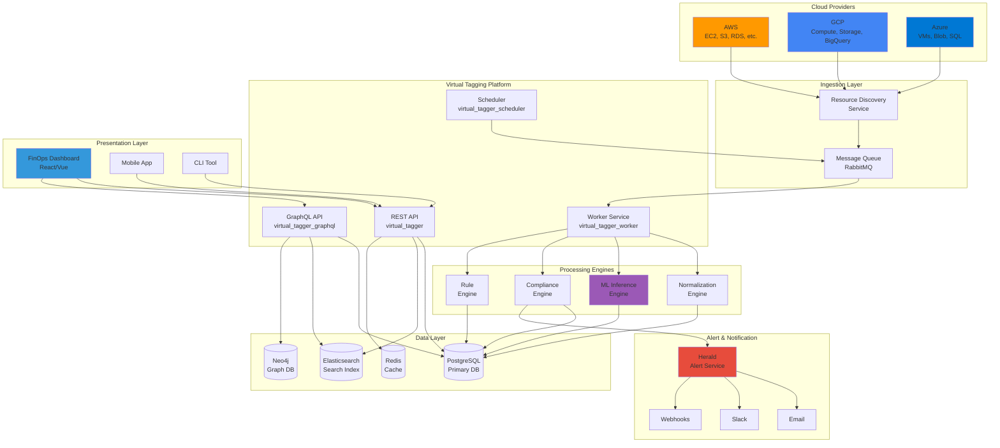

### 1.2 Simplified 3-Tier Architecture

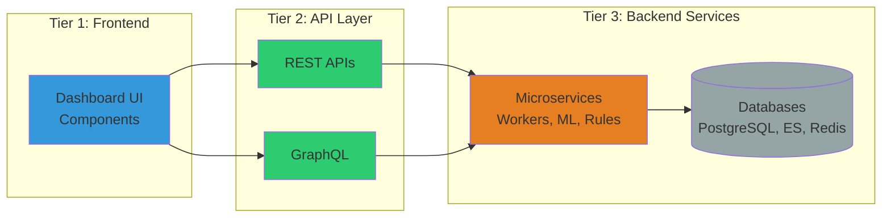

---

## 2. Component Architecture

### 2.1 Microservices Breakdown

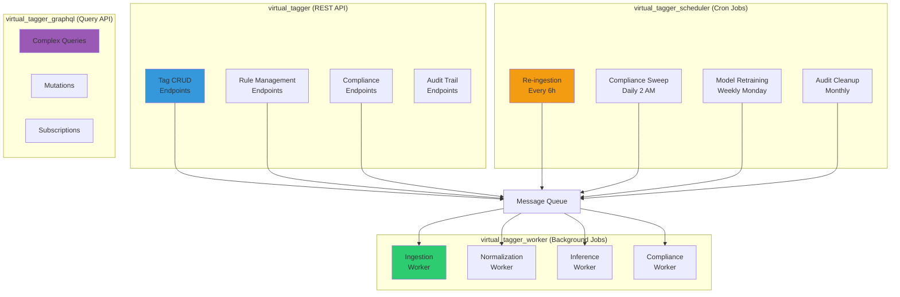

### 2.2 Service Dependencies

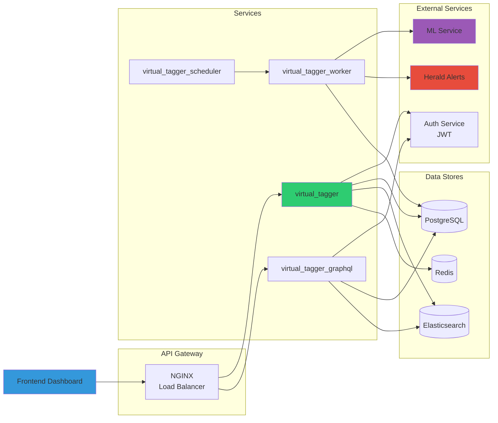

---

## 3. Data Flow Diagrams

### 3.1 Tag Creation Flow

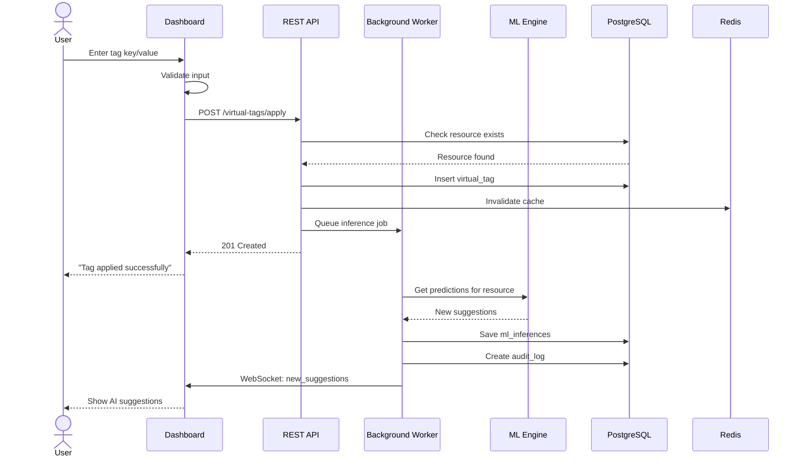

### 3.2 Rule-Based Tagging Flow

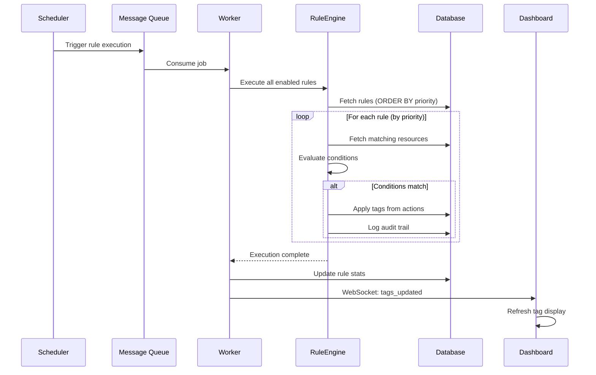

### 3.3 ML Inference Flow

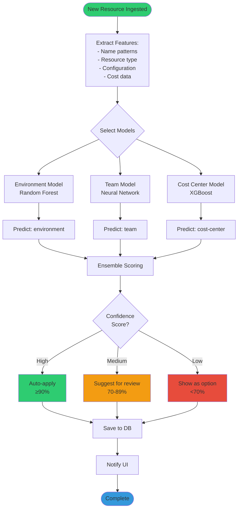

### 3.4 Compliance Check Flow

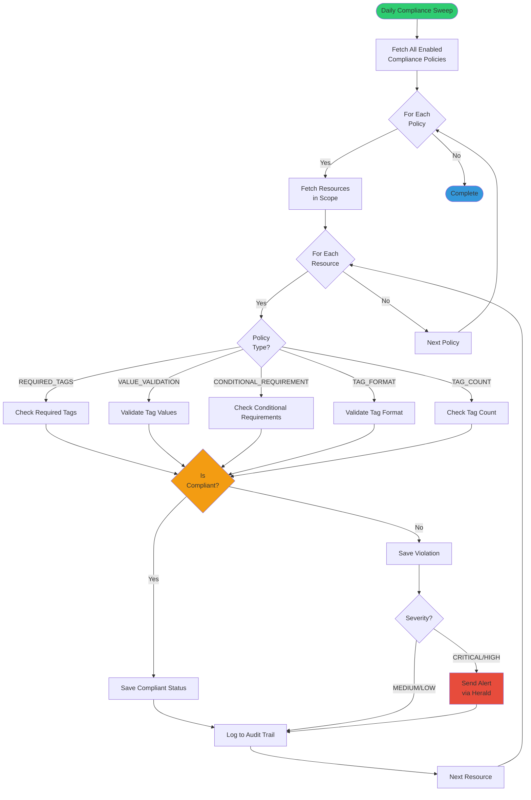

---

## 4. API Architecture

### 4.1 API Endpoint Map

```mermaid
graph TB
    subgraph "API Gateway"
        NGINX[NGINX<br/>Port 443]
    end
    
    subgraph "Virtual Tags API"
        GET_TAGS[GET /resources/{id}/virtual-tags]
        POST_TAGS[POST /virtual-tags/apply]
        PUT_TAGS[PUT /virtual-tags/{id}]
        DEL_TAGS[DELETE /virtual-tags/{id}]
        BULK_TAGS[POST /virtual-tags/bulk-apply]
    end
    
    subgraph "Tag Rules API"
        GET_RULES[GET /tag-rules]
        POST_RULES[POST /tag-rules]
        EXEC_RULE[POST /tag-rules/{id}/execute]
        TEST_RULE[POST /tag-rules/test]
    end
    
    subgraph "Compliance API"
        GET_STATUS[GET /compliance/status]
        GET_VIOL[GET /compliance/violations]
        POST_POLICY[POST /compliance/policies]
        RECHECK[POST /compliance/recheck]
    end
    
    subgraph "ML API"
        POST_INFER[POST /ml/infer]
        POST_FEEDBACK[POST /ml/feedback]
        GET_MODELS[GET /ml/models]
    end
    
    subgraph "Audit API"
        GET_TRAIL[GET /audit/trail]
        GET_REPORTS[GET /audit/reports]
    end
    
    NGINX --> GET_TAGS
    NGINX --> POST_TAGS
    NGINX --> GET_RULES
    NGINX --> POST_RULES
    NGINX --> GET_STATUS
    NGINX --> POST_INFER
    NGINX --> GET_TRAIL
    
    style NGINX fill:#2ECC71
    style GET_TAGS fill:#3498DB
    style POST_TAGS fill:#E67E22
    style GET_STATUS fill:#9B59B6
    style POST_INFER fill:#E74C3C
```

### 4.2 GraphQL Schema Structure

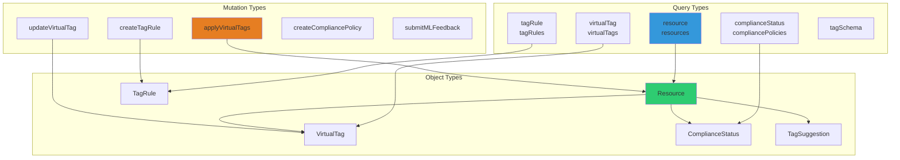

---

## 5. Frontend Components

### 5.1 Component Hierarchy

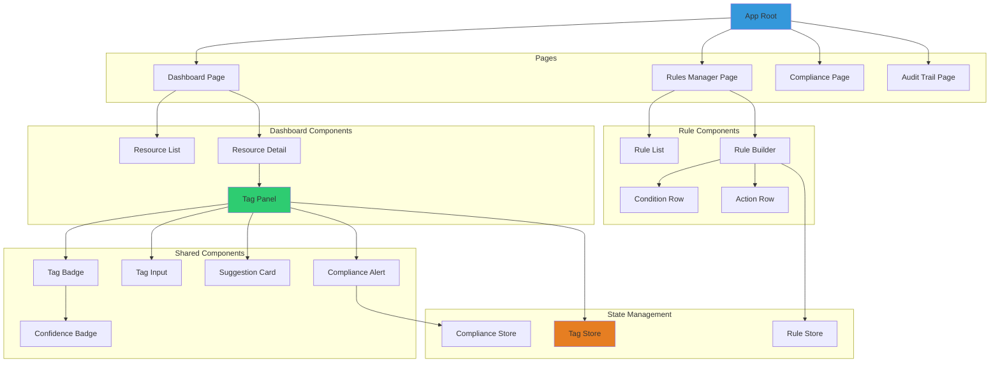

### 5.2 State Management Flow

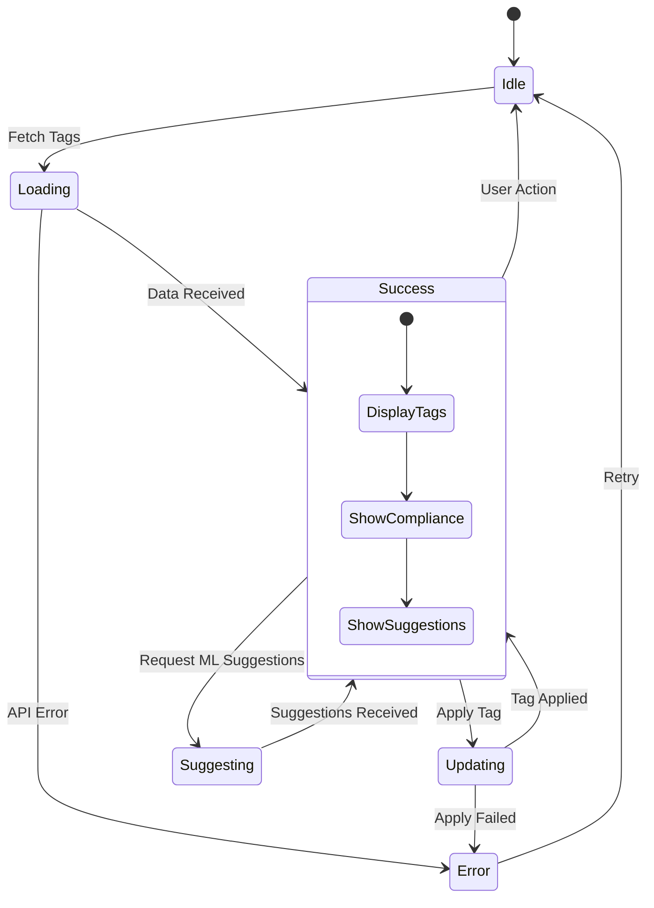

---

## 6. Database Schema

### 6.1 Entity Relationship Diagram

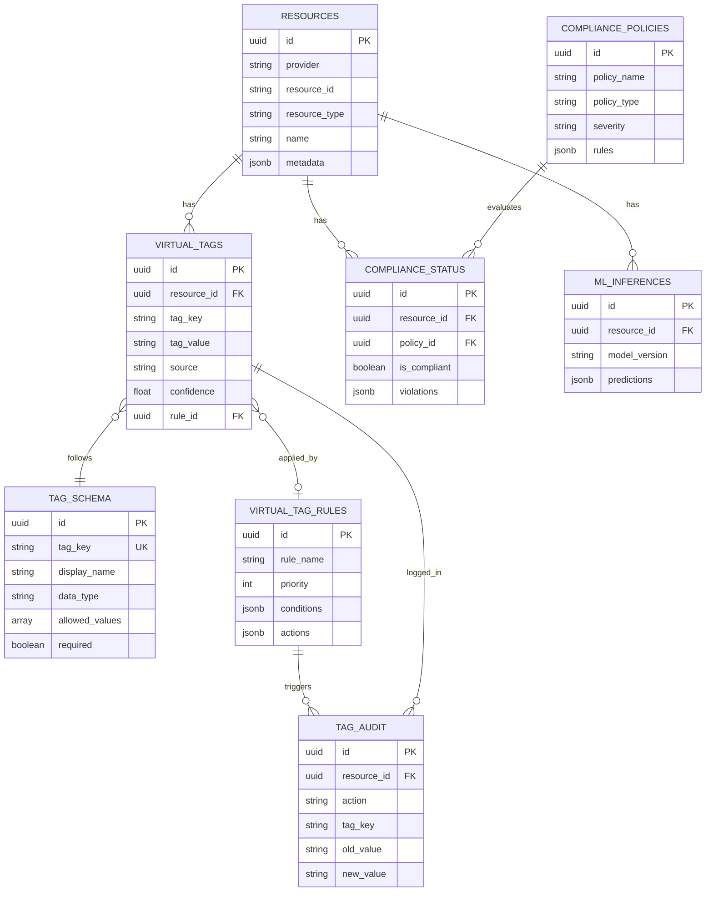

### 6.2 Table Dependencies

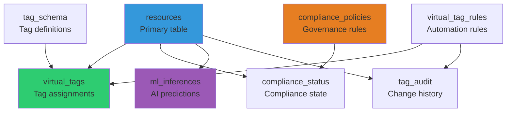

---

## 7. Deployment Architecture

### 7.1 Kubernetes Architecture

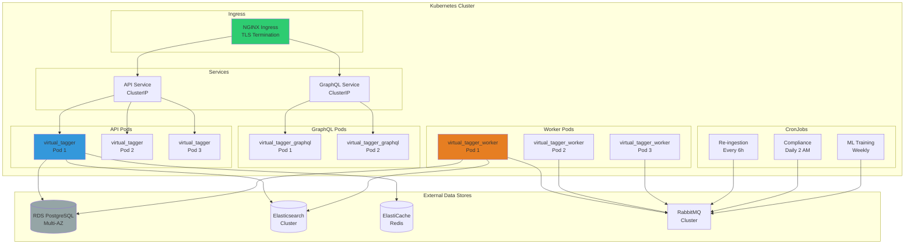

### 7.2 Multi-Region Deployment

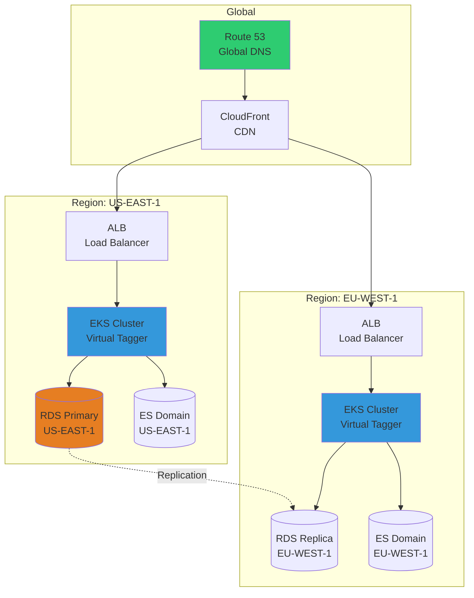

### 7.3 Security Architecture

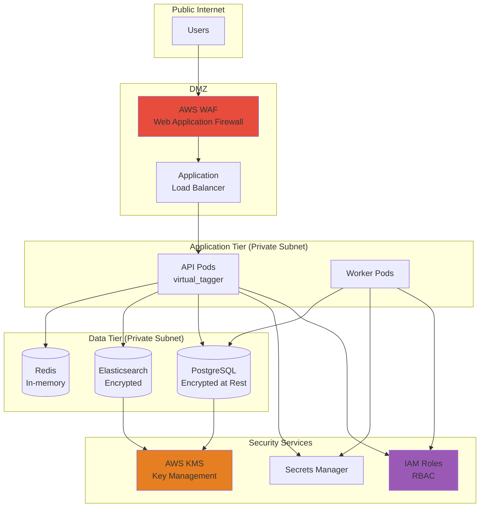

---

## 8. Integration Patterns

### 8.1 Event-Driven Architecture

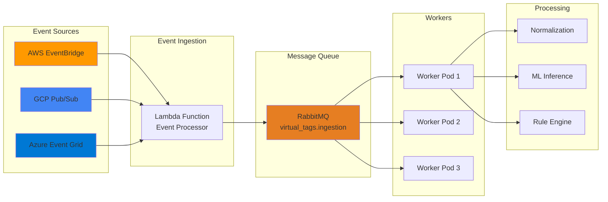

---

## 9. Performance & Scalability

### 9.1 Caching Strategy

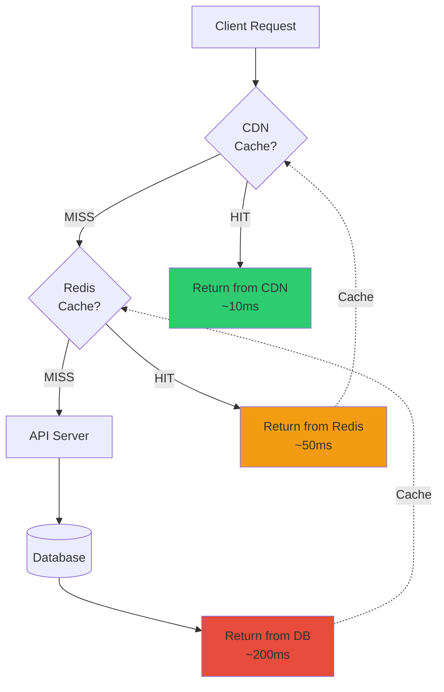

### 9.2 Auto-Scaling Configuration

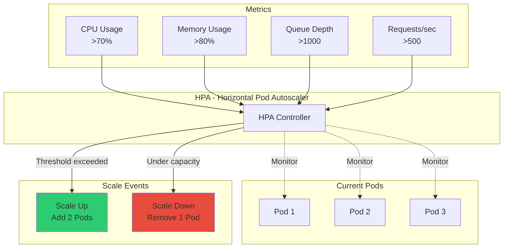

---

## 10. Monitoring & Observability

### 10.1 Monitoring Stack

```mermaid
graph TB
    subgraph "Applications"
        API[API Pods]
        WORKER[Worker Pods]
    end
    
    subgraph "Metrics Collection"
        PROM[Prometheus<br/>Metrics Scraper]
    end
    
    subgraph "Log Aggregation"
        FLUENT[Fluentd<br/>Log Collector]
        ES_LOG[(Elasticsearch<br/>Log Storage)]
    end
    
    subgraph "Tracing"
        JAEGER[Jaeger<br/>Distributed Tracing]
    end
    
    subgraph "Visualization"
        GRAFANA[Grafana<br/>Dashboards]
        KIBANA[Kibana<br/>Log Analysis]
    end
    
    subgraph "Alerting"
        ALERT[AlertManager]
        PAGER[PagerDuty]
    end
    
    API --> PROM
    API --> FLUENT
    API --> JAEGER
    
    WORKER --> PROM
    WORKER --> FLUENT
    WORKER --> JAEGER
    
    FLUENT --> ES_LOG
    ES_LOG --> KIBANA
    
    PROM --> GRAFANA
    PROM --> ALERT
    
    ALERT --> PAGER
    
    style PROM fill:#E67E22
    style GRAFANA fill:#F39C12
    style ALERT fill:#E74C3C
```

---

## 📚 Diagram Legend

### Colors
- 🟦 **Blue (#3498DB)**: Frontend/UI components
- 🟩 **Green (#2ECC71)**: API/Gateway services
- 🟧 **Orange (#E67E22)**: Backend/Worker services
- 🟪 **Purple (#9B59B6)**: ML/AI services
- 🟥 **Red (#E74C3C)**: Alerts/Security
- ⬜ **Gray (#95A5A6)**: Data stores

### Shapes
- 📦 **Rectangle**: Component/Service
- 🗄️ **Cylinder**: Database
- 💠 **Diamond**: Decision point
- 🔄 **Parallelogram**: Data/Message
- ⚫ **Circle**: Start/End state

---

**Document Version**: 1.0  
**Last Updated**: 2025-11-25  
**Maintained By**: Architecture Team  
**Next Review**: After Phase 1 deployment
