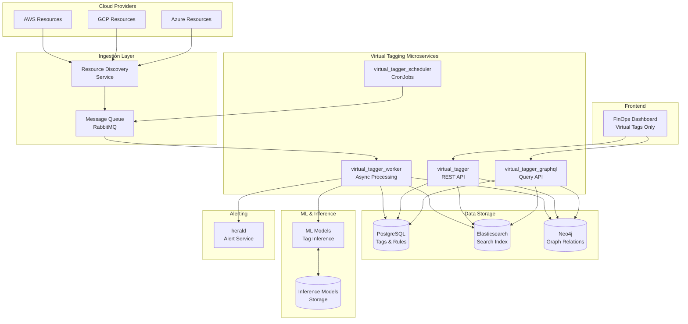
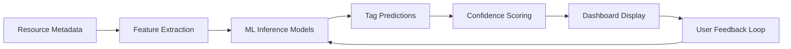
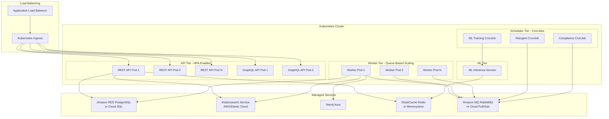
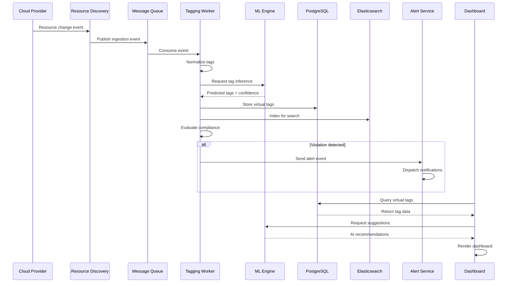
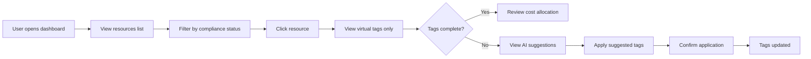
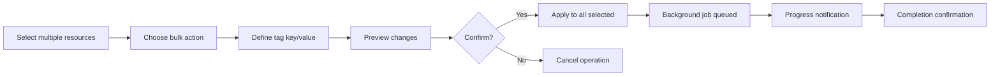
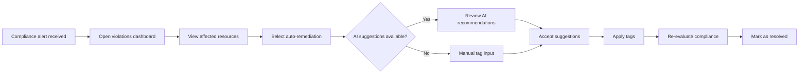

# CloudTuner Virtual Tagging - Architecture Diagrams

This document contains all Mermaid architecture diagrams for the CloudTuner Virtual Tagging system.

---

## 1. High-Level System Architecture

This diagram shows the complete end-to-end architecture from cloud providers through all processing layers to the dashboard.

---

## 2. ML Model Architecture

This diagram illustrates the machine learning pipeline for tag inference with feedback loop.

---

## 3. Component Deployment Architecture

This diagram shows the Kubernetes deployment with HPA-enabled API tier, queue-based worker scaling, and managed service integrations.

---

## 4. Data Flow Sequence Diagram

This diagram illustrates the complete event-driven flow from cloud resource change to dashboard display.

---

## 5. Detailed Multi-Cloud System Architecture

This diagram shows the comprehensive architecture including all cloud resources, processing layers, and monitoring.

```mermaid
graph TB
    subgraph "Multi-Cloud Resources"
        subgraph AWS
            EC2[EC2 Instances]
            S3[S3 Buckets]
            RDS[RDS Databases]
            Lambda[Lambda Functions]
        end
        
        subgraph GCP
            GCE[Compute Engine]
            GCS[Cloud Storage]
            BQ[BigQuery]
            GKE[GKE Clusters]
        end
        
        subgraph Azure
            VM[Virtual Machines]
            BLOB[Blob Storage]
            SQL[Azure SQL]
            AKS[AKS Clusters]
        end
    end

    subgraph "Ingestion & Processing Layer"
        API_GW[API Gateway<br/>Rate Limiting & Auth]
        
        subgraph "Resource Discovery"
            RD_AWS[AWS Collector]
            RD_GCP[GCP Collector]
            RD_AZURE[Azure Collector]
        end
        
        MQ[Message Queue<br/>RabbitMQ/SQS]
        
        subgraph "Processing Workers"
            W1[Ingestion Worker]
            W2[Normalization Worker]
            W3[Inference Worker]
            W4[Compliance Worker]
        end
    end

    subgraph "Virtual Tagging Platform"
        subgraph "API Services"
            REST[REST API<br/>virtual_tagger]
            GQL[GraphQL API<br/>virtual_tagger_graphql]
        end
        
        subgraph "Background Services"
            WORKER[Worker Service<br/>virtual_tagger_worker]
            SCHED[Scheduler Service<br/>virtual_tagger_scheduler]
        end
        
        subgraph "ML Services"
            ML_TRAIN[Training Pipeline]
            ML_INFERENCE[Inference Engine]
            ML_MODELS[(Model Registry)]
        end
    end

    subgraph "Data Layer"
        subgraph "Databases"
            PG[(PostgreSQL<br/>Primary Data)]
            ES[(Elasticsearch<br/>Search & Analytics)]
            NEO[(Neo4j<br/>Relationships)]
            REDIS[(Redis<br/>Cache)]
        end
        
        subgraph "Object Storage"
            S3_STORAGE[S3/GCS<br/>Model Artifacts & Logs]
        end
    end

    subgraph "Alerting & Notifications"
        HERALD[Herald Service<br/>Alert Manager]
        
        subgraph "Notification Channels"
            EMAIL[Email]
            SLACK[Slack]
            WEBHOOK[Webhooks]
        end
    end

    subgraph "Frontend"
        WEB[Web Dashboard<br/>React/Vue]
        MOBILE[Mobile App<br/>React Native]
    end

    subgraph "Monitoring & Observability"
        PROM[Prometheus<br/>Metrics]
        GRAFANA[Grafana<br/>Dashboards]
        ELK[ELK Stack<br/>Logs]
    end

    %% Connections
    EC2 --> RD_AWS
    S3 --> RD_AWS
    RDS --> RD_AWS
    Lambda --> RD_AWS
    
    GCE --> RD_GCP
    GCS --> RD_GCP
    BQ --> RD_GCP
    GKE --> RD_GCP
    
    VM --> RD_AZURE
    BLOB --> RD_AZURE
    SQL --> RD_AZURE
    AKS --> RD_AZURE
    
    RD_AWS --> MQ
    RD_GCP --> MQ
    RD_AZURE --> MQ
    
    MQ --> W1
    W1 --> W2
    W2 --> W3
    W3 --> W4
    
    W1 --> PG
    W2 --> PG
    W3 --> ML_INFERENCE
    W4 --> PG
    
    ML_INFERENCE --> ML_MODELS
    ML_TRAIN --> ML_MODELS
    
    PG --> ES
    PG --> NEO
    
    REST --> PG
    REST --> ES
    REST --> REDIS
    
    GQL --> PG
    GQL --> ES
    GQL --> NEO
    
    SCHED --> MQ
    
    W4 --> HERALD
    HERALD --> EMAIL
    HERALD --> SLACK
    HERALD --> WEBHOOK
    
    WEB --> API_GW
    MOBILE --> API_GW
    
    API_GW --> REST
    API_GW --> GQL
    
    REST --> PROM
    WORKER --> PROM
    SCHED --> PROM
    
    PROM --> GRAFANA
    
    REST --> ELK
    WORKER --> ELK
    SCHED --> ELK
```

---

## 6. User Flow: View Resource Tags

---

## 7. User Flow: Bulk Tag Application

---

## 8. User Flow: Compliance Remediation

---

## Usage Notes

### Rendering Mermaid Diagrams

These diagrams can be rendered in:
- **GitHub/GitLab**: Automatically renders Mermaid in markdown
- **VS Code**: Install "Markdown Preview Mermaid Support" extension
- **Confluence**: Use Mermaid macro
- **Documentation sites**: MkDocs, Docusaurus, GitBook support Mermaid
- **Online**: [mermaid.live](https://mermaid.live) for editing and export

### Exporting to Images

To export diagrams as PNG/SVG:
1. Use [mermaid-cli](https://github.com/mermaid-js/mermaid-cli)
2. Use online editor at mermaid.live
3. Use VS Code extension "Markdown PDF"
4. Use draw.io with Mermaid plugin

### Diagram Descriptions

| Diagram | Purpose | Complexity |
|---------|---------|------------|
| High-Level Architecture | Overview of all system components | Medium |
| ML Model Architecture | Machine learning pipeline flow | Low |
| Component Deployment | Kubernetes infrastructure details | High |
| Data Flow Sequence | Event processing timeline | Medium |
| Multi-Cloud System | Complete detailed architecture | Very High |
| User Flows (3) | User interaction patterns | Low |

---

**Document Version**: 1.0  
**Last Updated**: 2025-11-19  
**Related Document**: [CloudTuner-Virtual-Tagging-Complete-Technical-Documentation.md](file:///c:/Users/LENOVO/Desktop/my_docs/vt/CloudTuner-Virtual-Tagging-Complete-Technical-Documentation.md)
