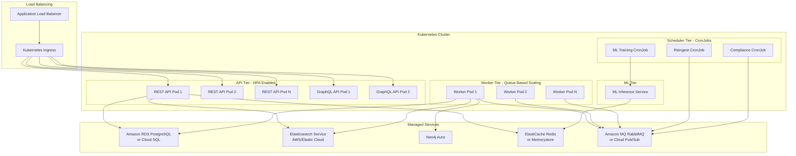
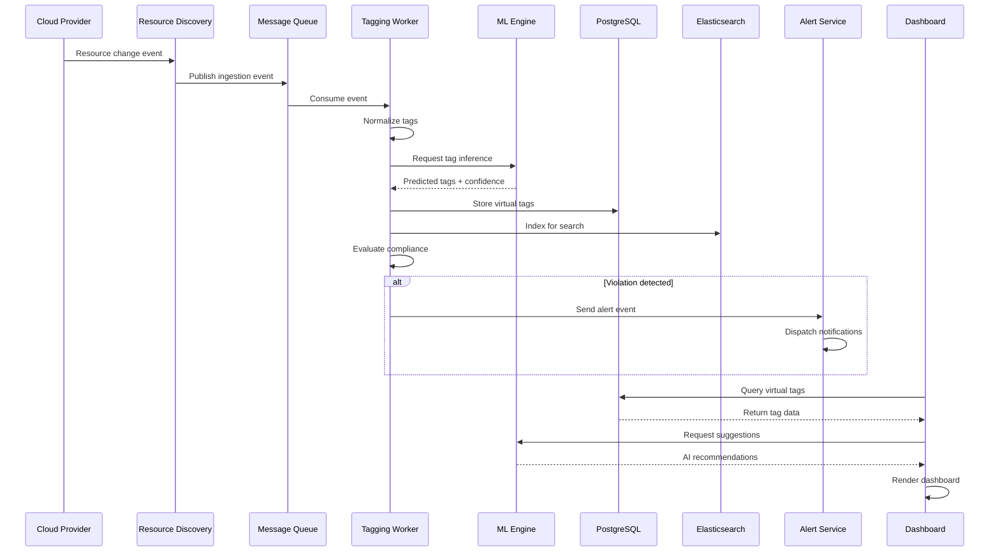
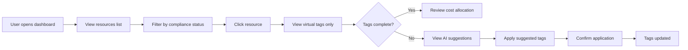
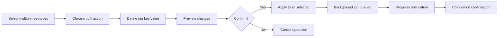
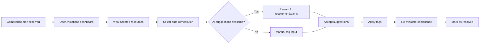

# CloudTuner Virtual Tagging - Complete Technical Documentation

## Executive Summary

CloudTuner's Virtual Tagging system provides automated, intelligent cloud resource tagging across AWS, Azure, and GCP without modifying native cloud resources. The platform creates a unified tagging layer that enhances cost allocation, compliance governance, and financial operations through AI-powered inference and rule-based automation.

### Key Capabilities

- **Multi-Cloud Unified Tagging**: Consistent tag schema across AWS, Azure, and GCP
- **AI-Powered Inference**: 70-80% reduction in manual tagging through ML models
- **Real-Time Compliance**: Automated policy enforcement and violation detection
- **Non-Intrusive**: Virtual tags stored in platform layer, cloud resources unchanged
- **Dashboard-First**: Visualize only virtual tags with confidence scoring and AI suggestions

### Business Value

- **Cost Allocation Accuracy**: 90%+ tag coverage for accurate chargeback
- **Compliance Automation**: Real-time governance with automated remediation
- **Time Savings**: Automated tagging reduces manual effort by 70-80%
- **Multi-Cloud Visibility**: Unified view across heterogeneous cloud environments

---

## 1. Goals and Requirements

### Primary Goal

Enable CloudTuner users to **create, view, and manage virtual tags** for cloud resources across AWS, Azure, and GCP. Virtual tags influence reporting, cost breakdowns, and policy rules **without modifying actual cloud resources**.

### Core Requirements

#### Functional Requirements

1. **Virtual Tag Management**
   - Create, read, update, delete virtual tags via API and UI
   - Support manual tagging and automated rule-based tagging
   - Tag versioning and audit history

2. **Multi-Cloud Support**
   - Unified tag schema across AWS, Azure, GCP
   - Provider-specific tag normalization
   - Cross-cloud tag mapping and consistency

3. **AI-Powered Inference**
   - Automatic tag prediction from resource metadata
   - Confidence scoring (High >90%, Medium 70-90%, Low <70%)
   - Continuous learning from user feedback

4. **Compliance Framework**
   - Required tag policies
   - Tag value validation
   - Conditional tag requirements
   - Automated violation detection and alerting

5. **Dashboard Visualization**
   - Display only virtual tags (never native cloud tags)
   - AI suggestions with confidence indicators
   - Cost allocation by virtual tags
   - Compliance status and alerts

#### Non-Functional Requirements

- **Scalability**: Handle thousands of resources across multiple accounts
- **Performance**: Near real-time tag updates and compliance checks
- **Security**: Encrypted storage, RBAC, audit trails
- **Reliability**: 99.9% uptime for tag query APIs
- **Maintainability**: Microservices architecture for independent scaling

---

## 2. Detailed Workflow

### Phase 1: Initial Tag Fetching from Clouds

#### Step 1: Connect to Cloud Providers

Authentication and API access:
- **AWS**: Resource Groups Tagging API, Cost Explorer API
- **GCP**: Cloud Resource Manager API, Billing API
- **Azure**: Resource Graph API, Cost Management API

Secure authentication using IAM roles, service accounts, and managed identities.

#### Step 2: Discover All Resources

Comprehensive resource scanning:
- **AWS**: EC2 instances, S3 buckets, Lambda functions, RDS databases
- **GCP**: Compute Engine VMs, BigQuery datasets, Cloud Storage, GKE clusters
- **Azure**: Virtual machines, storage accounts, app services, SQL databases

#### Step 3: Pull Existing Tags

Fetch native tags/labels from each provider:
- AWS: `tags` key-value pairs
- GCP: `labels` from resource metadata
- Azure: `tags` from ARM resources

Creates snapshot of current tagging state.

#### Step 4: Detect Changes

**Hybrid approach for comprehensive coverage**:
- **Real-time**: CloudWatch Events (AWS), Pub/Sub (GCP), Event Grid (Azure)
- **Periodic**: Scheduled scans every 4-6 hours
- **On-demand**: User-triggered refresh via dashboard

### Phase 2: Processing After Fetching

#### Step 5: Queue Raw Data

- Push resource/tag data to message queue (`virtual_tags.ingestion`)
- Decouples fetching from processing for scalability
- Enables asynchronous processing and retry logic

#### Step 6: Clean and Standardize (Normalization)

Convert cloud-specific formats to unified schema:

```javascript
// Example normalization
AWS: { "env": "prod" } → { "environment": "production" }
GCP: { "Environment": "PROD" } → { "environment": "production" }
Azure: { "Env": "Production" } → { "environment": "production" }
```

Mapping rules stored in `tag_schema` and `tag_mappings` tables.

#### Step 7: AI Tag Inference

ML models predict missing tags:

**Input Features**:
- Resource name patterns (e.g., "web-server-prod-001")
- Resource type and configuration
- Historical tagging patterns
- Account/project context

**Output**:
- Predicted tags with confidence scores
- Multiple suggestions ranked by likelihood

**Example**:
```
Resource: "web-server-prod-001"
Inferred Tags:
  environment: production (95% confidence)
  team: frontend (87% confidence)
  application: web-server (91% confidence)
```

#### Step 8: Apply Business Rules

Rule-based tagging engine:

```javascript
IF resource.name CONTAINS "prod" THEN tag.environment = "production"
IF account_id = "1234567890" THEN tag.owner = "DevOps"
IF resource.type = "rds" THEN tag.data-classification = "sensitive"
```

Rules stored in `virtual_tag_rules` table with priority ordering.

#### Step 9: Compliance Validation

Evaluate against governance policies:
- Required tags present?
- Values within allowed ranges?
- Conditional requirements met?
- Format compliance?

#### Step 10: Generate Alerts

If violations detected:
- Create alert events
- Send to `herald` alerting service
- Dispatch notifications (email, Slack, webhooks)
- Log in audit trail

#### Step 11: Store Processed Data

Persist to multi-database architecture:
- **PostgreSQL**: Virtual tags, rules, compliance state
- **Elasticsearch**: Full-text search and indexing
- **Neo4j**: Resource relationships and graph queries

### Phase 3: Dashboard Display

#### Step 12: Query Virtual Tags Only

Dashboard queries **only virtual tags**, never native cloud tags:

```graphql
query GetResourceTags($resourceId: ID!) {
  resource(id: $resourceId) {
    virtualTags {
      key
      value
      source
      confidence
      lastUpdated
    }
    complianceStatus
    mlSuggestions {
      key
      value
      confidence
    }
  }
}
```

#### Step 13: Enhance with AI Insights

Add ML-powered features:
- Confidence scores for each tag
- Alternative suggestions
- Anomaly detection
- Cost impact predictions

#### Step 14: Render Unified View

Dashboard displays:
- Virtual tags only (with source indicators)
- Compliance status (compliant/violations)
- AI suggestions for review
- Cost allocation based on virtual tags

### Phase 4: Continuous Improvement

#### Step 15: Learn and Adapt

**Feedback Loop**:
- User confirmations → positive training examples
- User rejections → negative training examples
- Weekly model retraining with new data
- A/B testing for model improvements

#### Step 16: Periodic Maintenance

Scheduled tasks via `virtual_tagger_scheduler`:
- **Every 6 hours**: Re-ingestion sweep
- **Daily 2 AM**: Compliance evaluation
- **Weekly Monday**: ML model retraining
- **Monthly**: Audit data cleanup and archival

---

## 3. Architecture

### High-Level Architecture

The complete system architecture is visualized in a comprehensive diagram showing all layers from cloud providers through ingestion, processing, storage, ML inference, and dashboard presentation.

**Architecture Components**:

**Cloud Provider Layer**:
- AWS Resources (EC2, S3, RDS, Lambda)
- GCP Resources (Compute Engine, Cloud Storage, BigQuery, GKE)
- Azure Resources (VMs, Blob Storage, Azure SQL, AKS)

**Ingestion Layer**:
- Resource Discovery Service
- Message Queue (RabbitMQ)

**Virtual Tagging Microservices**:
- `virtual_tagger` - REST API
- `virtual_tagger_worker` - Async Processing
- `virtual_tagger_scheduler` - CronJobs
- `virtual_tagger_graphql` - Query API

**Data Storage Layer**:
- PostgreSQL - Tags & Rules
- Elasticsearch - Search Index
- Neo4j - Graph Relations

**ML & Inference Layer**:
- ML Models - Tag Inference
- Inference Models Storage

**Alerting Layer**:
- Herald - Alert Service

**Frontend Layer**:
- FinOps Dashboard - Virtual Tags Only

> **📊 Visual Diagram**: See [CloudTuner-Architecture-Diagrams.md](file:///c:/Users/LENOVO/Desktop/my_docs/vt/CloudTuner-Architecture-Diagrams.md#1-high-level-system-architecture) for the complete visual architecture diagram.

### Microservices Architecture

#### 1. virtual_tagger (REST API)

**Purpose**: Synchronous API for tag CRUD, search, compliance queries

**Key Endpoints**:

```
GET    /api/v1/resources/{id}/virtual-tags
POST   /api/v1/virtual-tags/apply
PUT    /api/v1/virtual-tags/{id}
DELETE /api/v1/virtual-tags/{id}
GET    /api/v1/compliance/status
POST   /api/v1/compliance/recheck
GET    /api/v1/tag-schema
POST   /api/v1/tag-mappings
GET    /api/v1/audit-trail
```

**Technology Stack**:
- Runtime: Node.js / Python FastAPI
- Database: PostgreSQL (primary), Elasticsearch (search)
- Caching: Redis for frequently accessed tags
- Authentication: JWT with RBAC

#### 2. virtual_tagger_worker (Async Processing)

**Purpose**: Background job processing for heavy operations

**Queues**:
- `virtual_tags.ingestion` - Resource and tag ingestion
- `virtual_tags.normalization` - Tag standardization
- `virtual_tags.inference` - ML-based prediction
- `virtual_tags.compliance` - Policy evaluation
- `virtual_tags.audit` - Logging and reporting

**Operations**:
- Process ingestion events
- Normalize tags from different clouds
- Run ML inference models
- Evaluate compliance policies
- Dispatch alerts to herald

**Technology Stack**:
- Runtime: Python worker processes
- Queue: RabbitMQ / AWS SQS
- Concurrency: Celery for distributed task execution

#### 3. virtual_tagger_scheduler (Periodic Tasks)

**Purpose**: Time-based job orchestration

**Jobs**:

```yaml
# Every 6 hours: Re-ingestion
schedule: "0 */6 * * *"
job: reingest-resources

# Daily 2 AM: Compliance sweep
schedule: "0 2 * * *"
job: compliance-sweep

# Weekly Monday: ML retraining
schedule: "0 0 * * 1"
job: retrain-models

# Monthly: Audit cleanup
schedule: "0 0 1 * *"
job: cleanup-audit

# Weekdays 6 AM: Reports
schedule: "0 6 * * 1-5"
job: generate-reports
```

**Technology Stack**:
- Platform: Kubernetes CronJobs
- Runtime: Python scheduler scripts
- Monitoring: Prometheus metrics for job execution

#### 4. virtual_tagger_graphql (Query API)

**Purpose**: Flexible querying for complex dashboard requirements

**Schema**:

```graphql
type Resource {
  id: ID!
  provider: CloudProvider!
  type: String!
  name: String!
  virtualTags: [VirtualTag!]!
  complianceStatus: ComplianceStatus!
  alerts: [Alert!]!
  mlSuggestions: [TagSuggestion!]!
  costAllocation: CostBreakdown
}

type VirtualTag {
  key: String!
  value: String!
  source: TagSource!
  confidence: Float
  provenance: Provenance!
  createdAt: DateTime!
  updatedAt: DateTime!
}

type TagSuggestion {
  key: String!
  value: String!
  confidence: Float!
  reasoning: String
  alternatives: [TagValue!]
}

type ComplianceStatus {
  isCompliant: Boolean!
  violations: [PolicyViolation!]!
  score: Float!
  lastChecked: DateTime!
}

enum TagSource {
  INFERRED
  RULE_BASED
  AI_SUGGESTED
  USER_CONFIRMED
  MANUAL
}
```

**Technology Stack**:
- Framework: Apollo GraphQL / Hasura
- Database: PostgreSQL (with GraphQL views)
- Caching: DataLoader for batching

### Data Storage Architecture

#### PostgreSQL Schema

**Core Tables**:

```sql
-- Resources table
CREATE TABLE resources (
  id UUID PRIMARY KEY,
  provider VARCHAR(10) NOT NULL,
  resource_id VARCHAR(255) NOT NULL,
  resource_type VARCHAR(100),
  name VARCHAR(255),
  account_id VARCHAR(50),
  region VARCHAR(50),
  metadata JSONB,
  created_at TIMESTAMP DEFAULT NOW(),
  updated_at TIMESTAMP DEFAULT NOW(),
  UNIQUE(provider, resource_id)
);

-- Virtual tags table
CREATE TABLE virtual_tags (
  id UUID PRIMARY KEY,
  resource_id UUID REFERENCES resources(id),
  tag_key VARCHAR(100) NOT NULL,
  tag_value TEXT NOT NULL,
  source VARCHAR(20) NOT NULL,
  confidence FLOAT,
  rule_id UUID,
  created_by VARCHAR(100),
  created_at TIMESTAMP DEFAULT NOW(),
  updated_at TIMESTAMP DEFAULT NOW()
);

-- Tag rules table
CREATE TABLE virtual_tag_rules (
  id UUID PRIMARY KEY,
  rule_name VARCHAR(200) NOT NULL,
  condition TEXT NOT NULL,
  tag_key VARCHAR(100) NOT NULL,
  tag_value TEXT NOT NULL,
  scope VARCHAR(50),
  priority INTEGER,
  enabled BOOLEAN DEFAULT TRUE,
  created_at TIMESTAMP DEFAULT NOW()
);

-- Compliance policies
CREATE TABLE compliance_policies (
  id UUID PRIMARY KEY,
  policy_name VARCHAR(200) NOT NULL,
  policy_type VARCHAR(50) NOT NULL,
  rules JSONB NOT NULL,
  severity VARCHAR(20),
  enabled BOOLEAN DEFAULT TRUE
);

-- Audit trail
CREATE TABLE tag_audit (
  id UUID PRIMARY KEY,
  resource_id UUID REFERENCES resources(id),
  action VARCHAR(50) NOT NULL,
  tag_key VARCHAR(100),
  old_value TEXT,
  new_value TEXT,
  performed_by VARCHAR(100),
  timestamp TIMESTAMP DEFAULT NOW()
);
```

#### Elasticsearch Indexing

**Purpose**: Fast full-text search and aggregations

**Indices**:

```json
// virtual_tags index
{
  "mappings": {
    "properties": {
      "resource_id": { "type": "keyword" },
      "resource_name": { "type": "text" },
      "provider": { "type": "keyword" },
      "tags": {
        "type": "nested",
        "properties": {
          "key": { "type": "keyword" },
          "value": { "type": "text" },
          "confidence": { "type": "float" }
        }
      },
      "compliance_status": { "type": "keyword" },
      "last_updated": { "type": "date" }
    }
  }
}
```

#### Neo4j Graph Database

**Purpose**: Model relationships between resources

**Node Types**:
- Resource
- Tag
- CostCenter
- Team
- Project

**Relationships**:
- (Resource)-[:HAS_TAG]->(Tag)
- (Resource)-[:BELONGS_TO]->(CostCenter)
- (Resource)-[:OWNED_BY]->(Team)
- (Resource)-[:PART_OF]->(Project)

### Machine Learning Architecture

#### ML Pipeline

The ML pipeline follows a continuous learning cycle:

1. **Resource Metadata** → Feature Extraction
2. **Feature Extraction** → Classification Models
3. **Classification Models** → Ensemble Predictions
4. **Ensemble Predictions** → Confidence Scoring
5. **Confidence Scoring** → Tag Suggestions
6. **Tag Suggestions** → User Feedback
7. **User Feedback** → Retraining Dataset
8. **Retraining Dataset** → Classification Models (feedback loop)

> **📊 Visual Diagram**: See [CloudTuner-Architecture-Diagrams.md](file:///c:/Users/LENOVO/Desktop/my_docs/vt/CloudTuner-Architecture-Diagrams.md#2-ml-model-architecture) for the ML architecture visualization.

#### Feature Engineering

**Extracted Features**:

1. **Resource Name Features**
   - Tokenized name components
   - Presence of keywords (prod, dev, test)
   - Naming pattern clusters

2. **Resource Configuration Features**
   - Instance type / VM size
   - Region / availability zone
   - Network configuration
   - Storage characteristics

3. **Cost Features**
   - Daily/monthly cost trends
   - Cost percentile ranking
   - Usage patterns

4. **Historical Features**
   - Similar resource tags
   - Account-level patterns
   - Team tagging conventions

#### ML Models

**Tag Prediction Models**:

| Tag Type | Model | Accuracy | Features Used |
|----------|-------|----------|---------------|
| environment | Random Forest | 95% | Name, config, cost |
| team | Neural Network | 90% | Name, account, historical |
| cost-center | XGBoost | 85% | Team, project, account |
| owner | Collaborative Filtering | 75% | Historical, team |
| project | Classification Tree | 80% | Name, tags, account |

**Confidence Scoring**:

```python
# Ensemble confidence calculation
confidence = (
    model_prediction_probability * 0.5 +
    historical_pattern_match * 0.3 +
    rule_coverage * 0.2
)

# Thresholds
if confidence >= 0.90: auto_apply()
elif confidence >= 0.70: suggest_for_review()
else: show_as_recommendation()
```

**Training Pipeline**:

```
Weekly Schedule:
  1. Extract training data (user-confirmed tags)
  2. Engineer features from resource metadata
  3. Train models with cross-validation
  4. Evaluate on holdout set
  5. A/B test new models (10% traffic)
  6. Deploy if accuracy improved
  7. Archive old model version
```

---

## 4. Implementation Details

### Required Tag Taxonomy

#### Critical Tags (Must Have)

1. **environment**
   - Values: `production`, `staging`, `development`, `sandbox`, `test`
   - Importance: Cost optimization and policy enforcement
   - AI Accuracy: 95%

2. **cost-center**
   - Values: Department codes (e.g., `engineering`, `marketing`, `sales`)
   - Importance: Primary dimension for cost allocation
   - AI Accuracy: 85%

3. **owner**
   - Values: Email addresses or team names
   - Importance: Accountability and contact information
   - AI Accuracy: 75%

#### High Priority Tags

4. **project**
   - Values: Project identifiers (e.g., `analytics-platform`, `customer-portal`)
   - AI Accuracy: 80%

5. **team**
   - Values: Team names (e.g., `platform`, `devops`, `data-science`)
   - AI Accuracy: 90%

6. **application**
   - Values: Application/service names (e.g., `web-api`, `batch-processor`)
   - AI Accuracy: 85%

#### Medium Priority Tags

7. **business-unit**
8. **data-classification**
9. **backup**
10. **auto-stop**
11. **compliance**

#### Cross-Cloud Normalization

```javascript
// AWS to Unified
{
  "Environment": "prod" → "environment": "production",
  "CostCenter": "ENG" → "cost-center": "engineering",
  "Owner": "john" → "owner": "john@company.com"
}

// GCP to Unified
{
  "env": "PROD" → "environment": "production",
  "cost_center": "eng" → "cost-center": "engineering",
  "team": "Platform" → "team": "platform"
}

// Azure to Unified
{
  "Env": "Production" → "environment": "production",
  "costcenter": "ENG-001" → "cost-center": "engineering",
  "Team": "PLATFORM" → "team": "platform"
}
```

### API Specifications

#### REST API Response Format

```json
{
  "resource_id": "arn:aws:ec2:us-east-1:123456789012:instance/i-1234567890abcdef0",
  "resource_name": "web-server-prod-001",
  "provider": "aws",
  "virtual_tags": [
    {
      "key": "environment",
      "value": "production",
      "source": "inferred",
      "confidence": 0.95,
      "created_at": "2025-11-17T10:00:00Z",
      "updated_at": "2025-11-17T10:00:00Z"
    },
    {
      "key": "team",
      "value": "engineering",
      "source": "ai_suggested",
      "confidence": 0.87,
      "created_at": "2025-11-17T10:00:00Z",
      "updated_at": "2025-11-17T10:00:00Z"
    },
    {
      "key": "cost-center",
      "value": "platform",
      "source": "user_confirmed",
      "confidence": 1.0,
      "created_at": "2025-11-16T14:30:00Z",
      "updated_at": "2025-11-17T09:15:00Z"
    }
  ],
  "compliance_status": {
    "is_compliant": true,
    "score": 1.0,
    "violations": [],
    "last_checked": "2025-11-17T12:00:00Z"
  },
  "ml_suggestions": [
    {
      "key": "owner",
      "value": "platform-team@company.com",
      "confidence": 0.89,
      "reasoning": "Based on similar resources in this account"
    },
    {
      "key": "project",
      "value": "web-platform",
      "confidence": 0.82,
      "reasoning": "Inferred from resource name pattern"
    }
  ],
  "alerts": []
}
```

### Compliance Framework

#### Policy Types

**1. Required Tag Policy**

```json
{
  "policy_id": "req-tags-prod",
  "policy_name": "Required Tags for Production",
  "policy_type": "required_tags",
  "rules": {
    "condition": "tags.environment == 'production'",
    "required_tags": ["cost-center", "owner", "backup"],
    "severity": "critical"
  }
}
```

**2. Tag Value Validation Policy**

```json
{
  "policy_id": "validate-env",
  "policy_name": "Environment Value Validation",
  "policy_type": "value_validation",
  "rules": {
    "tag_key": "environment",
    "allowed_values": ["production", "staging", "development", "sandbox", "test"],
    "case_sensitive": false,
    "severity": "high"
  }
}
```

**3. Conditional Tag Policy**

```json
{
  "policy_id": "prod-backup-req",
  "policy_name": "Production Resources Need Backup Tags",
  "policy_type": "conditional_requirement",
  "rules": {
    "if_condition": "tags.environment == 'production'",
    "then_require": ["backup", "data-classification"],
    "severity": "high"
  }
}
```

**4. Cost-Based Policy**

```json
{
  "policy_id": "high-cost-tagging",
  "policy_name": "High Cost Resources Require Detailed Tagging",
  "policy_type": "cost_threshold",
  "rules": {
    "threshold": 500,
    "period": "monthly",
    "required_tags": ["business-unit", "project-justification", "cost-center"],
    "severity": "critical"
  }
}
```

#### Violation Severity Levels

| Severity | Response Time | Actions |
|----------|---------------|---------|
| **Critical** | Immediate | Alert, potential resource quarantine, escalation |
| **High** | Within 24 hours | Alert to owners, escalation if not resolved |
| **Medium** | Within 1 week | Dashboard warning, periodic reminders |
| **Low** | Best effort | Logged for reporting, no active alerts |

### Dashboard Features

#### Resource List View

Key components:
- Filter by cloud provider, environment, compliance status
- Search by resource name, ID, or tag value
- Sortable columns: name, cloud, compliance, cost
- Batch selection for bulk operations

#### Resource Detail View

**Panels**:

1. **Current Virtual Tags**
   - Tag key, value, source, confidence score
   - Edit/delete actions (RBAC controlled)
   - Visual indicators for AI-suggested vs confirmed

2. **AI Suggestions**
   - Recommended tags with confidence scores
   - Reasoning/explanation for each suggestion
   - One-click apply or dismiss

3. **Compliance Status**
   - Overall compliance state (compliant/violations)
   - List of required vs present tags
   - Violation details with remediation steps

4. **Activity Timeline**
   - Tag creation/modification history
   - Compliance check results
   - Alert notifications

5. **Cost Allocation**
   - Current month cost breakdown by tag
   - Historical cost trends
   - Projected costs based on tagging

#### Cost Allocation Dashboard

**Visualizations**:

- **Pie Chart**: Cost by environment (production vs non-production)
- **Bar Chart**: Cost by cost-center (top 10)
- **Trend Line**: Monthly cost trends by project
- **Heat Map**: Resource distribution by team and environment

**Filtering**:
- Date range selection
- Cloud provider filter
- Tag-based drill-down
- Export to CSV/PDF

#### Compliance Dashboard

**Metrics**:

- Overall compliance rate (%)
- Compliance trend (last 30 days)
- Top compliance issues
- Resources by compliance status

**Violation Drill-Down**:
- List of non-compliant resources
- Violation type and severity
- Recommended remediation actions
- Bulk remediation workflows

#### AI Insights Dashboard

**Performance Metrics**:

- Overall prediction accuracy
- Confidence score distribution
- Most accurate tag predictions
- User feedback statistics

**Anomaly Detection**:

- Resources with unusual tag patterns
- Conflicting tag combinations
- Potential data quality issues
- Recommended investigations

---

## 5. Cloud Architecture Diagram

### Detailed System Architecture

```mermaid
graph TB
    subgraph "Multi-Cloud Resources"
        subgraph AWS
            EC2[EC2 Instances]
            S3[S3 Buckets]
            RDS[RDS Databases]
            Lambda[Lambda Functions]
        end
        
        subgraph GCP
            GCE[Compute Engine]
            GCS[Cloud Storage]
            BQ[BigQuery]
            GKE[GKE Clusters]
        end
        
        subgraph Azure
            VM[Virtual Machines]
            BLOB[Blob Storage]
            SQL[Azure SQL]
            AKS[AKS Clusters]
        end
    end

    subgraph "Ingestion & Processing Layer"
        API_GW[API Gateway<br/>Rate Limiting & Auth]
        
        subgraph "Resource Discovery"
            RD_AWS[AWS Collector]
            RD_GCP[GCP Collector]
            RD_AZURE[Azure Collector]
        end
        
        MQ[Message Queue<br/>RabbitMQ/SQS]
        
        subgraph "Processing Workers"
            W1[Ingestion Worker]
            W2[Normalization Worker]
            W3[Inference Worker]
            W4[Compliance Worker]
        end
    end

    subgraph "Virtual Tagging Platform"
        subgraph "API Services"
            REST[REST API<br/>virtual_tagger]
            GQL[GraphQL API<br/>virtual_tagger_graphql]
        end
        
        subgraph "Background Services"
            WORKER[Worker Service<br/>virtual_tagger_worker]
            SCHED[Scheduler Service<br/>virtual_tagger_scheduler]
        end
        
        subgraph "ML Services"
            ML_TRAIN[Training Pipeline]
            ML_INFERENCE[Inference Engine]
            ML_MODELS[(Model Registry)]
        end
    end

    subgraph "Data Layer"
        subgraph "Databases"
            PG[(PostgreSQL<br/>Primary Data)]
            ES[(Elasticsearch<br/>Search & Analytics)]
            NEO[(Neo4j<br/>Relationships)]
            REDIS[(Redis<br/>Cache)]
        end
        
        subgraph "Object Storage"
            S3_STORAGE[S3/GCS<br/>Model Artifacts & Logs]
        end
    end

    subgraph "Alerting & Notifications"
        HERALD[Herald Service<br/>Alert Manager]
        
        subgraph "Notification Channels"
            EMAIL[Email]
            SLACK[Slack]
            WEBHOOK[Webhooks]
        end
    end

    subgraph "Frontend"
        WEB[Web Dashboard<br/>React/Vue]
        MOBILE[Mobile App<br/>React Native]
    end

    subgraph "Monitoring & Observability"
        PROM[Prometheus<br/>Metrics]
        GRAFANA[Grafana<br/>Dashboards]
        ELK[ELK Stack<br/>Logs]
    end

    %% Connections
    EC2 --> RD_AWS
    S3 --> RD_AWS
    RDS --> RD_AWS
    Lambda --> RD_AWS
    
    GCE --> RD_GCP
    GCS --> RD_GCP
    BQ --> RD_GCP
    GKE --> RD_GCP
    
    VM --> RD_AZURE
    BLOB --> RD_AZURE
    SQL --> RD_AZURE
    AKS --> RD_AZURE
    
    RD_AWS --> MQ
    RD_GCP --> MQ
    RD_AZURE --> MQ
    
    MQ --> W1
    W1 --> W2
    W2 --> W3
    W3 --> W4
    
    W1 --> PG
    W2 --> PG
    W3 --> ML_INFERENCE
    W4 --> PG
    
    ML_INFERENCE --> ML_MODELS
    ML_TRAIN --> ML_MODELS
    
    PG --> ES
    PG --> NEO
    
    REST --> PG
    REST --> ES
    REST --> REDIS
    
    GQL --> PG
    GQL --> ES
    GQL --> NEO
    
    SCHED --> MQ
    
    W4 --> HERALD
    HERALD --> EMAIL
    HERALD --> SLACK
    HERALD --> WEBHOOK
    
    WEB --> API_GW
    MOBILE --> API_GW
    
    API_GW --> REST
    API_GW --> GQL
    
    REST --> PROM
    WORKER --> PROM
    SCHED --> PROM
    
    PROM --> GRAFANA
    
    REST --> ELK
    WORKER --> ELK
    SCHED --> ELK
```



### Component Deployment Architecture



### Data Flow Diagram



---

## 6. User Flows

### User Flow 1: View Resource Tags



### User Flow 2: Bulk Tag Application



### User Flow 3: Compliance Remediation



---

## 7. Security and Compliance

### Access Control

**Role-Based Access Control (RBAC)**:

| Role | Permissions |
|------|-------------|
| **Viewer** | Read virtual tags, view dashboards, export reports |
| **Editor** | Viewer + manual tag application, accept/reject AI suggestions |
| **Admin** | Editor + create/modify rules, manage compliance policies |
| **Super Admin** | Admin + manage users, configure integrations, system settings |

### Data Security

**Encryption**:
- **At Rest**: AES-256 encryption for database storage
- **In Transit**: TLS 1.3 for all API communication
- **Secrets**: AWS Secrets Manager / GCP Secret Manager for credentials

**Audit Trail**:
- All tag modifications logged with user, timestamp, old/new values
- Compliance check results archived for 1 year
- API access logs retained for 90 days

**Data Isolation**:
- Tenant-level data separation in multi-tenant deployments
- Virtual tags stored separately from cloud-native metadata
- No exposure of native cloud tags in API responses or UI

### Compliance Standards

**Supported Frameworks**:
- SOC 2 Type II
- GDPR (data privacy for European resources)
- HIPAA (for healthcare-related tagging)
- ISO 27001

**Compliance Features**:
- Data retention policies
- Right to be forgotten (tag deletion)
- Audit report generation
- Compliance certification documentation

---

## 8. Implementation Roadmap

### Phase 1: Foundation (Months 1-2)

- [ ] Set up infrastructure (Kubernetes, databases)
- [ ] Implement resource discovery for AWS, GCP, Azure
- [ ] Build REST API for basic CRUD operations
- [ ] Develop PostgreSQL schema and initial data models
- [ ] Create simple dashboard for viewing resources

### Phase 2: Core Features (Months 3-4)

- [ ] Implement tag normalization engine
- [ ] Build rule-based tagging system
- [ ] Add compliance policy framework
- [ ] Develop alert/notification system
- [ ] Enhance dashboard with filtering and search

### Phase 3: AI/ML Integration (Months 5-6)

- [ ] Build ML training pipeline
- [ ] Develop tag inference models
- [ ] Implement confidence scoring
- [ ] Add AI suggestions to dashboard
- [ ] Create feedback loop for continuous learning

### Phase 4: Advanced Features (Months 7-8)

- [ ] GraphQL API for complex queries
- [ ] Elasticsearch integration for advanced search
- [ ] Neo4j integration for relationship modeling
- [ ] Cost allocation reporting
- [ ] Bulk operations and workflows

### Phase 5: Scale & Optimize (Months 9-12)

- [ ] Performance optimization
- [ ] Horizontal scaling implementation
- [ ] Advanced ML models (anomaly detection)
- [ ] Mobile application
- [ ] Third-party integrations (ITSM, SIEM)

---

## 9. Monitoring and Observability

### Key Metrics

**Application Metrics**:
- API request latency (p50, p95, p99)
- Tag inference accuracy
- Compliance check duration
- Queue depth and processing rate
- ML model prediction time

**Business Metrics**:
- Tag coverage rate (% resources with required tags)
- Compliance score trends
- AI suggestion acceptance rate
- Cost allocation accuracy
- Active users and API calls

**Infrastructure Metrics**:
- CPU/memory utilization
- Database connection pool usage
- Message queue lag
- Cache hit rate
- Error rates by service

### Alerting Rules

```yaml
# High API error rate
alert: HighAPIErrorRate
expr: rate(http_requests_total{status=~"5.."}[5m]) > 0.05
severity: critical

# Queue backlog
alert: MessageQueueBacklog
expr: rabbitmq_queue_messages{queue="virtual_tags.ingestion"} > 10000
severity: warning

# ML inference latency
alert: SlowMLInference
expr: histogram_quantile(0.95, ml_inference_duration_seconds) > 2
severity: warning

# Compliance check failures
alert: ComplianceCheckFailures
expr: rate(compliance_check_failures_total[10m]) > 0.1
severity: high
```

---

## 10. References and Source Files

### Source Documentation

This comprehensive document consolidates information from the following source files:

1. **[Project Goals Virtual Tagging.md](file:///c:/Users/LENOVO/Desktop/my_docs/vt/Project%20Goals%20Virtual%20Tagging.md)**
   - Goal definition and high-level requirements
   - Implementation plan overview
   - API layer specifications
   - Example architecture flow

2. **[VT - Required tag implementation.md](file:///c:/Users/LENOVO/Desktop/my_docs/vt/VT%20-%20Required%20tag%20implementation.md)**
   - Essential tags taxonomy (15 tag types)
   - Tag priority levels (Critical, High, Medium, Low)
   - Cross-cloud tag normalization
   - AI inference capabilities and accuracy metrics
   - Training and improvement strategies

3. **[VT - architecture.md](file:///c:/Users/LENOVO/Desktop/my_docs/vt/VT%20-%20architecture.md)**
   - End-to-end architecture design
   - Microservices specifications (4 services)
   - Data flow architectures (5 flows)
   - ML integration architecture
   - API specifications (REST, GraphQL, Message Queue)
   - Scheduler service configuration
   - Security and compliance frameworks

4. **[VT - dashboard.md](file:///c:/Users/LENOVO/Desktop/my_docs/vt/VT%20-%20dashboard.md)**
   - Dashboard layouts and UI components
   - Resource detail views
   - Cost allocation visualizations
   - Compliance dashboard designs
   - AI insights dashboard
   - Interactive features (tag editor, bulk operations)
   - Compliance framework details
   - Policy types and enforcement

5. **[VT - workflow.md](file:///c:/Users/LENOVO/Desktop/my_docs/vt/VT%20-%20workflow.md)**
   - Complete tagging flow (16 steps)
   - Phase-based workflow (4 phases)
   - Cloud provider integrations
   - Processing pipeline details
   - Dashboard display flow

6. **[virtualtagging.md](file:///c:/Users/LENOVO/Desktop/my_docs/vt/virtualtagging.md)**
   - Virtual tagging concept definition
   - Benefits and use cases
   - Comparison with native cloud tags
   - CloudTuner.ai specific features

### PDF Documents

The following PDF documents contain additional schemas and product information (not directly processed but available for reference):

- **CloudTuner-Virtual-Tagging-Schema.pdf** - Database schemas and data models
- **Cloudtuner.AI.pdf** - Product overview and marketing materials
- **focus dataset.pdf** - Sample datasets and test data

---

## Appendix A: Key Architecture Decisions

### ADR-001: Microservices vs Monolith

**Decision**: Microservices architecture with 4 core services

**Rationale**:
- Independent scaling of API vs worker vs scheduler
- Technology flexibility (different languages for different services)
- Fault isolation (worker failure doesn't impact API)
- Team autonomy for service ownership

**Trade-offs**:
- Increased operational complexity
- Distributed system challenges
- Higher infrastructure costs

### ADR-002: PostgreSQL as Primary Database

**Decision**: PostgreSQL for transactional data storage

**Rationale**:
- ACID compliance for critical tag data
- Rich JSON support (JSONB) for flexible metadata
- Mature ecosystem and tooling
- Strong consistency guarantees

**Alternatives Considered**: MongoDB (less ACID), DynamoDB (vendor lock-in)

### ADR-003: Multi-Database Strategy

**Decision**: PostgreSQL + Elasticsearch + Neo4j

**Rationale**:
- PostgreSQL: Source of truth for tags
- Elasticsearch: Fast search and aggregations
- Neo4j: Resource relationship modeling

**Trade-offs**: Data synchronization complexity, eventual consistency

### ADR-004: Virtual Tags Only in Dashboard

**Decision**: Never expose native cloud tags in UI

**Rationale**:
- Consistent user experience across clouds
- Enhanced tags with AI and rules
- Clear separation of concerns
- Simplified permission model

**Alternative**: Show both native and virtual (rejected for complexity)

---

## Appendix B: Sample Queries

### GraphQL Query Examples

**Get Resource with Virtual Tags**:

```graphql
query GetResourceDetails($resourceId: ID!) {
  resource(id: $resourceId) {
    id
    name
    provider
    type
    virtualTags {
      key
      value
      source
      confidence
      createdAt
    }
    complianceStatus {
      isCompliant
      score
      violations {
        policyName
        severity
        message
      }
    }
    mlSuggestions {
      key
      value
      confidence
      reasoning
    }
  }
}
```

**Cost Allocation by Tag**:

```graphql
query CostByTag($tagKey: String!, $dateRange: DateRange!) {
  costAllocation(tagKey: $tagKey, dateRange: $dateRange) {
    tagValue
    totalCost
    resourceCount
    breakdown {
      date
      cost
    }
  }
}
```

### SQL Query Examples

**Find Non-Compliant Resources**:

```sql
SELECT 
    r.id,
    r.name,
    r.provider,
    r.resource_type,
    COUNT(vt.id) as tag_count,
    ARRAY_AGG(vt.tag_key) as present_tags
FROM resources r
LEFT JOIN virtual_tags vt ON r.id = vt.resource_id
WHERE NOT EXISTS (
    SELECT 1 FROM virtual_tags vt2
    WHERE vt2.resource_id = r.id
    AND vt2.tag_key IN ('environment', 'cost-center', 'owner')
)
GROUP BY r.id, r.name, r.provider, r.resource_type
ORDER BY tag_count ASC;
```

**AI Suggestion Acceptance Rate**:

```sql
SELECT 
    DATE_TRUNC('day', ta.timestamp) as date,
    COUNT(*) FILTER (WHERE ta.action = 'accept_suggestion') as accepted,
    COUNT(*) FILTER (WHERE ta.action = 'reject_suggestion') as rejected,
    ROUND(
        100.0 * COUNT(*) FILTER (WHERE ta.action = 'accept_suggestion') / 
        NULLIF(COUNT(*), 0), 
        2
    ) as acceptance_rate
FROM tag_audit ta
WHERE ta.action IN ('accept_suggestion', 'reject_suggestion')
    AND ta.timestamp >= NOW() - INTERVAL '30 days'
GROUP BY DATE_TRUNC('day', ta.timestamp)
ORDER BY date DESC;
```

---

## Appendix C: Compliance Policy Examples

### Example 1: Production Environment Policy

```json
{
  "policy_id": "prod-tagging-standard",
  "policy_name": "Production Environment Tagging Standard",
  "description": "All production resources must have comprehensive tagging",
  "policy_type": "conditional_requirement",
  "enabled": true,
  "rules": {
    "if_condition": {
      "field": "tags.environment",
      "operator": "equals",
      "value": "production"
    },
    "then_require": [
      {
        "tag_key": "cost-center",
        "validation": {
          "type": "regex",
          "pattern": "^[A-Z]{3}-[0-9]{3}$",
          "message": "Cost center must be format: ABC-123"
        }
      },
      {
        "tag_key": "owner",
        "validation": {
          "type": "email",
          "message": "Owner must be valid email address"
        }
      },
      {
        "tag_key": "backup",
        "validation": {
          "type": "enum",
          "allowed_values": ["daily", "hourly", "weekly"],
          "message": "Backup must be daily, hourly, or weekly"
        }
      },
      {
        "tag_key": "data-classification",
        "validation": {
          "type": "enum",
          "allowed_values": ["public", "internal", "confidential", "restricted"],
          "message": "Invalid data classification"
        }
      }
    ],
    "severity": "critical",
    "grace_period_hours": 24,
    "auto_remediate": false
  }
}
```

### Example 2: High-Cost Resource Policy

```json
{
  "policy_id": "high-cost-governance",
  "policy_name": "High Cost Resource Governance",
  "description": "Resources exceeding $500/month require detailed justification",
  "policy_type": "cost_threshold",
  "enabled": true,
  "rules": {
    "cost_threshold": {
      "amount": 500,
      "currency": "USD",
      "period": "monthly"
    },
    "required_tags": [
      "business-unit",
      "project-justification",
      "approval-id",
      "review-date"
    ],
    "validation": {
      "approval-id": {
        "type": "regex",
        "pattern": "^JIRA-[0-9]{4,}$",
        "message": "Approval ID must reference JIRA ticket"
      },
      "review-date": {
        "type": "date",
        "format": "YYYY-MM-DD",
        "must_be_future": false,
        "max_age_days": 90,
        "message": "Review date must be within last 90 days"
      }
    },
    "severity": "high",
    "escalation": {
      "to": "finance-team@company.com",
      "after_hours": 48
    }
  }
}
```

---

## Appendix D: ML Model Details

### Feature Importance by Tag Type

| Tag Type | Top Features | Importance Score |
|----------|--------------|------------------|
| environment | Name pattern, Region, Cost variance | 0.92 |
| team | Account ID, Historical tags, Name tokens | 0.88 |
| cost-center | Team tag, Project tag, Account mapping | 0.83 |
| project | Name pattern, Resource grouping, File paths | 0.79 |
| owner | Team tag, Account owner, Historical ownership | 0.71 |

### Model Performance Metrics

```json
{
  "environment_classifier": {
    "accuracy": 0.95,
    "precision": 0.93,
    "recall": 0.94,
    "f1_score": 0.93,
    "confusion_matrix": {
      "production": {"production": 850, "staging": 30, "development": 20},
      "staging": {"production": 15, "staging": 780, "development": 55},
      "development": {"production": 10, "staging": 40, "development": 950}
    },
    "training_samples": 50000,
    "last_trained": "2025-11-11T00:00:00Z",
    "model_version": "v2.3.1"
  },
  "team_classifier": {
    "accuracy": 0.90,
    "precision": 0.89,
    "recall": 0.88,
    "f1_score": 0.88,
    "training_samples": 45000,
    "last_trained": "2025-11-11T00:00:00Z",
    "model_version": "v1.9.2"
  }
}
```

### Confidence Calibration

```python
# Confidence threshold tuning
confidence_thresholds = {
    "auto_apply": {
        "environment": 0.90,  # Very high confidence for critical tag
        "team": 0.85,         # High confidence
        "cost-center": 0.88,  # High confidence
        "project": 0.82,      # Medium-high confidence
        "owner": 0.80         # Medium confidence
    },
    "suggest_for_review": {
        "environment": 0.70,
        "team": 0.65,
        "cost-center": 0.70,
        "project": 0.65,
        "owner": 0.60
    }
}

# Calibrated probability → confidence score
def calibrate_confidence(raw_probability, historical_accuracy):
    """
    Adjust raw model probability based on historical accuracy
    to produce calibrated confidence score
    """
    calibration_factor = historical_accuracy / 0.5  # Normalize to 50% baseline
    calibrated = raw_probability * calibration_factor
    return min(calibrated, 0.99)  # Cap at 99% confidence
```

---

## Conclusion

This comprehensive technical documentation provides a complete end-to-end view of CloudTuner's Virtual Tagging system. The architecture enables:

✅ **Automated Tagging**: 70-80% reduction in manual effort through AI inference  
✅ **Multi-Cloud Unification**: Consistent tagging across AWS, Azure, and GCP  
✅ **Real-Time Compliance**: Automated policy enforcement and violation detection  
✅ **Cost Allocation Accuracy**: 90%+ tag coverage for precise chargeback  
✅ **Scalable Architecture**: Microservices design for independent scaling  
✅ **Intelligent Insights**: ML-powered suggestions and anomaly detection  

The system transforms cloud resource management from manual, error-prone tagging to an automated, intelligent platform that drives FinOps best practices and financial governance.

---

**Document Version**: 1.0  
**Last Updated**: 2025-11-19  
**Authors**: CloudTuner Engineering Team  
**Status**: Complete - Ready for Implementation
