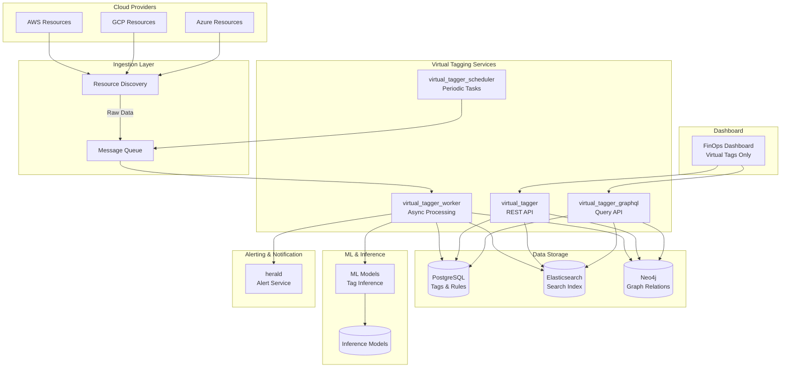
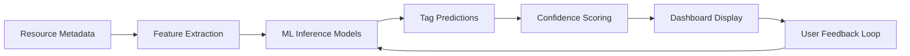

# Virtual Tagging in FinOps Platforms
  

## Overview

  

Virtual tagging in FinOps platforms enables unified, dynamic, and retroactive cost allocation across multi-cloud environments. This system displays only automated virtual tags on the dashboard, independent of native cloud provider tags. The architecture is designed to show inferred and applied tags exclusively through our platform, ensuring consistent financial governance without modifying cloud-native metadata.

  

## End-to-End Architecture

  

### High-Level Architecture

  

The Unified Virtual Tagging Service is implemented as one logical domain exposed through 4-5 technical APIs/layers, allowing each concern to scale independently while working together as a single product feature set.

The Virtual Tagging capability provides: unified tag schema, inference, governance, reporting, and change-driven alerting across AWS, Azure, and GCP resources.

### Microservices Architecture

The system consists of four microservices:

1. **`virtual_tagger`** - REST API for tag CRUD, search, schema, mappings, compliance, audit, and on-demand re-evaluation
2. **`virtual_tagger_worker`** - Asynchronous workers for ingestion, normalization, inference, propagation, compliance checks, and alert dispatch
3. **`virtual_tagger_scheduler`** - Time-based CronJobs for periodic maintenance, re-checks, and reports
4. **`virtual_tagger_graphql`** (optional) - GraphQL endpoint for complex queries, dashboards, and flexible client use cases

### Architecture Diagram




  

## Data Flow Architecture

  

### 1. Ingestion Data Flow

```

Cloud Provider Change → Resource Discovery → Message Queue → virtual_tagger_worker
↓
Normalization & Storage
↓
PostgreSQL + Search Indexes

```
**Detailed Flow:**

1. Cloud providers emit tag changes (AWS console, GCP labels, Azure tags)
2. `resource_discovery` service detects changes via APIs or periodic scans
3. Raw resource/tag snapshots pushed to `virtual_tags.ingestion` queue
4. `virtual_tagger_worker` consumes jobs and writes to database
5. Data indexed in Elasticsearch and Neo4j for querying

### 2. Inference Data Flow
```

Raw Data → Normalization → ML Inference → Virtual Tag Assignment → Storage

```

**Detailed Flow:**

1. Worker normalizes provider-specific tags using `tag_schema` and `tag_mappings`
2. ML models from `inference_models` infer missing required tags
3. Virtual tags applied based on rules and inference results
4. Results stored in PostgreSQL with provenance tracking
### 3. Compliance & Alerting Data Flow
```

Tag Change → Compliance Evaluation → Policy Check → Alert Generation → Notification

```

**Detailed Flow:**

1. Any tag change triggers compliance re-evaluation against `compliance_policies`
2. If violation detected (missing tags, rule breaks), update compliance state
3. Generate alert event to `herald` service via queue
4. Send notifications (email, Slack) to configured channels
5. Log audit trail in `tag_audit` table
### 4. Dashboard Display Data Flow
```
User Request → API Query → Data Retrieval → ML Enhancement → Dashboard Render
```

**Detailed Flow:**

1. Dashboard requests virtual tags via REST or GraphQL APIs
2. APIs query PostgreSQL/Elasticsearch for current virtual tags
3. ML models enhance display with confidence scores and suggestions
4. Only virtual tags shown - native cloud tags never displayed
5. Render dashboard with automated tags, compliance status, and alerts

### 5. Periodic Maintenance Data Flow


```

Scheduler Trigger → Queue Jobs → Worker Processing → Updates & Reports

```

  

**Detailed Flow:**

1. `virtual_tagger_scheduler` runs cron jobs for periodic tasks
2. Triggers re-ingestion, compliance sweeps, and cleanup jobs
3. Workers process queued jobs asynchronously
4. Updates database, generates reports, and sends summary alerts

  

## Machine Learning Integration for Dashboard Tags

  

### ML Model Architecture

  

The system uses machine learning to enhance virtual tag display and inference on the dashboard:

  



  

### ML Usage in Tag Display

  

#### 1. Tag Inference Models

- **Purpose**: Predict missing tags based on resource attributes
- **Input**: Resource type, name, configuration, usage patterns
- **Output**: Suggested virtual tags with confidence scores
- **Display**: Show inferred tags on dashboard with "AI Suggested" badges

#### 2. Confidence Scoring

- **Algorithm**: Ensemble of classification models (Random Forest, Neural Networks)
- **Features**: Historical tagging patterns, resource relationships, usage metrics
- **Output**: Confidence percentage for each inferred tag
- **Dashboard**: Color-coded confidence indicators (High: Green, Medium: Yellow, Low: Red)
#### 3. Tag Recommendation Engine

- **Purpose**: Suggest optimal tag values based on organizational patterns
- **Input**: Existing tags, business rules, cost center mappings
- **Output**: Ranked list of recommended tag values
- **Display**: "Recommended Tags" section on resource detail pages
#### 4. Anomaly Detection

- **Purpose**: Identify unusual tagging patterns or potential errors
- **Algorithm**: Isolation Forest, Autoencoders
- **Output**: Anomaly scores for tag combinations
- **Dashboard**: Highlight potentially incorrect tags with warning indicators

### ML Model Training Pipeline

  

```

Historical Data → Feature Engineering → Model Training → Validation → Deployment

```
1. **Data Collection**: Aggregate tagging history, resource metadata, user corrections
2. **Feature Engineering**: Extract patterns, relationships, contextual features
3. **Model Training**: Train models on labeled datasets with cross-validation
4. **Validation**: Test accuracy, precision, recall on holdout sets
5. **Deployment**: Deploy models to inference service with A/B testing

  

### Dashboard ML Features

  

#### Tag Prediction Panel

```

Resource: EC2 Instance i-1234567890abcdef0

Current Virtual Tags:

- environment: production (Confidence: 95%)
- team: engineering (AI Suggested)
- cost-center: platform (User Confirmed)
  

Suggested Tags:

- owner: john.doe@company.com (87% confidence)
- project: analytics-pipeline (73% confidence)

```

  

#### Compliance ML Insights

- Predict compliance violations before they occur
- Suggest remediation actions based on historical patterns
- Provide risk scoring for untagged resources
#### Cost Impact Analysis

- ML-driven cost allocation predictions
- Show potential savings from proper tagging
- Forecast cost trends based on tagging patterns

## API Specifications
### REST API (`virtual_tagger`)

#### Endpoints

- `GET /api/v1/resources/{id}/virtual-tags` - Get virtual tags for resource
- `POST /api/v1/virtual-tags/apply` - Apply virtual tags
- `GET /api/v1/compliance/status` - Get compliance status
- `POST /api/v1/compliance/recheck` - Trigger compliance re-evaluation

  

#### Response Format

```json

{
"resource_id": "i-1234567890abcdef0",
"virtual_tags": [
{
"key": "environment",
"value": "production",
"source": "inferred",
"confidence": 0.95,
"last_updated": "2025-11-17T12:30:00Z"
}

],
"compliance_status": "compliant",
"alerts": []
}

```

  

### GraphQL API (`virtual_tagger_graphql`)

  

#### Schema

```graphql

type Resource {
id: ID!
virtualTags: [VirtualTag!]!
complianceStatus: ComplianceStatus!
alerts: [Alert!]!
mlSuggestions: [TagSuggestion!]!
}

  

type VirtualTag {
key: String!
value: String!
source: TagSource!
confidence: Float
provenance: Provenance!

}

  

type TagSuggestion {
key: String!
value: String!
confidence: Float!
reasoning: String
}

```

  

### Message Queue APIs (`virtual_tagger_worker`)

#### Queues

- `virtual_tags.ingestion` - Resource and tag ingestion
- `virtual_tags.normalization` - Tag normalization and mapping
- `virtual_tags.inference` - ML-based tag inference
- `virtual_tags.compliance` - Compliance evaluation and alerting
- `virtual_tags.audit` - Audit logging and reporting

  

### Scheduler API (`virtual_tagger_scheduler`)

The scheduler service provides time-based job orchestration through Kubernetes CronJobs. It acts as a temporal API that triggers periodic maintenance tasks.
#### Configuration Interface

The scheduler is configured via Helm values and Kubernetes manifests rather than a traditional HTTP API. The "API" consists of:

- **Cron Expressions**: Define when jobs run (e.g., `0 */4 * * *` for every 4 hours)
- **Job Templates**: Define what tasks to execute
- **Queue Triggers**: Jobs that publish messages to worker queues
#### Key Scheduled Jobs

##### 1. Periodic Resource Re-ingestion
```yaml

# CronJob manifest example

apiVersion: batch/v1
kind: CronJob
metadata:
name: virtual-tagger-reingestion
spec:
schedule: "0 */6 * * *" # Every 6 hours
jobTemplate:
spec:
template:
spec:
containers:
- name: scheduler
image: virtual-tagger-scheduler:latest
command: ["python", "scheduler.py", "reingest-resources"]
```

  

**Purpose**: Re-synchronize resources and tags from cloud providers to catch missed events.
  
**Data Flow**:
```

Scheduler → Publish to virtual_tags.ingestion → Worker Processing → Database Update

```
##### 2. Compliance Sweep
```yaml

schedule: "0 2 * * *" # Daily at 2 AM
command: ["python", "scheduler.py", "compliance-sweep"]

```

**Purpose**: Periodic evaluation of all resources against compliance policies.

**Data Flow**:
```

Scheduler → Publish to virtual_tags.compliance → Worker Evaluation → Alert Generation

```
##### 3. ML Model Retraining
```yaml

schedule: "0 0 * * 1" # Weekly on Monday
command: ["python", "scheduler.py", "retrain-models"]

```

**Purpose**: Update ML models with new tagging data for improved inference.

**Data Flow**:
```

Scheduler → Collect Training Data → Retrain Models → Deploy New Versions

```
##### 4. Audit Data Cleanup
```yaml

schedule: "0 0 1 * *" # Monthly
command: ["python", "scheduler.py", "cleanup-audit"]

```

  

**Purpose**: Archive or delete old audit logs based on retention policies.

**Data Flow**:
```

Scheduler → Query Old Records → Archive/Delete → Update Indexes

```
##### 5. Report Generation
```yaml

schedule: "0 6 * * 1-5" # Weekdays at 6 AM
command: ["python", "scheduler.py", "generate-reports"]

```

  

**Purpose**: Create weekly compliance and tagging coverage reports.

**Data Flow**:
```

Scheduler → Aggregate Data → Generate Reports → Send to Stakeholders

```
#### Scheduler Configuration API

The scheduler exposes a configuration interface through:

- **Helm Values**:

```yaml

scheduler:
jobs:
reingestion:
schedule: "0 */6 * * *"
enabled: true
complianceSweep:
schedule: "0 2 * * *"
enabled: true
modelRetraining:
schedule: "0 0 * * 1"
enabled: true

```
- **ConfigMap Updates**: Dynamic configuration changes via Kubernetes ConfigMaps
- **Metrics Endpoint**: `/metrics` for monitoring job execution and success rates

#### Monitoring and Observability

The scheduler provides:

- Prometheus metrics for job duration, success/failure rates
- Logs for each job execution
- Alerts for failed or delayed jobs
- Dashboard integration for job status monitoring

## Security and Compliance

### Data Isolation

- Virtual tags stored separately from native cloud tags
- Dashboard displays only virtual tags - no exposure of cloud-native metadata
- Encrypted storage for sensitive tag data
### Access Control

- RBAC for tag management operations
- Audit trails for all tag changes
- Compliance reporting for regulatory requirements
### Alerting System

- Change-driven alerts for tag modifications
- Compliance violation notifications
- Periodic summary reports
## Deployment and Scaling

### Infrastructure Requirements

- Kubernetes cluster for microservices
- PostgreSQL for transactional data
- Elasticsearch for search capabilities
- Neo4j for relationship modeling
- RabbitMQ for message queuing
### Scaling Strategy

- REST API scales on request volume
- Workers scale on queue depth
- Scheduler uses CronJobs for periodic tasks
- GraphQL API scales independently for complex queries
## Conclusion

This virtual tagging architecture ensures that only automated, platform-managed tags are displayed on the FinOps dashboard, providing a unified view across multi-cloud environments. The microservices design enables independent scaling, robust ML integration for intelligent tag suggestions, and comprehensive alerting for compliance monitoring. The system maintains complete separation from native cloud tags while providing advanced features for cost allocation and financial governance.