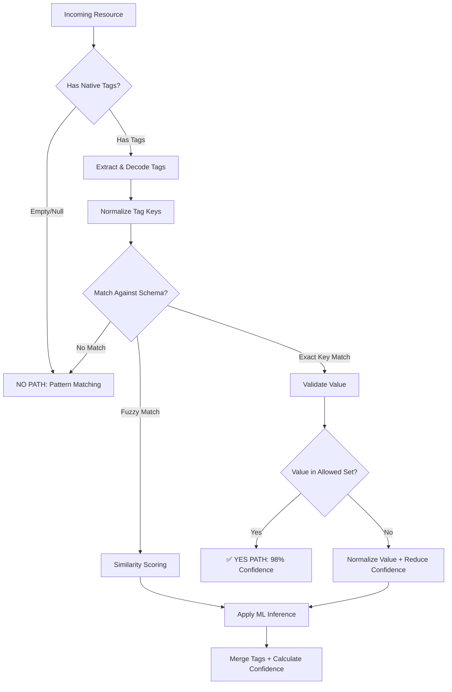
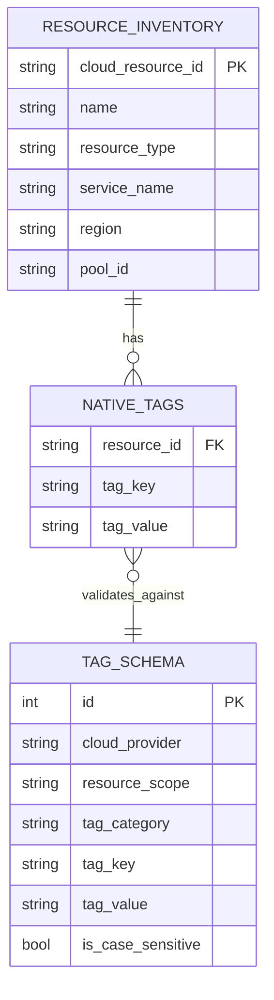
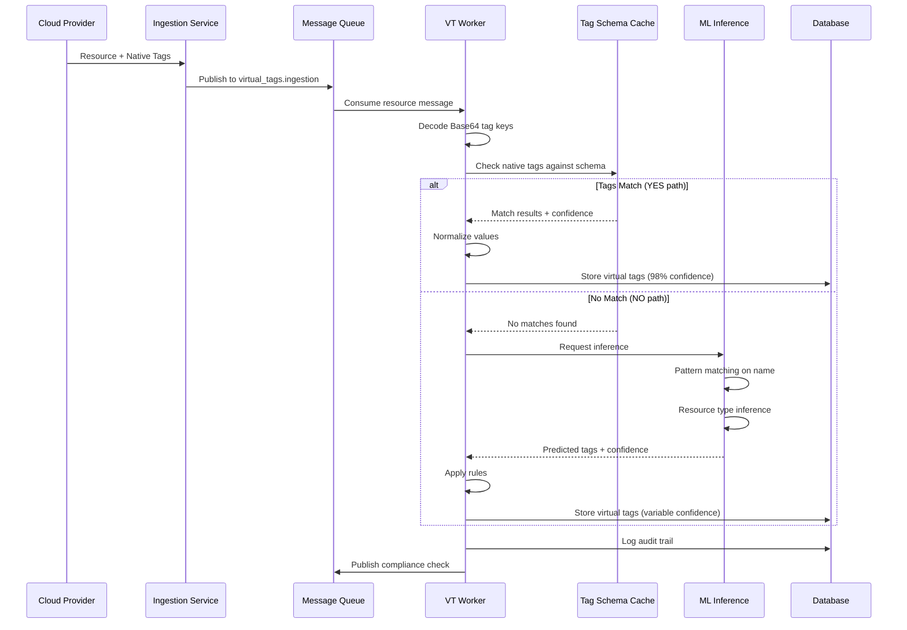

# Virtual Tags Native Mapping Analysis
## Multi-Cloud Resource Tagger Solution Architecture

> **Document Purpose**: End-to-end analysis of the native tag checking process, mapping strategy between the two data sources, and query optimization recommendations.

---

## 1. Executive Summary

This document addresses the core challenge of mapping native cloud tags from `restapi.resources` (70,708 resources) to the predefined tag schema in `cloud_resource_tags_complete` (226 schema definitions) for the "Check Native Tag" step in the Virtual Tagging workflow.

### The Core Problem


The workflow shows:
1. **Untagged Resource → ML Infrastructure → Check Native Tag** (the critical decision point)
2. If YES → **Exact & Normalize 98% Confidence**
3. If NO → **Pattern Matching on Name → Resource Type Inference → Apply Rules**
4. Both paths merge into **Confidence Scoring** and eventual approval/rejection workflow

---

## 2. Data Source Analysis

### 2.1 Schema Definition Table (`cloud_resource_tags_complete 1.xlsx`)

| Column | Description | Purpose |
|--------|-------------|---------|
| `cloud_provider` | All, AWS, GCP, Azure | Scope filtering |
| `resource_scope` | Global, Compute, Storage, etc. | Resource type targeting |
| `tag_category` | **Critical**, Non-Critical, Optional | Priority for validation |
| `tag_key` | Standardized key name (e.g., "Environment") | **Match target** |
| `tag_value` | Allowed values (e.g., "prod", "staging") | **Validation set** |
| `is_case_sensitive` | Boolean | Matching behavior |

**Key Insight**: This is your **Tag Schema Registry** - the "golden source" that defines:
- What tags SHOULD exist
- What values are VALID 
- How critical each tag is

### 2.2 Resource Metadata Table (`restapi.resources (1).xlsx`)

| Column Type | Examples | Purpose |
|-------------|----------|---------|
| **Resource Identity** | `cloud_resource_id`, `name`, `pool_id` | Unique identification |
| **Resource Metadata** | `resource_type`, `service_name`, `region` | Classification |
| **Native Tags** | `tags.*` (Base64 encoded) | Raw cloud provider tags |
| **System Metadata** | `meta.os`, `meta.vpc_id`, etc. | Inference features |

**Key Insight**: This is your **Resource Inventory** with actual tags from AWS/GCP/Azure in Base64-encoded format.

---

## 3. The "Check Native Tag" Algorithm

### 3.1 Conceptual Flow



### 3.2 Implementation Strategy

#### Step 1: Extract & Decode Native Tags

The native tags in `restapi.resources` are Base64 encoded. Example:
- `tags.RW52` → decodes to → `Env`
- `tags.U1RBR0U=` → decodes to → `STAGE`
- `tags.UHJvamVjdA==` → decodes to → `Project`

```python
import base64

def decode_tag_columns(df):
    """Decode Base64 tag column names to readable format"""
    tag_mapping = {}
    for col in df.columns:
        if col.startswith('tags.'):
            encoded = col.replace('tags.', '')
            try:
                decoded = base64.b64decode(encoded).decode('utf-8')
                tag_mapping[col] = decoded
            except:
                tag_mapping[col] = encoded  # Keep original if decode fails
    return tag_mapping
```

#### Step 2: Build Tag Lookup Index (Query Optimization)

> [!IMPORTANT]
> **This is the key to reducing query time**: Pre-compute a lookup index instead of scanning the entire schema for each resource.

```python
def build_tag_schema_index(schema_df):
    """
    Create optimized lookup structures for O(1) matching
    instead of O(n) table scans
    """
    index = {
        'key_lookup': {},        # tag_key → {values, category, case_sensitive}
        'value_lookup': {},      # (key, value) → {category, is_valid}
        'key_variations': {},    # lowercase_key → [original_keys]
    }
    
    for _, row in schema_df.iterrows():
        key = row['tag_key']
        value = row['tag_value']
        category = row['tag_category']
        case_sensitive = row['is_case_sensitive']
        
        # Key lookup for existence check
        if key not in index['key_lookup']:
            index['key_lookup'][key] = {
                'values': set(),
                'category': category,
                'case_sensitive': case_sensitive
            }
        index['key_lookup'][key]['values'].add(value)
        
        # Value lookup for validation
        index['value_lookup'][(key, value)] = {
            'category': category,
            'is_valid': True
        }
        
        # Case-insensitive key variations
        lower_key = key.lower()
        if lower_key not in index['key_variations']:
            index['key_variations'][lower_key] = []
        if key not in index['key_variations'][lower_key]:
            index['key_variations'][lower_key].append(key)
    
    return index
```

#### Step 3: Native Tag Checking Algorithm

```python
def check_native_tag(resource_row, decoded_tags, schema_index):
    """
    Core "Check Native Tag" implementation
    Returns: (has_match: bool, matches: list, confidence: float)
    """
    matches = []
    total_score = 0
    tag_count = 0
    
    for col, decoded_key in decoded_tags.items():
        value = resource_row.get(col)
        if pd.isna(value):
            continue
            
        tag_count += 1
        
        # Step 1: Try exact key match
        if decoded_key in schema_index['key_lookup']:
            key_info = schema_index['key_lookup'][decoded_key]
            
            # Step 2: Validate value
            if value in key_info['values']:
                # Perfect match - 98% confidence
                matches.append({
                    'native_key': decoded_key,
                    'native_value': value,
                    'matched_key': decoded_key,
                    'matched_value': value,
                    'match_type': 'EXACT',
                    'confidence': 0.98,
                    'category': key_info['category']
                })
                total_score += 0.98
            else:
                # Key matches but value not in allowed set
                # Attempt value normalization
                normalized = normalize_value(value, key_info['values'])
                matches.append({
                    'native_key': decoded_key,
                    'native_value': value,
                    'matched_key': decoded_key,
                    'matched_value': normalized['value'],
                    'match_type': 'NORMALIZED_VALUE',
                    'confidence': normalized['confidence'],
                    'category': key_info['category']
                })
                total_score += normalized['confidence']
        
        # Step 3: Try case-insensitive / fuzzy key match
        else:
            lower_key = decoded_key.lower()
            if lower_key in schema_index['key_variations']:
                canonical_keys = schema_index['key_variations'][lower_key]
                # Use first match (could prioritize by category)
                canonical_key = canonical_keys[0]
                key_info = schema_index['key_lookup'][canonical_key]
                
                matches.append({
                    'native_key': decoded_key,
                    'native_value': value,
                    'matched_key': canonical_key,
                    'matched_value': value,
                    'match_type': 'FUZZY_KEY',
                    'confidence': 0.85,
                    'category': key_info['category']
                })
                total_score += 0.85
    
    if tag_count == 0:
        return (False, [], 0.0)
    
    avg_confidence = total_score / tag_count
    has_match = len(matches) > 0
    
    return (has_match, matches, avg_confidence)
```

---

## 4. Mapping Architecture

### 4.1 The Two-Table Relationship



### 4.2 Query Optimization Strategies

#### Strategy 1: In-Memory Index (Recommended for < 100K resources)

```python
# At startup / cache refresh
schema_index = build_tag_schema_index(schema_df)

# For each resource - O(1) lookup per tag
for resource in resources:
    has_match, matches, confidence = check_native_tag(resource, decoded_tags, schema_index)
```

#### Strategy 2: Database-Level Optimization

```sql
-- Create materialized view for fast lookups
CREATE MATERIALIZED VIEW tag_schema_lookup AS
SELECT 
    LOWER(tag_key) as normalized_key,
    tag_key as canonical_key,
    tag_value,
    tag_category,
    is_case_sensitive,
    cloud_provider,
    resource_scope
FROM cloud_resource_tags
WITH DATA;

-- Create indexes for fast lookups
CREATE INDEX idx_tag_lookup_key ON tag_schema_lookup(normalized_key);
CREATE INDEX idx_tag_lookup_value ON tag_schema_lookup(canonical_key, tag_value);
```

#### Strategy 3: Redis Cache for Production Scale

```python
import redis
import json

def populate_redis_cache(schema_df, redis_client):
    """Cache schema in Redis for distributed access"""
    for _, row in schema_df.iterrows():
        key = f"tag_schema:{row['tag_key'].lower()}"
        value = {
            'canonical_key': row['tag_key'],
            'category': row['tag_category'],
            'case_sensitive': row['is_case_sensitive'],
            'provider': row['cloud_provider'],
            'scope': row['resource_scope']
        }
        # Add to set of valid values for this key
        redis_client.sadd(f"{key}:values", row['tag_value'])
        redis_client.set(key, json.dumps(value))

def check_tag_from_redis(native_key, native_value, redis_client):
    """O(1) Redis lookup for tag validation"""
    key = f"tag_schema:{native_key.lower()}"
    schema_info = redis_client.get(key)
    
    if not schema_info:
        return None  # No match
    
    schema = json.loads(schema_info)
    is_valid_value = redis_client.sismember(f"{key}:values", native_value)
    
    return {
        'matched': True,
        'canonical_key': schema['canonical_key'],
        'category': schema['category'],
        'value_valid': is_valid_value,
        'confidence': 0.98 if is_valid_value else 0.85
    }
```

---

## 5. Confidence Scoring Deep Dive

### 5.1 The Formula (From Workflow Diagram)

The workflow diagram shows the confidence calculation:

```
Confidence Score = Tag Key Match (40%) + Tag Value Match (50%) + Category Weight (10%)
```

### 5.2 Implementation

```python
def calculate_confidence_score(matches):
    """
    Calculate weighted confidence score based on matches
    """
    if not matches:
        return 0.0
    
    category_weights = {
        'Critical': 1.0,      # Environment, Owner, CostCenter - must have
        'Non-Critical': 0.7,  # Project, Team - nice to have
        'Optional': 0.4       # Version, ManagedBy - optional
    }
    
    total_score = 0
    total_weight = 0
    
    for match in matches:
        # Base confidence from match type
        key_match_score = 0.4 if match['match_type'] in ['EXACT', 'NORMALIZED_VALUE'] else 0.2
        
        # Value match score
        if match['match_type'] == 'EXACT':
            value_match_score = 0.5
        elif match['match_type'] == 'NORMALIZED_VALUE':
            value_match_score = 0.4
        else:
            value_match_score = 0.2
        
        # Category weight
        category_weight = category_weights.get(match['category'], 0.5) * 0.1
        
        match_score = key_match_score + value_match_score + category_weight
        total_score += match_score
        total_weight += 1
    
    return min(total_score / total_weight, 1.0) if total_weight > 0 else 0.0
```

### 5.3 Decision Thresholds

From the workflow diagram:

| Score Range | Action | Workflow Path |
|-------------|--------|---------------|
| **≥ 90%** | Auto-Approve | Direct to virtual tag application |
| **70-89%** | Auto-Apply as Pending | Goes to Approval Workflow |
| **50-69%** | Store as Suggestion | Manual Review required |
| **< 50%** | Reject | No virtual tag applied |

---

## 6. End-to-End Processing Pipeline

### 6.1 Complete Flow



### 6.2 Code Structure

```
virtual_tagger/
├── services/
│   ├── tag_schema_service.py     # Schema index building & caching
│   ├── tag_decoder_service.py    # Base64 decoding utilities
│   ├── native_tag_checker.py     # "Check Native Tag" implementation
│   ├── confidence_calculator.py  # Confidence scoring
│   └── tag_normalizer.py         # Value normalization
├── workers/
│   ├── ingestion_worker.py       # Process incoming resources
│   ├── inference_worker.py       # ML-based tag inference
│   └── compliance_worker.py      # Policy validation
├── models/
│   ├── resource.py               # Resource data model
│   ├── virtual_tag.py            # Virtual tag data model
│   └── tag_match.py              # Match result data model
└── cache/
    ├── redis_cache.py            # Redis integration
    └── memory_cache.py           # In-memory caching
```

---

## 7. Query Optimization Summary

### 7.1 The Problem

Scanning 226 schema rows × 70,708 resources × 63 tag columns = **~1 billion comparisons** if done naively.

### 7.2 The Solution: Pre-computed Index

| Approach | Time Complexity | Best For |
|----------|-----------------|----------|
| **Naive Scan** | O(resources × schema × tags) | Never |
| **In-Memory Index** | O(resources × tags) | < 100K resources |
| **Redis Cache** | O(resources × tags) | Distributed systems |
| **DB Materialized View** | O(resources × tags) | SQL-heavy workflows |

### 7.3 Performance Expectations

With proper indexing:
- **Per-resource check**: ~1-5ms
- **70K resources full scan**: ~5-10 minutes (parallelizable)
- **Incremental check**: Real-time (< 10ms per resource)

---

## 8. Recommended Implementation Steps

### Phase 1: Schema Index Creation

1. Load `cloud_resource_tags_complete` into memory
2. Build hash-based lookup indexes
3. Cache in Redis for distributed access

### Phase 2: Decoder Layer

1. Pre-decode all Base64 tag column names
2. Create mapping dictionary: `encoded_column → decoded_key`
3. Cache the mapping for reuse

### Phase 3: Native Tag Checker

1. For each resource, iterate through non-null tag columns
2. Decode tag key, look up in schema index
3. Validate value, calculate per-tag confidence
4. Aggregate to resource-level confidence

### Phase 4: Decision Router

1. If confidence ≥ 90%: Auto-approve path
2. If confidence 70-89%: Pending approval path
3. If confidence 50-69%: Suggestion path
4. If confidence < 50%: Rejection path (trigger ML inference)

---

## 9. Key Architectural Decisions

### Decision 1: Schema is Source of Truth

The `cloud_resource_tags_complete` file defines what tags **should** exist. Any tag not in this schema is either:
- A candidate for ML inference
- A suggestion for schema expansion
- An "unknown" tag to be categorized

### Decision 2: Decode Once, Match Many

Base64 decoding should happen **once** at ingestion, not at query time. Store decoded keys in a normalized format.

### Decision 3: Category Drives Priority

- **Critical tags** (Environment, Owner, CostCenter) must match for high confidence
- **Non-Critical tags** improve confidence but aren't required
- **Optional tags** are nice-to-have

### Decision 4: Confidence is Cumulative

The more tags that match with valid values, the higher the overall confidence. A resource with 5 matching Critical tags beats one with 10 Optional tags.

---

## 10. Next Steps

1. **Implement the `build_tag_schema_index()` function** - Convert schema Excel to optimized lookup structure

2. **Create Base64 decoder mapping** - One-time decode of all tag column names

3. **Build the Native Tag Checker service** - Core logic for the "Check Native Tag" decision

4. **Integrate with existing VT Worker** - Plug into the ingestion pipeline

5. **Add Redis caching** - For production-scale performance

6. **Create monitoring dashboards** - Track match rates, confidence distributions, and processing times

---

> **Document Created**: 2025-12-11  
> **Author**: AI Solution Architect  
> **Status**: Ready for Implementation Review
