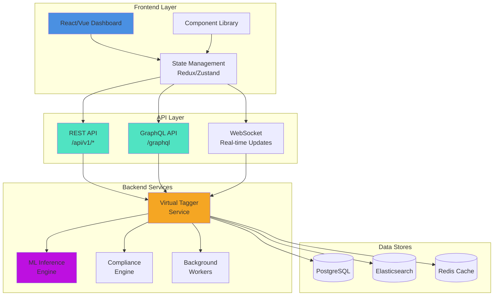
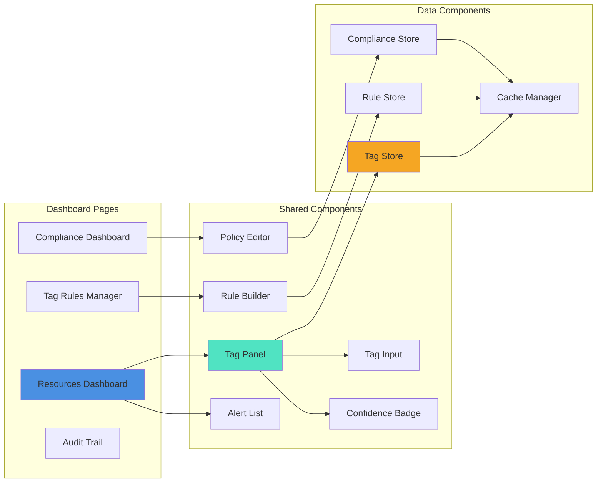
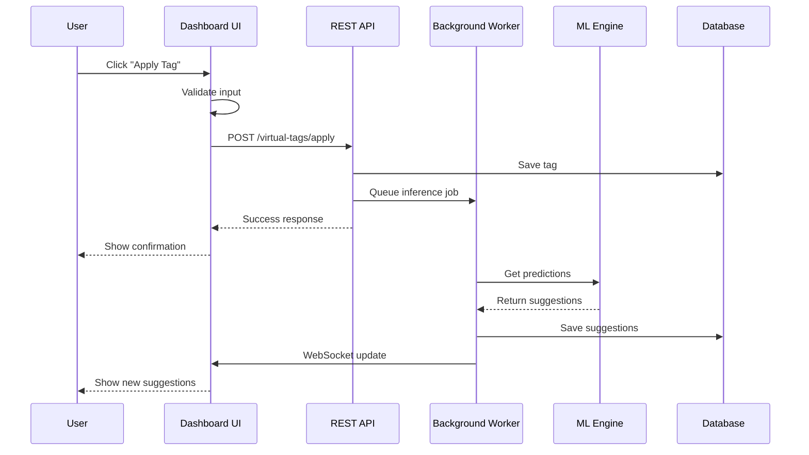
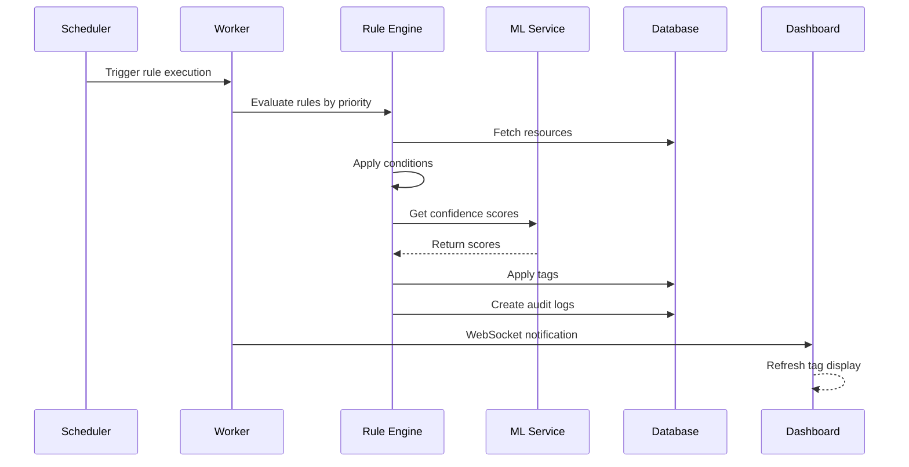
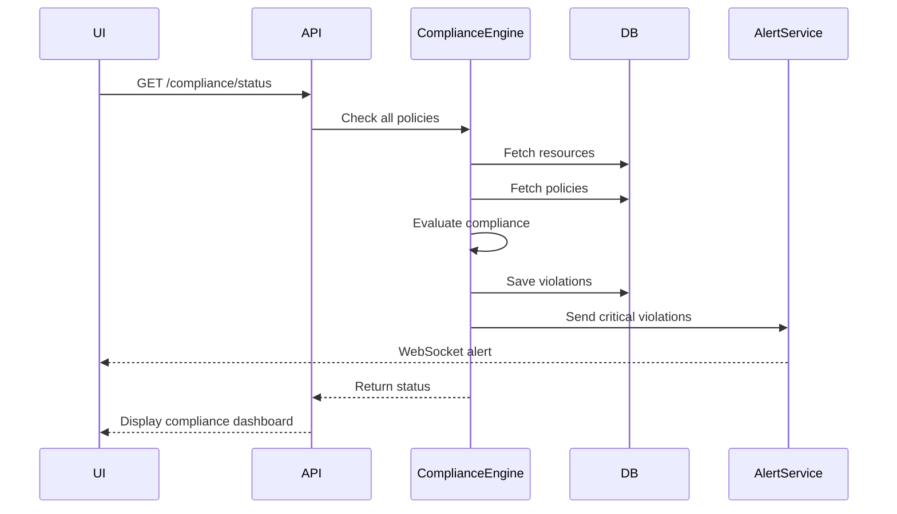

# Virtual Tags - Frontend Developer Guide
## CloudTuner Virtual Tagging System - UI/UX Implementation Guide

**Last Updated**: 2025-11-25  
**Audience**: Frontend Developers, UI/UX Designers  
**Prerequisites**: React/Vue.js, REST/GraphQL basics

---

## 📋 Table of Contents

1. [Quick Start](#quick-start)
2. [System Architecture](#system-architecture)
3. [API Integration](#api-integration)
4. [Component Library](#component-library)
5. [Data Flow](#data-flow)
6. [UI/UX Guidelines](#uiux-guidelines)
7. [Code Examples](#code-examples)
8. [Best Practices](#best-practices)

---

## 🚀 Quick Start

### What is Virtual Tagging?

Virtual tags are **metadata labels** applied to cloud resources (EC2, S3, VMs, etc.) **without modifying the actual cloud resources**. Think of it as a layer of smart labels that help organize and track cloud costs.

**Key Concept**: The dashboard shows **ONLY virtual tags**, never the native cloud tags.

### Frontend's Role

Your job is to build interfaces that let users:
- ✅ View virtual tags on resources with confidence indicators
- ✅ Apply tags manually or accept AI suggestions
- ✅ Create automation rules for bulk tagging
- ✅ Monitor compliance and fix violations
- ✅ Track tag changes in audit trail

---

## 🏗️ System Architecture

### High-Level Architecture Diagram



### Component Architecture



---

## 🔌 API Integration

### REST API Endpoints

#### Base URL
```javascript
const API_BASE = 'https://api.cloudtuner.ai/api/v1';
```

#### Authentication
```javascript
// All requests require JWT token
const headers = {
  'Authorization': `Bearer ${localStorage.getItem('jwt_token')}`,
  'Content-Type': 'application/json'
};
```

### Key Endpoints for Frontend

#### 1. Get Resource with Virtual Tags

```javascript
// GET /api/v1/resources/{resourceId}/virtual-tags
async function getResourceTags(resourceId) {
  const response = await fetch(`${API_BASE}/resources/${resourceId}/virtual-tags`, {
    headers
  });
  return await response.json();
}

// Response structure:
{
  "resource_id": "uuid",
  "resource_name": "web-server-prod-001",
  "provider": "aws",
  "resource_type": "ec2",
  "virtual_tags": [
    {
      "key": "environment",
      "value": "production",
      "source": "INFERRED",
      "confidence": 0.95,
      "created_at": "2025-11-25T10:00:00Z",
      "updated_at": "2025-11-25T10:00:00Z"
    }
  ],
  "ml_suggestions": [
    {
      "key": "owner",
      "value": "platform-team@company.com",
      "confidence": 0.89,
      "reasoning": "Based on similar resources"
    }
  ],
  "compliance_status": {
    "is_compliant": true,
    "score": 1.0,
    "violations": []
  }
}
```

#### 2. Apply Tags

```javascript
// POST /api/v1/virtual-tags/apply
async function applyTags(resourceIds, tags) {
  const response = await fetch(`${API_BASE}/virtual-tags/apply`, {
    method: 'POST',
    headers,
    body: JSON.stringify({
      resource_ids: resourceIds,
      tags: tags,
      source: 'MANUAL',
      reason: 'User applied from dashboard'
    })
  });
  return await response.json();
}

// Usage:
await applyTags(
  ['resource-uuid-1', 'resource-uuid-2'],
  [
    { key: 'environment', value: 'production', override_existing: true },
    { key: 'team', value: 'platform', override_existing: false }
  ]
);
```

#### 3. Get Tag Rules

```javascript
// GET /api/v1/tag-rules?enabled=true&limit=50
async function getTagRules(filters = {}) {
  const params = new URLSearchParams(filters);
  const response = await fetch(`${API_BASE}/tag-rules?${params}`, {
    headers
  });
  return await response.json();
}

// Response:
{
  "rules": [
    {
      "id": "uuid",
      "rule_name": "Auto-tag Production",
      "enabled": true,
      "priority": 1,
      "conditions": { /* ... */ },
      "actions": { /* ... */ }
    }
  ],
  "pagination": {
    "total": 25,
    "limit": 50,
    "offset": 0
  }
}
```

#### 4. Get Compliance Status

```javascript
// GET /api/v1/compliance/status
async function getComplianceStatus() {
  const response = await fetch(`${API_BASE}/compliance/status`, {
    headers
  });
  return await response.json();
}

// Response:
{
  "overall_compliance_score": 0.87,
  "total_resources": 2500,
  "compliant_resources": 2175,
  "non_compliant_resources": 325,
  "by_severity": {
    "CRITICAL": { "total_violations": 45 },
    "HIGH": { "total_violations": 123 }
  }
}
```

#### 5. Get ML Predictions

```javascript
// POST /api/v1/ml/infer
async function getMLPredictions(resourceIds) {
  const response = await fetch(`${API_BASE}/ml/infer`, {
    method: 'POST',
    headers,
    body: JSON.stringify({
      resource_ids: resourceIds,
      include_alternatives: true,
      min_confidence: 0.7
    })
  });
  return await response.json();
}
```

### GraphQL Integration

#### Setup Apollo Client

```javascript
import { ApolloClient, InMemoryCache, gql } from '@apollo/client';

const client = new ApolloClient({
  uri: 'https://api.cloudtuner.ai/graphql',
  cache: new InMemoryCache(),
  headers: {
    'Authorization': `Bearer ${localStorage.getItem('jwt_token')}`
  }
});
```

#### Query Resource Tags

```javascript
const GET_RESOURCE_TAGS = gql`
  query GetResourceTags($id: ID!) {
    resource(id: $id) {
      id
      name
      provider
      resourceType
      virtualTags {
        key
        value
        source
        confidence
        createdAt
      }
      mlSuggestions {
        key
        value
        confidence
        reasoning
        alternatives {
          value
          confidence
        }
      }
      complianceStatus {
        isCompliant
        score
        violations {
          violationType
          severity
          description
        }
      }
    }
  }
`;

// Usage in component:
const { data, loading, error } = useQuery(GET_RESOURCE_TAGS, {
  variables: { id: resourceId }
});
```

#### Mutation - Apply Tags

```javascript
const APPLY_TAGS = gql`
  mutation ApplyTags($input: ApplyTagsInput!) {
    applyVirtualTags(input: $input) {
      success
      tagsApplied
      resourcesUpdated
      errors
    }
  }
`;

// Usage:
const [applyTags] = useMutation(APPLY_TAGS);

await applyTags({
  variables: {
    input: {
      resourceIds: [resourceId],
      tags: [
        { key: 'environment', value: 'production', overrideExisting: true }
      ],
      source: 'MANUAL'
    }
  }
});
```

---

## 🎨 Component Library

### 1. Tag Panel Component

Shows all virtual tags for a resource with AI suggestions.

```jsx
import React, { useState, useEffect } from 'react';
import { getResourceTags } from '../api/tags';

function TagPanel({ resourceId }) {
  const [data, setData] = useState(null);
  const [loading, setLoading] = useState(true);

  useEffect(() => {
    async function loadTags() {
      const result = await getResourceTags(resourceId);
      setData(result);
      setLoading(false);
    }
    loadTags();
  }, [resourceId]);

  if (loading) return <div>Loading tags...</div>;

  return (
    <div className="tag-panel">
      <h3>Virtual Tags</h3>
      
      {/* Existing Tags */}
      <div className="tag-list">
        {data.virtual_tags.map(tag => (
          <TagBadge
            key={tag.key}
            tag={tag}
            onEdit={() => handleEdit(tag)}
            onDelete={() => handleDelete(tag)}
          />
        ))}
      </div>

      {/* Compliance Status */}
      {!data.compliance_status.is_compliant && (
        <ComplianceAlert violations={data.compliance_status.violations} />
      )}

      {/* AI Suggestions */}
      {data.ml_suggestions.length > 0 && (
        <div className="suggestions">
          <h4>AI Suggestions</h4>
          {data.ml_suggestions.map(suggestion => (
            <SuggestionCard
              key={suggestion.key}
              suggestion={suggestion}
              onAccept={() => handleAccept(suggestion)}
              onReject={() => handleReject(suggestion)}
            />
          ))}
        </div>
      )}

      {/* Add New Tag */}
      <TagInput onAdd={handleAddTag} />
    </div>
  );
}

export default TagPanel;
```

### 2. Tag Badge Component

Visual representation of a tag with confidence indicator.

```jsx
function TagBadge({ tag, onEdit, onDelete }) {
  const getConfidenceColor = (confidence) => {
    if (confidence >= 0.9) return 'green';
    if (confidence >= 0.7) return 'yellow';
    return 'red';
  };

  const getSourceIcon = (source) => {
    switch(source) {
      case 'INFERRED': return '🤖';
      case 'RULE_BASED': return '⚙️';
      case 'USER_CONFIRMED': return '✓';
      case 'MANUAL': return '✏️';
      default: return '📌';
    }
  };

  return (
    <div className="tag-badge">
      <span className="tag-icon">{getSourceIcon(tag.source)}</span>
      <span className="tag-key">{tag.key}:</span>
      <span className="tag-value">{tag.value}</span>
      
      {tag.confidence && (
        <span 
          className="confidence-indicator"
          style={{ color: getConfidenceColor(tag.confidence) }}
        >
          {Math.round(tag.confidence * 100)}%
        </span>
      )}
      
      <button onClick={onEdit} className="edit-btn">✎</button>
      <button onClick={onDelete} className="delete-btn">✕</button>
    </div>
  );
}
```

**CSS Styling:**

```css
.tag-badge {
  display: inline-flex;
  align-items: center;
  gap: 8px;
  padding: 8px 12px;
  background: linear-gradient(135deg, #667eea 0%, #764ba2 100%);
  border-radius: 8px;
  color: white;
  font-size: 14px;
  margin: 4px;
  box-shadow: 0 2px 8px rgba(0,0,0,0.1);
}

.tag-key {
  font-weight: 600;
}

.tag-value {
  background: rgba(255,255,255,0.2);
  padding: 2px 8px;
  border-radius: 4px;
}

.confidence-indicator {
  font-size: 12px;
  font-weight: bold;
  padding: 2px 6px;
  background: rgba(0,0,0,0.2);
  border-radius: 4px;
}
```

### 3. Suggestion Card Component

AI tag suggestions with accept/reject actions.

```jsx
function SuggestionCard({ suggestion, onAccept, onReject }) {
  const [expanded, setExpanded] = useState(false);

  return (
    <div className="suggestion-card">
      <div className="suggestion-header">
        <span className="ai-icon">🤖</span>
        <div className="suggestion-content">
          <div className="suggestion-tag">
            <strong>{suggestion.key}:</strong> {suggestion.value}
          </div>
          <div className="confidence-bar">
            <div 
              className="confidence-fill"
              style={{ width: `${suggestion.confidence * 100}%` }}
            />
            <span className="confidence-text">
              {Math.round(suggestion.confidence * 100)}% confident
            </span>
          </div>
        </div>
      </div>

      {suggestion.reasoning && (
        <div className="suggestion-reasoning">
          💡 {suggestion.reasoning}
        </div>
      )}

      {suggestion.alternatives && suggestion.alternatives.length > 0 && (
        <div className="alternatives">
          <button onClick={() => setExpanded(!expanded)}>
            {expanded ? '▼' : '▶'} Show alternatives
          </button>
          {expanded && (
            <div className="alternative-list">
              {suggestion.alternatives.map(alt => (
                <div key={alt.value} className="alternative-item">
                  {alt.value} ({Math.round(alt.confidence * 100)}%)
                </div>
              ))}
            </div>
          )}
        </div>
      )}

      <div className="suggestion-actions">
        <button onClick={onAccept} className="accept-btn">
          ✓ Accept
        </button>
        <button onClick={onReject} className="reject-btn">
          ✕ Reject
        </button>
      </div>
    </div>
  );
}
```

### 4. Compliance Alert Component

Shows compliance violations with remediation options.

```jsx
function ComplianceAlert({ violations }) {
  const getSeverityColor = (severity) => {
    switch(severity) {
      case 'CRITICAL': return '#E74C3C';
      case 'HIGH': return '#E67E22';
      case 'MEDIUM': return '#F39C12';
      case 'LOW': return '#3498DB';
      default: return '#95A5A6';
    }
  };

  return (
    <div className="compliance-alert">
      <div className="alert-header">
        ⚠️ Compliance Issues Detected
      </div>
      {violations.map((violation, idx) => (
        <div 
          key={idx}
          className="violation-item"
          style={{ borderLeft: `4px solid ${getSeverityColor(violation.severity)}` }}
        >
          <div className="violation-severity">{violation.severity}</div>
          <div className="violation-desc">{violation.description}</div>
          
          {violation.missing_tags && (
            <div className="missing-tags">
              Missing tags: {violation.missing_tags.join(', ')}
            </div>
          )}

          <button className="remediate-btn">
            🔧 Auto-fix
          </button>
        </div>
      ))}
    </div>
  );
}
```

### 5. Tag Input Component

Add new tags with autocomplete.

```jsx
function TagInput({ onAdd, existingTags = [] }) {
  const [key, setKey] = useState('');
  const [value, setValue] = useState('');
  const [suggestions, setSuggestions] = useState([]);

  const commonTags = [
    'environment', 'cost-center', 'owner', 'project', 
    'team', 'application', 'business-unit', 'data-classification'
  ];

  const handleKeyChange = (input) => {
    setKey(input);
    const matches = commonTags.filter(tag => 
      tag.toLowerCase().includes(input.toLowerCase())
    );
    setSuggestions(matches);
  };

  const handleSubmit = () => {
    if (key && value) {
      onAdd({ key, value, override_existing: false });
      setKey('');
      setValue('');
      setSuggestions([]);
    }
  };

  return (
    <div className="tag-input">
      <div className="input-group">
        <input
          type="text"
          placeholder="Tag key (e.g., environment)"
          value={key}
          onChange={(e) => handleKeyChange(e.target.value)}
          list="tag-suggestions"
        />
        <datalist id="tag-suggestions">
          {suggestions.map(tag => (
            <option key={tag} value={tag} />
          ))}
        </datalist>

        <input
          type="text"
          placeholder="Tag value (e.g., production)"
          value={value}
          onChange={(e) => setValue(e.target.value)}
        />

        <button onClick={handleSubmit} className="add-btn">
          + Add Tag
        </button>
      </div>
    </div>
  );
}
```

### 6. Rule Builder Component

Visual builder for tag automation rules.

```jsx
function RuleBuilder({ onSave }) {
  const [rule, setRule] = useState({
    rule_name: '',
    priority: 1,
    conditions: {
      operator: 'OR',
      rules: []
    },
    actions: {
      apply_tags: []
    }
  });

  const addCondition = () => {
    setRule({
      ...rule,
      conditions: {
        ...rule.conditions,
        rules: [
          ...rule.conditions.rules,
          { field: 'name', operator: 'CONTAINS', value: '' }
        ]
      }
    });
  };

  const addAction = () => {
    setRule({
      ...rule,
      actions: {
        apply_tags: [
          ...rule.actions.apply_tags,
          { tag_key: '', tag_value: '', override_existing: false }
        ]
      }
    });
  };

  return (
    <div className="rule-builder">
      <h3>Create Tag Rule</h3>

      <div className="rule-basic">
        <input
          placeholder="Rule Name"
          value={rule.rule_name}
          onChange={(e) => setRule({...rule, rule_name: e.target.value})}
        />
        <input
          type="number"
          placeholder="Priority"
          value={rule.priority}
          onChange={(e) => setRule({...rule, priority: parseInt(e.target.value)})}
        />
      </div>

      <div className="rule-conditions">
        <h4>Conditions</h4>
        <select 
          value={rule.conditions.operator}
          onChange={(e) => setRule({
            ...rule,
            conditions: {...rule.conditions, operator: e.target.value}
          })}
        >
          <option value="AND">Match ALL conditions</option>
          <option value="OR">Match ANY condition</option>
        </select>

        {rule.conditions.rules.map((condition, idx) => (
          <ConditionRow
            key={idx}
            condition={condition}
            onChange={(updated) => {
              const newRules = [...rule.conditions.rules];
              newRules[idx] = updated;
              setRule({
                ...rule,
                conditions: {...rule.conditions, rules: newRules}
              });
            }}
          />
        ))}

        <button onClick={addCondition}>+ Add Condition</button>
      </div>

      <div className="rule-actions">
        <h4>Actions</h4>
        {rule.actions.apply_tags.map((tag, idx) => (
          <ActionRow
            key={idx}
            tag={tag}
            onChange={(updated) => {
              const newTags = [...rule.actions.apply_tags];
              newTags[idx] = updated;
              setRule({
                ...rule,
                actions: {apply_tags: newTags}
              });
            }}
          />
        ))}

        <button onClick={addAction}>+ Add Tag Action</button>
      </div>

      <button onClick={() => onSave(rule)} className="save-rule-btn">
        Save Rule
      </button>
    </div>
  );
}
```

---

## 🔄 Data Flow Diagrams

### Tag Application Flow



### Rule Execution Flow



### Compliance Check Flow



---

## 🎯 UI/UX Guidelines

### Tag Confidence Visualization

**Color Coding**:
- ✅ **Green (≥90%)**: High confidence - Auto-applied
- ⚠️ **Yellow (70-89%)**: Medium confidence - Needs review
- ⛔ **Red (<70%)**: Low confidence - Recommendation only

**UI Pattern**:
```jsx
<div className="tag-confidence">
  <div className="confidence-bar">
    <div 
      className="fill"
      style={{
        width: `${confidence * 100}%`,
        background: confidence >= 0.9 ? '#2ECC71' : 
                   confidence >= 0.7 ? '#F39C12' : '#E74C3C'
      }}
    />
  </div>
  <span>{Math.round(confidence * 100)}%</span>
</div>
```

### Tag Source Icons

Use consistent icons to show tag origin:

| Source | Icon | Meaning |
|--------|------|---------|
| `INFERRED` | 🤖 | AI predicted |
| `RULE_BASED` | ⚙️ | Auto-applied by rule |
| `USER_CONFIRMED` | ✓ | User verified AI suggestion |
| `MANUAL` | ✏️ | Manually created |
| `INHERITED` | 🔗 | Inherited from parent resource |
| `NORMALIZED` | 🔄 | Normalized from cloud tag |

### Compliance Status Colors

| Severity | Color | Hex | Action |
|----------|-------|-----|--------|
| CRITICAL | 🔴 Red | #E74C3C | Immediate action |
| HIGH | 🟠 Orange | #E67E22 | Fix within 24h |
| MEDIUM | 🟡 Yellow | #F39C12 | Fix within week |
| LOW | 🔵 Blue | #3498DB | Nice to fix |

### Loading States

**Skeleton Screens**:
```jsx
function TagPanelSkeleton() {
  return (
    <div className="tag-panel-skeleton">
      <div className="skeleton-header" />
      <div className="skeleton-tags">
        {[1,2,3,4].map(i => (
          <div key={i} className="skeleton-tag" />
        ))}
      </div>
    </div>
  );
}
```

**CSS**:
```css
@keyframes shimmer {
  0% { background-position: -468px 0; }
  100% { background-position: 468px 0; }
}

.skeleton-tag {
  height: 32px;
  width: 150px;
  background: linear-gradient(to right, #f0f0f0 8%, #e0e0e0 18%, #f0f0f0 33%);
  background-size: 800px 100px;
  animation: shimmer 1.5s infinite;
  border-radius: 8px;
}
```

---

## 💻 Code Examples

### Complete Resource Tag Manager (React)

```jsx
import React, { useState, useEffect } from 'react';
import { useQuery, useMutation } from '@apollo/client';
import { GET_RESOURCE_TAGS, APPLY_TAGS, SUBMIT_ML_FEEDBACK } from './queries';

function ResourceTagManager({ resourceId }) {
  const { data, loading, error, refetch } = useQuery(GET_RESOURCE_TAGS, {
    variables: { id: resourceId }
  });

  const [applyTags] = useMutation(APPLY_TAGS, {
    onCompleted: () => refetch()
  });

  const [submitFeedback] = useMutation(SUBMIT_ML_FEEDBACK);

  const handleAcceptSuggestion = async (suggestion) => {
    await applyTags({
      variables: {
        input: {
          resourceIds: [resourceId],
          tags: [{
            key: suggestion.key,
            value: suggestion.value,
            overrideExisting: true
          }],
          source: 'USER_CONFIRMED'
        }
      }
    });

    await submitFeedback({
      variables: {
        input: {
          resourceId,
          feedback: [{
            tag_key: suggestion.key,
            predicted_value: suggestion.value,
            actual_value: suggestion.value,
            action: 'ACCEPTED'
          }]
        }
      }
    });
  };

  const handleRejectSuggestion = async (suggestion) => {
    await submitFeedback({
      variables: {
        input: {
          resourceId,
          feedback: [{
            tag_key: suggestion.key,
            predicted_value: suggestion.value,
            action: 'REJECTED'
          }]
        }
      }
    });
  };

  const handleAddTag = async (newTag) => {
    await applyTags({
      variables: {
        input: {
          resourceIds: [resourceId],
          tags: [newTag],
          source: 'MANUAL'
        }
      }
    });
  };

  if (loading) return <TagPanelSkeleton />;
  if (error) return <ErrorMessage error={error} />;

  const resource = data.resource;

  return (
    <div className="resource-tag-manager">
      {/* Resource Header */}
      <div className="resource-header">
        <h2>{resource.name}</h2>
        <span className="provider-badge">{resource.provider}</span>
        <span className="type-badge">{resource.resourceType}</span>
      </div>

      {/* Compliance Status */}
      {!resource.complianceStatus.isCompliant && (
        <ComplianceAlert 
          violations={resource.complianceStatus.violations}
          score={resource.complianceStatus.score}
        />
      )}

      {/* Virtual Tags */}
      <div className="tags-section">
        <h3>Virtual Tags</h3>
        <div className="tag-grid">
          {resource.virtualTags.map(tag => (
            <TagBadge
              key={tag.key}
              tag={tag}
              onEdit={() => handleEditTag(tag)}
              onDelete={() => handleDeleteTag(tag)}
            />
          ))}
        </div>
      </div>

      {/* ML Suggestions */}
      {resource.mlSuggestions.length > 0 && (
        <div className="suggestions-section">
          <h3>AI Suggestions</h3>
          {resource.mlSuggestions.map(suggestion => (
            <SuggestionCard
              key={suggestion.key}
              suggestion={suggestion}
              onAccept={() => handleAcceptSuggestion(suggestion)}
              onReject={() => handleRejectSuggestion(suggestion)}
            />
          ))}
        </div>
      )}

      {/* Add New Tag */}
      <TagInput
        onAdd={handleAddTag}
        existingTags={resource.virtualTags.map(t => t.key)}
      />
    </div>
  );
}

export default ResourceTagManager;
```

### State Management with Zustand

```javascript
import create from 'zustand';
import { getResourceTags, applyTags } from './api';

const useTagStore = create((set, get) => ({
  // State
  resources: {},
  loading: false,
  error: null,

  // Actions
  fetchResourceTags: async (resourceId) => {
    set({ loading: true, error: null });
    try {
      const data = await getResourceTags(resourceId);
      set(state => ({
        resources: {
          ...state.resources,
          [resourceId]: data
        },
        loading: false
      }));
    } catch (error) {
      set({ error, loading: false });
    }
  },

  applyTagsToResource: async (resourceId, tags) => {
    set({ loading: true });
    try {
      await applyTags([resourceId], tags);
      // Refresh resource data
      await get().fetchResourceTags(resourceId);
    } catch (error) {
      set({ error, loading: false });
    }
  },

  acceptSuggestion: async (resourceId, suggestion) => {
    const tags = [{
      key: suggestion.key,
      value: suggestion.value,
      override_existing: true
    }];
    await get().applyTagsToResource(resourceId, tags);
  }
}));

// Usage in component:
function MyComponent({ resourceId }) {
  const { 
    resources, 
    loading, 
    fetchResourceTags, 
    acceptSuggestion 
  } = useTagStore();

  useEffect(() => {
    fetchResourceTags(resourceId);
  }, [resourceId]);

  const resource = resources[resourceId];
  // ... render component
}
```

### Real-Time Updates with WebSocket

```javascript
import { useEffect } from 'react';
import io from 'socket.io-client';

function useTagUpdates(resourceId, onUpdate) {
  useEffect(() => {
    const socket = io('wss://api.cloudtuner.ai', {
      auth: {
        token: localStorage.getItem('jwt_token')
      }
    });

    // Subscribe to resource tag updates
    socket.emit('subscribe', { resourceId });

    // Listen for tag changes
    socket.on('tag:created', (data) => {
      console.log('Tag created:', data);
      onUpdate('created', data);
    });

    socket.on('tag:updated', (data) => {
      console.log('Tag updated:', data);
      onUpdate('updated', data);
    });

    socket.on('tag:deleted', (data) => {
      console.log('Tag deleted:', data);
      onUpdate('deleted', data);
    });

    socket.on('ml:new_suggestions', (data) => {
      console.log('New ML suggestions:', data);
      onUpdate('suggestions', data);
    });

    return () => {
      socket.emit('unsubscribe', { resourceId });
      socket.disconnect();
    };
  }, [resourceId, onUpdate]);
}

// Usage:
function ResourcePage({ resourceId }) {
  const [tags, setTags] = useState([]);

  useTagUpdates(resourceId, (event, data) => {
    // Refresh tags when updates occur
    fetchResourceTags(resourceId).then(setTags);
  });

  return <TagPanel tags={tags} />;
}
```

---

## 🏆 Best Practices

### 1. Caching Strategy

```javascript
// Use React Query for automatic caching
import { useQuery } from 'react-query';

function useResourceTags(resourceId) {
  return useQuery(
    ['resource-tags', resourceId],
    () => getResourceTags(resourceId),
    {
      staleTime: 5 * 60 * 1000, // 5 minutes
      cacheTime: 10 * 60 * 1000, // 10 minutes
      refetchOnWindowFocus: false
    }
  );
}
```

### 2. Error Handling

```jsx
function ErrorBoundary({ children }) {
  const [error, setError] = useState(null);

  if (error) {
    return (
      <div className="error-container">
        <h3>⚠️ Something went wrong</h3>
        <p>{error.message}</p>
        <button onClick={() => setError(null)}>Try again</button>
      </div>
    );
  }

  return children;
}
```

### 3. Optimistic Updates

```javascript
const [applyTags] = useMutation(APPLY_TAGS, {
  optimisticResponse: {
    applyVirtualTags: {
      success: true,
      tagsApplied: 1
    }
  },
  update: (cache, { data }) => {
    // Optimistically update cache
    const existing = cache.readQuery({ 
      query: GET_RESOURCE_TAGS, 
      variables: { id: resourceId } 
    });
    
    cache.writeQuery({
      query: GET_RESOURCE_TAGS,
      variables: { id: resourceId },
      data: {
        resource: {
          ...existing.resource,
          virtualTags: [
            ...existing.resource.virtualTags,
            newTag
          ]
        }
      }
    });
  }
});
```

### 4. Debouncing Search

```javascript
import { useMemo } from 'react';
import debounce from 'lodash/debounce';

function TagSearch() {
  const [query, setQuery] = useState('');

  const debouncedSearch = useMemo(
    () => debounce((searchTerm) => {
      // Perform search API call
      fetch(`${API_BASE}/virtual-tags/search?q=${searchTerm}`)
        .then(res => res.json())
        .then(setResults);
    }, 300),
    []
  );

  return (
    <input
      onChange={(e) => {
        setQuery(e.target.value);
        debouncedSearch(e.target.value);
      }}
    />
  );
}
```

### 5. Accessibility

```jsx
<button 
  aria-label="Accept AI suggestion for environment tag"
  onClick={handleAccept}
>
  ✓ Accept
</button>

<div 
  role="alert" 
  aria-live="polite"
  className="compliance-alert"
>
  {violations.length} compliance issues found
</div>
```

---

## 📱 Responsive Design

### Mobile-First Approach

```css
/* Mobile (default) */
.tag-panel {
  padding: 16px;
}

.tag-badge {
  font-size: 12px;
  padding: 6px 10px;
}

/* Tablet */
@media (min-width: 768px) {
  .tag-panel {
    padding: 24px;
  }
  
  .tag-badge {
    font-size: 14px;
    padding: 8px 12px;
  }
}

/* Desktop */
@media (min-width: 1024px) {
  .tag-panel {
    max-width: 1200px;
    margin: 0 auto;
  }
  
  .tag-grid {
    display: grid;
    grid-template-columns: repeat(auto-fill, minmax(200px, 1fr));
    gap: 16px;
  }
}
```

---

## 🚨 Common Pitfalls

### ❌ Don't Do This

```javascript
// DON'T: Fetch tags on every render
function BadComponent({ resourceId }) {
  const [tags, setTags] = useState([]);
  
  // This runs on EVERY render!
  getResourceTags(resourceId).then(setTags);
  
  return <div>{tags.length} tags</div>;
}
```

### ✅ Do This Instead

```javascript
// DO: Use useEffect with dependency array
function GoodComponent({ resourceId }) {
  const [tags, setTags] = useState([]);
  
  useEffect(() => {
    getResourceTags(resourceId).then(setTags);
  }, [resourceId]); // Only run when resourceId changes
  
  return <div>{tags.length} tags</div>;
}
```

---

## 🎓 Learning Resources

### Next Steps
1. ✅ Read the backend [schema](file:///c:/Users/LENOVO/Desktop/my_docs/AG/vt/schema) document
2. ✅ Review [RESEARCH_FINDINGS.md](file:///c:/Users/LENOVO/Desktop/my_docs/AG/vt/RESEARCH_FINDINGS.md) for context
3. ✅ Set up your development environment
4. ✅ Build your first tag component
5. ✅ Integrate with REST/GraphQL APIs

### Useful Libraries
- **React Query** - Data fetching and caching
- **Apollo Client** - GraphQL client
- **Zustand** - Lightweight state management
- **Socket.IO** - Real-time updates
- **React Hook Form** - Form validation
- **Tailwind CSS** - Utility-first styling

---

## 📞 Support

**Questions?** Contact the backend team for:
- API endpoint clarifications
- Schema questions
- Authentication issues
- WebSocket connection problems

**Frontend Team Lead**: [Your Name]  
**Backend API Docs**: `/api/v1/docs`  
**GraphQL Playground**: `/graphql`

---

**Document Version**: 1.0  
**Last Updated**: 2025-11-25  
**Status**: ✅ Production Ready  
**Next Review**: After Phase 1 implementation
