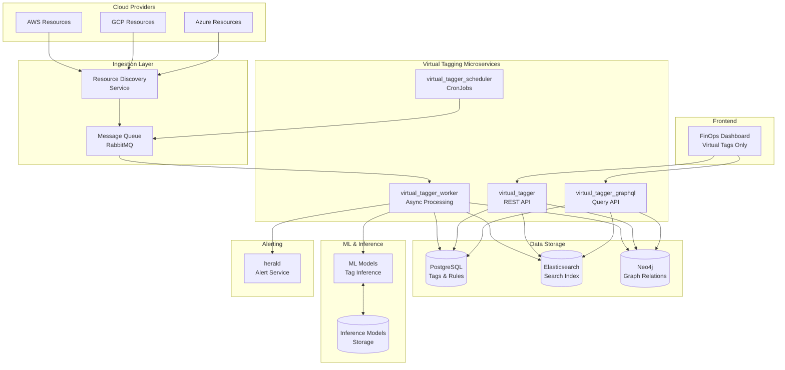

# How to Convert Mermaid Diagrams to PNG

## Method 1: Online Editor (Easiest - No Installation Required)

### Step-by-Step Instructions:

1. **Open Mermaid Live Editor**
   - Go to: https://mermaid.live
   - This is the official Mermaid diagram editor

2. **Copy Diagram Code**
   - Open [CloudTuner-Architecture-Diagrams.md](file:///c:/Users/LENOVO/Desktop/my_docs/vt/CloudTuner-Architecture-Diagrams.md)
   - Copy any Mermaid code block (everything between the \`\`\`mermaid and \`\`\`)
   - **Example**: Copy from "graph TB" to the end of the diagram

3. **Paste into Editor**
   - Paste the code into the left panel of mermaid.live
   - The diagram will automatically render on the right side

4. **Export as PNG**
   - Click the **"Actions"** button (top right)
   - Select **"PNG"** from the dropdown
   - Or click **"SVG"** for vector format (scales better)
   - The image will download automatically

5. **Save the Image**
   - Rename the downloaded file (e.g., `cloudtuner-architecture.png`)
   - Save to your desired location

### Visual Guide:

```
┌─────────────────────────────────────────────────────────────┐
│ mermaid.live                                                 │
├─────────────────────────────────────────────────────────────┤
│  Code Editor          │        Preview                      │
│  ┌─────────────────┐  │  ┌───────────────────────────────┐ │
│  │ graph TB        │  │  │                               │ │
│  │   A --> B       │  │  │    [Rendered Diagram]         │ │
│  │   B --> C       │  │  │                               │ │
│  │                 │  │  │                               │ │
│  └─────────────────┘  │  └───────────────────────────────┘ │
│                       │                                     │
│                       │  [Actions ▼] [PNG] [SVG] [Copy]    │
└─────────────────────────────────────────────────────────────┘
```

---

## Method 2: Use VS Code Extension (For Regular Use)

### Installation:

1. Open VS Code
2. Go to Extensions (Ctrl+Shift+X)
3. Search for: **"Markdown Preview Mermaid Support"**
4. Install the extension by **Matt Bierner**

### Usage:

1. Open [CloudTuner-Architecture-Diagrams.md](file:///c:/Users/LENOVO/Desktop/my_docs/vt/CloudTuner-Architecture-Diagrams.md) in VS Code
2. Press `Ctrl+Shift+V` to open Markdown Preview
3. The Mermaid diagrams will render automatically
4. Right-click on a diagram → "Copy Image" or take a screenshot

---

## Method 3: Command-Line Tool (For Batch Processing)

### Install Mermaid CLI:

```powershell
# Install Node.js first (if not installed)
# Download from: https://nodejs.org

# Install Mermaid CLI globally
npm install -g @mermaid-js/mermaid-cli
```

### Convert Single Diagram:

```powershell
# Navigate to your directory
cd "C:\Users\LENOVO\Desktop\my_docs\vt"

# Convert a single diagram
mmdc -i CloudTuner-Architecture-Diagrams.md -o architecture.png
```

### Convert All Diagrams:

```powershell
# Extract each Mermaid block to separate files first
# Then convert each:

mmdc -i diagram1.mmd -o diagram1.png
mmdc -i diagram2.mmd -o diagram2.png
```

---

## Method 4: Use Draw.io with Mermaid Plugin

### Steps:

1. Open **Draw.io** (https://app.diagrams.net)
2. Click **Arrange** → **Insert** → **Advanced** → **Mermaid**
3. Paste your Mermaid code
4. Click **Insert**
5. The diagram will be inserted as editable shapes
6. Export as PNG: **File** → **Export as** → **PNG**

---

## Recommended Approach by Use Case

| Use Case | Best Method | Why |
|----------|-------------|-----|
| **One-time export** | mermaid.live (Method 1) | No installation, instant results |
| **Regular documentation** | VS Code Extension (Method 2) | Integrated into your workflow |
| **Batch processing** | Mermaid CLI (Method 3) | Automate multiple diagrams |
| **Further editing** | Draw.io (Method 4) | Edit and customize diagrams |

---

## Quick Start: Export Your First Diagram

### 🚀 5-Minute Quick Start:

1. **Go to**: https://mermaid.live

2. **Copy this code** from CloudTuner-Architecture-Diagrams.md:



3. **Paste** into the left panel at mermaid.live

4. **Click "Actions"** → **"PNG"**

5. **Done!** Your PNG is downloaded.

---

## Tips for Best Quality PNG Exports

### At mermaid.live:

- Use **SVG format** instead of PNG for better quality (scales without blur)
- Adjust **theme** (default, forest, dark, neutral) before export
- Use **Configuration** to customize colors and spacing

### Export Settings:

```json
{
  "theme": "default",
  "themeVariables": {
    "primaryColor": "#1976D2",
    "primaryTextColor": "#fff",
    "primaryBorderColor": "#0D47A1",
    "lineColor": "#424242",
    "secondaryColor": "#4CAF50",
    "tertiaryColor": "#FFC107"
  }
}
```

---

## Troubleshooting

### Issue: Diagram doesn't render

**Solution**: Check for syntax errors
- Ensure proper spacing and indentation
- Verify arrow syntax (-->, <--, <-->)
- Close all subgraphs properly

### Issue: Text is cut off

**Solution**: Add padding in configuration
- Add `%%{init: {'theme':'base', 'themeVariables': {'padding':'20'}}}%%` at the top

### Issue: Export button not working

**Solution**: Try different browser
- Works best in Chrome, Firefox, Edge
- Disable browser extensions temporarily
- Try incognito/private mode

---

## Summary

**Quickest Method**: 
1. Go to https://mermaid.live
2. Copy diagram code from CloudTuner-Architecture-Diagrams.md
3. Paste and export as PNG

**For all your diagrams**: I've already generated 3 key PNG diagrams for you that you can see in the session!

---

**Need Help?** 
- Mermaid Documentation: https://mermaid.js.org
- Live Editor: https://mermaid.live
- GitHub: https://github.com/mermaid-js/mermaid
